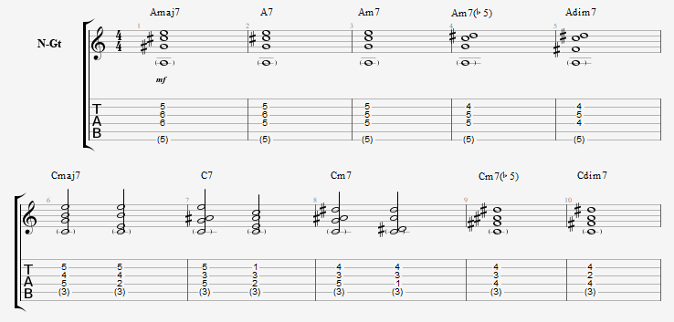
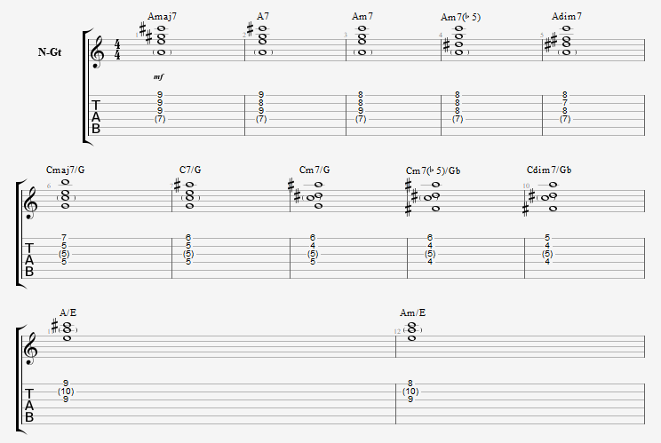

 기본적인 코드를 잡는 형태는 아래 사진과 같고, 형태를 그대로 하여 프렛을 이동하면 모든 코드를 잡을 수 있습니다. 몇 가지 간단한 예시를 들어서 설명해 보겠습니다 🎸

<i>- B7코드를 잡고싶다면 아래 사진의 A7코드를 그대로 2프렛 위로 이동시켜주면 됩니다.</i> 
<i>- BbM7코드를 잡고싶다면 아래 사진의 AM7코드를 그대로 1프렛 위로 이동시켜주면 됩니다.</i>

이 때 간단한 화성학 지식을 알고있으면 코드를 잡는데 도움이 됩니다. (원래는 장,단 몇도 이런 식으로 따지지만 쉽게 설명하기 위해서 그런 것은 배제하여 설명하겠습니다.)

<i>M코드: R, 3, 5</i> 
<i>m코드: R, b3, 5</i> 
<i>M7코드: R, 3, 5, 7</i> 
<i>7코드: R, 3 5 b7</i> 
<i>m7코드: R, b3, 5, b7</i> 
<i>m7b5코드: R, b3, b5, b7</i> 
<i>dim7코드: R, b3, b5, bb7</i> 

 4도 화음(7도가 들어간 화음)이 아닌, 메이저(M), 마이너(m)코드를 잡는 법도 어렵지 않습니다. 1옥타브가 8도 차이라는 것을 이용해서, 7도 음에서 반음 올려주면 됩니다.