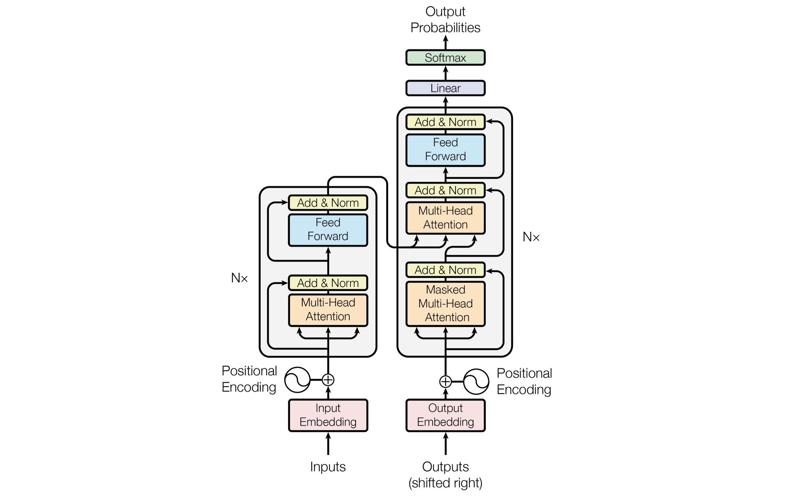

> Mary Phuong and Marcus Hutter, "Formal Algorithms for Transformers",  Vaswani, Ashish, et al., "Attention Is All You Need" 논문을 참고하여 Transformer를 정리합니다.

### Preliminaries

##### Attention

- **Query vector**와 **key vector**를 기반으로 **value vector**를 업데이트 시키는 매커니즘. 더 정확하게는, query vector와 key vector의 similairy를 기반으로 attention score $\alpha$를 얻고, $\alpha$를 사용하여 value를 업데이트 함
  - i.e., $
    \alpha_{t}=\frac{\exp \left(\boldsymbol{q}^{\top} \boldsymbol{k}_{t} / \sqrt{d_{\mathrm{attn}}}\right)}{\sum_{u} \exp \left(\boldsymbol{q}^{\top} \boldsymbol{k}_{u} / \sqrt{d_{\mathrm{attn}}}\right)}
    $

##### Tasks

- Chunking: 모든 seqence modeling을 위한 transformer 기반 모델은 maximum input length가 제한되어있기 때문에, 하나의 문서가 입력으로 주어지면 이를 여러 파트로 chunking하여 모델의 입력으로 제공함. 따라서 문서를 어떻게 chunking 하느냐에 따라 예측 성능에 차이가 생길 수 있음
- Seq2seq prediction: sequence pair $(\mathrm z_n, \mathrm x_n)$으로 이루어진 데이터에 대해서 conditional distribution $P(\mathrm x| \mathrm z)$를 잘 배우는 것(추정하는 것)이 목적. Encoder-Decoder 구조 사용
  - e.g., Translation, Question answering, Text-to-speech, etc. 

- Classification: Given $\mathrm x$에 대한 올바른 class를 예측해야하므로, conditional distribution $P(c|\mathrm x)$ 잘 배우는 것(추정하는 것)이 목적. Encoder 구조 사용
  - e.g., Sentiment classification, Spam filtering, Toxicity classification, etc.
- Sequence modeling: True distribution $P(x)$에 대한 estimation $\hat{P}$를 잘 배우는 것(추정하는 것)이 목적. $x[1:t-1]$가 주어졌을 때, single token $x[t]$에 대한 distribution을 학습하는 것이 목적. Decoder 구조 사용
  - e.g., RL policy distillation, Language modeling, Music generation과 같은 sequential data 예측에 활용

##### Tokenization

- Token: 모델의 입력으로 주어지는 어떤 의미를 가지는 하나의 단위
- Tokenization: 주어진 문장이나 문서 데이터를 token이라는 단위로 나누는 작업. Character-level tokenization, Word-level tokenization, Subword tokenization 등의 종류가 존재하며, 일반적으로는 Subword tokenization이 많이 사용됨 (task에 따라 달라짐). [이곳](https://wikidocs.net/86649)[^3]에서 자세한 설명을 제공하고 있음
- Vocabulary: 각 token에 ID를 부착하여 식별 가능하도록 만든 파일. 대부분 `vocab.txt`이라는 이름으로 존재
  - Special token: mask\_token, bos\_token(문장 시작), eos\_token(문장 끝), etc.

### Transformer

- Token embedding: Token을 representation vector의 형태로 바꿔준 것
- Positional embedding: Token에 문장, 문서 내 위치 정보를 부여하는 것. 학습을 통해 얻은 positional embedding을 token embedding에 더해주기도 하지만, 학습 기반이 아닌 $\sin(a \cdot t), \cos(a \cdot t)$ 값을 token embedding에 더해주는 경우도 다수
  - i.e., $$\boldsymbol{e}=W_{e}[:, x[t]]+W_{p}[:, t]$$  where $W_{p}[2 i-1, t] =\sin \left(t / \ell_{\max }^{2 i / d_{\mathrm{e}}}\right) 
    , \ W_{p}[2 i, t] =\cos \left(t / \ell_{\max }^{2 i / d_{\mathrm{e}}}\right)$

- Bidirectional self-attention (= Unmaksed self-attention): Current token의 위치와 상관없이 모델 입력으로 전체 문장, 문서를 제공하는 형태의 어텐션. Self-attention이기 때문에 query, key, value에 동일한 데이터 집합이 사용됨
- Undirectional self-attention (= Maksed self-attention): Auto-regressive 형태를 만들기 위해 current token 이후의 token은 masking하여 모델 입력으로 제공하지 않는 형태의 어텐션
- Cross-attention: Sequence-to-sequence task 같이, query와 key의 데이터 출처가 다른 경우
- Layer normalization: 이전 층에서 전달된 representations에 대해 mean과 variance로 normalization 후에 scaling과 biasing을 걸어주는 층. Batch 단위로 수행하는 것은 아니기 때문에 layer normalization으로 불림
- Unembedding: 최종 vector representation을 vocabulary에 대한 distribution으로 변환시키는 것

##### Model Architecture

<i>Figure 1. taken from Vaswani, Ashish, et al.</i>

##### The Transformer Family

- Encoder-Decoder Transformer: 제일 처음에 제안된 transformer 구조로, seq2seq task 풀기 위해 사용
- Encoder-Only Transformer, BERT: Masked language modeling이라는 task를 통해 모델을 학습하고, 학습된 모델을 여러 NLP downstream task에 활용 (e.g., NER, POS tagging, etc.). 기존 Transformer와 비교하여, Relu가 아닌 GELU를 activation function으로 사용한다는 차이점이 있음
- Decoder-Only Transformer, GPT-2, GPT-3, and Gopher: Autoregressive language modeling을 위한 모델이며, 따라서 bidirectional self-attention이 아닌 undirectional self-attention을 사용한다는 특징이 있음

### References

[^ 1 ]:[Phuong, Mary, and Marcus Hutter. "Formal Algorithms for Transformers." *arXiv preprint arXiv:2207.09238* (2022).](https://arxiv.org/abs/2207.09238)
[^ 2 ]:[Vaswani, Ashish, et al. "Attention is all you need." *Advances in neural information processing systems* 30 (2017).](https://proceedings.neurips.cc/paper/2017/hash/3f5ee243547dee91fbd053c1c4a845aa-Abstract.html)
[^ 3 ]:Won Joon Yoo, Introduction to Deep Learning for Natural Language Processing, Wikidocs
