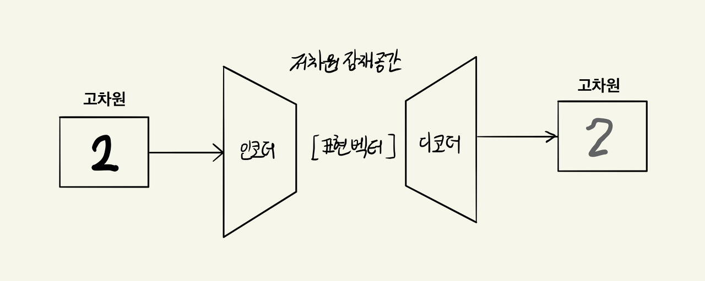
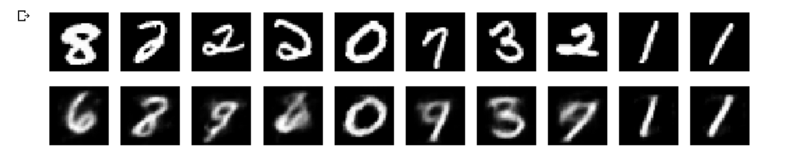
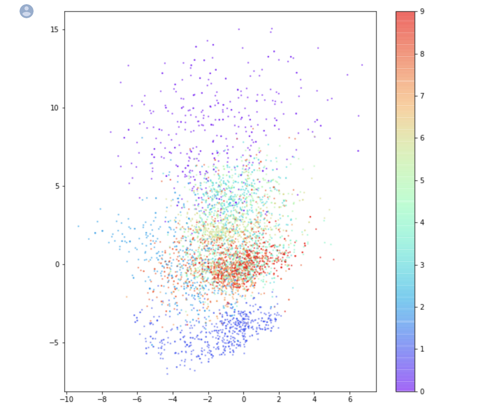

딥러닝 생성모델 공부에 있어서 가장 기초가 되는 autoencoder에 대해 알아보겠습니다. 'Generative Deep Learning' (O'REILLY) 책을 통해 공부한 내용을 중심으로 포스팅을 작성하였습니다.

### Autoencoder?

<center><p><i>https://blog.keras.io/building-autoencoders-in-keras.html</i></p></center>

 Autoencoder는 입력 데이터를 저차원으로 인코딩합니다. 그리고 저차원으로 인코딩된 데이터를 다시 디코딩하여 원래의 상태로 재구성하는 구조를 가지고있습니다. 다시 얘기하자면 입력데이터를 인코더를 통해 저차원으로 차원 축소를 하고, 디코더를 통해 다시 원본 차원으로 복원하는 형태를 가지고 있습니다.

 위의 이미지 처럼 2라는 숫자 이미지를 입력으로 받으면, 출력 값으로는 똑같은 2라는 이미지가 출력됩니다. 이 모델은 **입력 이미지와 재구성된 이미지 사이의 손실을 최소화**하는 가중치를 찾는 방향으로 훈련됩니다. 타겟 값이 입력 데이터와 같으므로 이를 self supervised learning 방식이라고 말하기도 합니다.

#### Autoencoder의 특징

 Autoencoder는 이제껏 **훈련된 데이터와 비슷한 데이터**만 입력으로 받을 수 있습니다. 데이터를 저차원으로 인코딩한다는 의미가 어떤 파일을 압축하는 알고리즘들과 같다는 의미가 아닙니다. 예를 들어, 이미지 압축 알고리즘은 일반적으로 이미지에 관한 압축이지만 특정한 종류의 이미지만 압축하기 위해 사용되지는 않습니다. 2라는 숫자 이미지를 압축하기 위해 학습된 모델은 사람 얼굴 사진같은 이미지는 올바르게 압축할 수 없습니다. 또한 최종적으로 디코딩을 거친 출력 결과는 대체로 원본 이미지보다 **흐릿하게 출력**됩니다.

 Autoencoder 하나만 가지고는 실제 응용 분야에서 많이 사용되지 않는 편이긴 하지만, autoencoder가 **data denosing**과 **차원 축소**라는 장점을 가지고 있기 때문에 이와 관련된 분야에서 사용됩니다.

#### High dimension과 Latent space

 Autoencoder에 대해서 제대로 이해하기 위해서는 **high dimension과 latent space**라는 용어에 대한 이해가 필수적입니다.

 사진이 한 장 있다고 가정해보고 100x100 픽셀이라고 한다면, 이 데이터는 100x100x3 array입니다. 즉, [100, 100, 3] 이므로 숫자 3만개를 갖는 3차원 데이터가 되는데, 우리는 이 사진 한장을 3만 차원의 공간에 존재하는 점 하나로 볼 수 있습니다. 축 3만 개를 갖는 공간(= 3만 차원의 공간)에서 사진 한장은 3만 개의 숫자로 이루어져 있으므로 숫자들에 따라 점 하나로 위치할 수 있게됩니다. 이 때의 3만 차원을 high dimension이라 하고, 사진 한 장이 위치하게 되는 점이 data point가 됩니다.

 

 자 그러면 이 관점에서 autoencoder를 다시 들여다보면, 2라는 숫자 이미지를 학습하는 autoencoder 모델의 인풋 데이터는 결국 28x28 차원 상의 점 하나입니다. 인코더는 28x28차원의 점 하나를, 28x28차원 보다 낮은 차원인 **저차원 잠재공간의 점 하나로 매핑**하는 법을 학습하고, 디코더는 저차원 잠재공간의 점 하나를 **28x28차원의 점으로 매핑**하는 법을 학습하게 됩니다. 결국 autoencoder는 이 과정을 통해 차원을 축소시키고 노이즈를 제거하는 효과를 얻게됩니다. 그리고 이 때의 저차원 잠재공간을 **latent space**, 저차원 잠재공간 상의 점 하나를 **표현벡터(representation vector)**라고 말합니다.

### Code-level 구현

 'Generative Deep Learning' (O'REILLY)의 저자가 깃허브에 제공한 [Keras 코드](https://github.com/davidADSP/GDL_code)를 통해 코드 레벨에서 autoencoder를 직접 학습시켜 봅시다. 모든 코드를 살펴보기보다는 중요한 부분만 골라서 어떤 형태를 가지고 있는지 살펴보겠습니다. 구현 코드는 개발자마다 달라질 수 있으니 대충 이런 구조구나 하고 감만 잡으시는 것을 추천드립니다. (dataset으로는 **MNIST**를 사용하였습니다.)

1. 인풋 데이터를 로드하고, 안정적인 학습을 위해 스케일을 조정하는 메소드입니다.

```python
def load_mnist():
    (x_train, y_train), (x_test, y_test) = mnist.load_data()

    x_train = x_train.astype('float32') / 255.
    x_train = x_train.reshape(x_train.shape + (1,))
    x_test = x_test.astype('float32') / 255.
    x_test = x_test.reshape(x_test.shape + (1,))

    return (x_train, y_train), (x_test, y_test)
```

2. 인코더의 구조입니다. 합성곱 신경망과 LeakyRelu 활성화 함수를 반복하여 사용하여 모델을 구성하였습니다. 마지막 합성곱의 출력은 Flatten을 통해 펼치고 z_dim차원 잠재공간을 표현하기 위해 크기가 z_dim인 Dense 층에 연결합니다.

```python
### THE ENCODER
        encoder_input = Input(shape=self.input_dim, name='encoder_input')
        x = encoder_input
        x = Conv2D(filters=self.encoder_conv_filters[0],
                   kernel_size=self.encoder_conv_kernel_size[0],
                   strides=self.encoder_conv_strides[0],
                   padding='same',
                   name='encoder_conv_' + str(0) )(x)
        x = LeakyReLU()(x)
        x = Conv2D(filters=self.encoder_conv_filters[1],
                   kernel_size=self.encoder_conv_kernel_size[1],
                   strides=self.encoder_conv_strides[1],
                   padding='same',
                   name='encoder_conv_' + str(1) )(x)
        x = LeakyReLU()(x)
        x = Conv2D(filters=self.encoder_conv_filters[2],
                   kernel_size=self.encoder_conv_kernel_size[2],
                   strides=self.encoder_conv_strides[2],
                   padding='same',
                   name='encoder_conv_' + str(2))(x)
        x = LeakyReLU()(x)
        x = Conv2D(filters=self.encoder_conv_filters[3],
                   kernel_size=self.encoder_conv_kernel_size[3],
                   strides=self.encoder_conv_strides[3],
                   padding='same',
                   name='encoder_conv_' + str(3))(x)
        x = LeakyReLU()(x)
        shape_before_flattening = K.int_shape(x)[1:]
        x = Flatten()(x)
        encoder_output = Dense(self.z_dim, name='encoder_output')(x)

        self.encoder = tf.keras.Model(encoder_input, encoder_output)
```

3. 디코더의 구조입니다. 전치 합성곱 신경망(conv transpose)과 LeakyRelu 활성화 함수를 반복하여 사용하여 모델을 구성하였습니다. 디코더가 인코더와 완전히 반대 구조를 가질 필요는 없이, 최종 출력층의 크기만 입력데이터의 크기와 맞춰주면 어떤 구조도 가능합니다. 

```python
 ### THE DECODER
        decoder_input = Input(shape=(self.z_dim,), name='decoder_input')
        x = Dense(np.prod(shape_before_flattening))(decoder_input)
        x = Reshape(shape_before_flattening)(x)
        x = Conv2DTranspose(filters=self.decoder_conv_t_filters[0],
                            kernel_size=self.decoder_conv_t_kernel_size[0],
                            strides=self.decoder_conv_t_strides[0],
                            padding='same',
                            name='decoder_conv_t_' + str(0) )(x)
        x = LeakyReLU()(x)
        x = Conv2DTranspose(filters=self.decoder_conv_t_filters[1],
                            kernel_size=self.decoder_conv_t_kernel_size[1],
                            strides=self.decoder_conv_t_strides[1],
                            padding='same',
                            name='decoder_conv_t_' + str(1) )(x)
        x = LeakyReLU()(x)
        x = Conv2DTranspose(filters=self.decoder_conv_t_filters[2],
                            kernel_size=self.decoder_conv_t_kernel_size[2],
                            strides=self.decoder_conv_t_strides[2],
                            padding='same',
                            name='decoder_conv_t_' + str(2) )(x)
        x = LeakyReLU()(x)
        x = Conv2DTranspose(filters=self.decoder_conv_t_filters[3],
                            kernel_size=self.decoder_conv_t_kernel_size[3],
                            strides=self.decoder_conv_t_strides[3],
                            padding='same',
                            name='decoder_conv_t_' + str(3) )(x)
        x = Activation('sigmoid')(x)
        decoder_output = x

        self.decoder = tf.keras.Model(decoder_input, decoder_output)
```

### Autoencoder의 한계점 



 keras 코드를 통해 전체 모델을 학습시키고 난 뒤 위와 같은 결과를 얻었습니다. 저는 784차원의 고차원 이미지 데이터를 2차원의 잠재공간으로 매핑하였기 때문에 출력값이 좋지 않은 것 처럼 보이긴 하지만, 잠재공간의 차원을 10차원 정도로만 설정하여도 입력값과 상당히 비슷한 출력값을 얻어내실 수 있습니다. 

<center><p><i>https://github.com/davidADSP/GDL_code</i></p></center>

MNIST dataset의 원본이미지가 인코더에 의해 잠재공간에 매핑된 표현벡터를 **산포그래프(scatter plot)**에 나타낸 것입니다. 우리가 사용한 예시 코드는 인코더가 이미지 데이터를 2차원 벡터로 매핑했기 때문에 이렇게 2차원상에 나타낼 수 있었습니다.

이 잠재공간 상의 표현벡터를 디코더를 통해 매핑하여 원본 이미지 차원으로 복원하려고 할 때는 생각해보아야 할 몇 가지 문제점이 있습니다. 

1. 잠재 공간에서 **랜덤 포인트를 선택하기 위한 방법이 명확하지 않습니다.** 
2. **생성된 이미지의 다양성이 부족**합니다. 예를 들어 숫자 1의 영역이 숫자 8의 영역보다 훨씬 넓기에, 랜덤하게 포인트를 선택하면 1이 만들어질 확률이 더 높습니다. 
3. 생성된 이미지의 **품질이 상당히 나쁜 경우**가 있습니다.

 이 문제는 autoencoder가 잠재공간을 **연속적으로 만들지 않기 때문에 발생**합니다. (1, 1) 이라는 포인트가 훌륭하게 디코딩 되었다고해서 (1.1, 1.1) 또한 훌륭하게 디코딩 될 것이라는 보장이 없습니다. 그렇기 때문에 우리는 잠재공간을 연속적으로 만들어야 할 필요가 있습니다. 이에 대해서는 다음 포스팅 Variational Autoencoder에서 살펴보도록 하겠습니다. 

### Reference

- 남세동님 [페이스북 포스팅](https://www.facebook.com/dgtgrade/posts/1598044216921105) (High dimensional data를 이해하는데 큰 도움을 받았습니다)
- 데이비드 포스터 - Generative Deep Learning (O'REILLY)
- [The Keras Blog](https://blog.keras.io/building-autoencoders-in-keras.html)