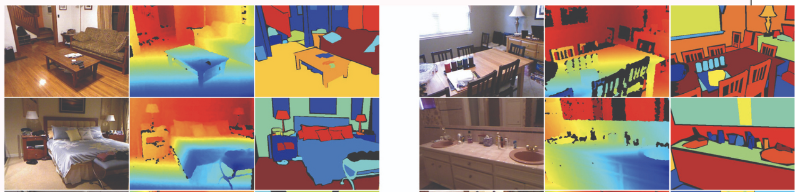
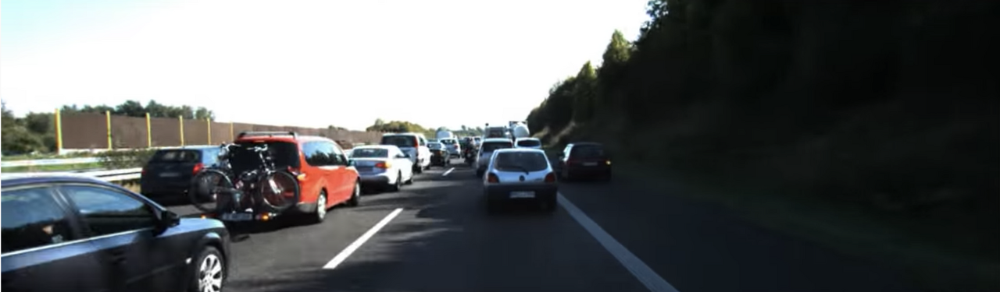
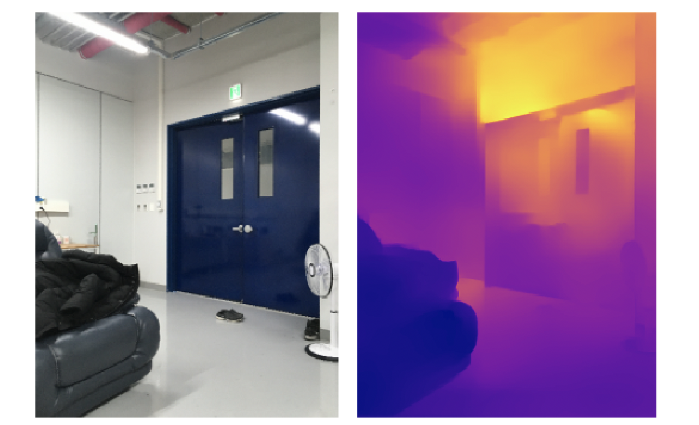
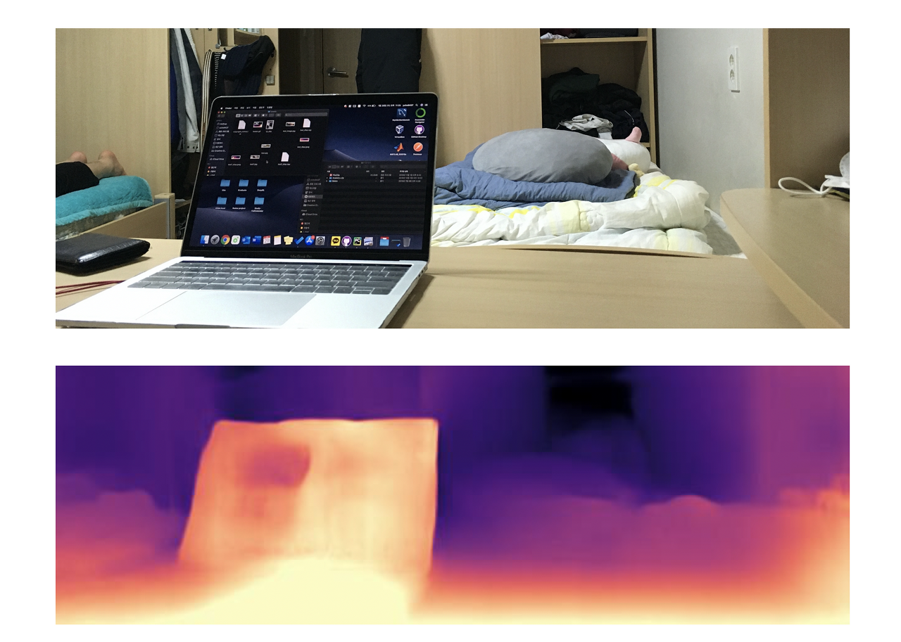

 얼마 전 연구실에서 진행중인 실험과 관련해서 depth estimation 코드를 돌려볼 일이 생겨서 depth estimation에 대해 아주 쪼끔 공부를 하게 되었습니다. 이번 포스팅에서는 이에 대해 제가 알게 된 내용과 참고한 논문 코드들을 공유해보도록 하겠습니다. 

### Depth estimation

 Depth estimation을 한글로 번역하면 '깊이 추정'입니다. 모델에 우리가 2D 사진을 입력값으로 주면, 모델이 이 **사진의 깊이 값을 출력으로 뱉는 것**이 depth estimation이라고 할 수 있습니다. 주로 **'깊이 값이 label로 주어진 이미지'**를 사용하여 학습을 진행하고, 모델은 깊이 값이 주어지지 않은 이미지가 주어졌을 때 깊이 값을 추정하여 실제 label과 비교하는 방식으로 가중치를 업데이트 해가는 supervised learning 방식을 사용하고있습니다. 

### Datasets

 Depth estimation 모델 학습을 위한 dataset은 depth camera를 통해 수집합니다. 그리고 학습에 자주 사용되는 유명한 dataset들은 NYU dataset과 KITTI dataset이 있습니다. 

#### NYU2 dataset

<i>https://cs.nyu.edu/~silberman/datasets/nyu_depth_v2.html</i>

 NYU dataset은 **실내 공간**에서의 정지된 사진과 깊이 값이 담겨있는 데이터셋입니다. 뿐만 아니라 가구 각각에 대한 class label도 포함되어 있습니다. [원본 사이트](https://cs.nyu.edu/~silberman/datasets/nyu_depth_v2.html) 내 데이터셋에 대한 자세한 설명이 있습니다. 

#### KITTI dataset

<i>http://www.cvlibs.net/datasets/kitti/index.php</i>

 KITTI dataset은 움직이는 자동차에 카메라를 달고 운행을 하면서 **거리의 영상**을 깊이 값과 함께 담아낸 데이터셋입니다. [원본 사이트](http://www.cvlibs.net/datasets/kitti/) 내 데이터셋에 대한 자세한 설명이 있습니다. 

### Depth estimation models

 Github에서 depth estimation 관련 코드를 찾아서 직접 코드레벨에서 실행을 시켜보았습니다. 먼저 pythone opencv2를 사용하여 직접 촬영한 사진을 로드하여 이 사진에 대해 결과를 prediction 하도록 해보았습니다.

 그리고 사진 뿐만 아니라 동영상을 realtime으로 prediction 또한 해보고 싶어서 동영상을 로드하여 frame마다 prediction을 진행해보기도 하였습니다. 근데 동영상의 경우에는 prediction 속도가 너무 느려서 결국 사진만 prediction 해보는 것으로 만족하였습니다. (제가 원했던 속도는 gpu로 실행시 초당 15 프레임 정도였는데, 아래의 코드들은 그 정도 속도까지는 나오지 않았습니다.)

#### Densedepth

- https://github.com/ialhashim/DenseDepth

 Densedepth 코드는 ['High Quality Monocular Depth Estimation via Transfer Learning'](https://arxiv.org/abs/1812.11941)라는 논문에서 소개된 코드입니다. 전체적인 모델의 구조는 CNN을 활용한 **standard encoder-decoder architecture**를 가지고 있고, ImageNet dataset으로 학습시킨 DenseNet을 encoder의 pre-trained network로 사용하는 **transfer learning** 방식을 사용하였습니다. 저는 이 논문의 취지를 'transfer learning을 사용한 네트워크가 depth estimation을 상당히 잘 수행하였다.' 정도로 이해했습니다.

이 코드는 NYU2 dataset으로 학습시킨 모델과 KITTI dataset으로 학습시킨 모델을 둘 다 제공하고있고, TensorFlow 코드와 PyTorch 코드를 모두 제공하고있습니다. 아래는 제가 직접 찍은 사진을 인풋으로 넣어서 얻어낸 출력결과 입니다. 

#### monodepth2

- https://github.com/nianticlabs/monodepth2

 monodepth2 코드는 논문은 읽어보지 않고 코드 레벨에서 실행만 해보았습니다. 이 코드는 KITTI dataset으로 학습시킨 모델만 제공하고있고, 코드는 PyTorch로 구현되었습니다. 아래는 제가 직접 찍은 사진을 인풋으로 넣어서 얻어낸 출력결과 입니다. 

 

 사용해 볼만 한 더 좋은 모델이 있다면 추천해주시면 감사하겠습니다.

### 관련 자료들

- 구글의 Depth Prediction: https://ai.googleblog.com/2019/05/moving-camera-moving-people-deep.html?fbclid=IwAR12YTuDS99mvPse-T0Jmn9TQKwskpxIUcWLQrJmg3J-ZdcRwLbiRVcEBa4
- 구글 AI와 구글 로보틱스의 연구 논문: https://arxiv.org/pdf/1904.04998.pdf
- Single View Stereo Matching: https://github.com/lawy623/SVS?fbclid=IwAR1xN_ClQ2vO6Xnmcrnmn_433KW2G96B-VtpIuYNwomq0LEGkbe1Q1M_y4o
- Google PAIR depth maps art and illusions: https://pair-code.github.io/depth-maps-art-and-illusions/art_history_vis/blogpost/blogpost_1.html?fbclid=IwAR2ZKvVTFoxh0f7cFC6_09QsAdKUsxPIZF-rmKAWQqkrndlV_cf_V7cntZE