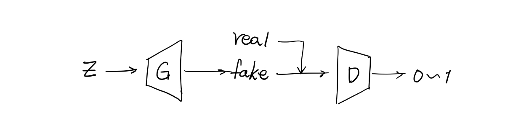
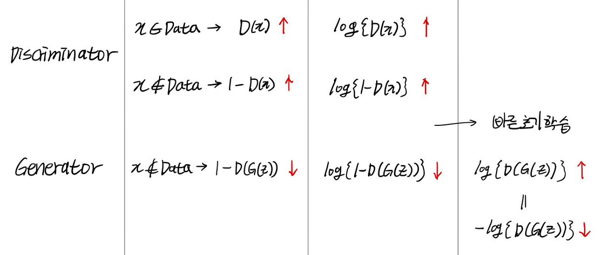

 딥러닝 생성 모델 중 가장 유명한 Generative Adversarial Networks(생성적 적대 신경망)에 대해 알아보겠습니다. 이를 공부하는데 참고한 자료들은 아래 reference에 적어두었습니다.

### Generative Adversarial Networks

##### GAN의 구조 

 GAN은 2014년 Ian Goodfellow의 논문에서 처음 소개되었습니다. GAN은 Generator(생성자)와 Discriminator(판별자), 두 개의 신경망으로 구성되어있습니다. Discriminator의 목표는 Generator가 만들어낸 이미지가 진짜인지 가짜인지 제대로 판별하는 것이고, Generator의 목표는 Discriminator가 자신이 만든 이미지가 진짜라고 판별하도록 이미지를 잘 생성해내는 것입니다. Discriminator와 Generator가 서로 상반되는 목표를 가지고 적대적으로 학습하여 이미지를 생성한다고 하여, 생성적 적대 신경망이라고 부릅니다. 

 GAN의 전체적인 알고리즘은 다음과 같습니다.

1. random vector 'z'를 Generator에 전달합니다.
2. Generator가 fake image를 생성합니다.
3. Discirminator는 real image와 fake image를 입력받아, 0에서 1사이의 확률값을 출력합니다.

여기서 확률값은 1에 가까우면 실제 이미지로 판별, 0에 가까우면 가짜 이미지로 판별했다는 것을 의미합니다. 

##### z에 대해서 VAE와 갖는 차이점 

 VAE 같은 경우에는 z값이 encoder에 의해 생성되는 값 입니다. 우리가 생성하려는 데이터를 input으로 줘서 만들어낸 값이 z이기 때문에, z는 우리가 생성하려는 데이터의 feature를 잘 표현하는 어떤 잠재적인 값이 된다고 생각하시면 됩니다. 그래서 이를 **잠재 벡터** 혹은 **표현 벡터**라고 말합니다.

 하지만 GAN의 z값은 이와는 조금 다릅니다. GAN의 z는 주로 **랜덤 벡터** 혹은 **랜덤 노이즈**라고 불리는데, 이는 VAE와는 달리 z가 우리가 생성하려는 데이터를 잘 설명해 주는 것이 아니라는 걸 의미합니다. 학습 초기의 Generator는 만들어야 하는 데이터가 무엇인지 전혀 알지 못합니다. 그렇다 하더라도 Generator는 데이터를 만들어 내야 합니다. 그렇기에 아무런 의미를 갖지 않는 z를 인풋으로 받고 차원 확대를 하여 데이터를 생성합니다. 그리고 이후에 Discriminator의 피드백에 따라서 weight를 업데이트하며 의미있는(Discriminator에게 높은 점수를 받는) 데이터를 만드는 법을 학습합니다.

### GAN을 수식으로 이해

##### Discriminator의 목적함수

 Discriminator는 real image 혹은 fake image를 받아서, 받은 데이터가 real일 확률을 0~1 사이의 값으로 출력합니다. 입력 데이터가 real인 경우에는 1에 가까운 값을 출력하고, fake일 경우에 0에 가까운 값을 출력한다면 Discriminator가 잘 학습되었다고 말할 수 있습니다. Discriminator의 **입력 x에 대한 출력 확률을 D(x)**라 표현한다면, **real에 대해서는 D(x)를 최대화하고 fake에 대해서는 1-D(x)를 최대화** 해야 합니다.

##### Generator의 목적함수

 Generator는 자신이 만든 fake image가 Discriminator에게 높은 출력을 받아내야 합니다. 여기서 Generator는 언제나 fake image만을 만들기 때문에, 이는 x=G(z)인 경우에 1-D(x)를 최소화 해야 한다는 것을 의미합니다. 다시 표현하면 **1-D(G(z))를 최소화** 한다는 것을 의미합니다.

 아래에 GAN의 목적함수에 대해 정리해 보았습니다. 기본적인 목적함수에 log를 취하고, 또 빠른 초기학습을 위해 형태를 조금씩 수정해주는 이유에 대해서는 다른 블로그들과 강의 자료에서 잘 설명되어 있으니 궁금하시다면 꼭 참고하시길 바랍니다. 저는 [최윤제님의 naver d2 발표](https://www.youtube.com/watch?v=odpjk7_tGY0)와 [Kwangmin Choi님 블로그 포스팅](https://learnai.tistory.com/3?category=699199)자료를 통해 이해했습니다.

 

+ 이활석님의 [github repository README](https://github.com/hwalsuklee/tensorflow-generative-model-collections)를 참고하시면 다양한 GAN의 목적함수를 한 눈에 파악할 수 있습니다.

### Reference

- 데이비드 포스터 'Generative Deep Learning' (O'Reilly)
- [생성적 적대 신경망(GANs)에 대한 초보자용 가이드 (GANs)](https://pathmind.com/kr/wiki/generative-adversarial-network-gan)
- [김태훈님 PyCon 발표](https://www.youtube.com/watch?v=soJ-wDOSCf4)
- [Kwangmin Choi님 블로그 포스팅 1](https://learnai.tistory.com/3?category=699199)
- [최윤제님 naver d2 발표](https://www.youtube.com/watch?v=odpjk7_tGY0)
- [이활석님 github repository](https://github.com/hwalsuklee/tensorflow-generative-model-collections)