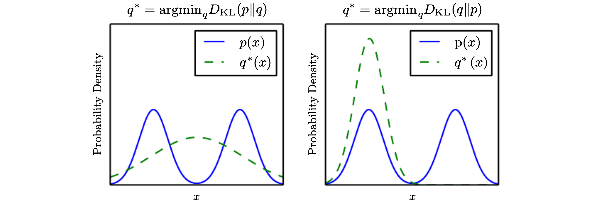

 Ian Goodfellow의 Deep Learning 책 내용을 참고하여 번역한 포스팅입니다. 개인적인 이해도에 따라서 추가되거나 빠진 내용이 있는 점 참고하시길 바랍니다. 잘못된 내용에 대해서도 지적해주시면 감사하겠습니다.

### Information Theory

 우리가 Information theory를 공부한다면, 어떻게 optimal code를 디자인하고, 또 특정 확률 분포를 갖는 다양한 정보들이 어떤 크기를 가질지에 대해 계산하는 법을 알 수 있습니다.

Information theory에 대한 가장 기본적인 직관은, **일어나지 않을 것 같은 사건이 더 큰 정보량을 갖는다**는 것입니다. 간단하게, 제가 오늘 헬스장에 간다는 사건을 예시로 들어보겠습니다. 만약 제가 오늘 헬스장에 가지 않을 확률이 0.9라고 가정을 해보겠습니다. 그렇다면 반대로 오늘 헬스장에 갈 확률은 0.1입니다. 정보이론적 관점에서는 제가 오늘 헬스장에 가는 사건이 더 큰 정보량을 갖습니다.

(1) Likely events는 low information을 갖고, (2) Less likely events는 higher information을 갖고, (3) 독립된 events는 additive information을 갖는다는 특성을 가지도록, 사건 x에 대한 정보량을 다음과 같이 수식으로 정의할 수 있습니다. 
$$
{I(x) = -logP(x)= log_e \frac 1 {P(x)}}
$$
이를 $\mathrm x = x$ 사건의 **self-information**라 합니다. 간단하게는 **'event $\mathrm x=x$에 대한 정보량'**, Information gain 또는 정보의 획득량으로 이해하셔도 될 것 같습니다. $I(x)$의 값은 $P(x)$의 값과 반비례하는데, 일어나지 않을 것 같은 사건일수록 $P(x)$가 작으며, 정보의 획득량 $I(x)$의 값은 커집니다.

### Shannon Entropy

self-information은 오직 한 사건만을 다룹니다. 하나가 아닌, 전체 확률 분포에 대한 정보량은 **Shannon entropy**를 통해 구할 수 있습니다. 
$$
H(P) = H(\mathrm x)  =  \mathbb E_{\mathrm x ~\sim P}[I(x)] = - \mathbb E_{\mathrm x ~\sim P}[logP(x)]
$$

$$
= - \sum P(x) logP(x)
$$

 Shannon entropy는 어떤 확률 분포에서 사건이 일어났을 때, 이들이 가지는 정보량의 기대값을 의미합니다. 한마디로 **'event x에 대한 정보량의 기대값'**이라고 생각하시면 됩니다. 분포가 상당히 deterministic인 경우에는 low entropy값을 가지며, 분포가 매우 균등하다면 high entropy를 가집니다. 만약 x가 discrete이 아니라 continuous하다면, shannon entorpy를 **differential entropy**라고 부르기도 합니다.

위의 수식은 로그의 밑으로 지수 e를 사용하기 때문에 단위로 nat을 사용하지만, 만약 로그의 밑으로 2를 사용한다면 단위는 bits (혹은 shannon)이 되며, 이 때의 정보량은 결국 정보를 인코딩하기 위한 bits수의 lower bound와 연관됩니다. 이에 대해서는 [Terry님의 영상](https://www.youtube.com/watch?v=zJmbkp9TCXY)을 참고하시면 좋습니다.

### Cross-Entropy

$$
H(P,Q) = - \mathbb E_{\mathrm x\sim P}[log Q(x)]
$$

$$
= -\sum P(x) log Q(x)
$$

cross-entropy는 **'최적이 아닌 확률 분포를 통해 얻은 entropy 값'**을 의미합니다. 우리가 생각하는 최적의 확률 분포가 P의 형태라고 생각해본다면, Q는 우리가 추정하는, 최적이 아닌 (최적 P와는 차이를 갖는) 확률 분포입니다. 그렇기에 위의 식 $H(P, Q)$를 통해 cross-entropy를 계산한 값은, 최적인 확률 분포의 entorpy인 shannon entropy보다 큰 값을 가지게 됩니다. 

### Kullback-Leibler Divergence

 cross-entropy와 긴밀히 연관된 개념으로는 KL Divergence라는 것이 있고, 이에 대한 식은 다음과 같습니다.
$$
D_{KL}(P||Q) = \mathbb E_{\mathrm x\sim P}[log \frac{P(x)}{Q(x)} ] = \mathbb E_{\mathrm x \sim P}[logP(x) - log Q(x)]
$$

$$
= -\sum P(x)logQ(x) + \sum P(x)logP(x)
$$

$$
\therefore H(P,Q) - H(P)
$$

$$
= CrossEntropy - ShannonEntropy
$$

 Kullback-Leibler Divergence는 어떤 두 확률분포 P와 Q가 있을 때, 두 확률 분포 사이의 차이를 나타내는 값입니다. '최적이 아닌 확률 분포를 통해 얻은 entropy와, 최적인 확률 분포를 통해 얻은 entropy의 차이'라고 생각하시면 쉽습니다. 그렇기에 P와 Q의 KL divergence가 0이라는 것은, P와 Q가 동일한 분포를 갖는다는 말과 동치입니다. 위에서 cross-entropy는 shannon entropy보다 큰 값을 가진다고 하였으므로, cross-entropy에서 shannon entropy를 뺀 형태의 KLD는 언제나 **non-negative**의 값을 갖습니다.

KLD가 두 확률 분포 사이의 차이를 의미하기는 하지만, 이것이 distance를 의미하지는 않습니다. 만약 distance 값이라면 $D_{KL}(P||Q)$가 $D_{KL}(Q||P)$값과 동일해야 하지만, 실제로 계산을 해보면 그렇지 않기 때문입니다. 이 말은 즉 P와 Q의 순서에 따라서 KLD의 값이 달라진다는 것(**not symmetric**)을 의미하는데, 이에 대해서는 그림과 함께 이해해 보면 좋습니다.

<i>Ian Goodfellow, Deep Learning</i>

KLD의 방향은 어떤 problem을 푸는지에 따라 달라집니다 (**problem-dependent**). 만약 P의 확률 밀도 함수가 그림처럼 2개 혹은 그 이상의 mode를 갖는다고 해봅시다. 이 때 우리가 만약 $D_{KL}(P||Q)$를 최소화 하는 방향의 Q를 추정한다면 결과는 왼쪽 그림처럼 나오게 됩니다. 이 경우는 **P가 높은 확률을 가질 때, Q도 높은 확률을 가지도록** 최적화합니다. Q는 P의 모든 mode에 높은 영향을 주기 위해 mode들을 함께 흐려지는 방향으로 선택합니다. 

반대로 $D_{KL}(Q||P)$를 최소화 하는 방향의 Q를 추정한다면 결과는 오른쪽 그림처럼 나오게 됩니다. 이 경우는 **P가 낮은 확률을 가질 때, Q도 낮은 확률을 가지도록** 최적화합니다. Q는 하나의 mode만 선택함으로써 P가 낮은 확률을 갖는 지역을 피합니다. 결과적으로, 데이터의 모든 분포를 잘 고려하여 결과를 내야하는 문제라면 $D_{KL}(P||Q)$ 를 사용하고, generation 문제처럼 한 가지의 mode에 대해서만이라도 좋은 결과를 도출해도 상관없는 문제라면 $D_{KL}(Q||P)$ 를 사용합니다.

한가지 정보를 더 추가하자면, **Q에 대한 cross-entroy를 최소화 하는 것은, Q에 대한 KL divergence를 최소화 하는 것과 동일**합니다. KL divergence에 대한 식은 cross-entropy에서 shannon entropy를 뺀 형태를 갖는데, 우리가 Q에 대한 P의 KL divergence를 최소화 할 때, 식 $H(P)$는 Q와 전혀 연관이 없으므로 최소화 과정에서 변하지 않는 값입니다. 그렇기에 결국, Q​ 분포에 대한 P​ 분포의 cross-entropy를 최소화 하는 행위는, Q에 대한 KL divergence를 최소화 하는 것과 동일합니다.

### Reference

- Ian Goodfellow, Yoshua Bengio, and Aaron Courville, Deep Learning (The MIT Press), Chapter 3.13
- [Terry TaeWoong Um님 유튜브 채널](https://www.youtube.com/watch?v=zJmbkp9TCXY)

