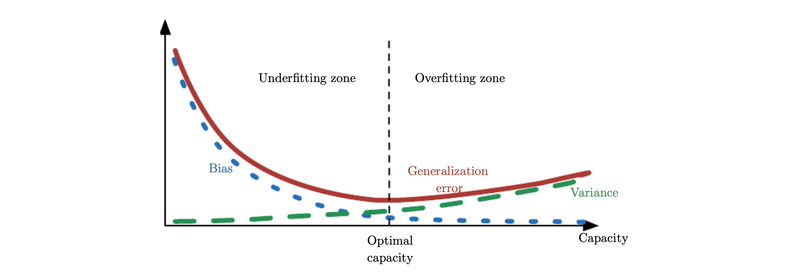

 Ian Goodfellow의 Deep Learning 책 5.4 챕터의 내용을 번역한 포스팅입니다. 개인적인 이해도에 따라서 추가되거나 빠진 내용이 있는 점 참고하시길 바랍니다. 잘못된 내용에 대해서도 지적해주시면 감사하겠습니다.

 이 챕터는 주로 statistics에 관한 개념들에 대해 다룹니다. 우리가 다음과 같은 statistics 개념에 대해 이해한다면, generalization, underfitting and overfitting에 대해서 분석을 할 때 유용하게 활용할 수 있습니다. 

### Estimator

 우리가 추정하고자 하는 값에 대해 하나의 best prediction을 만든는 것을 **point estimation**이라고 합니다. 예를 들어 parametric model의 경우, 우리는 일반적으로 weights라고 불리는 parameter 벡터를 추정해 나갑니다. 여기서의 point estimation은 weight라는 parameter에 대한 예측이 됩니다.

point estimation을 통해 우리가 알아내고자 하는 궁극적인 목표 값은 parameter $\theta$ 입니다. 이는 고정된 값이긴 하지만 **unknown**입니다. 그렇기에 우리가 가진 data points {$x^{(1)},\cdots,x^{(m)}$} 를 사용해서 그나마 정답에 가까운 parameter $\hat\theta$ 을 추정합니다. 다음와 같은 식을 통해 $\hat\theta$ 을 표현할 수 있고, 이를 **point estimator**라고 합니다.
$$
\hat\theta_m = g(x^{(1)},\cdots,x^{(m)})
$$

point estimator는 함수의 입력으로 data points를 넣어서 생성된 출력 값의 형태로 해석됩니다. 근데 여기서 data는 random process를 통해 도출된 값 즉, data generation process를 통해 생성되기 때문에, 결국 **$\hat\theta$ 는 확률 변수(random variable)**입니다. 

### Bias of Estimator

 **Bias of estimator**는 위와 다음과 같이 정의됩니다. 
$$
bias(\hat\theta_m) = \mathbb E(\hat\theta_m)-\theta
$$
이는 estimator의 기대값이 true $\theta$ 와 얼마나 다른지를 의미합니다. 만약 $bias(\hat\theta_m)$가 0이라면 이를 **unbiased**라고 하며, $lim_{m \to \infin}bias(\hat\theta_m)$이 0이라면 이를 **asymptotically unbiased**라고 합니다. 각각 estimator의 기대값이 true $\theta$와 일치하는 경우와, 데이터를 무한개 샘플링 했을 때 estimator의 기대값이 true $\theta$와 일치하는 경우를 의미합니다.

#### Example

 **Gaussian 분포의 분산($\sigma^2$)을 추정**하는 상황을 예시로 살펴봅시다. 이 경우 우리가 추정하고자 하는 parameter $\theta$는 $\sigma^2$입니다.
$$
\hat\sigma^2_m = \frac 1 m \sum_{i=1}^m (x^{(i)}-\hat\mu_m)^2
$$
첫 번째로는 위와 같은 sample variance라 불리는 값을 estimator로 설정해서 gaussian 분포의 분산을 추정을 해보았습니다. 이 때의 bias of estimator를 확인해보려면 $bias(\hat\sigma^2_m) = \mathbb E[\hat\sigma^2_m]-\sigma^2$ 라는 식을 계산하면 됩니다. $\mathbb E[\hat\sigma^2_m]$ 를 풀어보면 $\frac {m-1}{m}\sigma^2$ 이 나오기 때문에, 최종적으로 $bias(\hat\sigma^2_m)$는 $-\sigma^2/m$ 라는 결과가 나옵니다. 즉, 이 estimator는 biased estimator입니다.
$$
\tilde\sigma^2_m = \frac 1 {m-1} \sum_{i=1}^m (x^{(i)}-\hat\mu_m)^2
$$
두 번째로는 위와 같은 unbiased sample variance라 불리는 값을 esitmator로 설정해서 gaussian 분포의 분산을 추정을 해보았습니다. 이 때의 bias of estimator를 확인해보려면 $bias(\tilde\sigma^2_m) = \mathbb E[\tilde\sigma^2_m]-\sigma^2$ 라는 식을 계산하면 됩니다. $\mathbb E[\tilde\sigma^2_m]$ 를 풀어보면 $\sigma^2$ 이 나오기 때문에, 최종적으로 $bias(\tilde\sigma^2_m)$는 0이 됩니다. 즉, 이 estimator는 unbiased estimator입니다.

이 문제에서 우리는 variance를 우리가 구하고자 하는 parameter로 두고, 이에 대한 estimator를 설정해서 이 estimator가 biased인지 unbiased인지 확인해보았습니다. 물론 어떤 추정을 할 때 unbiased estimator를 찾는게 좋아 보이긴 하지만, 문제의 특성에 따라 언제나 best estimator인 것은 아니라고 합니다. 부가적으로 gaussian 분포에서 unbiased estimator의 분모가 m이 아니라 m-1인 이유에 대해서는 [공돌이의 수학정리노트](https://www.youtube.com/watch?v=UWh6fmb5btY)님과 [통계의 본질](https://www.youtube.com/watch?v=faVIwae-wkw)님이 잘 설명해주셨으니 참고하시길 바랍니다. 

### Variance and Standard Error of Estimator

 **Variance of estimator**와 **Standard error of estimator**는 각각 **$Var(\hat\theta)$, $SE(\hat\theta)$**로 표기하며, 표기한 그대로 계산하면 됩니다 ([variance 식](https://ko.wikipedia.org/wiki/분산)을 사용 / variance 식에 square root를 취해서 계산). Variance of estimator와 Standard error of estimator는 data generating process를 통해서 데이터들이 resample 되었을 때, 지금의 추정치와 얼마나 다를지에 대해서 알려줍니다.

#### SEM의 유용성

 만약 우리가 Standard error of the mean (SEM)을 계산하고자 한다면, 다음과 같은 식을 통해 구할 수 있습니다. 
$$
SE(\hat\mu_m) = \sqrt{Var[\frac 1 m \sum^m_{i=1}x^{(i)}]} = \frac {\sigma} {\sqrt m}
$$

Standard error of the mean(SEM)은 머신러닝 실험에 있어서 특히 유용합니다. 일반적으로 머신러닝 모델의 generalization error는 test set에 대한 error를 바탕으로 측정됩니다. 그렇기에 test set이 모델의 성능 측정에 큰 영향을 미치게 되는데, test set은 전체 데이터 셋 중에서 일부가 샘플링 된 데이터이기 때문에 어느 정도의 불확실성을 가집니다. 이럴 때에 우리는 standard error of the mean을 사용하여 **confidence interval (신뢰 구간)을 설정**할 수 있습니다. 예를 들어, $\hat\mu_m$을 중심으로 하는 95%의 confidence interval은 다음과 같은 값을 가집니다. 
$$
(\hat\mu_m-1.96SE(\hat\mu_m), \hat\mu_m+1.96SE(\hat\mu_m))
$$
머신러닝 실험에서는 이를 바탕으로, **알고리즘 A의 error에 대한 95% confidence interval의 upper bound가 알고리즘 B의 error에 대한 95% confidence interval의 lower bound보다 작으면, 알고리즘 A가 B보다 좋다**고 말하곤 합니다.

이렇게 confidence interval을 설정하는 과정은 **Central Limit Theorem (중심 극한 정리)**를 근거로 두고 있습니다. '동일한 확률 분포를 가진 독립확률 변수 n개의 평균의 분포는 n이 적당히 크다면 정규분포에 가까워 진다는 정리'를 중심 극한 정리라고 말하는데, 이에 대한 더 직관적인 설명 자료들은 유튜브에 많으니 지금은 건너 뛰도록 하겠습니다.

#### Bias vs. Variance

 Bias는 parameter의 true vale에 대해서 예상되는 편차를 측정하며, Variance는 데이터의 특정 샘플링이 유발할 수 있는 예상 estimator 값과의 편차 측정 값을 제공합니다 (이 부분은 저도 책의 설명이 잘 와닿지 않네요). 그렇다면 우리는 bias가 큰 estimator와 variance가 큰 estimator 중 더 적절한 estimator를 어떤 기준을 가지고 정해야 할까요?

bias와 variance 사이에서 밸런스를 가지고 estimator를 선정하는 방법으로는 **cross-validation**이 일반적으로 사용된다고 합니다. 다른 간단한 방법으로는 **mean squared error (MSE)**를 사용하는 방법도 있습니다. 한 번 우리가 추정하는 값 $\hat\theta_m$과 true parameter $\theta$ 사이의 MSE를 아래와 같이 적어봅시다.
$$
MSE = \mathbb E[(\hat\theta_m - \theta)^2]
$$

$$
= Bias(\hat\theta_m)^2 + Var(\hat\theta_m)
$$

최종적으로 도출된 식을 바탕으로 머신러닝에서 MSE를 최소화 하는 것은 통계적인 관점으로 바라본다면, **bias와 variance를 둘 다 적절하게 고려하며 모델을 학습**하는 것으로 해석할 수 있다고 합니다. 부가적으로 MSE로 generalization error를 측정할 때, 아래의 그림에서 보이는 것 처럼 **capacity를 증가시킬수록 variance는 커지며 bias는 줄어드는 경향**이 있다고 합니다.

  <i>Ian Goodfellow, Yoshua Bengio, and Aaron Courville, Deep Learning (The MIT Press), Chapter 5.4</i>
  

### Reference

- Ian Goodfellow, Yoshua Bengio, and Aaron Courville, Deep Learning (The MIT Press), Chapter 5.4
- [통계의 본질 유튜브 채널](https://www.youtube.com/watch?v=faVIwae-wkw)
- [공돌이의 수학정리노트 유튜브 채널](https://www.youtube.com/watch?v=UWh6fmb5btY)

