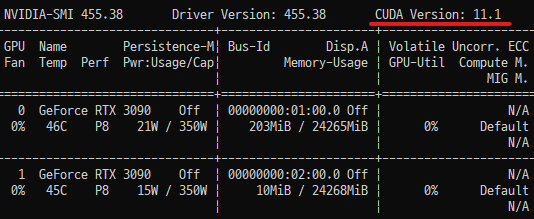
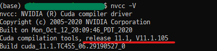
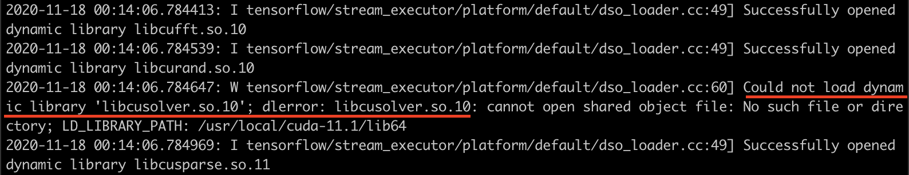

 실험용 워크스테이션 서버에 GeForce RTX 3090을 장착하여 사용하게 되었습니다. 직접 GPU를 교체하지는 않았고 기사님께서 오셔서 설치를 해주셨는데, GPU 장착 이후에 제가 Ubuntu 18.04 x86_64 운영체제 위에서 실험 환경을 구축했던 과정들을 아래에 공유합니다🤗

1. CUDA toolkit과 driver 삭제
2. CUDA toolkit 11 설치
3. cudnn 8 설치
4. tf-nightly 2.5.0 설치
5. libcusolver.so.10 에러 해결

RTX 30 시리즈는 CUDA 버전 11이상만이 호환되고, 이에 따라 cudnn 버전 8이상과 tensorflow 버전 2.5이상의 설치가 필수적이기 때문에 이런 순서로 설치를 진행했습니다.

### 설치 과정

##### 1. CUDA toolkit과 driver 삭제

 새로운 버전의 CUDA toolkit을 설치하기 위해서 이전 버전의 CUDA toolkit을 삭제해야합니다. 만약 CUDA toolkit은 없고 driver API만 존재하는 경우에도, 이전 버전의 파일이 존재한다는 이유로 설치가 취소되는 경우가 자주 발생하기 때문에 🤯 CUDA toolkit과 driver를 둘 다 삭제해 주었습니다.

```shell
sudo apt-get --purge -y remove 'cuda*'
sudo apt-get --purge -y remove 'nvidia*'
```

혹은 CUDA toolkit을 아래의 명령어를 통해 삭제하셔도 됩니다. /usr/local/ 디렉토리 내 cuda 관련 디렉토리가 남아있다면 이것 또한 지워줍니다. *명령어 내  x 표시가 되어있는 부분은 본인 환경에 맞는 버전으로 꼭 수정해 주시길 바랍니다.*

```shell
sudo /usr/local/cuda/bin/uninstall_cuda_x.x.pl

rm -rf /usr/local/cuda
rm -rf /usr/local/cuda-x.x
```

남아있는 nvidia 관련 파일은 아래의 명령어를 통해 확인 가능합니다. 남아있는 것들도 똑같이 `apt-get --purge remove` 명령어를 사용하여 삭제합니다. 

```shell
dpkg -l | grep -i nvidia
```

##### 2. CUDA toolkit 11 설치

 다음으로는 아래 명령어를 통해 버전 11을 설치하겠습니다. 설치를 완료하면 /usr/local/ 디렉토리 내에 cuda-11 디렉토리가 생성되며, driver API 또한 자동으로 설치됩니다.

*주의: 아래 명령어는 ubuntu 18.04 x86_64 운영체제를 위한 설치 명령어입니다. 다른 운영체제를 사용하고 계시다면 [공식 홈페이지](https://developer.nvidia.com/cuda-11.0-download-archive)를 참고하시면 됩니다.*

```shell
wget https://developer.download.nvidia.com/compute/cuda/repos/ubuntu1804/x86_64/cuda-ubuntu1804.pin
sudo mv cuda-ubuntu1804.pin /etc/apt/preferences.d/cuda-repository-pin-600
wget http://developer.download.nvidia.com/compute/cuda/11.0.2/local_installers/cuda-repo-ubuntu1804-11-0-local_11.0.2-450.51.05-1_amd64.deb
sudo dpkg -i cuda-repo-ubuntu1804-11-0-local_11.0.2-450.51.05-1_amd64.deb
sudo apt-key add /var/cuda-repo-ubuntu1804-11-0-local/7fa2af80.pub
sudo apt-get update
sudo apt-get -y install cuda
```

설치가 완료되었다면 driver API와 CUDA toolkit이 각각 버전 11으로 올바르게 인식되는지 확인합시다. `nvidia-smi` 명령어를 사용하면 driver API의 버전을 확인할 수 있습니다.



`nvcc -V` 명령어를 사용하면 CUDA toolkit의 버전을 확인할 수 있습니다. (전 11.0을 설치했는데 왜 11.1이 설치되었을까요..? 흠🤔)*참고로 `nvidia-smi`와 `nvcc -V`가 서로 다른 버전을 보이는 이유는 [이곳](https://stackoverflow.com/questions/53422407/different-cuda-versions-shown-by-nvcc-and-nvidia-smi)을 확인하시면 좋습니다.*



만약 `nvcc -V` 명령어를 사용했는데 위와 같이 버전이 출력되지 않는다면, 새로운 버전의 경로를 올바르게 인식할 수 있도록 계정의 .bashrc 파일 내 PATH를 수정해야 합니다. 먼저 .bashrc파일을 편집기를 통해 열어줍니다. 

```shell
vim ~/.bashrc
```

그리고 .bashrc 파일 하단에 아래 코드를 추가합니다.

```shell
# NVIDIA CUDA toolkit
export PATH=/usr/local/cuda-11/bin:$PATH	
export LD_LIBRARY_PATH=/usr/local/cuda-11/lib64
```

마지막으로, 변경된 .bashrc 파일의 내용을 적용합니다.

```shell
source ~/.bashrc
```

##### 3. cudnn 8 설치

 CUDA 버전 11이상을 사용하기 위해서 cudnn 또한 버전 8이상을 사용해야 합니다. [공식 홈페이지](https://developer.nvidia.com/cudnn)에서 cudnn 라이브러리를 다운 받아야 하며, NVIDIA 계정 필요합니다. NVIDIA 계정을 통해 본인 환경에 맞는 cudnn 라이브러리 tgz 파일을 다운로드 한 뒤에, 해당 파일을 압축 해제합니다. *명령어 내  x 표시가 되어있는 부분은 본인 환경에 맞는 버전으로 꼭 수정해 주시길 바랍니다.*

```shell
tar -xzvf cudnn-x.x-linux-x64-v8.x.x.x.tgz
```

그리고 압축 해제된 cudnn 관련 파일의 위치를 cuda 디렉토리로 이동시키고 사용권한도 변경해줍니다.

```shell
sudo cp cuda/include/cudnn*.h /usr/local/cuda/include
sudo cp cuda/lib64/libcudnn* /usr/local/cuda/lib64
sudo chmod a+r /usr/local/cuda/include/cudnn*.h /usr/local/cuda/lib64/libcudnn*
```

cudnn 버전을 확인하여 CUDNN_MAJOR 8이 출력된다면 설치가 완료된 것입니다.

```shell
cat /usr/local/cuda/include/cudnn_version.h | grep CUDNN_MAJOR -A 2
```


##### 4. tf-nightly 설치

현재 tensorflow의 공식 버전은 2.3.0이지만, CUDA 버전 11은 tensorflow 버전 2.5.0부터 지원되기 때문에 tensorflow 대신 tf-nightly를 사용해야 합니다.

```shell
pip install tf-nightly==2.5.0.dev20201116
```

tf-nightly는 매일 개발이 진행되고 있는 버전의 tensorflow라고 생각하시면 됩니다. 매우 최신 기능이 지원되기는 하나 불안정하다는 단점이 있습니다. *개발 진행 날짜에 따라 'dev2020xxxx' 부분이 다를 수 있습니다.*

##### 5. libcusolver.so.10 에러 해결

<center><i>해당 에러가 발생하지 않는 분들은 이 파트 전체를 건너 뛰시면 됩니다.</i></center><br>

현재 CUDA 버전 11 환경에서 tf-nightly 2.5.0을 사용하려고 하면 아래와 같은 에러로그가 출력되는 경우가 있습니다. 이는 CUDA toolkit 10.1에 존재하는 libcusolver.so.10 파일을 불러오지 못해서 발생하는 에러입니다. (CUDA 10을 지우고.. 11을 설치했는데.. 10.1을 또 설치하라는 말입니까..? 😭) 이 뿐만 아니라 가끔 cudnn 버전 8에 존재하는 파일 또한 제대로 불러오지 못하는 경우도 존재합니다.



아나콘다 가상환경을 사용하는 분들은 아래의 명령어를 통해 이 문제를 쉽게 해결할 수 있습니다. 가상환경 위에 설치하는 것이 충돌이 날 확률도 적고 문제가 생겼을 때 삭제하기도 쉬워서, 웬만하면 이 방법을 사용하는 것을 추천드립니다. *다만 새로운 가상환경을 만드실 때 마다 해당 env에 아래의 패키지를 설치해주셔야 합니다.*

```shell
conda install cudatoolkit		# CUDA 파일 관련 에러 해결
conda install -c nvidia cudnn	# cudnn 8 파일 관련 에러 해결
```

<center><i>아나콘다 가상환경을 통해 에러를 해결하신 분들은 아래 파트를 건너 뛰시면 됩니다.</i></center><br>

아나콘다 가상환경을 사용하지 않는 경우에는 CUDA toolkit 10.1을 설치하여 libcusolver.so.10 파일을 인식할 수 있도록 했습니다. 이 방법은 임시 방편이기 때문에 저는 추후에 CUDA 버전이 안정화가 되면 CUDA를 다시 설치하려 생각하고 있습니다.*혹은 [이곳](http://ejklike.github.io/2019/08/19/insatall-tensorflow-2.0.0-beta1-in-ubuntu-with-cuda-10-1.html)을 참고하는 것도 좋아보입니다.*

아래의 명령어를 사용하여 CUDA toolkit 10.1 설치를 진행합니다. 설치 과정에서 cuda 폴더를 업데이트 할 지에 대한 질문이 있었는데, 충돌이 생길까 걱정되어서 NO를 선택했습니다. 

*주의: 아래의 명령어는 ubuntu 18.04 x86_64 운영체제를 위한 설치 명령어입니다. 다른 운영체제를 사용하고 계시다면 [공식 홈페이지](https://developer.nvidia.com/cuda-10.1-download-archive-base)를 참고하시면 됩니다.*

```shell
wget https://developer.nvidia.com/compute/cuda/10.1/Prod/local_installers/cuda_10.1.105_418.39_linux.run
sudo sh cuda_10.1.105_418.39_linux.run
```

.bashrc 파일의 PATH를 수정하여 CUDA toolkit 10.1을 올바르게 인식할 수 있도록 합시다. 먼저 .bashrc파일을 편집기를 통해 열어줍니다.

```shell
vim ~/.bashrc
```

그리고 .bashrc 파일의 CUDA 11버전 PATH 하단에 아래 코드를 추가합니다.

```shell
export LD_LIBRARY_PATH=${LD_LIBRARY_PATH}:/usr/local/cuda-10.1/lib64
```

마지막으로, 변경된 .bashrc 파일의 내용을 적용합니다. 여기까지 모두 완료하셨다면 이제 거의 다 끝났습니다😆

```shell
source ~/.bashrc
```

### 테스트

이제 RTX 3090 GPU가 tf-nightly 2.5.0에서 잘 작동하는지 확인해봅시다. 다음의 코드를 통해서 GPU의 사용 가능 여부를 확인할 수 있습니다. 저는 python 3.8과 3.6 버전에서 각각 확인해보았으며 모두 잘 동작하였습니다.

```python
import tensorflow as tf
from tensorflow.python.client import device_lib

tf.test.is_gpu_available()		# 사용 가능한 GPU가 있는지 확인: True
device_lib.list_local_devices()	# 사용 가능한 모든 디바이스를 출력: RTX 3090 정보 출력
```

모든 디바이스를 출력하는것이 아니라 장착한 GPU의 번호만 간단하게 출력하는 [방법](https://stackoverflow.com/questions/38559755/how-to-get-current-available-gpus-in-tensorflow)은 아래 코드를 사용하시면 됩니다.

```python
from tensorflow.python.client import device_lib

def get_available_gpus():
    local_device_protos = device_lib.list_local_devices()
    return [x.name for x in local_device_protos if x.device_type == 'GPU']

get_available_gpus()
```

이 외에도 간단한 실습코드를 돌려보면서 이전 GPU와 비교해서 얼마나 빠르게 학습이 진행되는지, GPU를 충분히 활용하고 있는지를 확인해보시길 바랍니다. 저는 '핸즈온 머신러닝' 책의 [예제코드](https://github.com/ageron/handson-ml2/blob/master/10_neural_nets_with_keras.ipynb)를 돌려보았고 잘 동작하는 것을 확인했습니다. 

혹시 코드의 디버깅 로그가 너무 잡다하게 출력되는 경우에는 python의 os모듈을 통해 로그를 출력하지 않도록 바꾸시면 편리합니다. 

```python
import os
os.environ['TF_CPP_MIN_LOG_LEVEL'] = '3' 
import tensorflow as tf
```

- 0 = all messages are logged (default behavior)
- 1 = INFO messages are not printed
- 2 = INFO and WARNING messages are not printed
- 3 = INFO, WARNING, and ERROR messages are not printed

이제 딥러닝 실험에서 RTX 3090을 사용할 수 있게 되었습니다! 👏👏👏

>(21.01.06) 위의 tf.test.is_gpu_available() 에서는 값이 true가 나오더라도, 실제 예제 코드를 돌리면 에러를 뱉는 경우를 발견했습니다. 그래서 혹시 환경을 모두 구축하셨으면 실제 코드를 돌려가면서 gpu가 잘 활용되는지 확인해보시는 것을 추천드립니다. 저는 [tensorflow benchmark](https://github.com/tensorflow/benchmarks/tree/master/scripts/tf_cnn_benchmarks) 코드를 돌려보면서 gpu가 잘 활용되는지, 얼마나 빠르게 데이터를 처리하는지 등을 확인했습니다. 자세한 사용법은 해당 링크 readme에도 잘 나와있고, [HiSEON님의 블로그](http://hiseon.me/data-analytics/tensorflow/tensorflow-benchmark/)에도 잘 나와있으니 필요하신 분들은 참고하시길 바랍니다..!

### Reference

- [NVIDIA cudnn documentation](https://docs.nvidia.com/deeplearning/cudnn/install-guide/index.html)
- [The Simple Guide: Deep Learning with RTX 3090 (CUDA, cuDNN, Tensorflow, Keras, PyTorch)](https://medium.com/@dun.chwong/the-simple-guide-deep-learning-with-rtx-3090-cuda-cudnn-tensorflow-keras-pytorch-e88a2a8249bc) 
- [Different CUDA versions shown by nvcc and NVIDIA-smi](https://stackoverflow.com/questions/53422407/different-cuda-versions-shown-by-nvcc-and-nvidia-smi)
- [Disable Tensorflow debugging information](https://stackoverflow.com/questions/35911252/disable-tensorflow-debugging-information)
- [How to get current available GPUs in tensorflow?](https://stackoverflow.com/questions/38559755/how-to-get-current-available-gpus-in-tensorflow)

