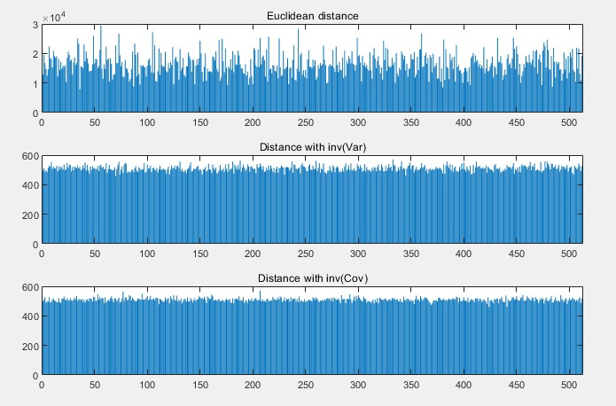

Mahalanobis distance는 데이터의 분포를 고려하며 거리 계산을 할 수 있는 좋은 툴입니다. 식을 이해하기 위해서는 먼저 공분산과 공분산의 역행렬 term이 의미하는 바를 알아야 하기 때문에, 이번 포스팅에서 간단한 설명 및 시각화를 통해 mahalanobis distance을 이해해보도록 하겠습니다. 

### Inverse matrix

어떤 $D_a$라는 데이터 분포에 대하여 $A$라는 행렬을 곱하면, 선형 대수에서 가장 기본적 형태인 $AD_a = B$ 식으로 표현됩니다. 이미지 왼쪽은 $D_a$ 즉, 데이터 분포를 나타낸 것이고, 오른쪽은 이 데이터 분포에 어떤 $A$라는 선형변환을 가한 결과($B$)입니다.

이와 반대로 어떤 데이터 분포 $D_b$에 $A^{-1}$를 곱하는 것은, 데이터 분포를 $A$라는 변환 이전의 상태로 되돌린다는 의미로 해석이 가능합니다.

### Variance and Covariance 

**분산(Variance)**은 어떠한 하나의 축을 기준으로, 데이터가 기댓값으로부터 얼마나 떨어진 곳에 분포하는지를 나타냅니다.
$$
\begin{aligned}
Var[X] 
&= \mathbb E[(X-\mathbb E[X])^2] = \mathbb E[(X-\mu)^2]
\end{aligned}
$$
**공분산(Covariance)**은 어떠한 2개의 축 사이에서 데이터의 **상관 관계**를 나타내는 값 입니다. 예를 들어 우리가 2차원 데이터 분포를 관찰한다고 할 때, 데이터가 x축으로 증가하는 경향을 보이면서 y축으로도 증가하는 경향을 보인다면 양의 공분산 값을 갖습니다.
$$
\begin{aligned}Cov[X,Y] &= \mathbb E[(X-\mathbb E[X])(Y-\mathbb E[Y])] = \mathbb E[(X-\mu_x)(Y-\mu_y)] \end{aligned}
$$
**공분산 행렬(Covarianve matrix)**에 대해서는 2차원(x, y축을 가지는) 데이터 예제와 함께 살펴보도록 하겠습니다.
$$
D (\mu = 0, v=0) = \begin{bmatrix}
-6 & 8 \\
4 & -10\\
2 & 2
\end{bmatrix} \\
Then, D^TD = \begin{bmatrix}
Cov(X,X) & Cov(X,Y) \\
Cov(Y,X) & Cov(Y,Y)
\end{bmatrix}
= \begin{bmatrix}
56 & -84 \\
-84 & 168
\end{bmatrix}
$$
식을 통해 해석해보면, 공분산 행렬은 '데이터의 모든 축에 대하여, 축 두 쌍에 대한 공분산 정보를 담고 있는 행렬'이라는 것을 알 수 있습니다. 이는 결국 공간 상의 전체적인 데이터 형태를 설명해주는 역할을 합니다.

### Mahalanobis distance

어떤 점과 점 사이의 similairty를 측정 할 때 가장 간단하게 사용할 수 있는 툴은 euclidean distance입니다. 하지만 데이터가 어떻게 분포해 있느냐에 따라 euclidean distance로 similarity를 측정하는 것은 좋은 성능을 내지 못할 수 있습니다. 아래 이미지를 예로 들어보겠습니다.

이미지의 왼쪽은 데이터 분포의 평균 지점을 중심으로한 euclidean distance $d$ 이하의 점들을 모아본 것입니다. (원의 반지름의 길이가 $d$ 입니다) 왼쪽 이미지 상에서 빨간색의 점은 파란색 점들과 실제로 다른 class인데도 불구하고, 외곽에 위치한 파란색 점 보다 오히려 더 파란색 데이터 class일 확률이 높다고 잘못 추론될 수 있습니다.
$$
d(\vec{x},\vec{y}) = \sqrt{(\vec{x}-\vec{y})^T(\vec{x}-\vec{y})}
$$
이미지의 오른쪽처럼 공간 분리가 되는 것이 더 논리적으로 보이지만, euclidean distance 식의 경우에는 공간 상에서 데이터가 어떻게 분포되어 있는지는 고려하지 않기 때문에(정확히 말하자면 데이터 분포가 gaussian이라고 보기 때문에) 오른쪽 이미지와 같은 similairty 측정이 불가능합니다. 

이런 문제 상황에 대해 우리는 mahalanobis distance를 사용하여 데이터 분포를 고려한 거리 계산을 할 수 있습니다. 식은 다음과 같습니다.
$$
d(\vec{x},\vec{y}) = \sqrt{(\vec{x}-\vec{y})^T\Sigma^{-1}(\vec{x}-\vec{y})}
$$
형태는 euclidean distance의 식에서, 가운데에 **공분산 행렬의 역행렬**이 들어있다는 점만 다릅니다. 여기서 공분산 행렬의 역행렬이 의미하는 점을 이 포스팅의 가장 첫 부분에 있었던 inverse matrix에 대한 설명과 함께 이해하시면 좋습니다.

공분산 행렬은 데이터가 공간상에서 어떤 형태를 가지고 퍼져있는지를 설명해줍니다. 이런 공분산 행렬에 대해서 역행렬을 취한뒤 거리 계산 식 사이에 넣어준다는 것은, 기존에는 euclidean distance로 측정되던 값을 데이터 분포 형태에 따라서 늘이거나 줄여서 측정한다는 것을 의미합니다. 즉, 공분산이 큰 방향에 대해서는 데이터가 어느정도 퍼져있어도 용인해주면서도, 공분산이 작은 방향에 대해서는 데이터가 많이 퍼져있지 않도록 제한하겠다는 것을 의미합니다.

아래는 데이터의 분포를 고려하면서 거리를 측정하는 것이 실제로 효과가 있는지 확인해보기 위해서, matlab으로 512차원 상 512개의 데이터(갯수에 딱히 어떤 의미는 없습니다)로 이루어진 랜덤한 데이터 분포를 생성하고, 평균점을 기준으로 데이터 점들의 거리 계산을 한 결과입니다. 

Euclidean distance 측정 결과를 확인한다면 워낙 distance가 튀어있는 값들이 많아서, 분포상에 어떤 outlier가 추가된다고 하더라도 발견하기가 쉽지 않습니다. 하지만 mahalnobis distance 측정 결과를 확인한다면, 해당 class가 아닌 다른 class의 데이터가 space 상에 추가된다고 하더라도 distance가 튀어(거리값이 매우 크게 측정됨) 쉽게 다른 class라는 것을 파악할 수 있습니다.