이번 포스팅에서는 2019년 ICLR 학회에 게재된 [Learning to Propagate Labels: Transductive Propagation Network for Few-shot Learning](https://arxiv.org/pdf/1805.10002.pdf) 논문에 대해 리뷰합니다. 랩 세미나 준비를 위한 스크립트를 제작하다가 겸사겸사 포스팅으로도 올리게 되었습니다 🤣

제목을 먼저 살펴보면 이 논문에서 제시하는 알고리즘은 'Label 전파 방법을 학습한다'고 합니다. Label 전파 방법을 학습하는 네트워크의 이름이 Transductive Propagation Network(TPN)이며, 이를 학습하는 이유는 few-shot learning 문제 상황을 잘 해결해보기 위함임을 제목을 통해 짐작해볼 수 있습니다. 그리고 이 모델에서는 label 전파 방법을 학습하기 위해서 왠지 transductive 라는 것을 활용했을 것만 같습니다.

그러면 들어가기 앞서 few-shot learning이란 무엇인지에 대해 간략하게 소개를 드리고 이 논문에서 제시하는 알고리즘과 novelty에 대해 이야기 해보도록 하겠습니다.

### Introduction

현재는 대부분의 분야에 인공지능이 활용되고 있을만큼 인공지능 기술이 많이 발전했습니다. 하지만 이런 발전에도 불구하고 *연속적 학습의 어려움*, *결과에 대한 분석의 어려움*, *많은 양의 데이터가 요구된다는 점*, *인과 관계에 대한 설명 능력의 부족* 등과 같이 인공지능 기술은 아직 몇 가지 한계점을 가지고 있습니다. 그래서 이에 대한 돌파구를 찾기 위한 연구들이 다양한 이름을 가지고 진행되고 있고, few-shot learning 또한 이런 한계점을 극복하기 위한 연구 분야 중 하나입니다.

Few-shot learning은 위에서 언급한 딥 러닝의 여러 한계점들 중에, 학습에 필요한 **데이터 양에 따른 일반화 성능**에 집중합니다. 일반적으로 딥러닝 모델에 새로운 task의 데이터가 아주 적은 양으로 주어진다면 우리는 모델을 빠르게, 그리고 올바르게(정확도가 높게) 최적화 할 수 없습니다. 하지만 사람의 경우에는 단 몇 개의 예시만을 가지고도 새로운 개념이나 이미지를 빠르게 배우고 분류할 수 있습니다. 이는 사람의 일반화 능력이 매우 높기 때문인데, 이렇게 새로운 task에 대해서 단 몇 개의 예시만을 가지고도 사람과 같은 적응성을 보이는 딥러닝 모델을 만들어 보자는 목표로 연구되고 있는 분야가 few-shot learning 연구입니다. 그렇다면 최근 연구들이 이러한 목표를 어떤 식으로 풀어나가고 있을까요?

대부분의 few-shot learning 연구들은 문제상황을 아래과 같이 설정합니다. 

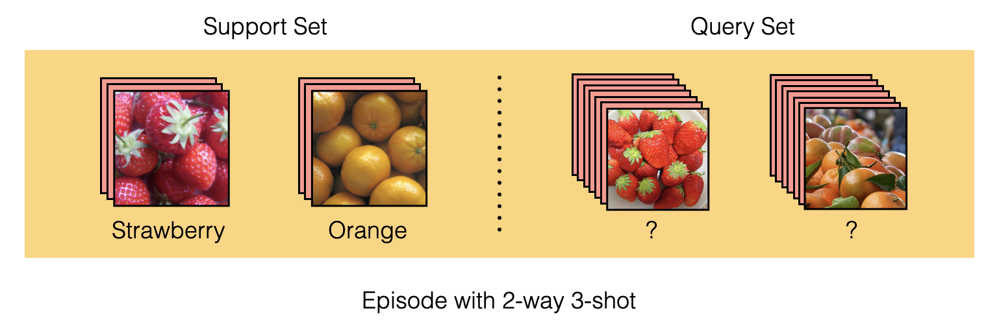

Few-shot learning에서는 훈련에 사용하는 데이터 셋을 support set과 query set으로 이루어진 episode 형태로 제공합니다. 이러한 상황을 **N-way K-shot**의 episodic learning 방식이라고 말하며, N은 class의 수, K는 class당 제공하는 입력 데이터의 수를 의미합니다. 위 그림의 경우 2개의 class를 가지며, class당 3개의 이미지가 주어지므로 2-way 3-shot이라고 할 수 있습니다. 대부분의 연구들이 5-way 1-shot 또는 5-way 5-shot을 벤치마크로 하여 실험을 진행합니다.

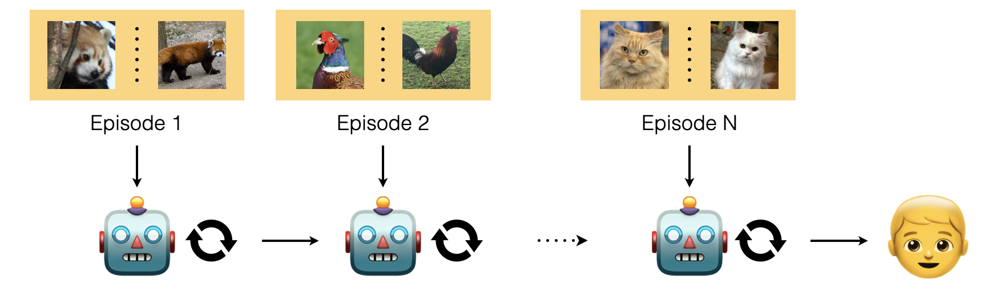

먼저 모델의 입력으로 support set을 제공합니다. 그러면 모델은 '이 episode에는 이러한 class가 있고, 이 class 데이터들은 대강 이렇게 생겼구나'라는 것을 알고 받아들일 준비를 합니다. 다음으로 query set을 제공하는데, query set은 support set과 class는 같지만 support set에서는 보여준 적이 없는 데이터입니다. 그리고 query set에서 모델이 task를 얼마나 잘 수행했는지를 통해 loss를 계산하여 (분류 문제의 경우엔 cross-entropy) 모델을 최적화합니다. 

그 다음 에피소드로 넘어가도 학습은 동일한 방식으로 진행됩니다 - support set으로 이전에 본적없는 새로운 class에 대한 few-shot이 제공되고, query set을 통해 loss를 뽑아 모델을 최적화 하는 방식

Few-shot 문제를 풀기위한 선행 연구들은 주로 **거리 기반** 학습 방식과 **최적화 기반** 학습 방식을 사용했습니다. 

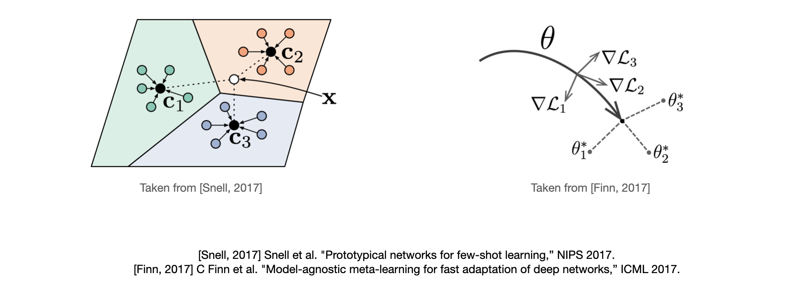

거리 기반 학습의 경우에는 먼저 support set을 모델에 제공하여 임베딩 공간 상에 feature vector를 찍습니다. 그리고 이 feature vector들을 관찰하여 거리 기반으로 query set이 어느 label에 속할지 추론합니다. *(좌측 그림)*

최적화 기반 학습의 경우에는 support set을 가지고 모델의 파라미터를 fine-tunnning 하고, 이 fine-tunning된 파라미터를 통해 query set을 잘 분류하도록 모델을 학습시킵니다. 이런 방식으로 학습을 진행하면, 적은 수의 데이터 만으로 fine-tunnning을 했을 때에도 모델이 빠르게 해당 task에 적합한 파라미터를 찾을 수 있게 됩니다. 즉 학습된 모델이 새로운 task에 대한 좋은 initial parameter point를 가지게 됩니다. *(우측 그림)*

이러한 방법들이 few-shot 문제 상황을 어느정도 잘 풀어내긴 했지만, 아직 개선해볼 수 있는 단점들이 몇 가지 존재합니다. 첫 번째로 이 방법들은 support set과 query set 사이의 관계를 관찰하기는 하지만 **sample 사이의 관계 정보**는 직접적으로 관찰하지 않습니다. 학습과정에 있어서 관계 정보가 내재적으로 학습될 수는 있겠으나, 이를 직접적으로 학습의 입력값으로 넣어줄 여지는 존재합니다. 

두 번째로는 support set을 모델의 query set 추론을 위한 단서로 사용하고, query set으로는 학습을 위한 loss만 뽑는 few-shot setting 자체가 단점입니다(논문에서는 이에 대해 fundamental difficulty라는 워딩을 사용했습니다). 워낙 적은 수의 support sample 만으로 query set의 label을 추론하다보니 적은 sample로만 추론한 데이터 분포가 실제 분포와는 많이 다를 수 있습니다. 다시말해, 각 task에 대한 모델의 추론에 있어서 support sample만 사용하기 때문에 **query set이라는 단서를 소모**하게 된다고 볼 수 있습니다. 예를 들어 support set으로 5-way 5-shot 데이터를 제공한 뒤 75개의 unlabeled query set 데이터를 가지고 loss를 얻는다면, 좋은 추론을 위해 사용할 수 있는 75개의 단서를 소모하는 것입니다.

그래서 이런 단점들을 극복하고자 공분산 정보나 graph 구조를 학습에 사용하는 시도들과, 모델의 추론 단계에 있어서 support set 뿐만 아니라 query set 까지도 활용할 수 있는 방안에 대한 연구가 최근 활발하게 진행되고 있고 TPN 또한 위의 단점들을 개선하기위해 제시된 방법 중 하나입니다.

여기까지가 few-shot learning에 대한 소개와 TPN이 나오게 된 배경에 대한 설명이었으며 이제 본격적으로 TPN 논문의 내용을 들여다봅시다.

### Proposed Model

이 논문은 위에서 말씀드린 워낙 적은 수의 support sample로 query를 추론해야 한다는 few-shot setting의 fundamental difficulty를 해결하고, 각 sample node들의 관계 정보를 추론에 활용하기 위한 시도로써 Transductive Propagation Network를 제안합니다. 

대략적인 모델은 다음과 같은 메커니즘으로 작동합니다.

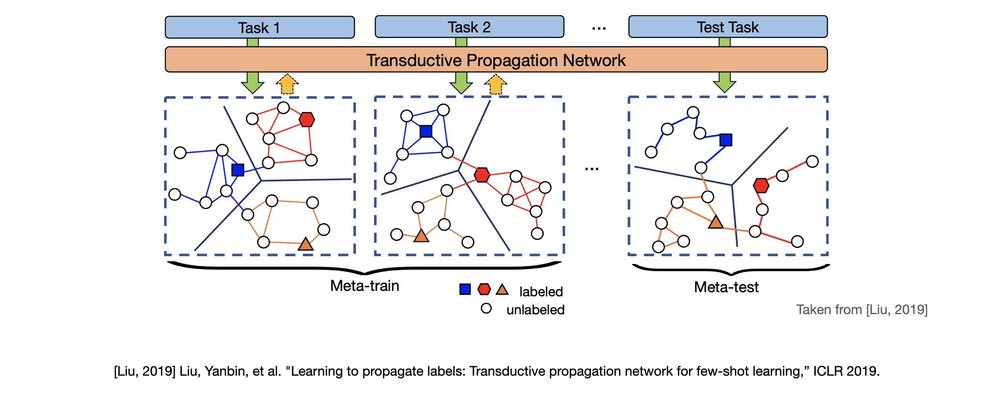

먼저 support set과 query set으로 이루어진 task 1 즉, episode 하나를 모델의 입력으로 제공합니다. 그러면 TPN은 받은 입력을 바탕으로 입력 하나 당 노드 하나를 갖도록 그래프를 구축합니다. 여기에 각 support set의 label은 one-hot encoding 형태, query set은 모두 0으로 채워진 형태로 label vector를 만들어 각 노드에 부여합니다. 따라서 그림 상 색칠된 노드는 support set을 입력으로 받아 만들어진 노드이며 색칠되지 않은 노드는 query set을 입력으로 받아 만들어진 노드를 의미합니다. 이렇게 그래프를 구축 한 뒤에는 support set 노드의 label을 label propagation 식의 계산을 통해 query set 노드로 iterative하게 전파합니다.

좀 더 세부적인 figure를 통해 모델의 기작을 살펴보겠습니다.

논문에서는 알고리즘을 **feature embedding**, **graph construction**, **label propagation**, **loss** 총 네 단계로 나누어 설명하고 있습니다. 

Feature embedding 단계에서는 episode(support set과 query set)의 모든 이미지를 CNN ${f_\varphi}$의 입력으로 받아 이미지의 주요한 특징을 feature vector의 형태로 뽑아냅니다. feature extractor 자체는 선행 연구들과의 공정한 비교를 위하여 선행 few-shot learning 연구들이 사용한 feature extractor 모델을 그대로 가져와 사용했습니다.

Graph construction 단계에서는 이전 단계에서 얻은 feature vector를 또 다른 CNN ${g_\varphi}$의 입력으로 제공하여 **sigma**(${\sigma}$)라는 **example-wise length-scale parameter**를 뽑아냅니다. 이 sigma는 노드 사이의 similarity를 나타내는 유사도 행렬(Similarity matrix)을 계산하기 위해 사용되는데, TPN에서는 similarity matrix로 흔히 사용되는 gaussain similarity function의 ${W_{ij} = \exp(-\frac{d(x_i,x_j)}{2\sigma^2})}$ 식을 ${W_{ij}} = \exp(-\frac{1}{2}d(\frac{f_\varphi(x_i)}{\sigma_i},\frac{f_\varphi(x_j)}{\sigma_j}))$의 형태로 수정하여 사용합니다. 

수정된 식을 살펴보면 기본적으로 노드(feature vector) 사이의 거리를 가지고 similarity를 계산하되, 노드 간 거리를 그대로 보는 것이 아니라 scaling parameter인 sigma를 통해 노드 값을 task에 알맞게 조정한 뒤에 similarity를 계산합니다. 즉, 이 단계의 ${g_\varphi}$는 '이번에는 이런 feature들이 들어왔으니, sigma를 이렇게 뽑아 feature를 조정하여 그래프를 구성해야겠구나'라는 기작을 갖는다고 이해할 수 있습니다.

만들어진 similarity matrix는 다시 normalized graph laplacian을 적용하여 최종적으로 ${S = D^{-1/2}WD^{-1/2}}$ 형태가 됩니다. 여기서 $D$는 $W$의 i번 째 row의 합을 (i, i) 값으로 갖는 diagonal matrix입니다.

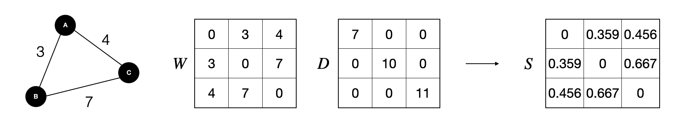

Laplacian matrix는 graph의 similarity와 degree를 통해 graph를 표현하는 방법입니다. ${L  = D-W}$로 정의되며 normalized 형태는  ${L= I-D^{-1/2}WD^{-1/2}}$로 정의됩니다. TPN에서의 normalized graph laplacian 식은 기존의 normalized graph laplacian식과 조금 차이를 보이는데 2004년 Zhou et al, "Learning with Local and Global Consistency" 논문의 label propagation 식을 그대로 사용하였기 때문이기도 하며, $D$가 의미하는 바가 degree matrix와 $W$의 i번 째 row의 합으로 각각 다르고, similarity matrix를 normalize하기 위한 목적으로만 사용하였기 때문이라고 개인적으로 추측하고 있습니다. 

이렇게 만들어진 $S$는 1과 갖거나 **1보다 작은 eigenvalue**를 갖는 symmetric matrix가 됩니다(자세한 설명은 Appendix에 있습니다). 과정은 복잡하지만 간단하게는 similarity matrix를 normalized된 형태로 표현했다 정도로 이해하시면 쉽습니다.

Label propagation 단계에서는 이전 단계에서 얻은 **normalized graph laplacian** $S$를 사용하여 support set 노드의 label을 query set의 unlabeled 노드로 전파합니다. label propagation 과정은 아래 식의 계산을 통해 이루어지며, 이 단계에는 trainable parameter가 존재하지 않는다는 것이 특징입니다.
$$
F_{t+1} = \alpha SF_t + (1-\alpha)Y
$$
$\mathcal F$를 양수의 entry를 갖는 $(N\times K + T)\times N$ 크기 matrix set이라고 할 때, $Y \in \mathcal F$는 $x_i$가 support set에 속하고 $y_i = j$인 경우에 해당 entry 값이 1이 되는 label matrix를 의미하고, $F_t \in \mathcal F$는 timestep $t$에서의 predicted label matrix를 의미합니다. $\alpha$는 propagated information의 양을 조절하기 위한 0에서 1사이의 값을 갖는 hyperparameter이며, 이 값을 사용하여 현재 timestep의 predicted label 값($F_t$)과 support label의 값($Y$)을 다음 timestep으로 각각 얼마만큼 전달할지 결정합니다. 실제 실험에서는 $\alpha$를 0.99로 설정하였다고 합니다.

충분한 timestep을 지난 뒤의 $F_t$의 값을 $F^*$라고 표기하여 식을 재구성 해봅시다. 
$$
\begin{aligned}
F^* &= lim_{t→\infin} F_t \\ 
&=(1-\alpha)(1-\alpha S)^{-1}Y \\ \\
\therefore F^* &= (1-\alpha S)^{-1}Y\text{,  for classification}
\end{aligned}
$$
$\alpha$가 0에서 1사이의 값이고, $S$ eigenvalue의 절댓값이 1보다 작은 경우, $F_t$가 충분한 timestep을 지나면 두 번째 줄과 같은 식이 나오며(이유는 Appendix 파트를 참고하시면 됩니다!) classification 문제는 label에 대한 추측 중에서 제일 높은 값을 하나만 고르면 되기에 모든 entry에 곱해지는 상수 $(1-\alpha)$를 지우더라도 여전히 해는 동일합니다. 따라서 최종적으로 $F^* = (1-\alpha S)^{-1}Y$ 라는 닫힌 형태의 label propagation 식이 도출되어 iteration 없이 바로 $F^*$를 계산할 수 있습니다. 결과적으로 우리가 찾고자 하는 $F^*$는 $Y$라는 label matrix에 $(1-\alpha S)^{-1}$의 선형변환을 가해준 것으로 해석이 가능하며, 이 때 $(1-\alpha S)^{-1}$는 **graph kernel, diffusion kernel**이라고 "Learning with Local and Global Consistency" 논문에서는 말하고 있습니다. 아직 graph kernel, diffusion kernel에 대한 이해가 부족한데, 이에 대한 의견이 있으시면 댓글로 공유해주시면 감사하겠습니다. (일단은 더 적은 정보를 가지고 있는 $Y$를 사용하여  $F^*$를 추론해야하는 상황에서 최적의 $S$를 잘 찾아야 하는 문제이므로 이렇게 말한게 아닐까 생각하고 있습니다.)

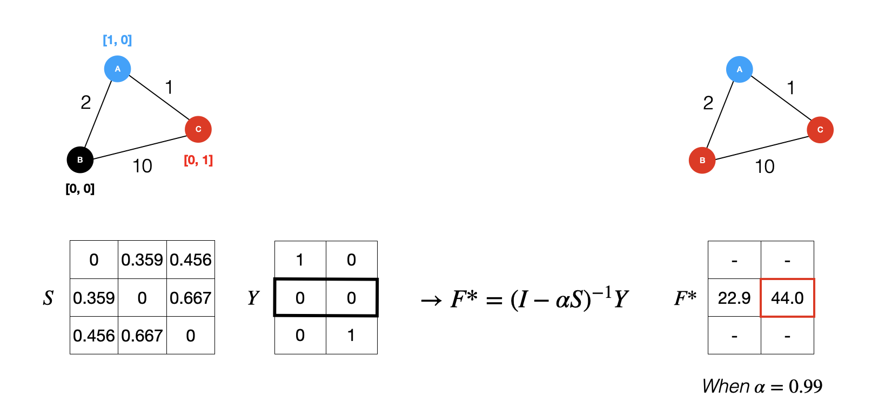

역행렬 계산은 $O(n^3)$의 시간 복잡도를 갖는 비효율적인 계산이지만, few-shot learning의 경우엔 n이 100정도로 매우 작기 때문에 사용에 큰 무리는 없었다고 합니다.

마지막으로 loss 단계에서는 label propagation 단계에서 계산된 $F^*$를 graound-truth labels와 비교하여 cross-entropy loss를 계산합니다. 여기서 개인적으로 loss를 query set의 label로만 계산하는 것이 아니라 support set의 label도 포함하여 계산한다는 점이 흥미로웠습니다. 기존의 few-shot learning 연구들은 support set는 추론을 위한 단서로 사용하고 오로지 query set을 가지고 loss를 뽑습니다. 하지만 TPN의 경우에는 추론의 단서로도 support set과 query set을 모두 사용하고, loss 계산에도 support set과 query set을 모두 사용이 가능한 세팅이라는 점이 신기하다는 생각을 했습니다. 그리고 추가적으로 query label만 가지고 loss를 뽑으면 결과가 어떻게 나올까 궁금하기도 했습니다. 그런데 논문에서 관련된 사항이 언급되지 않은걸 보니 query label만 가지고 loss를 뽑았을 때의 성능이 좋지 않았거나 큰 차이가 없어서 언급 자체를 안한 것이 아닐까 추측하고 있습니다.

모든 과정을 다시 되돌아 보자면, 먼저 feature embedding 단계에서 이미지를 잘 설명하는 feature vector를 뽑고, graph construction 단계에서 feature vector를 바탕으로 task에 적합하게 feature를 조정하는 sigma를 뽑아 similarity matrix를 통해 그래프 형태를 구축하고, label propagation 단계에서 구축된 그래프와 support set label을 통해 unlabeled query set에 predicted label을 부여하고, 최종적으로 모든 노드에 부여된 predicted label 값을 ground truth label과 비교하여 모델을 최적화합니다.

### Contribution

논문에서 언급하는 main contribution 세 가지를 차례대로 살펴보겠습니다.

1. Transductive inference를 few-shot learning에 explicitly하게 사용한 최초의 논문이다. 2018년 Nichol의 논문에서 transductive setting의 실험이 진행되긴 했으나, 직접적인 transductive model을 제안한 것이 아닌 test(query) example간의 정보를 batch normalization을 통해 공유하는 정도에 불과했다.
2. Transductive inference 상황에서 episodic meta-learning을 통해 unseen class에게 label 전파방법을 학습하는 label propagation graph를 제안한다. 2004년 Zhou의 논문에서 제시된 naive heuristic-based label propagation methods의 성능을 눈에 띄게 능가한다.
3. few-shot learning 연구에서 벤치마크로 여겨지는 mini-ImageNet, tiered-ImageNet classification에 대해서 각각 state-of-the-art 성능을 보였으며 semi-supervised learning 실험에서도 높은 성능을 보였다.

Introduction에서 support set을 모델의 query set 추론을 위한 단서로 사용하고 query set으로는 학습을 위한 loss만 뽑는 few-shot setting이 few-shot learning 연구의 fundamental difficulty라는 말을 했었는데요, 바로 이 점이 논문에서 첫 번째 contribution으로 언급한 transductive와 관련이 있습니다.

- **Induction** *is reasoning from observed training cases to general rules, which are then applied to the test cases.*
- **Transduction** *is reasoning from observed, specific (training) cases to specific (test) cases.*

Induction은 일반적으로 우리가 알고있는 supervised learning을 생각하면 됩니다. 정의 그대로, 모델은 observed training case를 통해 **general rules**을 학습하고, test 단계에서는 학습된 general rules를 활용하여 이전에 보지못한 test cases를 추론합니다. 그래서 머신러닝 모델이 test case에 대한 좋은 일반화 성능을 보이는 것에 대해 모델이 inductive bias를 잘 학습했다 라고 말할 수 있습니다. Transduction은 이와 조금 차이를 가집니다. 어떤 general rule을 사용하여 추론하기보다는 observed specific(training) cases를 사용한 specific(training) cases의 추론 과정을 transduction이라고 할 수 있습니다.

Few-shot learning 상황에 대입해서 생각해보면, support set을 통해 만들어낸 단서를 가지고 support set에서는 본 적 없는(다만 class는 같은) query set을 분류하는 모델들은 inductive inference를 하는 것이며, TPN과 같이 query set에 대한 추론이 support set에만 의존하는 것이 아니라 query set에도 의존한다면 이는 transductive inference를 한다고 말할 수 있습니다. transductive 방식을 사용하면 25개의 support set, 75개의 query set 데이터를 가지고 있는 경우에, inductive inference 방식에 비해 75개의 단서를 추가적으로 사용할 수 있는 것이기 때문에 더 좋은 성능을 보입니다.

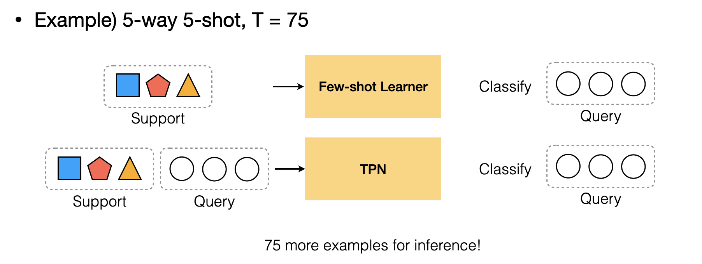

논문에서 언급한 두 번째, 세 번째 contribution은 모델의 성능과 관련한 내용이므로 Experiment 파트로 넘어가서 살펴봅시다.

### Experiment

TPN의 성능에 대한 실험은 few-shot learning 연구의 벤치마크 데이터 셋인 **miniImageNet** 데이터 셋과 **tieredImageNet** 데이터 셋을 사용했습니다. miniImageNet 데이터 셋은 100개의 class와 각 클래스당 600개의 샘플로 이루어져 있고, tieredImageNet 데이터 셋은 600개의 class와 각 클래스당 평균 1281개의 샘플로 이루어져 있습니다.

성능에 대한 비교는 transduction을 기준으로 non-transduction, BN, transduction 각 세 분류로 나누어 진행되었습니다. Transductive를 few-shot learning에 적용하는것의 novelty, 그리고 transductive 중에서도 TPN이 성능이 좋다는 사실을 강조하기위해 이러한 분류를 사용했다고 생각됩니다. 

사실 위에서 본 transduction의 정의에 대해서 저자들이 각각 해석하는 것이 조금씩 차이가 있기 때문에 이 모델이 transductive냐 inductive냐에 대해서 명확히 가르기는 힘들지만, 이 논문에서는 **query set에 대한 추론이 support에만 의존하느냐 아니냐**에 따라 transductive인지 아닌지로 구분지었습니다. 그래서 non-transduction의 경우에는 query set에 대한 추론이 각 query sample마다 개별적으로 이루어지고, transduction의 경우에는 query set에 대한 추론이 모든 support sample과 query sample에 대해 동시에 이루어집니다.

BN은 Nichol, et al. "On first-order meta-learning algorithms."논문의 실험 세팅과 동일합니다. Batch normlaization statistics를 support set의 정보만 참고하는 것이 아니라 모든 query set의 정보까지 참고하여 계산하였습니다. 이런 경우, batch normalization을 통해 query set에 대한 추론이 query set의 정보 또한 활용한다고 해석할 수 있습니다. 다만 이는 transduction의 explicit한 사용이라고 말하기엔 부족하여 저자들은 이를 BN이라는 키워드로 따로 분류하였습니다.

MAML+Transduction은 TPN에서 새롭게 제시한 실험 세팅입니다. MAML의 cross-entropy loss term에 transductive regularization 역할을 하는 ${\Sigma^{N\times K+T}_{i,j=1}W_{i,j}}\lVert \hat{y_i} - \hat{y_j}\rVert^2_2$ 을 추가한 형태입니다. 이 loss term은 같은 similarity가 큰 경우에는 $y_i$와 $y_j$의 차이가 작아야하고, $y_i$와 $y_j$의 차이가 큰 경우에는 similarity가 작아야 합니다.

실험 결과는 다음과 같습니다.

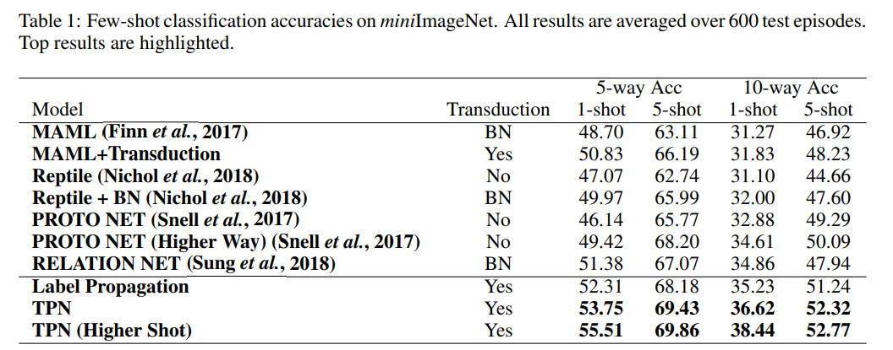

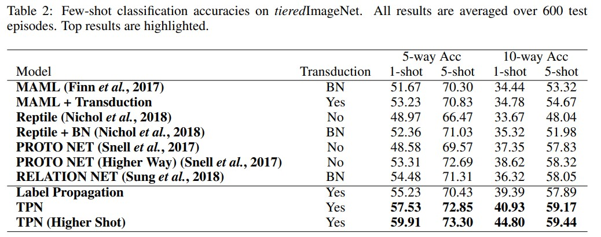

Semi-supervised 버전도 선행 semi-supervised few-shot learning 연구들과 비교하여 높은 성능을 보여주었습니다. semi-supervised는 support set에 unlabeled 샘플을 추가적으로 제공하는 것을 의미합니다.

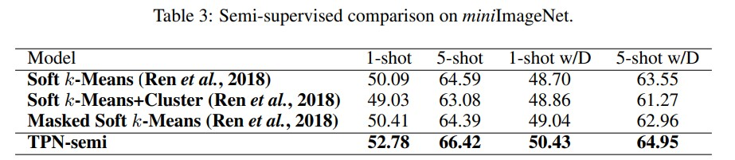

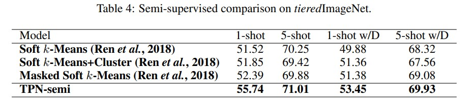

### Conclusion

Propgation 관련 선행 알고리즘들은 데이터 공간상에 샘플들이 고르게 분포되어있는 상황을 가정합니다. 그래서 고정된 sigma 값을 잘 조정하는 방식을 통해 label propagation을 진행합니다. 하지만 few-shot learning의 경우에는 데이터가 제한적이고 고르게 분포되어있지 않습니다. 이러한 이유로 기존 label propagation 알고리즘을 적용할 수 없었는데, 이 논문은 sigma를 hypereparameter 형태가 아닌 파라미터로 정의하여 데이터에 따른 최적의 sigma를 모델이  찾는 방식으로 식을 수정하였고 해당 문제를 효과적으로 해결하였습니다. 

또한 transduction을 통해 support 뿐만 아니라 query set까지 추론의 단서로써 사용하여 few-shot learning의 fundamental difficulty를 개선할 수 있는 방법을 제안하며, transduction과 few-shot learning의 후속 연구 가능성을 증가시켰다고 생각합니다.

TPN은 일반적인 GNN과 비교해서 노드, 혹은 엣지에 대한 업데이트가 모델의 파라미터를 통해 이루어진다거나 그래프 구조상에 뉴럴넷이 들어가 있는 형태는 아닙니다. 그래서 TPN이 GNN 모델이라고 보기에는 애매한 것 같고, 그래프 이론을 few-shot learning에서 사용해보려는 시도 정도로 이해했습니다. TPN의 아이디어와 최신 GNN들의 특징을 접목하여 label propagation을 더욱 개선하는 방법을 고안해보면 어떨까 하는 생각도 추가적으로 들었습니다. 

### Appendix

##### Higher-shot

ProptoNet의 'Higher-way' 학습방법과 유사하게, TPN은 'Higher-shot'에 대한 실험도 수행했습니다. Transduction의 경우 더 많은 샘플을 제공하면 단서가 많아지는 것이므로, 과연 단서를 계속해서 늘려가면 성능이 어떤 식으로 변화할까?라는 궁금증을 해결해주는 실험입니다.

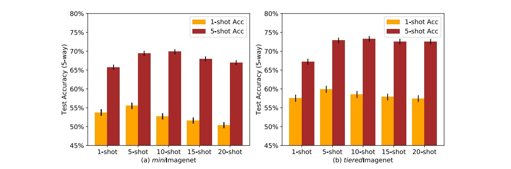

##### Loss

$F^*$의 값을 softmax를 통해 확률 값으로 변경한 뒤 이를 negative log likelihood cross-entropy로 계산합니다.
$$
P(\tilde{y_i} = j | \mathrm x_i) = \frac{\exp(F^*_{ij})}{\Sigma^N_{j=1}\exp(F^*_{ij})} \\
J(\varphi,\phi) = \Sigma^{N\times K + T}_{i=1}\Sigma^N_{j=1} - \mathbb I(y_i == j)log(P(\tilde{y_i}=j)|\mathrm x_i)
$$

##### |eigenvalue of $S$| < 1 증명

선형대수학에서 두 similar matrix의 eigenvalue는 서로 같습니다. 그리고 아래 식의 경우에 $A$의 eigenvector가 $v$라면, $B$의 eigenvector는 $P^{-1}v$가 됩니다. 

$B = P^{-1}AP \ \Longleftrightarrow \ PBP^{-1} = A$. If $Av = \lambda v$, then $PBP^{-1}v = \lambda v \ \Longrightarrow \ BP^{-1}v = \lambda P^{-1}v$

이를 바탕으로 |eigenvalue of $S$| < 1 를 증명해봅시다.
$$
S \text{ is similiar with } A = D^{-1}W \\
\text{Meaning of similarity: } B = P^{-1}AP\\
A = D^{-1}W = D^{-1/2}SD^{1/2}
$$

$S = D^{-1/2}WD^{-1/2}$는 바꿔서 표현해보면, $D^{-1}W = D^{-1/2}SD^{1/2}$와 같이 표현이 가능합니다. 이는 S와 $D^{-1}W$가 similar 하다는 것을 의미하는데, 그러면 $S$는 $D^{-1}W$와 같은 eigenvalue 값을 갖는다는 것을 알 수 있습니다.

여기서 $D^{-1}W$는 **markov matrix (stochastic matrices)**입니다. markov matrix는 무조건 eigenvalue 1인 값 하나와 절댓값이 1보다 작은 나머지 eigenvalue를 갖기 때문에 S의 eigenvalue의 절댓값은 모두 1보다 작게 됩니다.

##### Convergence of $F_t$

$$
F_0= Y, \text{ and}\ \ F_{t+ 1}= \alpha SF_t+ (1− \alpha )Y \\

F_t = ( \alpha S)^{t−1}Y + (1 −  \alpha )\Sigma^{t−1}_{i=0}( \alpha S)^iY
$$

$0 < \alpha < 1 $ 과 |eigenvalue of $S$| < 1 에 의해서 다음과 같은 식들이 만족합니다.
$$
\lim_{t \to \infin}( \alpha S)^{t−1}=0 ,\text{ and  }\lim_{t \to \infin}\Sigma^{t−1}_{i=0}( \alpha S)^i = (1-\alpha S)^{-1}
$$
따라서 $F^*$는 다음과 같은 결과로 수렴합니다.
$$
F^* = lim_{t→\infin} F_t
=(1-\alpha)(1-\alpha S)^{-1}Y
$$

##### normalized graph Laplacian

$$
\begin{aligned}
L &= D-A \\
D^{-\frac{1}{2}}LD^{-\frac{1}{2}} &= D^{-\frac{1}{2}}(D-A)D^{-\frac{1}{2}} \\
&= D^{-\frac{1}{2}}(D^{\frac{1}{2}} -AD^{-\frac{1}{2}}) \\
&= I - D^{-\frac{1}{2}}AD^{-\frac{1}{2}}
\end{aligned}
$$

##### Transductive 실험 세팅

자세한 설명은 Nichol, et al. "On first-order meta-learning algorithms"의 6. Experiments 파트를 참고하시면 좋습니다.

- MAML: MAML은 원래 실험에서 batch normalization계산할 때 support set 샘플과 모든 query sample의 정보(평균 분산) 사용하였음 *(BN)*
- MAML + Transduction: TPN에서 제시한 새로운 세팅. MAML의 loss function에 transductive regularization이라는 것을 추가함
- Reptile No: batch normalization계산할 때 support set 샘플과, 추론하려는 query 하나의 정보(평균 분산)만 사용
- Reptile + BN: batch normalization계산할 때 support set 샘플과 모든 query sample의 정보(평균 분산) 사용
- ProtoNet No: batch normalization계산할 때 support set 샘플과, 추론하려는 query 하나의 정보(평균 분산)만 사용

##### Graph kernel의 정의

In structure mining, a graph kernel is a kernel function that computes an inner product on graphs. Graph kernels can be intuitively understood as functions measuring the similarity of pairs of graphs.

### Reference

- [Zhou et al. Learning with Local and Global Consistency (NIPS 2003)](https://proceedings.neurips.cc/paper/2003/file/87682805257e619d49b8e0dfdc14affa-Paper.pdf)
- [Liu et al. Learning to Propagate Labels: Transductive Propagation Network for Few-shot Learning (ICLR 2019)](https://arxiv.org/abs/1805.10002)
- [Inductive vs. Transductive Learning](https://towardsdatascience.com/inductive-vs-transductive-learning-e608e786f7d)
- [Nichol, et al. On first-order meta-learning algorithms](https://arxiv.org/abs/1803.02999)
