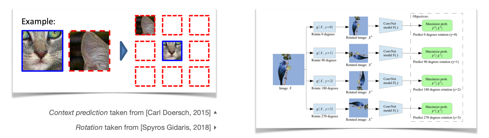
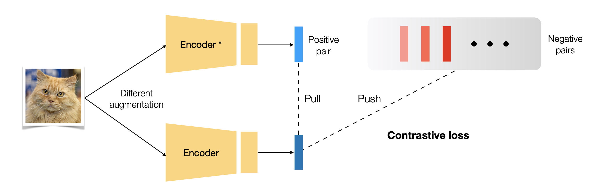
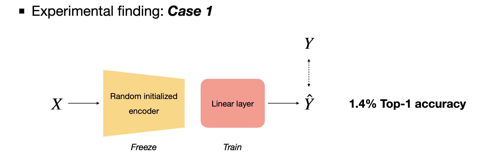
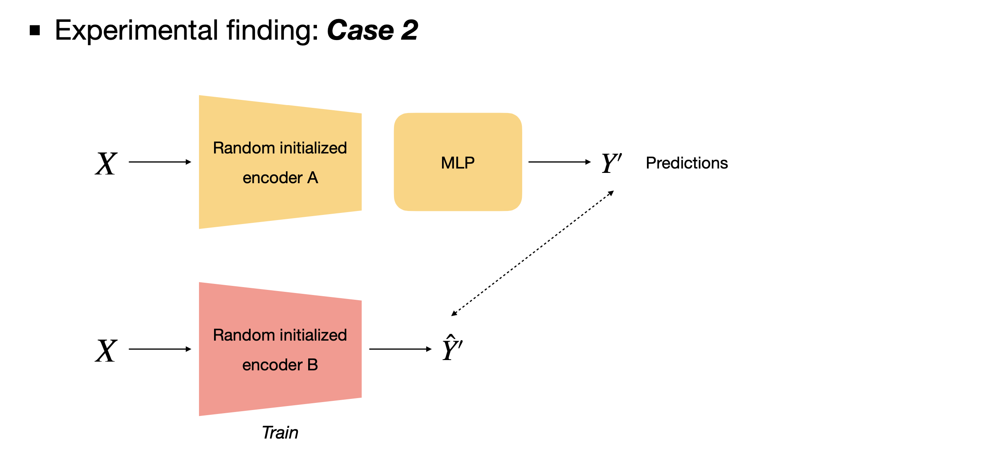
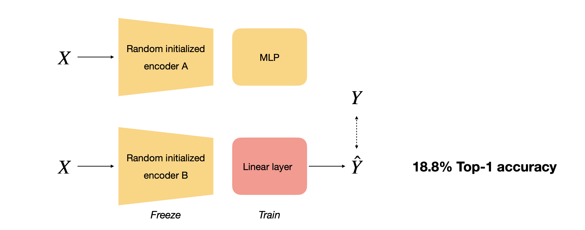
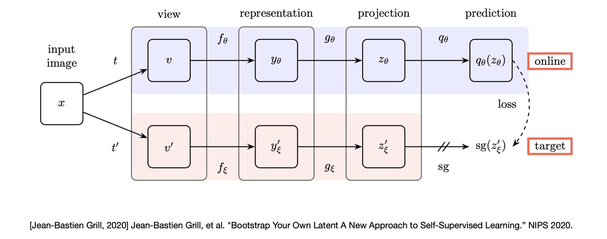
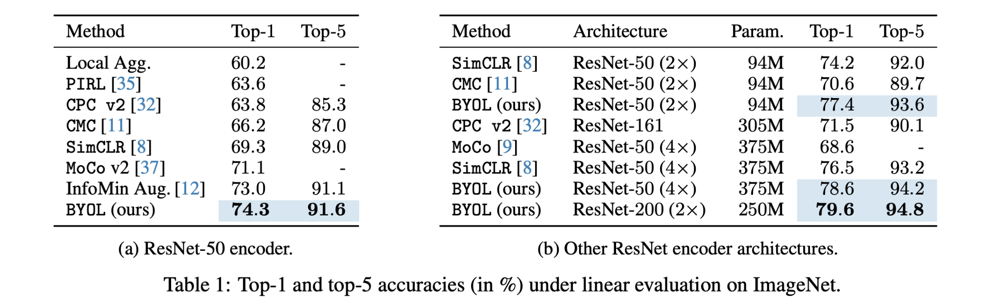
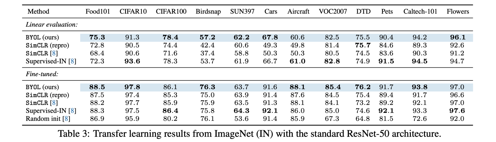
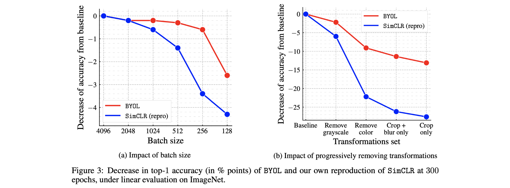

이번 포스팅에서는 2020년 NIPS 학회에 게재된 Deepmind 팀의 [Bootstrap your own latent: A new approach to self-supervised Learning](https://arxiv.org/abs/2006.07733) 논문에 대해 리뷰합니다.

이 논문을 읽기 한 이틀 전에 어떤 새로운 딥러닝 알고리즘을 혼자 상상하고 있었는데요, 하나는 mate 모델, 하나는 main 모델, 총 2개의 모델로 이루어진 형태에서 mate 모델이 main 모델의 성능을 올려주기 위한 러닝메이트 같은 역할을 하는 알고리즘이었습니다. 그러다 세미나 준비를 위해 self-supervised learning 관련 논문을 훑어보던 중에 BYOL 논문을 발견하여 제가 생각했던 모델의 형태가 비슷해서 반갑고 신기했고, 하루만에 논문을 읽은 뒤 바로 이 논문으로 세미나 발표를 해야겠다고 마음먹게 되었습니다.

### Self-supervised Learning

인공지능 학습을 위해서는 많은 양의 데이터가 필요합니다. 여기서 데이터라 함은 이미지나 음성데이터 같이 데이터 그 자체뿐만 아니라 인공지능의 예측이 틀렸는지 맞았는지 확인하기 위한 label을 포함합니다. 수 많은 데이터 자체를 얻는 것도 상당히 수고스러운 일이지만 데이터 하나하나에 대해 정답이 무엇인지 label하는 작업은 더욱 수고스럽고 비용이 많이 드는 작업입니다. 

이러한 기존 supervised learning의 문제점을 극복하기 위해서 데이터의 일부만 labeling하는 semi-supervised learning이나 label 되지 않은 데이터를 학습에 이용하는 unsupervised learning 연구가 다양하게 진행되고 있으며, self-supervised learning 또한 데이터를 labeling하지 않고 학습에 사용하는 연구의 한 갈래입니다.

Label이 없는 데이터를 사용한다는 점에서 self-supervised learning을 unsupervised learning에 속하는 분야라고 말하는 사람도 있는 반면, self-supervised learning이 스스로 supervision을 주어서 loss를 뽑아내고 학습하는 방식이기 때문에 supervision이 전혀 없는 unsupervised learning에 속한다고 보는 것은 잘못되었다고 말하는 사람도 있습니다. 

Self-supervised learning을 위해서는 먼저 label 되지 않은 데이터에 대해서 새로운 문제와 정답을 정의해야 합니다. 가장 간단한 분류 문제를 예시로 들어보자면, 어떤 이미지 데이터를 90도 회전시킨 뒤에 이 이미지가 기존대비 몇 도 회전되었는지를 기존 이미지를 보여주지 않은 상태에서 맞추도록 encoder를 학습시키고, 이렇게 학습된 encoder의 parameter를 가져와서 우리가 원래 풀려고 했던 분류 문제를 supervised learning 방식으로 학습하며 모델을 fine-tuning 합니다.

이미지가 얼마나 회전되었는지 맞추는 문제를 잘 풀도록 encoder를 학습시키는 과정을 통해서 encoder는 해당 데이터셋 내 데이터들의 특성을 잘 이해하게 되고, 이 과정을 통해 우리가 가진 데이터가 비교적 적은 양의 label만 가지더라도 어떤 원하는 목적 task를 잘 풀도록 encoder를 학습시킬 수 있습니다. 

예시로 들었던 label이 없이 정의된 새로운 문제상황을 **pretext task**라 하며 pretext task를 통해 얻은 모델에 transfer learning 과정을 거쳐 실제로 우리가 해결하려는 문제를 **downstream task**라 합니다. 

##### Related works

초기에는 pretext task를 어떤 방식으로 정의할 것인가에 대한 연구들이 많이 진행되었습니다. 이와 관련해서는 아래의 토픽들을 찾아보시면 좋습니다. 

- `Exemplar (NIPS 2014)`, `Context prediction (ICCV 2015)`, `Jigsaw puzzle (ECCV 2016)`, `Count (ICCV 2017)`, `Rotation (ICLR 2018)`

최근에는 **contrastive learning**이라는 분야의 연구가 활발하게 진행되고 있습니다. 일반적인 supervised learning은 이미지가 특정 클래스에 속하는지 아닌지를 1 또는 0이라는 정답 label을 통해 학습합니다. 이때 모델의 예측(출력값) 확률이 높은 클래스는 모델을 어떠한 semantic label을 통해 학습시킨 것이 아님에도, 실제 정답 클래스와 시각적으로 유사하다는 것을 눈으로 확인할 수 있습니다. Contrastive learning은 이러한 특징을 적극 활용합니다.

하나의 이미지에 서로 다른 data augmentation을 가한 뒤 각 이미지를 encoder에 전달하면 representation vector가 2개 출력됩니다. 하나는 anchor, 또 다른 하나는 poitive pair의 representation이라고 말 한다면, encoder가 anchor와 positive pair representation 사이의 유사도가 높도록, 다른 이미지(negative pairs) representation에 대해서는 유사도가 낮도록 학습되어야 하는 것이 contrastive learning의 로직입니다. 관련해서 아래의 토픽들을 찾아보시면 좋습니다.

- `NPID (CVPR 2018)` - Memory bank, Noise-Contrastive Estimation
- `MoCo (CVPR 2020)` - Memory queue, Momentum encoding
- `SimCLR (ICML 2020)` - Batch size

하지만 contrastive learning 알고리즘은 data augmentation 방법에 따라 성능의 차이가 크고 negative pair도 잘 선택해줘야 하는 문제들이 있어 새로운 방식의 연구도 진행되고 있으며, 이번 포스팅에서 살펴볼 BYOL이 대표적인 예입니다.

### BYOL

앞에서 짧게 살펴 본 contrastive learning은 negative pair를 잘 선택해야 학습이 잘 된다는 단점이 있습니다. 그렇다고해서 negative pair를 아예 사용하지 않는다면 모델이 constant vector만을 출력하여 loss는 줄어들지만 데이터로부터 아무런 학습을 하지 못하는 상황(collapse)이 발생할 수 있어 이를 방지하고자 positive sample과 negative sample을 학습에 같이 사용합니다. 

하지만 Bootstrap your own latent (BYOL) 논문에서는 negative pair를 사용하지 않는 새로운 self-supervised learning 알고리즘을 제시합니다. (논문 제목에서부터 'A new approach to self-supervised Learning'이라고 말하고 있네요😃) 저자들은 BYOL이 contrastive learning 대비 data augmentation 방법에 robust하다는 장점이 이 negative pair를 사용하지 않는다는 점에서 생겨났다고 말하기도 하는데요, 그렇다면 과연 어떻게 negative pair를 사용하지 않고도 collapse 하지 않으며 오히려 contrastive learning 방법들 보다 좋은 성능을 낼 수 있었던 걸까요?

##### Motivation

저자들은 논문에서 BYOL 알고리즘의 core motivation이 되었다는 실험적 발견을 소개합니다.

Case 1에서는 parameter가 랜덤 초기화된 encoder를 freeze 시킨 뒤, self-supervised learning의 벤치마크 실험 방식인 linear evaluation을 시행합니다. 랜덤 초기화된 encoder를 가지고 제일 뒷 단의 linear layer만을 학습시킨 것이기 때문에 1.4%라는 매우 낮은 top-1 accuracy를 기록하였습니다. 

Case 2에서는 두 개의 network를 사용합니다. 먼저 첫 번째 network는 Case 1과 동일한 구조의 encoder를 사용하며 이 network에 이미지를 입력으로 제공하여 $y'$ 이라는 예측값을 뽑아냅니다. 그리고 이 $y'$를 정답으로 삼아 해당 이미지가 두 번째 network의 입력으로 들어왔을 때 $y'$를 출력하도록 학습시킵니다. 그러면 정말 신기하게도 18.8%라는 Case 1과 비교하여 매우 향상된 top-1 accuracy를 기록합니다.

아무것도 학습되지 않은 network에 이미지 데이터를 통과시켜  $y'$를 얻고, 이를 정답으로 삼아 다른 network를 학습시키는 것이 어떻게 작동할 수 있는건지 아직 저는 이해를 할 수 없고 마치 마법같지만, 아무튼 저자들은 이 발견을 통해서 BYOL이라는 아이디어를 고안해냈다고 합니다.

##### Architecture

논문에서는 **Target network**와 **Online network**라는 두 가지 network를 제안합니다. 

Online network는 **encoder $f_\theta$, projector $g_\theta$, predictor $q_\theta$ network**로 이루어져있고, target network는 online network와 같은 구조에서 predictor만 빠진 $f_\xi$, $g_\xi$ network로 이루어져 있습니다. 각 network에서 사용되는 encoder는 다른 알고리즘들과의 공정한 비교를 위해 self-supervised setting의 벤치마크로 사용되는 ResNet-50을 사용하였습니다. (더 깊은 구조인 ResNet-101, 152, 200에 대한 실험 또한 진행하였습니다)

Core motivation과 함께 생각해보면, 먼저 target network가 이미지가 입력으로 제공되었을 때 $y'$라는 예측값을 출력합니다. 그러면 online network는 이 $y'$를 정답으로 삼아 해당 이미지가 입력으로 들어왔을 때 $y'$를 출력하도록 학습됩니다. 여기서 두 network에 제공되는 이미지는 완전히 같은 이미지는 아니고 서로 다른 data augmentation 방법을 거친 변경된 이미지입니다. 헷갈리지 않게 추가 설명을 드리자면 $y'$는 0에서 1사이의 **확률값이 아니라 256 크기의 벡터** 형태를 가집니다.

Online network는 $y'$를 기준으로 학습되지만 target network는 따로 gradient descent를 통한 학습의 과정을 거치지는 않습니다. 다만 target network의 parameter가 고정되어 있으면 top-1 accuracy가 18%에서 더 증가하지 않을 것이기에 **exponential moving average(EMA)** 식을 사용하여 online network의 parameter를 target network로 가져옵니다. 이 과정을 반복하다보면 target network도 점점 좋은 예측을 출력하게 되고 online network 또한 좋은 예측 $y'$을 통해 학습을 하게되어 모델의 성능이 점차 향상됩니다. 

##### Weight update

Loss는 online network의 prediction과 target network의 projection에 각각 L2-normalize를 해주고, 이 둘의 mean squared error를 계산합니다. 다시 말해 normalized prediction과 normalized target projection사이의 MSE를 구하는 것이며 이는 cosine distance와 비례하는 값을 가집니다.
$$
\begin{aligned}
	\mathcal L_{\theta, \xi} 
	& \triangleq \lVert \bar{q_\theta}(z_\theta) - \bar{z_\xi'}\rVert^2_2 \\
    &= 2- 2 \cdot \frac{\langle q_\theta(z_\theta),z'_\xi \rangle}{\lVert{q_\theta(z_\theta)}\rVert_2 \cdot \lVert{z'_\xi}\rVert_2}\\
    &= 2-2 \cdot \text{cos}{(q_\theta(z_\theta),z'_\xi )}
\end{aligned}
$$
이 때 online network와 target network에 가해준 data augmentation 방법이 다르기 때문에, 저자들은 data augmentation 조합을 서로 교환하여 loss를 한 번 더 계산하는 과정을 통해 loss를 symmetrize했다고 합니다. 이렇게 구한 $\mathcal L^{BYOL}_{\theta, \xi}$ 는 online network의 parameter $\theta$를 업데이트하는데 사용됩니다.
$$
\mathcal L^{BYOL}_{\theta, \xi} = \mathcal L_{\theta, \xi} + \tilde{\mathcal L}_{\theta, \xi} \\
\theta \gets \text{optimizer}(\theta, \nabla_{\theta}\mathcal L^{BYOL}_{\theta, \xi}, \eta)
$$
Target network의 parameter $\xi$는 exponential moving average(EMA)식을 통해 업데이트합니다. 과거 모델들 parameter의 가중평균으로 parameter $\xi$를 update하며, 여기서 $\tau$는 0.996에서 시작해서 학습이 진행될수록 1에 가까워집니다.
$$
\xi \gets \tau \xi + (1-\tau)\theta
$$

$$
\tau \triangleq 1 - (1-\tau_{base})\cdot\frac{\text{cos}(\frac{\pi k}{K})+1}{2}
$$

위와 같은 형태의 식을 parameter $\xi$와 $\theta$에 각각 가중치를 둔 평균을 새로운 $\xi$로 사용한다고 해서 weighted average라고 부르기도 하고, 가중 평균을 teacher network로 여겨 학습한다는 점에서 mean teacher라고 부르기도 합니다. MoCo 논문에서의 momentum update $\theta_t = \alpha\theta_{t-1} + (1-\alpha)\theta_t$ 와는 $\tau$가 constant가 아닌 cosine annealing된 변화하는 값이라는 점만 차이를 가집니다.

##### Comment

Exponential moving average를 사용하면 과거 parameter들이 현재 모델(Online network)을 가르치는 teacher(Target network)의 역할을 수행하게 됩니다. 이와 관련해서는 [Hoya님의 블로그 포스팅](https://hoya012.github.io/blog/byol/)에서 '과거의 내가 오늘의 스승이 된다'라는 비유가 참 재미있었습니다.

Target network가 teacher의 역할을 수행하면서 모델이 학습한다는 그 로직 자체는 받아들일 수 있었지만, 그럼에도 대체 random initailize 되었던 모델에서 어떤 정보를 학습한 것일까 라는 의문은 쉽게 풀리지 않았습니다. 그래서 BYOL 논문 설명 영상을 찾아보다가 발견한 [Yannic Kilcher](https://www.youtube.com/channel/UCZHmQk67mSJgfCCTn7xBfew)님의 설명 또한 흥미로웠습니다. 

짧게 요약을 해보자면, augmentation에 의해서 이미지의 pixel은 바뀌지만 이미지의 의미(semantic)는 변하지 않으니, BYOL은 이미지에 어떤 알 수 없는 augmentation이 가해지더라도 pixel의 변화는 무시하고 내재된 semantic을 알아보도록 feature extractor를 학습하는다는 의견이었습니다. BYOL의 전체 식에서 projector를 없애면 $q(f_\theta(A(x))) = f_\xi(A'(x))$로 간단화 할 수 있는데(A는 augmentation을 의미합니다), 이 식에서 $q$는 $E_{A'}[f(A(x))]$를 최대화하는 역할을 맡게됩니다. 

### Experiment

최종 평가 단계에서는 오직 online network의 encoder $f_\theta$만을 따로 떼어 내 downstream task에 대한 성능을 평가하게 됩니다. 다른 self-supervised learning 알고리즘들 처럼 ImageNet dataset에 대한 linear evluation과 dataset transfer, task transfer 등의 실험을 진행하였습니다. 

이 외에도 ablation study를 통해 batchsize 작을 때도 성능이 덜 망가진다는 점과 contrastive learning와 비교하여 augmentation 방법이 바뀌어도 성능이 잘 유지된다는 점을 보여주었습니다, 

### Conclusion

논문에서 저자들은 BYOL이 negative pairs가 없는데도 모델이 collapse하지 않는 이유에 대해 predictor의 존재와, exponetial moving average를 아주 조심스럽게 변경해준 점, 그리고 target network의 parameter $\xi$가 loss의 gradient 방향으로 업데이트 되지 않는다는 점을 근거로 들었습니다. 하지만 정확한 이유는 저자들 또한 아직 모르는 듯한 느낌을 받았습니다.

BYOL은 ImageNet dataset에 대해서 ResNet-50, batch-size 4096의 경우 512 Cloud TPU로 8시간 학습시켰다고 합니다. 왜 이렇게나 엄청난 computation이 요구되었나 곰곰히 생각해봤는데, 일단 image augmentation을 통해 기존 ImageNet dataset의 크기가 몇 배나 늘어났을 것이고 또한 기존 encoder에 추가적으로 predictor와 target network가 추가된 점, epoch이 1000이나 되는 점들이 이런 엄청난 computation을 만들어 냈을거라 추측해보았습니다. 그래서 BYOL의 연구 결과를 다른 분야에 접목시키려 할 때, encoder의 parameter를 그대로 가져다가 쓰는 것은 가능하겠으나 아이디어 자체를 연구 단계에서 활용할 수 있을지에 대해서는 의문이 들었습니다.

다만 appendix가 20페이지가 넘을 정도로 정말 다양한 세팅과 하이퍼 파라미터를 조정해가며 실험을 진행했다는 점과, 다른 모델들에 대해서도 reproducing을 통해 성능을 높인 상태로 비교했다는 점 등, 독자들의 다양한 궁금증을 clear하게 해소하려한 점이 좋았습니다.

### Appendix

##### Bootstrap의 의미

논문에서 사용된 bootstrap이라는 워딩은 통계학에서 흔히 사용되는 의미가 아니라 idiomatic sense로 사용되었다고 합니다. 신발의 뒷 부분에 있는 끈을 bootstrap이라고 하는데, 신발의 bootstrap을 위로 당겨서 자기 자신의 몸을 공중으로 들어올린다는 의미로써 bootstrap이라는 워딩이 사용된다고 합니다. 그래서 '불가능한 일, 말도 안되는 일'이라는 의미로 사용되기도 하고 혹은 'self-sustaining processes that proceed without external help (외부 도움없이 진행되는 자립 프로세스)'라는 의미로 사용된다고도 합니다. 

BYOL은 어떤 외부의 도움 없이 스스로 모델을 개선해나가는 알고리즘이기 때문에 이런 이유로 논문에서 bootstrap이라는 용어를 사용한게 아닐까 생각합니다.

### Reference

- [Grill, Jean-Bastien, et al. "Bootstrap your own latent: A new approach to self-supervised learning." *arXiv preprint arXiv:2006.07733* (2020).](https://arxiv.org/abs/2006.07733)
- [HOYA012'S RESEARCH BLOG - Bootstrap Your Own Latent： A New Approach to Self-Supervised Learning 리뷰](https://hoya012.github.io/blog/byol/)
- [Yannic Kilcher YOUTUBE - BYOL: Bootstrap Your Own Latent: A New Approach to Self-Supervised Learning (Paper Explained)](https://www.youtube.com/watch?v=YPfUiOMYOEE)
- https://en.wikipedia.org/wiki/Bootstrapping
