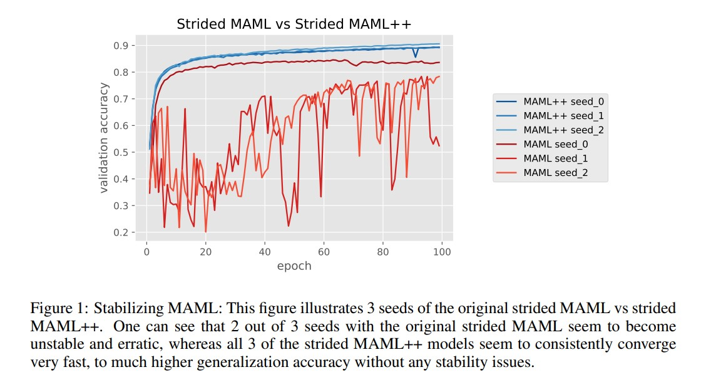
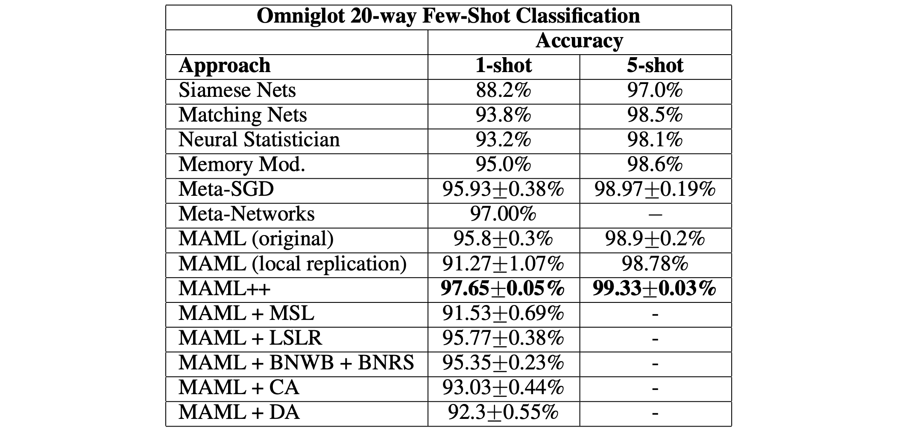

> ICLR 2019에 accept된 "How to Train Your MAML" 논문을 읽고 간단하게 요약합니다.

2017년 ICML에 accept된 ["Model-Agnostic Meta-Learning for Fast Adaptation of Deep Networks."](https://arxiv.org/abs/1703.03400)(이하 MAML)은 meta-learning 연구분야에서 가장 핫한 알고리즘이자 meta-learning이라는 용어와 거의 동일시되는 알고리즘입니다. 중요한 논문이긴 하지만 MAML 논문의 아이디어를 그대로 코드에 적용시키면 몇 가지 이슈들이 존재합니다. 

저 또한 다른 연구에 MAML의 아이디어를 사용하려던 도중에 몇 가지 이슈들이 생겨서 자료들을 참고하여 MAML 코드를 수정/보완하는 과정에 있고, 이 과정 중에 "How to Train Your MAML" 논문을 읽으며 알게 된 내용들을 간단하게 요약하여 아래에 공유합니다. 

### MAML++

##### 문제점 1. Training Instability 

Backpropagation을 할 때 skip-connection 없이 모든 gradient가 convolution layer를 여러 번 지나가는 과정에서 gradient explosion & vanishing과 같은 gradient degradation이 발생할 수 있습니다. 

MAML은 suuport set으로 fine-tuning을 5번 정도 거친 후에 마지막 fine-tuning된 모델에 대해서만 target loss를 가져와서 모델을 최적화하기 때문에, 최종적으로 fine-tuning된 모델의 gradient가 fine-tuning 되기 전 initial 모델까지 전달되는 과정이 학습의 불안정성을 만드는 것으로 보입니다.

##### 해결책: Muti-Step Loss Optimization (MSL)

저자들은 마지막 fine-tuning된 모델에 대해서만 query loss를 가져와서 모델을 최적화하는게 아니라, 모든 support set으로 한 번 fine-tuning 될 때마다 매번 target loss를 계산하자고 주장합니다. 그리고 이 모든 step의 target loss를 합한 값을 통해 모델을 최적화하는 것이 학습의 안정성을 높여준다고 말합니다.

##### 문제점 2. Second-Order Derivate Cost

MAML은 fine-tuning 과정에서 생기는 gradient의 2차 미분항을 계산에 그대로 사용할 것인지, 혹은 stop gradient를 통해 2차 미분항을 상수 취급을 하여 1차 미분항만을 계산할 것인지 선택할 수 있습니다. 2차 미분항을 사용하면 일반화 성능을 높일 수 있으나 1차 미분항만을 사용하는 경우 대비 시간적 소모가 큽니다.

##### 해결책: Derivative-Order Annealing (DA)

Derivative-Order Annealing(DA)는 컴퓨팅 비용과 일반화 성능의 균형을 맞추기 위해 제안되었고, 50 epoch만 1차 미분항을 사용하고 그 다음부터는 2차 미분항을 사용하자는 아이디어입니다. 

저자들은 DA를 사용하였을 때 gradient exploding과 diminishing gradient가 없어지는 실험적 결과를 얻었으며 심지어 2차 미분항만 사용했을 때 보다 안정적인 학습이 가능했다고 말합니다.

##### 문제점 3. Absence of Batch Normlaization Statistic Accumulation & Shared (accross step) Batch Normalization Bias

Accumulated running statistics을 사용하는 batch normalization의 경우엔 최종적으로 gloabl mean과 globla standard deviation으로 수렴합니다. MAML은 accumulated running statistics를 사용하는 것이 아닌 현재 batch의 statistics를 사용합니다. Parameter가 다양한 task에 대한 mean과 standard deviation에 적응해야하므로 batch normalization이 효과적이지 않습니다.

또한 MAML은 각 레이어에서 single set의 bias를 학습합니다. 이는 network를 통과하는 feature의 분포가 모두 동일하다는 것을 가정하지만 이는 올바른 가정이 아닙니다.

##### 해결책: Per-Step Batch Normalization Running Statistics (BNRS) & Per-Step BatchNormalization Weights and Biases (BNWB)

가장 간단한 대안은 inner loop의 입력값들에 대해서 running batch statistics를 사용하는 것입니다. 하지만 이는 최적화와 시간적 측면에 있어서 몇 가지 이슈를 가집니다.

더 나은 방법은 inner loop step 마다 다른 running mean과 running standard deviation을 가지고 running statisics를 각각 업데이트 하는 것입니다. 이런 per-step batch normalization 방법을 사용하면 최적화 속도와 일반화 성능을 높일 수 있습니다. Bias 또한 per-step 마다 다르게 학습합니다. 

##### 문제점 4. Shared Inner Loop Learning Rate

모든 gradient에 대해 inner loop step에서 $\alpha$라는 동일한 learning rate를 사용하는 것은 많은 하이퍼파라미터 탐색이 요구되며 일반화 성능도 좋지 않습니다. 

##### 해결책: Learning Per-Layer Per-step Learning Rates and Gradient Direction (LSLR)

Data fitting 보다 generalization 성능을 강화하기 위해 사용할 수 있는 요소 중 하나가 'learn a learning rate'을 하는 것입니다. 관련 선행 연구 중에 Meta-SGD라는 연구가 있는데, $\alpha$값이 constant가 아니라 gradient의 개수와 동일한 크기의 learnable parameter이며 gradient와 $\alpha$를 element-wise product를 하는 알고리즘입니다.

다만 이 경우는 parameter의 양이 배로 많아지기 때문에 많은 메모리와 계산이 요구됩니다. 따라서 대안으로써 하나의 gradient 마다 learning rate를 설정해주기 보다는 layer마다의 learning rate를 다르게 사용하는 방법도 있습니다. 저자들은 L개의 레이어와 N개의 스텝마다 모두 다른 learning rate를 사용하도록 설정하여 추가적으로 LN개의 파라미터를 추가하였습니다.

##### 문제점 5. Fxied Outer Loop Learning Rate

MAML은 static outer loop learning rate를 사용합니다.

##### 해결책: Cosine Anealing of Meta-Optimizer Learing Rate (CA)

다른 논문들에서 annealing learning rate 방식들이 일반화 성능에 좋다는 의견이 자주 제시되고 있기 때문에 저자들은 cosine annealing 방식을 사용하였다고 합니다. 실제로 일반화 성능이 높아지는 결과를 얻어냈으며, 하이퍼 파라미터를 튜닝하는데 비교적 적은 시간을 들여도 된다는 장점 또한 얻었다고 합니다.

### Reference

- [OpenAI, "Reptile: A Scalable Meta- Learning Algorithm."](https://openai.com/blog/reptile/)
- [Sherwin Chen, "How to Train MAML(Model-Agnostic Meta-Learning)."](https://pub.towardsai.net/how-to-train-maml-model-agnostic-meta-learning-90aa093f8e46)
- [Finn et al., "Model-Agnostic Meta-Learning for Fast Adaptation of Deep Networks."](https://arxiv.org/abs/1703.03400)
- [Antoniou et al., "How to train your maml."](https://arxiv.org/abs/1810.09502)

