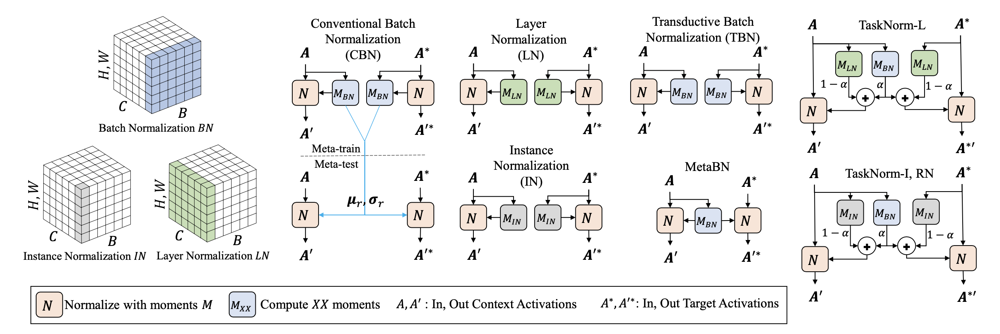
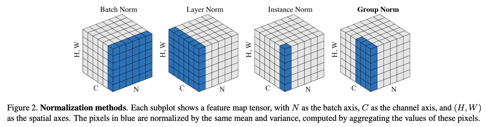
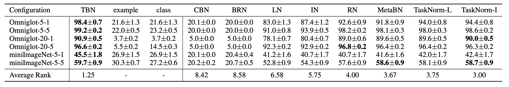

> Batch normalization의 개념에 대해 소개하고, meta-learning 세팅에서는 어떤 normalization 방법을 사용하는게 적절한지 정리합니다.

### Batch normalization

Batch normalization(이하 BatchNorm)은 2015년 Sergey Ioffe와 Christian Szegedy의 논문[^1]에서 제안된 기법입니다. BatchNorm을 사용하면 대부분의 모델에서 성능이 크게 향상하며, 모델에 전달하는 학습 데이터 셋을 표준화할 필요가 없습니다. 또한 gradient vanishing 문제가 감소하여 큰 학습률을 사용할 수 있으며, regularization의 역할을 하여 다른 regularization 기법의 필요성을 줄여줍니다.

논문에서 저자들은 BatchNorm이 학습 과정 중에 이전 레이어의 파라미터 변화로 인해 현재 레이어의 입력 분포가 달라지는 현상인 internal covariate shift를 줄여준다고 말합니다. 그리고 한동안 이것이 BatchNorm을 사용했을 때 모델이 학습을 잘 하는 이유로 알려져 있었습니다. 하지만 최근 연구에서는 BatchNorm이 internal covariate shift를 줄여주지는 않고 다만 objective function을 완만하게 만들어줘 이것이 성능을 높인다고 말하는 등, 아직 BatchNorm의 효과에 대한 이유는 논의 중에 있습니다.

BatchNorm의 연산은 입력을 원점에 맞추고 정규화한 뒤, 두 개의 새로운 파라미터를 사용하여 scaling과 biasing(shifting)을 합니다.
$$
\mu_B = \frac{1}{m_B}\Sigma^{m_B}_{i=1}{\mathbf x_i}, \;\;
\sigma^2_B = \frac{1}{m_B}\Sigma^{m_B}_{i=1}{(\mathbf x_i-\mu_B)^2} \tag{1}
$$

$$
\mathbf{\hat x_i}^{(k)} = \frac{\mathbf{x_i}^{(k)}-\mu_{B}^{(k)}}{\sqrt{{\sigma^{(k)}_{B}}^2 + \varepsilon}} \tag{2}
$$

$$
\mathbf{z_i}^{(k)} = \gamma^{(k)} \otimes \hat{\mathbf x_i}^{(k)} + \beta^{(k)} \tag{3}
$$

식 (1)에서는 현재 미니배치 입력의 평균과 표준편차를 계산합니다. 이 값들을 moments라고 표현하겠습니다. 그리고 식 (2)에서 해당 moments를 사용하여 입력을 원점에 맞추고 정규화 합니다. 여기서의 $\varepsilon$은 분모항이 0이 되는 것을 방지하기 위한 $10^{-5}$ 정도의 작은 숫자입니다. 식 (3)에서는 $\gamma$와 $\beta$라는 두 개의 파라미터를 사용하여 scaling과 biasing을 하여 BatchNorm의 최종 출력 $z^{(i)}$를 얻어냅니다.

전체 과정은 $\mathbf z^{(k)} = BN_{\gamma^{(k)},\beta^{(k)}}(\mathbf x^{(k)})$ [^2]으로 표현할 수 있습니다.

##### Moving average

학습 단계에서의 moments는 $\mu_{B}, \sigma_{B}$을 사용하면 문제가 없다고 하지만, 테스트 단계에서는 만약 단일 샘플이 입력으로 주어진다면 moments를 계산할 방법이 없습니다. 입력을 배치 형태로 제공한다고 가정해도 매우 작은 배치를 사용한다면 해당 통계 정보에 대한 신뢰도가 떨어집니다.

테스트 단계에서 발생하는 이런 문제를 해결하기 위해서 moments를 배치에서 얻는 것이 아니라 전체 학습 데이터 셋을 모델에 제공하여 얻어낸 평균과 표준편차를 대신 사용할 수 있습니다. 하지만 일반적으로는 훈련하는 동안 레이어의 $\mu, \sigma$에 대한 moving average를 계산하여 테스트 단계에서 이 값을 사용합니다. 
$$
\mu = \frac{1}{n}\Sigma\mu_{B},\;\; \sigma = \frac{1}{n}\Sigma\sigma_{B}
$$
여러 moving average 중에서도 exponential moving average를 주로 사용하는데, 아래 식에 $\alpha$라는 하이퍼 파라미터는 momentum이라고 부르며 텐서플로우에서는 기본값이 0.99로 설정되어 있습니다.
$$
\mu = \alpha\mu + (1-\alpha)\mu_{B},\;\; \sigma = \alpha\sigma + (1-\alpha)\sigma_{B}
$$

### Meta-learning scenario

일반적인 지도 학습에서는 데이터 분포를 i.i.d로 가정하여 학습 데이터 셋 입력을 통해 얻어낸 moments의 moving average를 테스트에 적용하는 것이 적절하다고 여깁니다. 하지만 meta-learning 세팅에서는 오직 specific task에 대해서만 i.i.d를 가정할 수 있기 때문에 이러한 running statistics(moving average)를 사용하는 것이 적절하지 않습니다. 그래서 meta-learning 세팅에서는 normalization 계산에 어떤 moments를 사용할 것인가를 다시 고민해보아야 합니다.

##### i.i.d assumption[^3]

In machine learning theory, i.i.d. assumption is often made for training datasets to imply that all samples stem from the same generative process and that the generative process is assumed to have no memory of past generated samples.

### Normalization methods

이 섹션의 워딩은 TaskNorm 논문[^4]의 워딩을 그대로 사용하였습니다. 일반적인 BatchNorm을 이 섹션에서는 CBN이라 부르겠습니다.

##### Transductive Batch Normalization (TBN)

BatchNorm의 컨셉을 그대로 가져가면서 이를 meta-learning 세팅에서도 적용할 수 있는 가장 간단한 방법은 TBN을 사용하는 것입니다. Meta-learning 세팅에서는 전체 배치를 i.i.d라고 가정할 수 없으니, TBN은 specific task의 moments(평균, 표준편차)를 normalization 연산에 사용합니다. 즉, 현재 에피소드의 moments를 normalization 연산에 사용한다는 뜻이며 따라서 moving average를 기록할 필요가 없습니다. 텐서플로우로 직접 구현하는 경우에도  `moving_mean`, `moving_variance` 파라미터를 굳이 업데이트할 필요가 없습니다(사용하지도 않습니다).

쿼리 셋을 추론하기 위해서 쿼리 셋의 정보도 사용하기 때문에 transductive라는 이름이 붙었고, MAML이 이 방식을 사용하였습니다. Non-transductive 방식에 비해서 웬만하면 좋은 성능이 나오나, 쿼리 셋의 데이터 분포에 민감하게 반응하고 non-transductive 방식보다 활용성에 있어서 제한적이라는 단점이 있습니다. 또한 non-transductive에 비해 추가적인 정보를 더 이용하기 때문에 공정한 비교가 아니라는 지적을 받습니다.

##### Instance-Based Normalization

Instance-base normalization 방법들은 배치 단위로 normalization을 수행하는 것이 아니라 샘플 단위로 normalization을 수행합니다. 따라서 normalization 결과가 배치에 전혀 영향을 받지 않아, meta-learning setting에서 CBN을 대체하여 유용하게 사용할 수 있는 normalization 방법 중 하나입니다.

Instance-base normalization으로는 Layer Normalization(LN), Instance Normalization(IN), Group Normalization(GN)이 있으며, 각 normalization 방법들의 moments가 어떻게 계산되는지는 아래 GN 논문[^5]의 Figure를 참고하면 쉽게 이해하실 수 있습니다. 다만 Instance-base normalization 방법들은 성능이 충분하지 않고, 훈련 효율성 측면에서는 CBN 보다 좋지 않다는 단점을 가집니다.

##### TaskNorm

TaskNorm은 ICML 2020 학회에서 소개되었으며, 앞서 언급한 meta-learning 세팅에서 기존 normalization 방법들의 문제점을 해결하기 위해 고안되었습니다. 일단 TaskNorm에 대해 알아보기에 앞서서 논문에서 소개하고 있는 MetaBN을 먼저 살펴보겠습니다.

MetaBN은 CBN을 meta-learning 세팅에서 non-transductive하게 사용할 수 있도록 변형한 방법이라고 생각하시면 됩니다. MetaBN은 서포트 셋의 데이터 만으로 moments를 계산합니다. 그리고 이 moments를 서포트 셋과 쿼리 셋의 normalization 연산에 동일하게 사용합니다. 당연한 얘기지만 이런 방식으로 moments를 계산하면 서포트 셋의 샘플이 소수로 주어졌을 때 충분한 성능이 나오지 않습니다. 따라서 TaskNorm은 MetaBN에 한 가지 변형을 더 적용합니다. 바로 secondary moments를 추가하는 것입니다. 

MetaBN의 normalization 결과는 서포트 셋 샘플들의 데이터 분포에 영향을 받습니다. 하지만 샘플이 소수인 경우에는 데이터 분포가 유용하지 않을 수 있기 때문에, TaskNorm은 데이터 분포에 영향을 받지않는 Instance-Based Normalization 방법의 moments를 secondary moments로 사용합니다. 즉, TaskNorm은 서포트 셋 데이터 분포와 샘플 각각의 특성을 일정 비율씩 고려한 normalization 방법이라고 할 수 있습니다. 식은 다음과 같습니다.
$$
\mu_{TN} = \alpha \mu_{BN} +(1−\alpha)\mu_+  \\
\sigma^2_{TN} =\alpha( \sigma_{BN}^2 +(\mu_{BN} − \mu_{TN} )^2) + (1−\alpha)(\sigma_+^2 +(\mu_+ −\mu_{TN})^2)
$$

$$
\alpha = SIGMOID(SCALE|D^\tau | + OFFSET)
$$

$\alpha$는 서포트 셋의 moments와 secondary moments를 각각 얼마만큼의 비율로 사용할 것 인가를 결정합니다. 여기서 $D^\tau$는 서포트 셋의 사이즈를 의미하며 SCALE과 OFFSET는 meta-training 과정 중에 학습되는 파라미터입니다. 모델은 서포트 셋의 사이즈과 SCALE, OFFSET 값에 따라 task에 적합한 normalization 비율을 설정하고, 이 결과를 가지고 normalization 연산을 수행합니다.

아래는 Omniglot 데이터 셋과 miniImageNet 데이터 셋에 대해 실험한 결과입니다.

### References

[^1]: Ioffe, Sergey, and Christian Szegedy. "Batch normalization: Accelerating deep network training by reducing internal covariate shift." International conference on machine learning. PMLR, 2015
[^2]: Wikipedia contributors. (2021, April 13). Batch normalization. In Wikipedia, The Free Encyclopedia. Retrieved 04:59, May 5, 2021, from https://en.wikipedia.org/w/index.php?title=Batch_normalization&oldid=1017569708
[^3]: Wikipedia contributors. (2021, April 11). Independent and identically distributed random variables. In Wikipedia, The Free Encyclopedia. Retrieved 05:26, May 19, 2021, from https://en.wikipedia.org/w/index.php?title=Independent_and_identically_distributed_random_variables&oldid=1017206855
[^4]: Bronskill, John, et al. "Tasknorm: Rethinking batch normalization for meta-learning." International Conference on Machine Learning. PMLR, 2020.
[^5]: Wu, Yuxin, and Kaiming He. "Group normalization." Proceedings of the European conference on computer vision (ECCV). 2018.APA
[^6]: Géron, Aurélien. Hands-on machine learning with Scikit-Learn, Keras, and TensorFlow: Concepts, tools, and techniques to build intelligent systems. O'Reilly Media, 2019.

