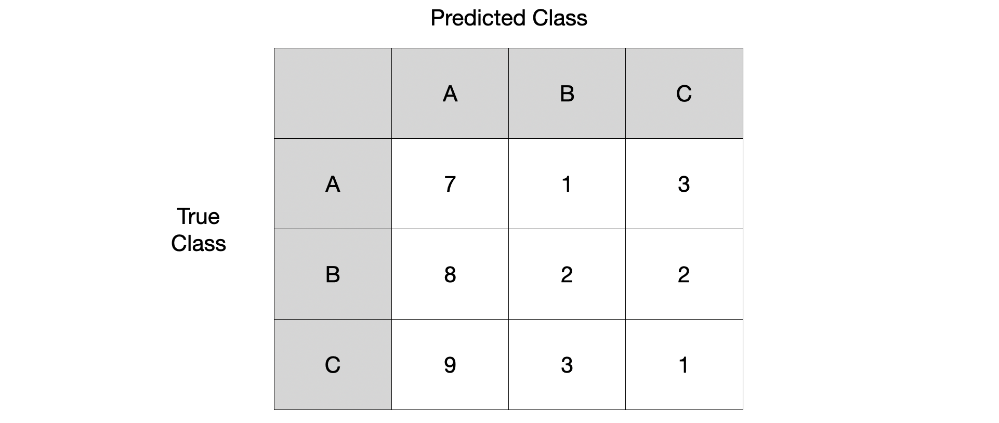
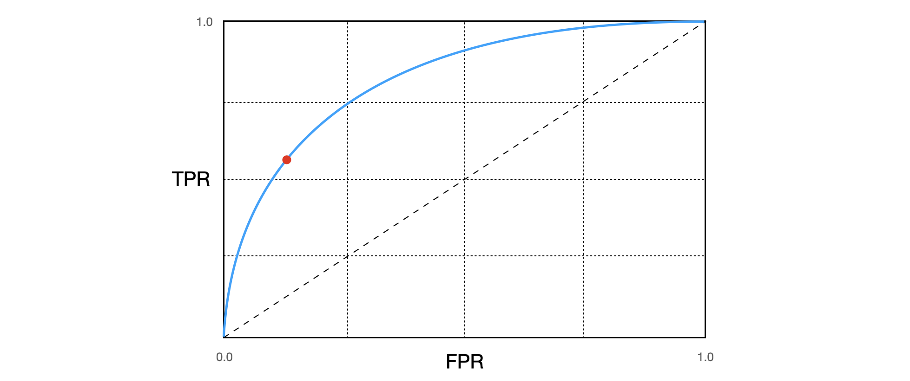

> 분류기의 성능 평가 지표인 confusion matrix, precision(정밀도), recall(재현율), sensitivity(민감도), F1-score, ROC curve, AUC에 대해서 간단하게 기록합니다. Hands-On Machine Learning 2판을 참고하여 작성하였으며 이 외에 참고한 자료를 아래 references에 기록하였습니다.

### Confusion Matrix

Confusion matrix는 다음 4개의 요소로 나눠서 분석할 수 있습니다.

- **True Positive(TP)**: 목적 클래스에 대해서, 목적 클래스가 맞다고(Positive) 올바르게(True) 분류한 경우
- **True Negative(TN)**: 목적 클래스가 아닌 것에 대해서, 목적 클래스가 아니라고(Negative) 올바르게(True) 분류한 경우
- **False Positive(FP):** 목적 클래스가 아닌 것에 대해서, 목적 클래스가 맞다고(Positive) 잘못(False) 분류한 경우
- **False Negative(FN)**: 목적 클래스에 대해서, 목적 클래스가 아니라고(Negative) 잘못(False) 분류한 경우

Multi-class 상황에서 confusion matrix 예시[^1]를 살펴봅시다.

Class A에 대해서 TP, TN, FP, FN 결과를 계산해보겠습니다.

- True Positive(TP): class A를 A라고 예측한 경우 = $7$
- True Negative(TN): class A가 아닌 것을 A가 아니라고 예측한 경우 = $(2+3+2+1) = 8$
- False Positive(FP): class A가 아닌 것을 A라고 예측한 경우 = $(8+9)=17$
- False Negative(FN): class A를 A가 아니라고 예측한 경우 = $(1+3) = 4$

##### Precision

Precision은 분류기가 목적 클래스라고 분류한 것 중에서 실제로도 그 목적 클래스가 맞는 것의 비율을 의미합니다. *양성 예측의 정확도*라고도 이해할 수 있습니다.
$$
\text{Precision} = \frac{TP}{TP + FP}
$$
Class A에 대해서 Precision을 계산해보겠습니다.
$$
\text{Precision}= \frac{TP}{TP + FP} = 7/(7+8+9) = 0.29
$$

##### Recall (Sensitivity, TPR)

Precision은 확실한 양성 샘플 하나만 예측하면 매우 높게(1/1=100%) 나올 수 있기 때문에, $FN$을 고려한 Recall 지표도 함께 사용하는 것이 좋습니다.

Recall은 전체 목적 클래스 샘플에 대해서 분류기가 실제로 그 목적 클래스를 올바르게 분류한 비율을 의미합니다. *분류기가 정확하게 감지한 양성 샘플의 비율*로도 이해할 수 있습니다. 민감도(sensitivity) 또는 진짜 양성 비율(TPR, True Positive Rate)이라고도 합니다.
$$
\text{Recall} = \frac{TP}{TP + FN}
$$
Class A에 대해서 Recall을 계산해보겠습니다.

$$
\text{Recall} = \frac{TP}{TP + FN} = 7/(7+1+3) = 0.64
$$

##### F1-score

Precision과 Recall을 F1-score라고 하는 하나의 숫자로 만들면 편리할 때가 많습니다. 특히 두 분류기를 비교할 때 그렇습니다. **F1-score는 Precision과 Recall의 조화 평균**이며 식으로는 아래와 같이 표현됩니다.
$$
F_1 \text{ score} = \frac{2}{\frac{1}{\text{Precision}} + \frac{1}{\text{Recall}}} = 2\times\frac{\text{Precision}\times\text{Recall}}{\text{Precision}+\text{Recall}} = \frac{TP}{TP + \frac{FN+FP}{2}}
$$
Class A에 대해서 F1-score를 계산해보겠습니다.

$$
F_1 \text{ score} = \frac{2}{\frac{1}{\text{Precision}} + \frac{1}{\text{Recall}}} = \frac{2}{\frac{1}{0.29} + \frac{1}{0.64}} = 0.40
$$

### ROC curve

ROC는 Receiver Operation Characteristic(수신기 조작 특성)의 약자이며 아래의 의미를 갖습니다.

- ROC curve: **TPR(진짜 양성 비율)** vs. **FPR(가짜 양성 비율)**
- ROC curve: **Recall(Sensitivity, 민감도)** vs. **1 - Specificity(특이도)**
- $FPR = \frac{FP}{FP + TN} = 1- \frac{TN}{FP + TN} = 1-TNR$

분류기의 성능은 고정해두고 decision threshold만 움직여 TPR을 높인다면 FPR도 같이 높아지기 때문에 trade-off가 존재합니다. 또한 ROC curve **곡선의 아래 면적(area under the curve, AUC)**을 측정하면 분류기들을 비교할 수 있습니다. **완벽한 분류기는 ROC의 AUC이 1이고 랜덤 분류기는 0.5**입니다.

추가적으로, ROC curve의 빨간 점과 현의 휨 정도에 대한 의미가 잘 정리되어 있는 글을 reference에 링크[^3]하였습니다. 꼭 참고하시는 것을 추천드립니다. 

### References

[^1]:[Joydwip Mohajon, Confusion Matrix for Your Multi-Class Machine Learning Model](https://towardsdatascience.com/confusion-matrix-for-your-multi-class-machine-learning-model-ff9aa3bf7826)
[^2]: Géron, Aurélien. *Hands-on machine learning with Scikit-Learn, Keras, and TensorFlow: Concepts, tools, and techniques to build intelligent systems*. O'Reilly Media, 2019.
[^3]: 공돌이의 수학정리노트, ROC curve. https://angeloyeo.github.io/2020/08/05/ROC.html
