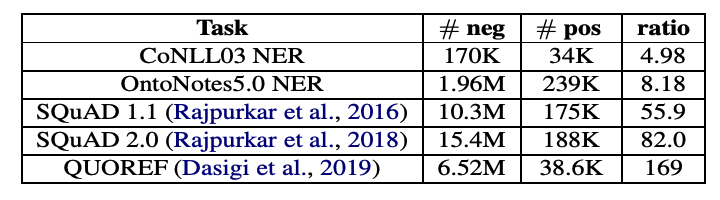

> 이번 포스팅에서는 ACL 2020 학회에서 발표된 Li, Xiaoya, et al. "Dice loss for data-imbalanced NLP tasks."[^1]에 대해서 정리합니다. 최근에 포스팅을 할 시간이 너무 부족해져 간단하게 핵심 내용 위주로만 글을 작성하였습니다.
>

### Preliminaries

A, B, C에 대해서 A class에 대한 분류 성능을 측정한다고 할 때,

- Positive examples: A class의 데이터 샘플 (목적 클래스 데이터)
- Negative examples: B, C class의 데이터 샘플 (목적 클래스가 아닌 데이터)
- Easy-negative examples: A와 확연히 다른 negatives (negative 예측이 쉬운 데이터)
- Hard-negative examples: A와 비슷한 negatives (positive로 혼동할 여지가 있는 데이터)
- True positive (TP): positive로 예측한 것 중에 실제로도 positive가 맞는 경우
- False positive (FP): positive로 예측한 것 중에 실제로는 positive가 아닌 경우
- False negative (FN): negative로 예측한 것 중에 실제로는 negative가 아닌 경우

- Precision = TP / (TP + FP): 목적 클래스라고 예측한 것 중에서 실제로도 그 목적 클래스가 맞는 것의 비율
- Recall = TP / (TP + FN): 전체 목적 클래스 샘플에 대해서, 실제로 그 목적 클래스를 올바르게 분류한 비율. 분류기가 정확하게 감지한 양성 샘플의 비율
- $F_1$ score: precision과 recall의 조화평균
- $F_\beta$ score: precision과 recall을 동일한 가중치를 둔 것이 $F_1$ score이고, $\beta$ 라는 특정 가중치 값을 부여한 것을 $F_\beta$ score라고 부름. 자세한 내용은 [링크](https://en.wikipedia.org/wiki/F-score) 참고

##### Focal loss

Focal loss[^3]는 computer vision의 object detection task에서 유용하게 사용되는 loss입니다. Focal loss의 식은 easy negative example보다 hard example에 더 많은 가중치를 주는 효과를 가집니다. 

$$
\begin{aligned}
&\text { Cross Entropy }=-\log \left(p_{t}\right) \\
&\text { Focal Loss }=-\left(1-p_{t}\right)^{\gamma} \log \left(p_{t}\right)
\end{aligned}
$$

### Introduction

NLP task의 데이터들은 negative examples이 positive examples 보다 압도적으로 많은 data-imbalanced 상황이 자주 발생합니다. 

<i>Number of positive and negative examples for different data-imbalanced NLP tasks. Taken from Li, Xiaoya, et al.</i>

<CoNLL, OntoNotes> NER(named entity recognition) 데이터 셋에 대해, 표의 #neg는 'O' label 데이터의 수, #pos는 그 외 데이터의 수를 의미합니다. (이는 preliminary에서 언급한 negative, positive의 의미와는 다르지만, 'O'는 항상 negative이기 때문에 이렇게 표현한 듯 합니다.) 실제로 학습에 있어서 상대적으로 덜 중요한 'O' label이 다른 label에 비해 5~8배나 많은 수를 차지하고 있습니다.

이 문제는 MRC(machine reading comprehension) task에서 더 심해집니다. MRC task는 제시문에서 정답 문장의 '시작 지점'과 '끝 지점'을 찾는 방식으로 디자인 되어있기 때문에 문서 전체에서 오직 2개의 token만이 positive 입니다. 실제로 <SQuAD, QUOREF> MRC 데이터 셋에 대해, negative example이 positive의 55배 이상의 수를 차지하고 있습니다.

이런 data-imbalance 상황은 아래의 두 가지 문제를 야기합니다.

1. **The training-test discrepancy**: CE는 모든 sample을 동일한 비율로 고려하는데, data-imbalanced NLP task에서는 negative의 양이 많으니(e.g. 'O' label), test에서 F1 score의 목적과는 차이가 있음
2. **The overwhelming effect of easy-negative examples**: negative 중에서도 easy-negative의 양이 많기 때문에 positive와 hard-negative 사이의 차이를 충분히 학습하지 못함

두 가지 문제를 해결하기 위해 본 논문에서는 다음의 방법을 제안합니다.

1. **CE 대신 Dice loss 사용**
   - Dice loss는 F1 score의 soft version임 (여기서의 soft의 의미는 soft-kNN에서 처럼 확률값으로 디자인 되었다는 것을 의미한다고 이해했습니다)
   - $\operatorname{DSC}\left(x_{i}\right)=\frac{2 p_{i 1} y_{i 1}}{p_{i 1}+y_{i 1}}$,  $\mathrm{F} 1\left(x_{i}\right)=2 \frac{\mathbb{I}\left(p_{i 1}>0.5\right) y_{i 1}}{\mathbb{I}\left(p_{i 1}>0.5\right)+y_{i 1}}$
2. **Dynamic weight adjusting strategy**: training에서 easy-negative의 영향을 줄이기 위해서 데이터 샘플마다 가중치를 부여할 수 있는 loss term을 고안

### Related Work

##### Data resampling

- Importance sampling: 샘플마다 가중치를 부여하여 데이터 분포를 변경
- Boosting: hard example(신뢰도가 낮거나, 잘못 분류한 데이터)에 대해 후속 학습에서 가중치 부여
- Downsampling: 데이터 비율을 맞추기 위해 overwhelming 데이터를 덜 샘플링
- Oversampling: 데이터 비율을 맞추기 위해 few 데이터를 더 생성 (e.g. SMOTE)
- Recent works 중에서는 training loss에 따라 데이터 마다의 가중치를 부여하는 방법들도 존재함

### Proposed Methods

논문의 저자들은 이해를 돕기 위해 식을 전부 binary classification (class 0 or 1) 상황으로 설명하였습니다. 

##### Notation

- $p_{i0}$: i번째 샘플을 입력 받았을 때 0 class에 대한 모델의 확률
- $p_{i1}$: i번째 샘플을 입력 받았을 때 1 class에 대한 모델의 확률
- $y_{i0}$: i번째 샘플이 0 class인 경우엔 1 (True), 1 class인 경우엔 0 (False)
- $y_{i1}$: i번째 샘플이 0 class인 경우엔 0 (False), 1 class인 경우엔 1 (True)

##### Sorensen-Dice coefficient

Individual sample 단위의 Sorensen-Dice coefficient(DSC)는 아래와 같이 정의됩니다.
$$
\operatorname{DSC}\left(x_{i}\right)=\frac{2 p_{i 1} y_{i 1}}{p_{i 1}+y_{i 1}}
$$
그리고 smoothing의 목적으로 분자 분모에 각각 $\gamma$를 더해주면 다음과 같이 표현할 수 있습니다.
$$
\operatorname{DSC}\left(x_{i}\right)=\frac{2 p_{i 1} y_{i 1}+\gamma}{p_{i 1}+y_{i 1}+\gamma}
$$

##### Dice Loss version 1.

DSC 값이 높을수록 좋은 것이니 모델이 DSC 값을 높이도록 loss를 설계하면 됩니다. 따라서 위의 DSC 식에 마이너스 부호를 붙여, -DSC를 낮추도록 loss 식을 디자인했습니다.

또한 Milletari et al. (2016) [논문](https://arxiv.org/pdf/1606.04797.pdf)[^4]에서 분모를 square form으로 바꾸면 수렴이 빠르다는 것을 제안했기 때문에 해당 방법도 사용하였습니다.
$$
\mathrm{DL}=\frac{1}{N} \sum_{i}\left[1-\frac{2 p_{i 1} y_{i 1}+\gamma}{p_{i 1}^{2}+y_{i 1}^{2}+\gamma}\right]
$$

##### Dice Loss version 2.

최적화를 간단하게 하기 위해서 식을 아래의 형태로 변경하여 사용했다고 합니다.
$$
\mathrm{DL}=1-\frac{2 \sum_{i} p_{i 1} y_{i 1}+\gamma}{\sum_{i} p_{i 1}^{2}+\sum_{i} y_{i 1}^{2}+\gamma}
$$

##### Self-adjusting Dice Loss

추가적으로, DSC 식 $\frac{2 p_{i 1} y_{i 1}+\gamma}{p_{i 1}+y_{i 1}+\gamma}$에 focal loss와 동일한 효과를 내기 위해 다음과 같이 DSC 식을 수정하였습니다. 여기서도 동일하게 -DSC를 줄여야하니, 1-DSC의 형태의 loss 식을 사용합니다. 
$$
\operatorname{DSC}\left(x_{i}\right)=\frac{2\left(1-p_{i 1}\right)^{\alpha} p_{i 1} \cdot y_{i 1}+\gamma}{\left(1-p_{i 1}\right)^{\alpha} p_{i 1}+y_{i 1}+\gamma}
$$
결과적으로 training-test discrepancy와 easy-negative의 영향을 모두 줄일 수 있는 새로운 loss를 고안하였습니다.

### Experiments

아래의 네 가지 NLP task는 모두 data-imbalance 문제를 가지고 있습니다. 

- POS tagging: 품사태깅 (e.g. noun, verb, adjective)
- NER(named entity recognition): 개체명 인식
- MRC(machine reading comprehension): 주어진 질문에 대해서, 문서 내에 문장 중에서 최적화된 답안을 찾아내는 문제
- PI(paraphrase identification): 두 문장이 주어지고, 두 문장이 서로 같은의미인지 다른 의미인지를 판단하는 문제

BERT pre-trained LM에 대해 네 가지 NLP task에 대해서 fine-tuning을 진행할 때, CE를 사용한 결과와 proposed method를 사용한 결과를 비교해보았고, 모든 케이스에 대해서 proposed method를 사용한 결과가 제일 좋은 성능을 얻었습니다. 자세한 결과 표는 논문을 참고하시면 좋습니다.

### Conclusion

본 논문을 요약하자면,

1. NLP task 중에서 POS tagging, NER, MRC, PI task는 data-imbalance 문제가 심각함. 즉, **negative examples이 positive examples 보다 압도적으로 많음**
2. 모델 training에서 자주 사용되는 **cross-entropy는 data-imbalance 문제를 해결하기 위해 적합하지 않은 objective**임
   - Cross-entropy는 accuracy-oriented measure인데, 이 objective(CE)를 training에서 사용하는 것은 training과 test의 차이를 유발
   - Training은 easy-negative examples을 많이 사용하여 진행되지만, 정작 test에서의 성능은 positive examples에 영향을 많이 받는 F1 score를 사용함
3. 따라서 **data-imbalance 상황에 적합한 새로운 loss를 제안**하고, 분류하기 어려운 **hard-negative를 더 고려하기 위한 sample-wise weight 방법** 또한 제안함

실제로 data-imbalance 문제가 NER과 같은 NLP task에서 중요한 문제이면서 training은 CE로 하고 성능 측정은 F1 score로 하는 것이 최적의 방법은 아니라고 생각했는데, 본 논문이 이 문제를 잘 인식하여 해결한 듯 합니다.

### References

[^1]: Li, Xiaoya, et al. "Dice Loss for Data-imbalanced NLP Tasks." *Proceedings of the 58th Annual Meeting of the Association for Computational Linguistics*. 2020.
[^ 2]: Wikipedia contributors. (2022, January 29). F-score. In *Wikipedia, The Free Encyclopedia*. Retrieved 09:57, February 19, 2022, from https://en.wikipedia.org/w/index.php?title=F-score&oldid=1068716174
[^3]: Lin, Tsung-Yi, et al. "Focal loss for dense object detection." *Proceedings of the IEEE international conference on computer vision*. 2017.
[^4]: Milletari, Fausto, Nassir Navab, and Seyed-Ahmad Ahmadi. "V-net: Fully convolutional neural networks for volumetric medical image segmentation." *2016 fourth international conference on 3D vision (3DV)*. IEEE, 2016
