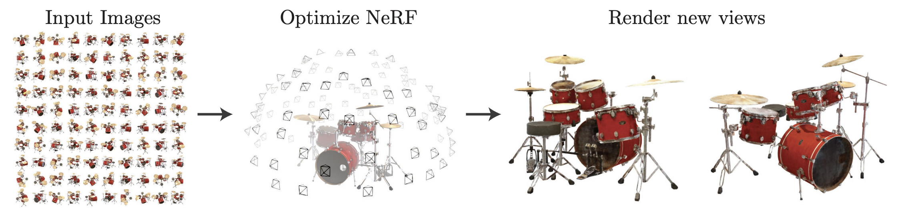
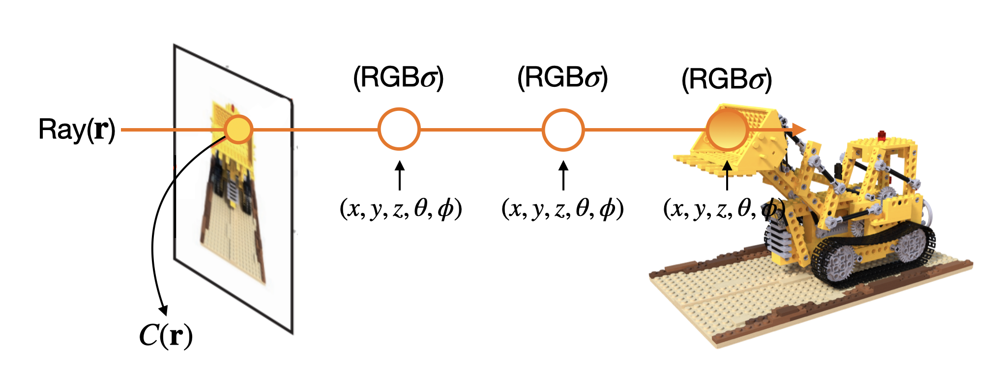
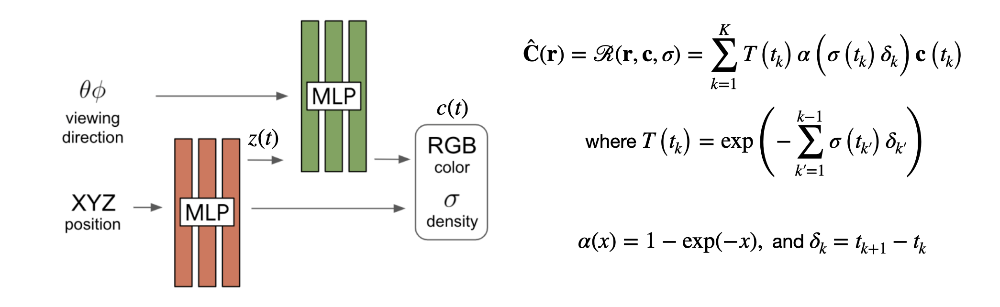
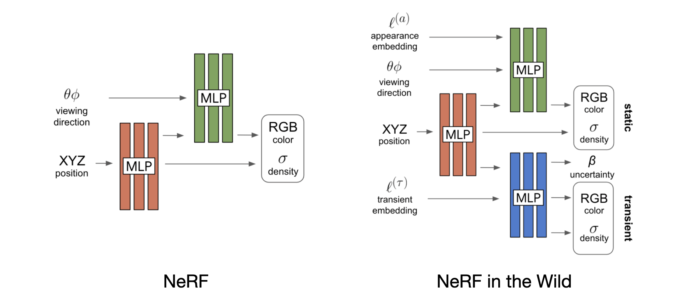
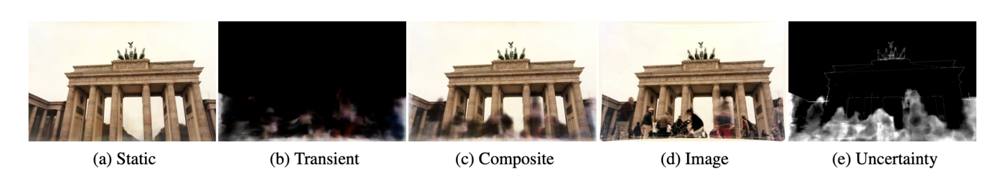
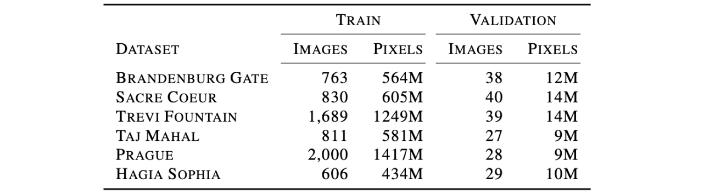
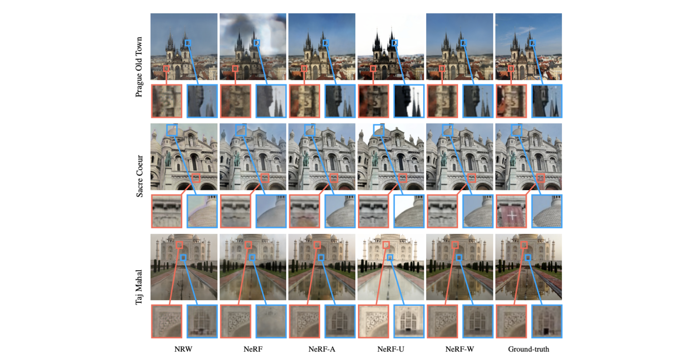
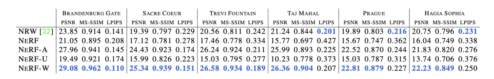

> 구글 리서치 팀에서 2020년 8월에 발표하여 CVPR 2021에서 oral로 발표된 NeRF in the Wild (NeRF-W)에 대해서 포스팅합니다. 해당 논문은 View Synthesis task를 풀기 위한 알고리즘인 NeRF가, photometric variation과 transient objects가 존재하는 in-the-wild 데이터셋에는 대응하지 못한다는 점을 지적하며 이를 개선하고자 한 advanced 버전의 NeRF 알고리즘입니다.

### Introduction

##### Implicit Neural Representation

일반적인 뉴럴 네트워크 모델은 어떤 데이터 입력이 들어왔을 때 특정한 의미를 갖는 하나의 값이 출력됩니다. 예를 들어 image recognition model이라고 한다면 강아지, 혹은 고양이라는 예측 결과가 출력되고, word embedding model이라고 한다면 입력 토큰에 해당하는 워드 임베딩 벡터가 출력되는 식으로 모델의 아웃풋이 어떤 특정한 의미를 가집니다. 

하지만 implicit neural representation(INR)의 경우에는 이와는 조금 차이를 가집니다. 가장 대표적인 예로 많이 드는 것이 이미지의 position $(x, y)$ 값을 입력으로 받아 pixel $(R,G,B)$ 값을 출력하는 모델에 대한 예시입니다.

만약 저희가 어떤 하나의 이미지를 뉴럴 네트워크 함수의 형태로 표현한다고 가정해보겠습니다. 그러면 이 함수는 position $(x, y)$ 값을 입력으로 받아 pixel $(R,G,B)$ 값을 출력하는 형태를 가집니다. 해당 모델에 position 입력을 준 뒤 출력으로 얻어낸 RGB 값 하나하나가 어떤 특정한 의미를 가지는 것은 아니지만, 전체적으로는 이미지라는 signal 정보가 continuos한 뉴럴 네트워크 함수에 담기게 됩니다.

그래서 이러한 방식으로 모델을 디자인하면 예시로 든 이미지 뿐만 아니라, 물리적인 Field를 표현하거나, PDE solver에 활용하거나, 3D 물체 표현 등을 학습시킬 수 있습니다. 오늘 소개드리는 NeRF와 NeRF in the Wild (이하 NeRF-W)도 implicit neural representation의 대표적인 예시 중 하나입니다.

##### View Synthesis

NeRF와 NeRF-W가 풀고자 하는 task는 novel view synthesis task 입니다.

하나의 scene에 대해서 다양한 각도로 촬영한 2D 이미지들이 있다고 할 때, 2D 학습 이미지를 통해 모델을 학습시킨 뒤에, 테스트에서는 학습에서 본 적 없는 새로운 방향에서 scene을 바라본 이미지를 합성해 내는 것이 novel view synthesis task입니다.

Sparse 하게 주어진 학습 이미지를 통해서 모델을 학습하고 해당 이미지의 사이사이의 view를 합성해 내면, [링크](https://www.matthewtancik.com/nerf)처럼 사진을 통해 영상과 같은 효과를 만들어 낼 수 도 있습니다.

<i>Taken from B. Mildenhall, P. P. Srinivasan, M. Tancik et al.</i>

### NeRF: Neural Radiance Field

NeRF[^2]는 novel view synthesis task를 푸는 알고리즘이고, 여기에 implcit neural representation의 아이디어를 사용합니다. 앞서 implicit representation은 이미지 뿐만 아니라 어떤 물리적인 Field를 모델링할 수도 있다고 하였는데 NeRF에서는 Radiance Field라는 것을 모델링합니다.

Radiance는 어떤 특정 파티클에 빛이 비춰서 해당 빛이 얼마만큼 반사되고 있는지를 의미합니다. 여기서 NeRF는 아래의 그림처럼 카메라와 object 상의 한 점을 이어서 만든 ray라는 직선이 있다고 할 때, ray 상 파티클의 $(x,y,z,\theta,\phi)$ coordinate에 따라 $RGB$라는 빛이 얼마만큼의 density $\sigma$를 가지고 방출되고 있는지를 모델링합니다. 

Ray 위의 coordinate마다 모든 $RGB\sigma$ 값을 계산한 뒤에 ray의 방향을 따라 파티클들의 모든 $RGB$ 값을 density $\sigma$와 비례하게 weighted sum을 하게 되면 이미지 내 하나의 pixel $RGB$ 값을 렌더링할 수 있게 됩니다.

이것을 식으로 표현하면 다음과 같습니다.
$$
C(\mathbf{r})=\int_{t_{n}}^{t_{f}} T(t) \sigma(\mathbf{r}(t)) \mathbf{c}(\mathbf{r}(t), \mathbf{d}) d t, \text { where } T(t)=\exp \left(-\int_{t_{n}}^{t} \sigma(\mathbf{r}(s)) d s\right)
$$
$c$는 컬러이고, $\sigma$는 density입니다. 그리고 $T$는 카메라와 $t$ 지점 파티클 사이에 다른 파티클들이 얼마나 간섭을 하고 있는지를 의미합니다. 

$T$ 식을 보면, $t$ 지점의 파티클과 $t_n$ 사이에 존재하는 다른 파티클들의 density를 적분하여 negative를 취해준 값입니다. $t_n$와 $t$ 사이 density가 높지 않아야 $t$ 지점의 color가 많이 고려된다는 것을 의미합니다. 카메라와 목적 파티클 사이에 장애물이 없어야 목적 지점의 색을 많이 반영할 수 있다 정도로 이해하시면 될 것 같습니다. 

Architecture로는 MLP 구조를 사용하고, $(x, y, z)$로는 $\sigma$와 $z(t)$ 임베딩 벡터를 얻어내고, $\theta, \phi, z(t)$를 사용해서 $RGB$를 얻어내는 형태로 구성되어 있습니다. 

원래의 rendering 식은 적분 항이 존재하지만, 뉴럴 네트워크 계산에는 적분항을 사용할 수 없기 때문에 이를 quadrature으로 변경하여 $\Sigma$를 사용하는 rendering 식으로 수정해주었습니다. $\sigma$ 값이 $\alpha$를 사용한 값으로 변경된 것을 확인할 수 있는데, 이는 Max, N. "Optical models for direct volume rendering." [^1]를 참고했다고 합니다. 

Loss는 squared l2 loss를 사용해서 ground truth pixel $RGB$와 predicted pixel $RGB$가 같아지도록 모델을 학습합니다. Squared l2 loss가 두 개인 이유는 NeRF에서 사용하는 hierarchical volume sampling 방법 때문인데 이것은 포스팅의 마지막에 짧게 첨부하도록 하겠습니다. 
$$
\text { Loss }=\sum_{i j}\left\|\mathbf{C}\left(\mathbf{r}_{i j}\right)-\hat{\mathbf{C}}^{c}\left(\mathbf{r}_{i j}\right)\right\|_{2}^{2}+\left\|\mathbf{C}\left(\mathbf{r}_{i j}\right)-\hat{\mathbf{C}}^{f}\left(\mathbf{r}_{i j}\right)\right\|_{2}^{2}
$$
여기까지는 NeRF in the Wild의 prior works인 NeRF에 대한 내용이었고 이제부터는 NeRF in the Wild에 대한 내용입니다.

### NeRF in the Wild

##### Motivation

기존의 NeRF는 아주 잘 contorlled된 환경에서만 잘 동작을 하며 이와 관련하여 두 가지 정도의 기본적인 제약이 존재합니다.

첫번째로는 scene에 대한 모든 카메라 이미지들이 거의 동시에 촬영되어서 모든 이미지에 대한 lighting effects가 달라서는 안된다는 조건입니다. Radiance field를 잘 모델링 하는 것이 NeRF의 기본 아이디어이기 때문에 어찌보면 당연한 제약이라고 생각합니다. 

두번째로 scene 내 모든 object가 static이어야 합니다. 즉 카메라의 위치와 방향만이 바뀔 뿐 scene 내에 있는 물체들의 이동이 있어서는 안됩니다. 이동이나 변화가 있는 물체를 transient라고 하는데 이런 transient가 존재해서는 안됩니다.

이 두 가지 경우가 지켜지지 않으면 NeRF의 novel view synthesis 성능이 많이 떨어진다고 합니다. 하지만 실제 세상에서는 이 두 가지 제약을 만족하기가 쉽지 않습니다. 날씨에 따라, 찍는 카메라에 따라, 이미지의 lighting effect가 모두 다를 수 있고, 사진을 촬영할 때 앞에 보행자나 자동차 같은 transient objects가 담길 수 도 있습니다.

따라서 NeRF-W[^3]의 저자들은 기존 NeRF에서 확장하여 photometric variation과 transient object를 대응할 수 있도록 알고리즘을 개선하고자 했고, 실제로 인터넷에서 구한 유명 건축물 사진을 가지고 본인들이 고안한 알고리즘을 적용하였더니 실제 세상에서도 적용이 가능한 NeRF를 만들어낼 수 있었다고 말하고 있습니다.

NeRF-W 전체적인 모델 구조부터 살펴보겠습니다. 기존의 NeRF 구조에서 appearance embedding과 transient component 파트가 추가되었습니다.

<i>Figure 3: NeRF-W model architecture taken from Martin-Brualla, Ricardo, et al.</i>

##### Latent Appearance Modeling

먼저 appearance embedding에 대한 설명입니다. 이는 photometric variation에 대응하기 위한 방법이며, Generative Latent Optimziation(GLO)[^4]라는 아이디어를 차용했다고 합니다. 

GLO는 generative network에서 latent vector를 random noise로 제공하던 것에 대해, discriminator를 없애고 기존에 제공되던 random noise를 learnable parameter로 대체합니다. 개별 이미지 단위로 learnable latent vector를 만들고 generator와 latent variable을 같이 optimization 하여,  “encoderless” autoencoder, 혹은 “discriminator-less” GAN으로 볼 수 있다고 합니다. NeRF-W에서도 이와 비슷한 방식으로 개별 이미지 단위의 latent vector를 만들고 이를 나머지 모델과 함께 최적화 합니다.

Appearance embedding을 추가함으로써 기존 NeRF의 radiance output이 image-independent 했었던 것이  image-dependent한 값으로 변경됩니다. 따라서 scene에 대해서 geometry 정보 뿐만 아니라 개별 이미지가 촬영된 카메라의 설정이라던지, 날씨, 대기 등에 자유도를 가지게 되었다고 합니다.
$$
\begin{gathered}
\hat{\mathbf{C}}_{i}(\mathbf{r})=\mathcal{R}\left(\mathbf{r}, \mathbf{c}_{i}, \sigma\right) \\
\mathbf{c}_{i}(t)=\operatorname{MLP}_{\theta_{2}}\left(\mathbf{z}(t), \gamma_{\mathbf{d}}(\mathbf{d}), \ell_{i}^{(a)}\right)
\end{gathered}
$$

##### Transient Objects

Transient object에 대응하기 위해서 저자들은 occluders만 따로 렌더링할 수 있는, 즉 transient object의 color와 density를 출력하는 $MLP_{\theta_3}$를 추가합니다. 

해당 네트워크에도 appearance embedding과 동일한 방식으로 per-image transient embedding을 만들고 이를 z(t)와 함께 입력으로 전달하여 transient에 대한 color와 density를 뽑아냅니다. 

<i>Figure 4. taken from Martin-Brualla, Ricardo, et al.</i>

사진처럼 모델의 static component에서는 occluder가 없는 static 요소만 렌더링이 되고, transient component에서는 occluders가 렌더링 되어, 둘이 합쳐진 composite 이미지가 실제 training ground truth 이미지와 비슷해지게 됩니다. Static과 transient 두 개의 이미지를 각각 만든 뒤에 더해서 composite을 만들어내는 것은 아니고 rendering 식에서 부터 합쳐지도록 식을 구성하였습니다.

$$
\begin{gathered}
\hat{\mathbf{C}}_{i}(\mathbf{r})=\sum_{k=1}^{K} T_{i}\left(t_{k}\right)\left(\alpha\left(\sigma\left(t_{k}\right) \delta_{k}\right) \mathbf{c}_{i}\left(t_{k}\right)+\alpha\left(\sigma_{i}^{(\tau)}\left(t_{k}\right) \delta_{k}\right) \mathbf{c}_{i}^{(\tau)}\left(t_{k}\right)\right) \\
\text { where } T_{i}\left(t_{k}\right)=\exp \left(-\sum_{k^{\prime}=1}^{k-1}\left(\sigma\left(t_{k^{\prime}}\right)+\sigma_{i}^{(\tau)}\left(t_{k^{\prime}}\right)\right) \delta_{k^{\prime}}\right)
\end{gathered}
$$
그런데 $MLP_{\theta_3}$는 color와 density 뿐만 아니라 uncertainity $\beta$라는 값도 추가적으로 출력합니다. 

저자들은 loss 계산에 있어서 모든 pixel이 equally reliable 하지 않다는 가정 하에 transient component가 출력한 uncertainty 값을 기준으로 loss를 scaling 합니다. 장애물 정보를 잘 학습하는 것 보다는 static 요소를 잘 학습하는 것이 훨씬 중요하기 때문에 uncertainty가 높게 나온 pixel에 대해서는 loss가 덜 반영되도록 설정합니다. 따라서 loss 식은 다음과 같이 작성됩니다.

$$
L_{i}(\mathbf{r})=\frac{\left\|\mathbf{C}_{i}(\mathbf{r})-\hat{\mathbf{C}}_{i}(\mathbf{r})\right\|_{2}^{2}}{2 \beta_{i}(\mathbf{r})^{2}}+\frac{\log \beta_{i}(\mathbf{r})^{2}}{2}+\frac{\lambda_{u}}{K} \sum_{k=1}^{K} \sigma_{i}^{(\tau)}\left(t_{k}\right)
$$
먼저 loss의 첫번째 두번째 term은 $C_i$를 평균으로 하고, $\beta_i^2$을 분산으로 하는 normal distribution의 negative log likelihood 식과 동일합니다. (정확히 동일한 것은 아니고 원래는 $\frac{1}{2} \log(2\pi)$가 추가되어야 하기에 shifted negative log likelihood라고 할 수 있습니다.) 

픽셀 값 하나를 $C_i$가 평균이고 $\beta_i^2$가 분산인 normal distriubtion으로 바라보고, 해당 normal distribution의 log likelihood를 높이도록 loss식을 설계한 것 입니다. 렌더링된 predicted pixel color가 ground truth pixel color에 기본적으로 가까워야 하지만, uncertainity $\beta$ 값이 크다면 predicted pixel color 값이 ground truth와 좀 멀더라도 괜찮다는 것을 식으로 나타낸 것입니다. Bayesian methods에서 normal distribution의 variance가 클 수록 uncertainty가 높다고 판단하기 때문에 이를 loss 식에 녹여내고자 한 것 같고, loss이기 때문에 log likelihood를 높이는 것이 아니라 negative log likelihood를 낮추도록 설계되었습니다.

세번째 term은 transient density에 대한 L1 regularizer입니다. 위에서 transient 렌더링을 설명하면서 transient 파트는 그냥 알아서 static을 제외한 occluder가 잘 분리되어 렌더링 되는 것 처럼 이야기하고 지나갔었는데 사실은 아무런 supervision이 없기 때문에 transient object만 렌더링되도록 transient component가 학습되는 것은 그렇게 쉽지 않을 것으로 생각됩니다. 따라서 저자들은 세번째 term에 대해서 transient density가 static phenomena를 설명하는 것을 막고자 L1 regularizer를 사용했다고 말하고 있습니다. 

L1 regularizer가 중요한 value만 살려두고 중요하지 않은 value는 0으로 만드는 효과를 가지는데, 따라서 transient density에 L1 regulaizer를 적용한 것은 transient rendering에 중요한 부분을 제외한 나머지를 density=0이 되도록 하여, 실제 pixel을 렌더링 하여도 대부분이 RGB=0이 되어, 추후 테스트에서 transient component를 제거하더라도 static의 중요한 부분은 그대로 보존되기 위함이지 않았을까라는 생각을 했습니다.

NeRF에서 사용한 것 처럼 모델을 coarse model과 fine model로 두 개로 복제하여 두 모델을 동시에 최적화 합니다. 다만 NeRF-W에서는 transient component에 대해서는 coarse model을 만들지 않았다고 합니다.
$$
\text { NeRF-W loss }=\sum_{i j} L_{i}\left(\mathbf{r}_{i j}\right)+\frac{1}{2}\left\|\mathbf{C}\left(\mathbf{r}_{i j}\right)-\hat{\mathbf{C}}_{i}^{c}\left(\mathbf{r}_{i j}\right)\right\|_{2}^{2}
$$

### Experiments

##### Phototourism dataset

<i>Table 2: Number of images and pixels per Phototourism scene taken from Martin-Brualla, Ricardo, et al.</i>

데이터 셋은 실제 온라인 사진 공유 사이트에서 가져왔으며 이 중에서 장애물이 80%이상을 차지하는 사진들은 전처리 과정에서 삭제했다고 합니다. 학습 데이터와 테스트 데이터를 나누는 것은 수동으로 나눴는데, 이를 수동으로 나눈 이유는 학습 데이터에서는 transient가 많아도 상관이 없지만 테스트에서의 목적이 photometric variation이 적고 transient가 없는 static만 잘 합성하는 것이 목적이기 때문에, 이미지 중에서 transient 요소가 없고 photometric effect가 적은 이미지만 선정하여 테스트에 사용했다고 합니다.

카메라에 대한 $(x,y,z,\theta,\phi)$ 정보는 실제로 가지고 있지 않기 때문에 COLMAP이라는 2D 이미지를 가지고 3D 정보를 만들어주는 알고리즘을 사용하여 추정값을 사용했다고 합니다.

##### Qualititive result

<i>Figure 7: Qualitative results on the Phototourism dataset taken from Martin-Brualla, Ricardo, et al.</i>

NRW는 neural rending in the wild라는 prior works중 하나이고, NeRF-A는 transient component를 없앤 NeRF-W, NeRF-U는 appearance embedding를 없앤 NeRF-W 입니다. 

NeRF는 real-world data에서 잘 작동하지 않는다는 점, transient component가 없으면 high-frequency details을 잘 담지 못한다는 점, appearance embedding이 없으면 photometric effect를 담지 못한다는 점을 파악했고, 따라서 각 모델의 component들이 논문에서 가정한 대로 작동하는 것을 확인할 수 있었다고 합니다. 동영상 결과는 [링크](https://nerf-w.github.io/)에서 확인하실 수 있습니다.

##### Quantative results

하이퍼 파라미터는 PSNR을 maximize하는 하이퍼파라미터를 선택해서 사용했다고 합니다. 테스트에서는 transient와 uncertaintiy 파트를 제외하고 static 파트만 사용하여 렌더링 하였다고 합니다. 

Quantative result 측정을 하기 위해서 어쩔 수 없었던 점은, NeRF-W의 appearance embedding이 개별 이미지 단위로 optimization 되기 때문에, test 이미지에 대한 photometric effect를 잘 반영하기 위해서는 어쨋든 test 이미지에 대한 appearance embedding optimization도 수행 되어야 했다고 합니다. 따라서 이미지의 왼쪽 절반을 사용해서 appearance embedding을 optimziation 하고 오른쪽 절반에 대해서 evaluation을 진행했다고 합니다. 대체적으로 모든 경우에서 NeRF-W가 성능이 좋은 것을 확인할 수 있습니다.

<i>Table 1: Quantitative results on the Phototourism dataset taken from Martin-Brualla, Ricardo, et al.</i>

### Conclusion

NeRF-W는 per-image latent embedding 학습하여 photometric variation에 대응할 수 있었고, static과 transient를 decompose할 수 있는 구조도 제안하였습니다. 

논문을 읽으면서 들었던 생각은, 이게 NeRF 자체의 문제이기도 한데, 카메라에 대한 $(x,y,z,\theta,\phi)$ 정보를 전부 넣어줘야만 작동을 하는 것이 아쉬웠습니다. 해당 논문에서는 COLMAP이라는 방법을 사용하여 추정값을 사용하긴 했지만 이미지만 주어지더라도 NeRF가 가능하다면 더 좋을 것 같다는 생각이 들었고, 찾아보니 관련하여 Self-Calibrating Neural Radiance Fields라는 NeRF를 학습하면서 카메라 시점도 같이 알아내는 알고리즘이 있는 것 같아서 함께 보면 좋을 것 같다는 생각이 들었습니다.

또한 static과 transient에 대한 supervision 없이도 이렇게 잘 알아서 나눠져 렌더링 된다는게 좀 신기하면서도 아직은 이해되지 않는 부분들이 있었습니다.

### Appendix

NeRF에서는 모델의 학습에 Positional encoding과 Hierarchical volume sampling이라는 두 가지 트릭을 사용합니다. 

Positional encdoing은 $(x,y,z,\theta,\phi)$라는 모델의 입력이 저차원(5차원 혹은 6차원)이기 때문에 이를 차원을 높이는 과정입니다.

Hierarchical volume sampling은, NeRF 학습의 sample efficiency를 위해 똑같은 모델을 coarse model과 fine model 이라는 두개의 네트워크로 복제한 뒤에 coarse 네트워크는 ray상의 점을 uniform distribution으로 샘플링하고, 이후 coarse network에서 나온 density distribution 정보를 가지고 fine network의 quadrature sampling point를 결정하는 방법입니다. Density가 높은 부분의 정보가 픽셀 렌더링에 더 중요할테니 해당 지점을 더 많이 샘플링 하려는 전략입니다.

### References

[^1]:Max, Nelson. "Optical models for direct volume rendering." *IEEE Transactions on Visualization and Computer Graphics* 1.2 (1995): 99-108
[^2]: Mildenhall, Ben, et al. "Nerf: Representing scenes as neural radiance fields for view synthesis." *European conference on computer vision*. Springer, Cham, 2020.
[^3]: Martin-Brualla, Ricardo, et al. "Nerf in the wild: Neural radiance fields for unconstrained photo collections." *Proceedings of the IEEE/CVF Conference on Computer Vision and Pattern Recognition*. 2021.
[^4]: Bojanowski, Piotr, et al. "Optimizing the Latent Space of Generative Networks." *International Conference on Machine Learning*. PMLR, 2018.
