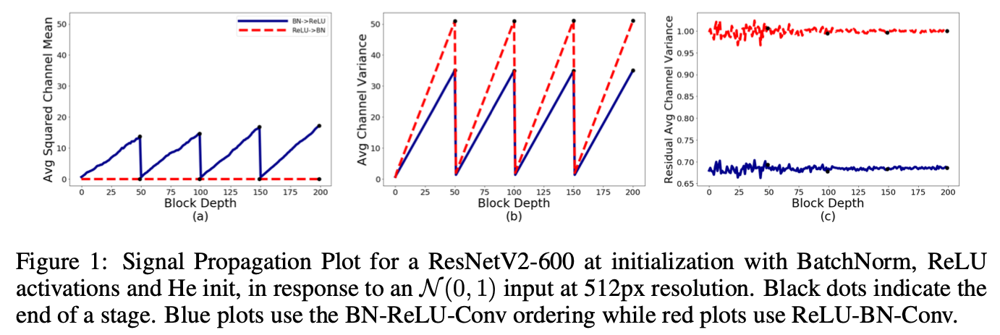

> Deepmind에서 2021년에 발표한 Normalizer-Free ResNets 논문 두 개를 리뷰합니다. BatchNorm이 몇 가지 문제점이 존재하지만 모델의 성능에 큰 영향을 주기 때문에 계속 사용해 왔던 점을 지적하며, 해당 논문에서는 BatchNorm이 없더라도 기존 성능을 유지할 수 있는 방법을 제안합니다.

### Introduction

BatchNorm은 Convolutional layer를 사용한 모델 대부분에서 사용되는 normalization layer의 한 종류입니다. 2015년에 처음 제안된 방법이고, 자세한 식은 [이전 블로그 글](https://yuhodots.github.io/deeplearning/21-05-19/)에서 확인이 가능합니다.

BatchNorm을 사용하면 학습 초기에 수렴이 빠르고 convolutional layer를 사용한 모델의 성능을 크게 높여준다는 장점이 있지만, batch size에 의존적이기 때문에 batch size가 매우 크거나 매우 작으면 성능에 문제가 생기고, 또 BatchNorm 내부의 running mean과 variance 때문에 training과 inference 사이의 모델 동작에 차이가 생겨, 제대로 된 이해 없이 BatchNorm을 사용하는 경우엔 구현 오류로 이어지기도 합니다.

비록 BatchNorm의 대안으로 LayerNorm, InstanceNorm, GroupNorm 등의 normalization 방법들이 추가로 제안되었지만, 각자의 단점이 존재하기도 하고 성능 또한 BatchNorm이 우세하기 때문에 아직까지도 BatchNorm을 완전히 대체할만 한 방법론은 제안되지 않았습니다.

따라서 본 논문은, BatchNorm을 사용하지 않으면서도 BatchNorm을 사용했을 때만큼의 모델 성능을 유지하는 방법을 제안하여 이러한 문제점들을 해결하고자 합니다.

### NF-ResNets[^1]

##### Signal Propagation Plot (SPP)

논문의 저자들은 먼저 기존의 ResNet 분석을 위해서, 모델에 random Gaussian 혹은 실제 학습 이미지를 입력으로 주고 hidden activation의 statistics를 시각화 하였습니다. 이를 Signal Propagation Plots(SPP)라는 이름으로 소개하고 있고, SPP를 사용함으로써 학습 시에 생기는 버그를 파악하거나 NF-ResNets를 고안하기 위한 인사이트를 얻는 데 도움을 받았다고 합니다. 

SPP에는 세 가지 plot이 존재합니다. (Tensor dimension은 $NHWC$로 표기하였습니다.)

1. Average Channel Squared Mean: $NHW$ activation value의 평균을 제곱한 뒤에, $C$ axis에 대해 평균을 계산한 값입니다. 다른 channel $C$ 끼리 opposite sign을 가질 수도 있기 때문에 제곱해주는 과정이 꼭 필요하며, 네트워크가 좋은 signal propagation을 가질 때 이 값이 0과 가까울 것으로 가정합니다.
2. Average Channel Variance: $NHW$ activation value의 variance를 계산한 뒤, $C$ axis에 대해 평균을 계산한 값입니다. 이 값을 통해 signal explosion 혹은 attenuation(감쇠)을 관찰합니다.
3. Average Channel Variance on the end of the residual branch: Skip path와 합치기 전의 residual branch activation value의 variance를 관찰한 값입니다. 이 값을 통해 residual branch가 올바르게 초기화되었는지 확인합니다.

<i>Taken from Brock, Andrew, Soham De, and Samuel L. Smith.</i>

SPP 관련 다양한 실험을 진행하였고 논문에서는 대표적인 두 가지 경우를 소개합니다. 첫 번째는 가장 일반적으로 사용되는 BN-RELU-Conv 순서의 ResNet과, 두 번째는 이것보다는 덜 사용되는 RELU-BN-Conv 순서의 ResNet입니다. 

참고로, $\ell^{\text{th}}$ block의 입력을 $x_\ell$로 표기하고, $\ell^{\text{th}}$ residual branch는 $f_\ell$, residual block은 $x_{\ell+1}=f_{\ell}\left(x_{\ell}\right)+x_{\ell}$의 형태로 표기하였습니다. 실험에서의 모델 입력으로는 unit Gaussian distribution을 사용하였고 이때 관측된 현상은 다음과 같습니다.

1. Average Channel Variance 값이 depth에 따라 선형적으로 상승합니다. 이 현상은 variance가 $\text{Var}(x_{\ell + 1}) = \text{Var}(x_{\ell}) + \text{Var}(f_\ell(x_\ell))$ 을 만족하기 때문입니다. 그리고 transition block에서 variance가 1과 가깝게 리셋되는데, 이것은 transition block에서 skip path대신 normalized covolution operation을 사용하기 때문입니다.
   - RELU-BN-Conv 구조에서 Skip path가 있을 때의 variance 식은 $\text{Var}(x_{\ell + 1}) = \text{Var}(x_{\ell}) + 1$로 생각할 수 있습니다.
2. BN-RELU-Conv 구조에서는 Average Channel Squared Mean이 RELU에 의해 선형적으로 상승합니다. 이 현상을 "mean-shift"라고 하는데, 이 구조에서 단순히 normalization layer를 제거하면 문제가 생긴다고 합니다. 자세한 이유는 다음 파트에서 더 설명합니다.
3. 반면, RELU-BN-Conv 구조에서는 RELU 이후에 normalization이 수행되기 때문에 mean-shift 문제에서 벗어날 수 있고, 모든 $\ell$에 대해서 $\text{Var}(f_{\ell}(x_\ell)) \approx 1$ 값을 얻을 수 있다고 합니다.

##### Normalizer-Free ResNets

ResNet에서의 SPP 결과를 확인해보면,

1. BatchNorm이 residual blcok의 입력을 input signal의 standard deviation과 비례하게 downscale하는 역할을 한다는 것을 알 수 있고,
   - $\text{Var}(x_{\ell})$의 형태로 들어왔던 입력이, BN을 거치며 1(RELU-BN-Conv order) 혹은 0.68(BN-RELU-Conv order)로 줄어들었기 때문입니다.
2. Residual block이 signal의 variance를 상수항 만큼씩 상승시킨다는 것을 알 수 있습니다.

따라서 저자들은 SPP에서 얻은 두 가지 인사이트를 바탕으로, BN을 제거한 NF-ResNets의 residual block 초기화 식을 다음과 같이 디자인 합니다.
$$
x_{\ell+1}=x_{\ell}+\alpha f_{\ell}\left(x_{\ell} / \beta_{\ell}\right)
$$

1. Residual branch에 대해서 $\text{Var}(f_{\ell}(z)) = \text{Var}(z)$가 되어야 하므로 residual branch의 입력 $x_\ell$을 $\beta_\ell = \sqrt{\text{Var}(x_\ell)}$라는 fixed scalar 값으로 나눕니다.
2. $\alpha$는 scalar hyperparameter로, block 사이에 variance growth 정도를 조절할 수 있게 만들어주는 값입니다.
3. Transition layer에서 variance가 다시 1로 리셋되는 현상은, transition layer에서 $x_\ell$대신 $(x_\ell/\beta_\ell)$을 사용하여 동일하게 1로 리셋되도록 맞춰주었습니다.

이렇게 모델을 초기화하면 BatchNorm이 없어도 BatchNorm이 있을 때와 동일한 SPP 결과를 얻을 수 있을 것으로 기대하였지만, 실제로는 두 가지의 예상하지 못했던 문제점이 발생합니다.

1. Average Channel Squared Mean 값이 depth에 따라 매우 빠르게 증가("mean shift")했습니다
2. BN-RELU-Conv 순서의 ResNet 결과에서 본 것처럼, Average Channel Variance on the end of the residual branch가 1보다 작은 값을 가집니다.

저자들은 원인 분석을 위해서 RELU가 없는 ResNet 구조로 실험을 진행하였습니다. 이때에 Average Channel Squared Mean 값이 모든 block depth에서 0과 가깝게 유지된 것으로 확인하였고, 그렇다면 왜 RELU activation이 있는 ResNet은 mean shift 현상이 발생하는지에 대해 고민하게 됩니다.

먼저, $z=Wg(x)$라는 transformation을 생각해보겠습니다.

$W$는 arbitrary and fixed 값이고 $g(\cdot)$은 activation function을 의미합니다. Activation $g(x)$에 대해서 statistics를 $\mathbb{E}\left(g\left(x_{i}\right)\right)=\mu_{g} $와 $\operatorname{Var}\left(g\left(x_{i}\right)\right)=\sigma_{g}^{2}$ 이라고 할 때, single unit $i$ of the output $z_{i}=\sum_{j}^{N} W_{i, j} g\left(x_{j}\right)$의 expected mean과 variance는 아래와 같이 계산됩니다. ($j$는 input의 index를 의미하여 $N$을 fan-in으로 볼 수 있으며, $i$는 output의 index를 의미합니다.)
$$
\mathbb{E}\left(z_{i}\right)=N \mu_{g} \mu_{W_{i, \cdot}}, \quad \text { and } \quad \operatorname{Var}\left(z_{i}\right)=N \sigma_{g}^{2}\left(\sigma_{W_{i, \cdot}}^{2}+\mu_{W_{i, .}}^{2}\right)
$$

$$
\mu_{W_{i, \cdot}}=\frac{1}{N} \sum_{j}^{N} W_{i, j}, \quad \text { and } \quad \sigma_{W_{i, \cdot}}^{2}=\frac{1}{N} \sum_{j}^{N} W_{i, j}^{2}-\mu_{W_{i,}}^{2}
$$

$g(\cdot)$이 RELU activation function $g(x) = \max(x,0)$이고 $x_i \sim N(0,1)$ for all $i$라고 한다면, $\mu_g$는 $1/\sqrt{2\pi}$가 됩니다. 즉,  $\mu_{W_i}$가 non-zero라고 한다면 $\mu_g > 0$이기 때문에 transformation의 output인 $z_i$ 또한 non-zero mean을 갖게 됩니다.

비록, 우리가 $W$라는 parameter를 zero-centered distribution에서 샘플링하더라도 실제 empirical mean을 계산해보면 non-zero인 경우가 대부분이고, 그 결과로 residual branch의 아웃풋도 non-zero mean 값을 가지게 되는 경우가 많습니다. (찾아보니 measure theory와 관련이 있다고 하는데, 더 자세히 공부하지는 않았습니다.) 따라서 저자들은 이것이 He-initialized weight을 사용하는 NF-ResNet에서 모델이 불안정해지는 원인이라고 이야기하고 있습니다.

##### Scaled Weight Standardization (Scaled WS)

이러한 문제를 해결하기 위해서 본 논문에서는 Weight normalization[^3] 을 일부 수정한 Scaled Weight Standardaization(Scaled WS)을 사용합니다.  Convolutional parameter를 아래의 식을 사용하여 re-parameterize 합니다.

$$
\hat{W}_{i, j}=\gamma \cdot \frac{W_{i, j}-\mu_{W_{i, \cdot}}}{\sigma_{W_{i,},} \sqrt{N}}
$$

- $\gamma$는 fixed constant입니다.
- 이 constraint를 학습 과정 동안 계속 유지합니다.
- fan-in에 대해서 mean, variance 구하는 이유는, input activation을 weight matrix $W_{i,j}$의 $j$ 축 값들과 곱해줘 $i$개의 ouput이 나오는 것이기 때문에, standardization을 $j$ 축이 사라지도록 수행해야하기 때문입니다. 

Scaled WS에서 empirical mean, variance를 사용하여 standardization을 수행하기 때문에 $z=\hat W g(x)$에 대해서 $\mathbb{E}(z_i) = 0$이 되며, 따라서 mean shift 현상을 없앨 수 있게 됩니다. 게다가 $\text{Var}(z_i) = \gamma^2\sigma^2_g$에 대해서 $g$에 따라 적절한 $\gamma$를 설정하면 variance 보존도 가능하게 됩니다. 실제로 SPP 결과를 확인해보아도 Average Channel Squared Mean이 증가하지 않고, RELU-BN-Conv 구조와 동일한 형태의 SPP가 출력되는 것을 논문의 Figure 2.를 통해 확인할 수 있습니다.

##### Determining Nonlinearity-Specific Constants

Variances of the hidden activations on the residual branch가 초기화 당시 1에 가까워지도록 하기 위해서는 $\gamma$를 잘 선정해야 하는데, 이 값은 수학적 계산을 통해 얻을 수 있습니다.

$x$라는 인풋이 $\mathcal N(0,1)$에서 샘플링 되었을때, RELU 출력의 variance는 $\sigma_{g}^{2}=(1 / 2)(1-(1 / \pi))$[^4] 으로 계산됩니다. 따라서 $\text{Var}(\hat W g(x))=\gamma^2\sigma^2_g$가 되고, $\text{Var}(\hat W g(x))$를 1로 맞춰주기 위해서는 $\gamma=1 / \sigma_{g}=\frac{\sqrt{2}}{\sqrt{1-\frac{1}{\pi}}}$를 사용하면 됩니다.

이 외에 추가적으로 활용한 방법들은 논문의 Appendix C에서 확인할 수 있습니다.

##### Experimental results

RestNet에서 BatchNorm을 없앤 NF-ResNets 방법은 BN-ResNets과 비교하여 견줄 수 있을 만큼의 성능이 나왔고, stochastic depth와 dropout을 추가한 경우에는 NF-ResNets이 BN-ResNets보다 좋은 성능을 보였다고 합니다.

BatchNorm이 아예 없는 구조이다 보니, batch size를 8과 4 같이 매우 작게 설정한 경우에 BN-ResNets의 성능은 무너졌지만, NF-ResNets은 성능 유지가 가능했습니다.

### NF-ResNets for Large-Scale Datasets[^2]

지금까지는 ICLR 2021에 게재된 "Characterizing signal propagation to close the performance gap in unnormalized ResNets." 논문을 소개해 드렸습니다. 

이번 파트에서는 같은 저자들이 large-scale 데이터셋에 대해서 NF-ResNets을 적용했을 때 생기는 문제점을 찾고, 이 문제점을 극복하기 위한 방법을 제안하는 "High-performance large-scale image recognition without normalization." 논문을 짧게 소개합니다.

##### Limitations of NF-ResNets

앞서 소개드린 NF-ResNets은 몇 가지 한계점이 존재합니다.

- Large learning rate 혹은 strong data augmentation이 붙었을 때 안정적으로 학습하지 못합니다.
- 따라서 large-scale 데이터셋 실험들에 적용하기 어려워집니다. Batch size 1024까지는 BN-ResNet 성능에 도달하지만, 4096 혹은 그 이상의 batch size를 사용하는 경우엔 성능이 낮아집니다. 그렇기 때문에 당시 SOTA 모델이었던 EfficientNets 성능에 미치지 못했습니다. 

##### Adaptive Gradient Clipping (AGC)

일반적인 gradient clipping은 gradient norm이 hyper-parameter로 정해놓은 $\lambda$을 넘으면 clipping 해주는 방식으로 동작합니다.
$$
G \rightarrow \begin{cases}\lambda \frac{G}{\|G\|} & \text { if }\|G\|>\lambda \\ G & \text { otherwise }\end{cases}
$$

그런데 이 $\lambda$ 값에 따라서 training stability가 매우 민감하게 영향 받는다는 것을 실험적으로 발견하였고, 따라서 이를 극복하기 위해서 본 논문에서는 Adaptive Gradient Clippin(AGC)를 제안합니다.

 $\left\|W^{\ell}\right\|_{F}=\sqrt{\sum_{i}^{N} \sum_{j}^{M}\left(W_{i, j}^{\ell}\right)^{2}}$는 Frobenius norm을 의미하는데, $\frac{\left\|G^{\ell}\right\|_{F}}{\left\|W^{\ell}\right\|_{F}}$를 확인하면 single gradient descent step이 original weight $W$를 얼마나 바꿀 것인가를 대략적으로 알 수 있습니다. 예를 들어, momentum이 없는 SGD의 경우에는 $h$가 learning rate라고 할 때, $\frac{\left\|\Delta W^{\ell}\right\|}{\left\|W^{\ell}\right\|}=h \frac{\left\|G^{\ell}\right\|_{F}}{\left\|W^{\ell}\right\|_{F}}$를 의미하기 때문입니다.

그렇다면 직관적으로 $\left(\left\|\Delta W^{\ell}\right\| /\left\|W^{\ell}\right\|\right)$ 이 값이 커지면 weight이 너무 크게 변경되어 학습이 불안정할 것으로 생각되니, 저자들은 gradient clipping의 기준으로 $\frac{\left\|G^{\ell}\right\|_{F}}{\left\|W^{\ell}\right\|_{F}}$을 사용해야겠다고 마음먹게 되었다고 합니다. 이 때에 layer-wise norm ratio보다는 unit-wise norm ratio가 더 좋은 성능을 내는 것을 확인하여서 최종적으로는 아래과 같은 clipping 방식을 사용하게 됩니다. ($\left\|W_{i}\right\|_{F}^{\star}$ 는 $\max \left(\left\|W_{i}\right\|_{F}, \epsilon\right)$를 의미합니다.)
$$
G_{i}^{\ell} \rightarrow \begin{cases}\lambda \frac{\left\|W_{i}^{\ell}\right\|_{F}^{\star}}{\left\|G_{i}^{\ell}\right\|_{F}} G_{i}^{\ell} & \text { if } \frac{\left\|G_{i}^{\ell}\right\|_{F}}{\left\|W_{i}^{\ell}\right\|_{F}^{\star}}>\lambda \\ G_{i}^{\ell} & \text { otherwise }\end{cases}
$$

이러한 AGC를 사용하니 NF-ResNets을 4096 이상의 large batch size에서도 안정적인 학습을 할 수 있었을 뿐만 아니라, RandAugment 같은 strong data augmentation 방법을 사용해도 문제가 없었다고 합니다.

---

*PyTorch에서 SPPs와 NF-ResNets를 구현한 코드가 있어서 참고하여 [이곳](https://github.com/yuhodots/SPPs)에서 결과를 확인해 보았습니다! 현재는 NF-ResNet101이 생각했던 형태가 나오지 않아서 제가 놓친 부분이 있는 듯 싶습니다...*

### References

[^1]:Brock, Andrew, Soham De, and Samuel L. Smith. "Characterizing signal propagation to close the performance gap in unnormalized ResNets." ICLR 2021.
[^2]: Brock, Andy, et al. "High-performance large-scale image recognition without normalization." *International Conference on Machine Learning*. PMLR, 2021.
[^3]: Salimans, Tim, and Durk P. Kingma. "Weight normalization: A simple reparameterization to accelerate training of deep neural networks." *Advances in neural information processing systems*29 (2016).
[^4]: Devansh Arpit, Yingbo Zhou, Bhargava Kota, and Venu Govindaraju. Normalization propagation: A parametric technique for removing internal covariate shift in deep networks. In *International Conference on Machine Learning*, pp. 1168–1176, 2016
