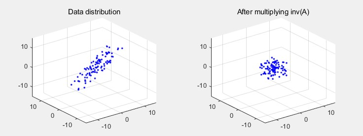
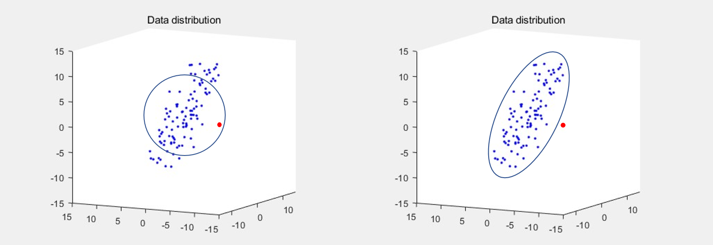

Mahalanobis distance는 데이터의 분포를 고려하며 거리 계산을 할 수 있는 좋은 툴입니다. 식을 이해하기 위해서는 먼저 공분산과 공분산의 역행렬이 의미하는 바를 알아야 하기 때문에, 이번 포스팅에서 간단한 설명 및 시각화를 통해 Mahalanobis distance을 이해해보도록 하겠습니다. 

### Inverse matrix

어떤 $D_a$라는 데이터 분포에 대하여 $A$라는 행렬을 곱하면, 선형 대수에서 가장 기본적 형태인 $AD_a = B$ 식으로 표현됩니다. 이미지 왼쪽은 $D_a$ 즉, 데이터 분포를 나타낸 것이고, 오른쪽은 이 데이터 분포에 어떤 $A$라는 선형변환을 가한 결과($B$)입니다.

이와 반대로 어떤 데이터 분포 $D_b$에 $A^{-1}$를 곱하는 것은, 데이터 분포를 $A$라는 변환 이전의 상태로 되돌린다는 의미로 해석이 가능합니다.

### Variance and Covariance 

**분산(Variance)**은 어떠한 하나의 축을 기준으로, 데이터가 기댓값으로부터 얼마나 떨어진 곳에 분포하는지를 나타냅니다.
$$
\begin{aligned}
Var[X] 
&= \mathbb E[(X-\mathbb E[X])^2] = \mathbb E[(X-\mu)^2]
\end{aligned}
$$
**공분산(Covariance)**은 어떠한 2개의 축 사이에서 데이터의 **상관 관계**를 나타내는 값 입니다. 예를 들어 우리가 2차원 데이터 분포를 관찰한다고 할 때, 데이터가 x축으로 증가하는 경향을 보이면서 y축으로도 증가하는 경향을 보인다면 양의 공분산 값을 갖습니다.
$$
\begin{aligned}Cov[X,Y] &= \mathbb E[(X-\mathbb E[X])(Y-\mathbb E[Y])] = \mathbb E[(X-\mu_x)(Y-\mu_y)] \end{aligned}
$$
**공분산 행렬(Covarianve matrix)**에 대해서는 2차원(x, y축을 가지는) 데이터 예제와 함께 살펴보도록 하겠습니다.
$$
D (\mu = 0, v=0) = \begin{bmatrix}
-6 & 8 \\
4 & -10\\
2 & 2
\end{bmatrix} \\
Then, D^TD = \begin{bmatrix}
Cov(X,X) & Cov(X,Y) \\
Cov(Y,X) & Cov(Y,Y)
\end{bmatrix}
= \begin{bmatrix}
56 & -84 \\
-84 & 168
\end{bmatrix}
$$
식을 보면 공분산 행렬은 '데이터의 모든 축에 대하여, 축 두 쌍에 대한 공분산 정보를 담고 있는 행렬'이라는 것을 알 수 있습니다. 이는 결국 공간 상의 전체적인 데이터 형태를 설명해주는 역할을 합니다.

### Mahalanobis distance

어떤 점과 점 사이의 similairty를 측정 할 때 가장 간단하게 사용할 수 있는 툴은 euclidean distance입니다. 하지만 데이터가 어떻게 분포해 있느냐에 따라 euclidean distance로 similarity를 측정하는 것은 좋은 성능을 내지 못할 수 있습니다. 아래 이미지를 예로 들어보겠습니다.

이미지의 왼쪽은 데이터 분포의 평균 지점을 중심으로한 euclidean distance $d$ 이하의 점들을 모아본 것입니다. (원의 반지름의 길이가 $d$ 입니다) 왼쪽 이미지 상에서 빨간색의 점은 파란색 점들과 실제로 다른 class인데도 불구하고, 외곽에 위치한 파란색 점 보다 오히려 더 파란색 데이터 class일 확률이 높다고 잘못 추론될 수 있습니다.
$$
d(\vec{x},\vec{y}) = \sqrt{(\vec{x}-\vec{y})^T(\vec{x}-\vec{y})}
$$
이미지의 오른쪽처럼 공간 분리가 되는 것이 더 논리적으로 보이지만, euclidean distance 식의 경우에는 공간 상에서 데이터가 어떻게 분포되어 있는지는 고려하지 않기 때문에(정확히 말하자면 데이터 분포가 gaussian이라고 보기 때문에) 오른쪽 이미지와 같은 similairty 측정이 불가능합니다. 

이런 문제 상황에 대해 우리는 Mahalanobis distance를 사용하여 데이터 분포를 고려한 거리 계산을 할 수 있습니다. 식은 다음과 같습니다.
$$
d(\vec{x},\vec{y}) = \sqrt{(\vec{x}-\vec{y})^T\Sigma^{-1}(\vec{x}-\vec{y})}
$$
형태는 euclidean distance의 식에서, 가운데에 **공분산 행렬의 역행렬**이 들어있다는 점만 다릅니다. 여기서 공분산 행렬의 역행렬이 의미하는 점을 이 포스팅의 가장 첫 부분에 있었던 inverse matrix에 대한 설명과 함께 이해하시면 좋습니다.

공분산 행렬은 데이터가 공간상에서 어떤 형태를 가지고 퍼져있는지를 설명해줍니다. 이런 공분산 행렬에 대해서 역행렬을 취한뒤 거리 계산 식 사이에 넣어준다는 것은, 기존에는 euclidean distance로 측정되던 값을 데이터 분포 형태에 따라서 늘이거나 줄여서 측정한다는 것을 의미합니다. 즉, 공분산이 큰 방향에 대해서는 데이터가 어느정도 퍼져있어도 용인해주면서도, 공분산이 작은 방향에 대해서는 데이터가 많이 퍼져있지 않도록 제한하겠다는 것을 의미합니다.

### Mahalanobis distance for singular covariance matrix

하지만 Mahalanobis distance를 모든 데이터에 대해서 적용할 수 있는 것은 아닙니다. 만약 우리가 가지고 있는 데이터의 공분산 행렬이 singular matirx라고 한다면, 우리는 covariance matrix의 역행렬을 계산할 수 없기 때문에 Mahalanobis distance를 사용할 수 없게 됩니다.

Zero-centered 데이터 셋을 $\tilde X$라고 하고, $\tilde X$가 $n \times m$ matrix일 때, 만약 $n$이 $m$보다 작다면 해당 데이터 셋의 공분산 행렬은 역행렬이 존재하지 않습니다. Singular Value Decompostion을 사용하여 공분산 행렬의 식을 전개해보면 $\tilde X^\top \tilde X = VS^\top U^\top U S V^\top = V S^\top S V^\top$인데, 여기서 $m \times m$ matrix인 $S^\top S$가 full-rank가 아니기 때문에 not invertible 합니다. 결과적으로는 데이터의 feature dimension $m$보다 데이터 샘플 수 $n$이 작은 경우에 공분산 행렬의 역행렬이 존재하지 않게 됩니다. 하지만 이런 상황은 실생활에서 매우 빈번하게 일어나는 문제이고, 따라서 이러한 이유 때문에 Mahalanobis distance가 실제 문제를 풀기 위해서 자주 사용되지는 않습니다. 

또 그렇다고 해서 Mahalanobis distance의 아이디어를 활용할 방법이 아예 없는 것은 아닙니다. 

##### 1. Diagonal Mahalanobis distance

제일 간단한 방법으로는 공분산 행렬의 diagonal term인 분산 항만 이용하는 방법이 있습니다. 

공분산 행렬에서 분산 항만 남기게 되면 $\sigma = \begin{bmatrix}
    d_1 & 0 & \dots  & 0 \\
    0 & d_2  & \dots  & 0 \\
    \vdots & \vdots  & \ddots & \vdots \\
    0 & 0  & \dots  & d_m
\end{bmatrix}$ 형태의 $m \times m$ matrix가 되는데, 이 행렬의 역행렬인 $\sigma^{-1} = \begin{bmatrix}
    1/d_1 & 0 & \dots  & 0 \\
    0 & 1/d_2  & \dots  & 0 \\
    \vdots & \vdots  & \ddots & \vdots \\
    0 & 0  & \dots  & 1/d_m
\end{bmatrix}$를 Mahalanobis distance 식의 $\Sigma^{-1}$ 위치에 넣어 사용하게 됩니다. 하지만 아무래도 기존 행렬에서 공분산 항을 모두 없앤 것이기 때문에 데이터 분포를 잘 고려하는 거리 계산이라고 볼 수는 없습니다.

##### 2. Mahalanobis distance with Moore-Penrose inverse

두 번째 방법으로는 Moore-Penrose inverse (pseudo inverse)를 사용하는 방법이 있습니다. 

Moore–Penrose inverse는 $A\mathrm  x =\mathrm b$의 형태의 linear system을 풀 때, $A$가 singular matrix일 때 inverse 대신으로 유용하게 사용할 수 있는 방법입니다. 먼저, $A$에 대해서 Singular Value Decomposition을 사용하여 전개해보면 아래와 같습니다.
$$
A \mathrm x = b \\
U S V^\top \mathrm  x =\mathrm b \\
V S ^{-1} U^\top U S V^\top \mathrm  x =V S ^{-1} U^\top \mathrm b \\
\mathrm x = V S ^{-1} U^\top \mathrm b := A^+ \mathrm  b
$$
$A$가 만약 invertible matrix라면 우리는 solution $\mathrm x$에 대해서 $A^{-1}\mathrm b = V S ^{-1} U^\top \mathrm b$를 얻을 수 있지만, $A$가 not invertible 하다면 $A^+\mathrm b = V S ^+ U^\top \mathrm b$이라는 해를 대신 얻을 수 있습니다. $S = \text{diag}_{n,m}(\lambda_1, \cdots, \lambda_{\min\{ n, m \}})$일 때 $S^+ = \text{diag}_{m,n}(\lambda_1^+, \cdots, \lambda^+_{\min\{ n, m \}})$ where $\lambda^+= 
\begin{cases}
    \lambda^{-1},& \lambda \neq 0 \\
    0,              & \lambda = 0
\end{cases}$ 를 의미하는데, 여기서 $A^+ = VS^+U^\top$을 $A$의 Moore–Penrose inverse라 합니다. 

이제 Moore–Penrose inverse를 공분산 행렬의 역행렬을 구하는 데에 적용해보겠습니다. 일단, 공분산 행렬 $\Sigma$는 symmetric, 즉 orthogonally diagonalizable이기 때문에 $P^\top D P$의 형태로 표기할 수 있습니다(P는 orthogonal matrix 입니다). 이 행렬이 invertible하지 않다는 것은 $D$ 행렬의 형태가 $D = \begin{bmatrix}
    d_1 & 0 & \dots  & 0 \\
    0 & d_2  & \dots  & 0 \\
    \vdots & \vdots  & \ddots & \vdots \\
    0 & 0  & \dots  & 0
\end{bmatrix}$로, eigenvalue가 0인 경우가 존재한다는 것(positive semi-definite)을 의미하기 때문에, 공분산 행렬의 역행렬인 $\Sigma ^{-1} = (P ^\top D P)^{-1}$ 식에서 $D$의 역행렬을 구하는 것이 불가능해집니다. 하지만 여기에 위에서 언급한 Moore–Penrose inverse 식의 $S^+$ 처럼, $D^{-1}$ 대신 $D^+ = \begin{bmatrix}
    1/d_1 & 0 & \dots  & 0 \\
    0 & 1/d_2  & \dots  & 0 \\
    \vdots & \vdots  & \ddots & \vdots \\
    0 & 0  & \dots  & 0
\end{bmatrix}$를 사용해볼 수 있고, 결과적으로 $\Sigma ^{-1}$ 대신 $\Sigma ^+ = P ^\top D^+ P$를 Mahalanobis distance 식에 적용할 수 있게 됩니다. 그리고 이 방법이 의미하는 바를 생각해보면, eigenvalue가 0인 feature axis에 대해서는 아예 거리 계산에 포함시키지 않는다(해당 축의 정보가 0과 곱해져 사라지므로)고 이해할 수 있을 것 같습니다. 

##### 3. Regularized covariance

마지막으로는, positive semi-definite이었던 covariance matrix를 positive definite으로 바꿔주는 방법이 있습니다.

Positive semi-definite인 $m \times m $ matrix는 eigenvalue가 0이 존재하는 경우에 역행렬 계산이 불가능합니다. 하지만 positive definite matrix의 경우에는 역행렬 계산이 가능하며 determinant도 0보다 크게 됩니다. 여기서 우리는 "positive semi-definite matrix에 positive definite matrix를 더하면, positive definite matrix가 된다"는 성질을 이용해볼 수 있습니다. 이는 A가 positive definite이고, B가 positive semi-definite일 때, $x^\top(A+B)x = x^\top Ax + x^\top B x > 0$ for $0 \neq x \in \mathbb R^n$이라는 식을 통해 간단히 증명이 가능합니다. 

해당 방법을 ["Time Series Classification by Class-Based Mahalanobis Distances"](https://www.researchgate.net/publication/229024971_Time_Series_Classification_by_Class-Based_Mahalanobis_Distances) 논문에서는 "Covariance shrinkage"라는 이름으로 소개하고 있고, ["Classification with Kernel Mahalanobis Distance Classifiers"](http://pnp.mathematik.uni-stuttgart.de/ians/haasdonk/publications/HP08b.pdf) 논문에서는 "Regularized covariance"라는 이름으로 소개하고 있습니다.

두 방법 모두 기존의 positive semi-definite인 공분산 행렬에 추가적으로 positive definite matrix를 더해주어 역행렬 계산이 가능하도록 강제하고 있고, 여기서 positive definite matrix로는 공분산 행렬의 diagonal term으로만 이루어진 matrix를 사용하거나 $\sigma^2 I$ 형태의 matrix를 사용하고 있습니다. 자세한 내용은 논문을 직접 참고하시면 좋을 것 같습니다. 

### Appendix

- 포스팅 작성을 위해 [이곳](https://www.researchgate.net/post/Is_there_any_advantage_of_taking_pseudoinverse_of_a_covariance_matrix/5458b382d4c11854448b4603/citation/download)과 ["Time Series Classification by Class-Based Mahalanobis Distances"](https://www.researchgate.net/publication/229024971_Time_Series_Classification_by_Class-Based_Mahalanobis_Distances) 논문, ["The Mahalanobis classifier with the generalized inverse approach for automated analysis of imagery texture data"](https://www.sciencedirect.com/science/article/pii/0146664X79900522) 논문을 참고하였는데, 해당 자료들의 인용 수가 너무 적기도 하고 제대로 설명되어있는 자료가 부족하기도 해서, 잘못된 내용이나 추가해주실 내용, 그리고 참고할 만 한 추가 자료가 있으시면 코멘트 주시면 감사하겠습니다.
- 위에서 소개한 세 가지 방법이 아니더라도, 데이터의 feature dimension을 데이터 샘플 수 보다 작아지도록 dimensionality reduction을 수행한 뒤에 Mahalanobis distance를 사용하는 방법 또한 존재합니다.
