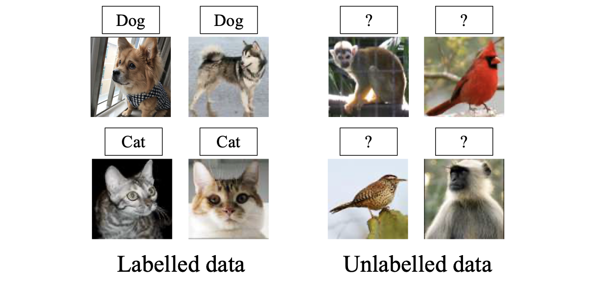
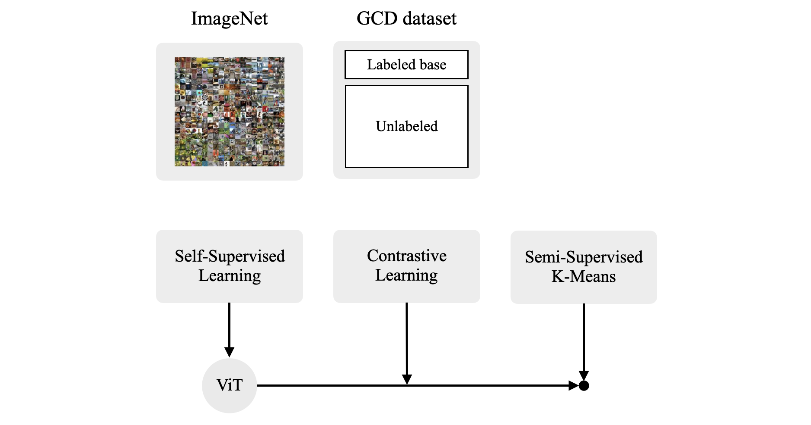
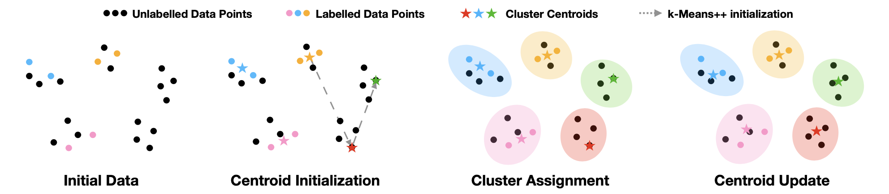
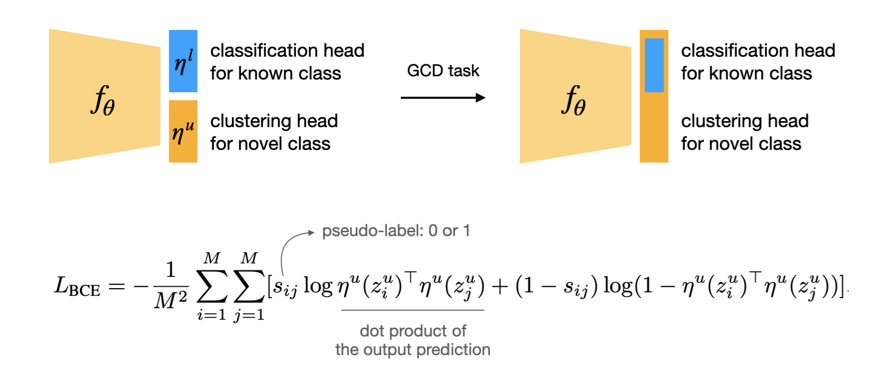
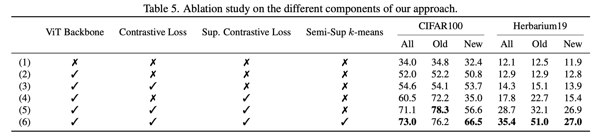

> CVPR 2022에서 발표된 "Generalized Category Discovery" 논문을 정리합니다. 해당 논문에서는 Generalized Category Discovery(GCD)라는 새로운 task를 정의합니다. 기존에 존재하던 Novel Category Discovery(NCD) task는 unabeled dataset 내에 오로지 이전에 본 적 없는 novel class만 존재한다고 가정하는데, 이 가정이 real-world 상황과 괴리가 있었기 때문에 NCD 세팅을 더 일반화 시키고자 한 것이 GCD 세팅입니다.

### Background

##### Open-World Setting

저희가 흔히 알고있는 일반적인 supervised learning 세팅은, training time에서 보았던 class만이 test time에서 주어진다는 closed-world setting을 가정하고 있습니다. 비록 이러한 가정을 기반으로 제작된 많은 AI 모델들이 실제로도 좋은 성능을 보이고 있지만, 사실 real-world에서는 해당 가정을 만족하지 않는 상황이 자주 발생합니다. 즉, test time(= deployment)에서, training time에서 한 번도 본 적 없는 새로운 class(i.e., novel class)의 데이터가 주어지는 상황이 발생할 수 있고, 이러한 상황을 고려하는 세팅을 open-world setting이라고 말 합니다.

Closed-world를 가정하는 모델의 경우에는(classification task라 한다면) classification head 내 weight vector의 수를 training time에서 본 데이터 class 개수와 동일하게 설정하기 때문에, test time에 novel class 데이터가 존재하는 경우에는 당연하게도 해당 novel class 데이터에 대한 예측이 언제나 실패하게 됩니다. 이에 따라, open-world setting에서도 모델의 예측이 가능하도록 여러 task가 정의됨과 동시에 관련 알고리즘들도 최근까지 여럿 제안되었습니다.

세부적으로는 여러 이름의 task가 존재하지만, 주로 알려진 task로는 'test time에서 known class와 novel class를 분리하는 binary classification 문제'와, 'known class의 classification을 잘 수행하면서도 novel class를 detect하는 open classification 문제', 그리고 'novel class에 대해 clustering을 수행하여 새로운 category를 discovery하는 문제' 등이 존재합니다. 세번째로 언급한 task를 *Novel Category Discovery* (이하 NCD) task라고 하는데, 오늘 소개드릴 Generalized Category Discovery[^1] (이하 GCD)가 NCD 세팅을 기반으로 제안된 task입니다.

한 가지 유의할 점은, incremental learning의 경우에는 새로운 class를 점진적으로 학습하는 learning task이긴 하지만 그럼에도 open-world learning으로 보지는 않는다는 점 입니다. 이는 novel class에 대한 rejection 기작이 따로 존재하지 않고, 여전히 closed-world를 가정한 상태에서 전체 데이터에 대한 재학습 없이 새로운 class에 대한 지식 확장을 목적으로 하기 때문입니다. 이와 같이, training time에서 novel class에 대한 specific label을 미리 부여하여 training을 수행하는 경우에는 여전히 closed-world setting이라고 볼 수 있습니다.

##### Novel Category Discovery

먼저, GCD task가 제안되는데에 배경이 된 NCD task에 대해서 소개드리겠습니다. NCD task에서 데이터셋은 labeled dataset과 unlabeled dataset으로 구분됩니다. 이 때 **labeled dataset 내의 class와 unlabeled dataset 내의 class는 서로 disjoint** 합니다. Labeled dataset 내의 class는 known class, unlabeled dataset 내의 class는 unseen class, 혹은 novel class라 명시합니다. 

NCD task의 목적은 labeled dataset을 사용하여 (혹은 unlabeled dataset도 같이 활용하여) backbone model을 학습시킨 뒤에, 해당 backbone model을 활용하여 unlabeled dataset 내 존재하는 novel class를 잘 clustering 하는 것입니다. Known class 데이터셋으로 학습 시킨 모델을 가지고 novel class들을 자동으로 구분해내는 형태를 지니기 때문에 Novel Category Discovery라고 명명하며, pre-trained backbone을 가지고 training distribution과는 다른 distribution의 문제를 푸는데에 사용하기 때문에 NCD를 **transfer clustering**의 일종으로 볼 수 있습니다. 아래의 그림을 보시면 감을 잡으실 수 있을 것 같습니다.

<i>Taken from Kai Han, et al. "AutoNovel: Automatically Discovering and Learning Novel Visual Categories."</i>

참고로, NCD task에서는 일반적인 clustering 문제들에서도 그러하듯이 novel class의 개수가 몇 개인지는 prior로 제공됩니다. 몇몇 논문에서는 novel class의 개수를 estimation하는 알고리즘을 추가로 제안하는 경우도 있습니다.

비록 NCD task가 비교적 최근에 정의된 task이긴 하지만, 그럼에도 task 자체에 어색한 부분은 여전히 존재합니다. 특히, labeled dataset과 unlabeled dataset의 class가 서로 disjoint하고, unlabeled dataset에는 이전에 본 적 없는 novel class만 존재한다는 가정부터가 비현실적인 부분이 있습니다. Real-world 상황에서는 당연하게도, unlabeled dataset이 전부 novel class로 이루어진 것이 아니라, **unlabeled dataset 내에 known class와 novel class가 섞여있는 형태**가 더 자연스럽습니다. 이 경우에 모델은 입력으로 들어온 unlabeled data가 known class인지 novel class인지를 파악할 수 있어야 하며, 동시에 novel class 중에서도 어떤 specific cluster에 속하는지 까지 알아낼 수 있어야 하기 때문에, 이는 기존의 NCD task와 비교하여 상당히 까다로운 문제입니다. 바로 이 점이 다음 섹션에서 소개드릴 GCD 논문이 나오게 된 배경입니다.

### Generalized Category Discovery

##### Problem Statements

GCD task의 대략적인 형태는 아래 사진과 같습니다. NCD task와는 다르게, 물음표(?)로 표시된 unlabeled dataset 내에 elephant, bird 등과 같이 known class가 섞여있는 것을 확인하실 수 있습니다. 즉, 이러한 데이터 집합에 대해, 모델은 입력으로 들어온 unlabeled data가 known class인지 novel class인지를 파악할 수 있음과 동시에, novel class 중에서도 어떤 specific cluster에 속하는지 까지 알아낼 수 있어야합니다. Oxford VGG 연구진들은 본 논문에서 이러한 형태의 task를 *Generalized Category Discovery*라는 이름을 사용하여 처음으로 정의하였고, 논문에서 GCD를 풀기위한 간단한 방법도 제공하고 있습니다.

<i>Taken from Vaze, Sagar, et al. "Generalized Category Discovery."</i>

- $\mathcal{D}_{\mathcal{L}} =\left\{\left(\mathbf{x}_i, y_i\right)\right\}_{i=1}^N \in \mathcal{X} \times \mathcal{Y}_{\mathcal{L}} $ and $\mathcal{D}_{\mathcal{U}}=\left\{\left(\mathbf{x}_i, y_i\right)\right\}_{i=1}^M \in \mathcal{X} \times \mathcal{Y}_{\mathcal{U}}$ where $\mathcal{Y}_{\mathcal{L}} \subset \mathcal{Y}_{\mathcal{U}}$
- Training time에서 $\mathcal{D}_{\mathcal{U}}$의 label을 알 수 없으며, test time에서 $\mathcal{D}_{\mathcal{U}}$의 label을 예측하는 것이 목적
- Validation set은 $\mathcal{D}_{\mathcal{V}}=\left\{\left(\mathbf{x}_i, y_i\right)\right\}_{i=1}^{N^{\prime}} \in \mathcal{X} \times \mathcal{Y}_{\mathcal{L}}$ 으로, class는 labeled dataset과 동일하지만 data 자체는 disjoint 함
- NCD에서와 같이, novel class의 개수는 prior로 주어짐

### Proposed Method

<i>Overall learning framework of GCD</i>

##### Representation Learning

본 논문에서는 GCD task 풀기 위한 key insight로써 **parametric classification head를 없애는 방법**을 사용합니다. 대신 unlabeled dataset 내에 존재하는 모든 class를 구분하기 위해서, feature space에서 non-parametric prototypes 기반의 clustering을 수행합니다. Learnable parameter인 classification head를 둔 상태로 unlabeled dataset을 활용한 semi-supervised learning을 수행하게 되면 (known class의 head가 강화되어) 자연스레 known class에 성능이 치우칠 수 밖에 없고, 따라서 training label이 존재하지 않는 novel class에 대한 성능이 좋지 않을 것이기 때문입니다.

이와 더불어 저자들은 **self-supervised learning 방식과 ViT 구조**를 가져옵니다. 이는 기존 NCD task를 푸는 논문들도 robust한 representation을 학습하기 위해 self-supervised learning을 pre-training 전략으로 자주 사용하기도 했고, 또한 최근에 "Emerging Properties in Self-Supervised Vision Transformers."[^3] 논문을 통해 self-supervised learning으로 학습된 ViT 모델이 nearest neighbour classifiers(non-parametric method)를 사용할 때 유용하다는 것이 알려져있었기 때문입니다. 따라서 본 논문의 representation 방식은 크게 두 단계에 걸쳐 수행됩니다.

먼저 "Emerging Properties in Self-Supervised Vision Transformers." 논문에서 제안된 DINO self-supervision으로 pre-train된 ViT backbone을 사용합니다. DINO는 [BYOL](https://yuhodots.github.io/deeplearning/21-04-04/)과 동일하게 label이 없이 Mean Teacher self-distillation만으로 모델을 학습시킨 모델이며, BYOL과 student, teacher 작동은 동일하고 similarity matching loss에서만 차이점을 가진다고 합니다. 위에서 언급한 것 처럼, DINO 모델이 강력한 nearest neighbour classifier를 생성하기 때문에 이것이 non-parametric clustering 방식과 잘 어울릴 것이라는 생각에 사용하게 되었다고 합니다.

그 다음으로는 target GCD dataset에 대해서 downstream task tuning을 수행해야 하는데, 이때 labeled dataset에 대한 supervised contrastive learning과 전체 dataset에 대한 self-supervised contrastive learning 방식을 사용합니다. Feature backbone $f$, projection head $\phi$, projected vector $\mathbf z_i=\phi(f(\mathbf x_i))$에 대해 contrastive loss 식은 아래와 같이 정의됩니다.

- $\mathcal{L}_i^s=-\frac{1}{|\mathcal{N}(i)|} \sum_{q \in \mathcal{N}(i)} \log \frac{\exp \left(\mathbf{z}_i \cdot \mathbf{z}_q / \tau\right)}{\sum_n \mathbb{1}_{[n \neq i]} \exp \left(\mathbf{z}_i \cdot \mathbf{z}_n / \tau\right)}$
- $\mathcal{L}_i^u=-\log \frac{\exp \left(\mathbf{z}_i \cdot \mathbf{z}_i^{\prime} / \tau\right)}{\sum_n \mathbb{1}_{[n \neq i]} \exp \left(\mathbf{z}_i \cdot \mathbf{z}_n / \tau\right)}$
- $\mathcal{L}^t=(1-\lambda) \sum_{i \in B} \mathcal{L}_i^u+\lambda \sum_{i \in B_{\mathcal{L}}} \mathcal{L}_i^s$

Objective function에 cross-entropy loss 대신 오직 contrastive framework만 사용함으로써 unlabeled data와 labeled data를 동일하게 취급해주었다고 하는데, 여기서 동일하게 취급한다는 것은 '같은 형태의 objective를 적용함으로써 두 data split 사이에 불균형이 생기지 않도록 유의했다' 정도로 이해하시면 될 것 같습니다.

##### Semi-Supervised $K$-Means

Representation learning이 끝난 뒤에는, GCD task의 목적인 unlabeled dataset에 cluster(or class) label을 부여해야 합니다. 앞서 말한 것 처럼 저자들은 non-parametric method인 $k$-means clustering 방법을 사용합니다. $k$-means clustering에서 known class의 초기 prototype은 labeled dataset의 feature vector를 class-wise average 한 값을 사용합니다. Novel class에 대해서는 labeled data가 없기 때문에 class-wise averaged prototype을 사용할 수 없는데, 따라서 여기서는 $k$-means++[^4]라는 방법을 활용합니다. 

논문의 appendix에서 $k$-means++ 작동에 대한 대략적인 그림을 제공하고 있습니다. GCD 세팅에서의 $k$-means++ 방법은 먼저 labeled dataset에 대해서 class-wise average를 미리 계산된 상태에서 부터 시작합니다. 그 다음에는, 가장 마지막에 얻은 prototype을 기준으로 모든 unlabeled feature vector에 거리에 비례한 확률 값을 부여합니다(= 기준 prototype과 멀리 있을 수록 높은 값을 갖는 확률 분포). 그리고 이 확률 분포로 부터 한 점을 샘플링하면, 샘플링된 점이 그 다음 prototype으로 선정됩니다. 전체 cluster 수와 동일한 개수 만큼의 prototype이 초기화 될 때까지 이 과정을 반복하고, 모든 prototype을 초기화 한 이후에는 위에서 언급한 semi-supervised $k$-means clustering 과정을 수행하게 됩니다.

<i>Taken from Vaze, Sagar, et al. "Generalized Category Discovery."</i>

Prototype 초기화 이후에는 전체 데이터셋의 feature vectors을 대상으로 $k$-means clustering을 수행합니다. 다만 $k$-means clustering의 update, cluster assignment cycle이 수행되는 와중에, labeled dataset은 언제나 동일한 cluster에 속하도록 제한합니다. 최종적으로 이러한 semi-superivsed $k$-means 프로세스가 어느정도 수렴한 뒤에, unlabeled data에 부여된 cluster label을 확인하여 clustering accuracy를 측정합니다.

### Experiments

##### Two Strong Baselines from the NCD Methods

GCD task는 본 논문에서 제안된 새로운 task이기 때문에 prior work가 존재하지 않습니다. 따라서 저자들은 NCD task를 위해 제안되었던 RS[^5]와 UNO[^6]라는 알고리즘을, GCD task에 맞게 적절히 개조하여 각각 RS+, UNO+라는 이름으로 명시하였습니다. 결과적으로 본 논문에서 제안하는 알고리즘을 단순 $k$-means clustering 방법과 더불어, RS+, UNO+와 비교하여 성능을 검증하였습니다. RS+와 UNO+ 모두 classification head가 learnable paramter의 형태를 가집니다. RS는 deep clustering 방법론에서 일반적으로 사용되는 **pairwise pseudo-label**를 활용하고, UNO는 **SwAV[^7] manner의 pseudo-label**을 활용하여 모델을 각각 학습시키는데, 자세한 내용은 논문을 직접 참고하시면 좋습니다.

##### Comparative Results

비교 실험을 위해서는 3개의 generic image recognition dataset과 3개의 fine-grained dataset, 총 6개의 데이터셋을 사용하였습니다. 각각의 데이터셋에 대해서 known class의 50%를 labeled dataset에, 나머지 50%를 unlabeled dataset에 할당하고, novel class는 전부를 unlabeled dataset에 할당하였다고 합니다. 일부 방법들이 known class(Old)에 대해 성능이 좋은 것을 확인할 수 있지만, 전체 기준으로는 본 논문에서 제안하는 방법이 성능이 제일 좋은 것을 확인할 수 있습니다.

<i>Taken from Vaze, Sagar, et al. "Generalized Category Discovery."</i>

##### Ablation Study

Proposed component에 대해서 abliation study를 수행한 결과입니다. 여기서 semi-sup $k$-means에 X 표시가 있는 경우는   논문 내에서 자세한 설명을 찾지 못해 어떤 방식으로 실험을 수행한 것인지에 대해 아직 제대로 이해하지는 못했습니다.

<i>Taken from Vaze, Sagar, et al. "Generalized Category Discovery."</i>

### Conclusion

본 논문은 real-world에서 흔히 발생할 수 있는 문제를 실제 task로써 formulation 했다는 점에서 의미를 가지며, 기존에 사용하던 NCD 알고리즘을 그대로 GCD task에 적용하기보다, GCD에 적합한 구조를 적절히 제안했다는 점이 좋았습니다. 다만, 각각의 proposed component가 이미 모두 존재하는 방법들이고 이를 하나의 알고리즘으로 조립한 형태이기 때문에, 논문 내에서 새롭게 제안하는 method가 없다는 점이 아쉬웠습니다.

개인적으로는 올해 초에 NCD 알고리즘 관련 논문들을 읽으면서 GCD와 같은 세팅이 왜 아직 없는건지에 대해서 의문이었는데, 실제로 몇 달 뒤에 바로 해당 논문이 제안되는 것을 보고 신기하기도 했고, open-world setting에 대한 연구적 관심이 급증하고 있다는 것을 체감했습니다. 관련하여 ECCV 2022에서는 GCD task에 continual learning에서의 제약(i.e., labeled dataset과 unabeled dataset을 jointly training 불가)을 추가하여 더 일반화된 세팅인 *NCD without Forgetting*(NCDwF)가 제안되기도 하였습니다. 관심있는 분들은 읽어보시는 것을 추천드립니다.

### References

[^1]:Vaze, Sagar, et al. "Generalized category discovery." *Proceedings of the IEEE/CVF Conference on Computer Vision and Pattern Recognition*. 2022.
[^2]:Han, Kai, et al. "Autonovel: Automatically discovering and learning novel visual categories." *IEEE Transactions on Pattern Analysis and Machine Intelligence* (2021).
[^3]:Caron, Mathilde, et al. "Emerging properties in self-supervised vision transformers." *Proceedings of the IEEE/CVF International Conference on Computer Vision*. 2021.
[^4]: Arthur, D.; Vassilvitskii, S. (2007). ["*k*-means++: the advantages of careful seeding"](http://ilpubs.stanford.edu:8090/778/1/2006-13.pdf) (PDF). *Proceedings of the eighteenth annual ACM-SIAM symposium on Discrete algorithms*. Society for Industrial and Applied Mathematics Philadelphia, PA, USA. pp. 1027–1035.
[^5]:Han, Kai, et al. "Automatically Discovering and Learning New Visual Categories with Ranking Statistics." *International Conference on Learning Representations*. 2020.
[^6]:Fini, Enrico, et al. "A unified objective for novel class discovery." *Proceedings of the IEEE/CVF International Conference on Computer Vision*. 2021.
[^7]: Caron, Mathilde, et al. "Unsupervised learning of visual features by contrasting cluster assignments." *Advances in Neural Information Processing Systems* 33 (2020): 9912-9924.

