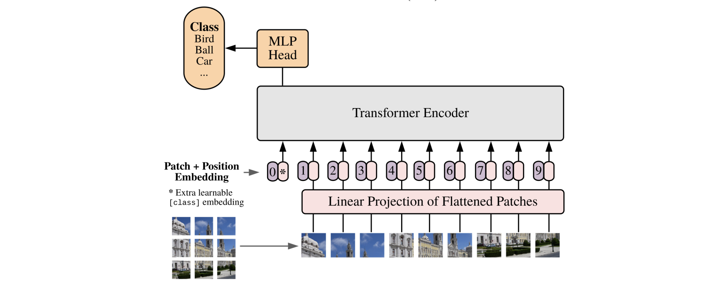
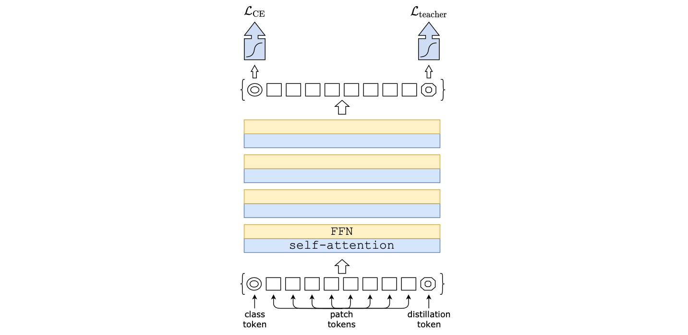
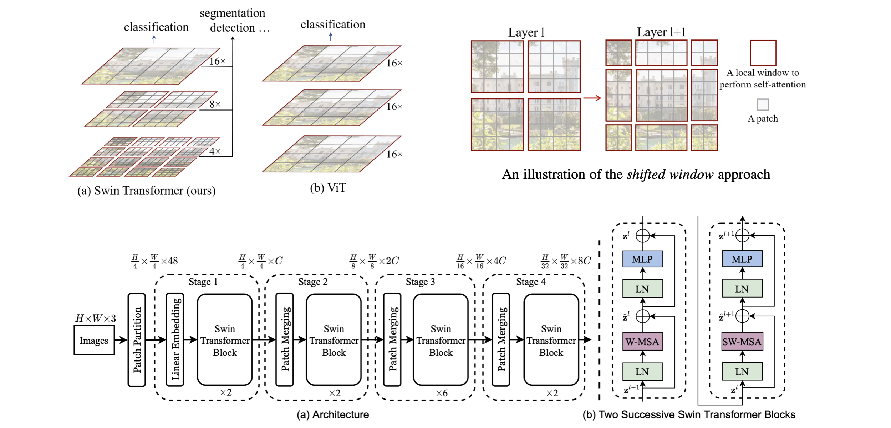
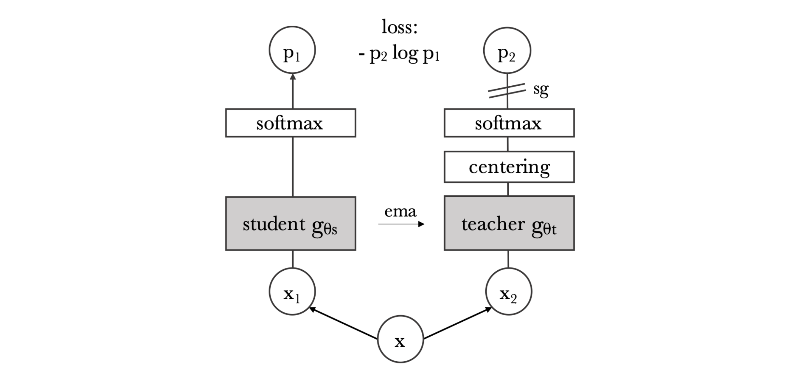
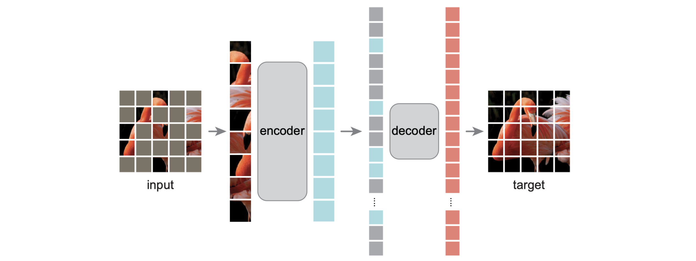
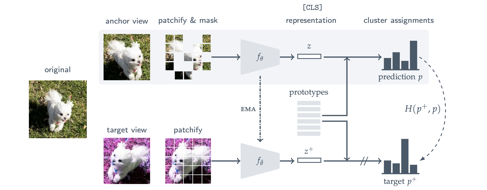

> ViT 관련 알고리즘들을 모아 정리합니다. 알고리즘은 시간 순으로 나열하였습니다. 포스팅의 제목은 Variants of Vision Transformer이나, 구조적 차이를 갖는 논문 외에도 동일한 구조에서 학습 방법만 차이를 갖는 논문들도 기록하였습니다. 

### Vision Transformer

Alexey Dosovitskiy, et al. “An Image is Worth 16x16 Words: Transformers for Image Recognition at Scale.” (Oct 2020 / ICLR2021)

<i>Taken from Alexey Dosovitskiy, et al.</i>

1. 전체 이미지를 16x16 size의 patch로 절단. 예를 들어 48 x 48 이미지라면 9개의 patch로 나뉨: `ViT-Base/16` model에서 16이 의미하는 것이 patch size임
2. 각각의 patch를 평탄화(16x16x3 = 768) 한 뒤에, 워드 임베딩을 만드는 것처럼 linear projection을 통해 embedding vector의 형태로 변환
3. 해당 embedding vector에, BERT 처럼 CLS 토큰과 positional embedding을 추가함. 이 둘은 learnable parameter 임
   - CLS 토큰은 patch embedding과 동일한 사이즈이며, 9개의 patch embedding들과 concat 함
   - position embedding은 총 9 + 1 = 10개로, patch embedding에 합(+)해주는 형태로 구성
4. 각 embedding vector를 하나의 워드 토큰처럼여겨, transformer의 입력으로 전달
5. BERT 처럼, CLS 토큰의 최종 출력이 해당 이미지의 output class라고 가정. 따라서 transformer 출력 단에서 CLS의 embedding이 어떻게 변했는지 확인하여 inference 수행

### DeiT

Hugo Touvron, et al., "Training data-efficient image transformers & distillation through attention." (Dec 2020, ICML 2021)

- ViT는 CNN에 비해 inductive bias가 적은 구조를 가지지만 그에 따라 매우 많은 양의 학습 데이터를 요구함
- 따라서 DeiT 논문에서는 ViT 구조는 그대로 유지하고, transformer에 적합한 teacher-student 방식인 distillation token을 추가하여 빠른 수렴 가능하게 했음
- Distillation token: ViT에서 CLS token과 더불어 distillation token이라는 것을 추가하고, teacher model의 output을 distillation token의 target으로 사용
  - CNN 기반 model을 teacher로 사용했을 때 성능 좋음

### Swin Transformer

Ze Liu, et al. "Swin transformer: Hierarchical vision transformer using shifted windows." (March 2021, ICCV 2021)

<i>Taken from Ze Liu, et al. </i>

- 기존 ViT는 이미지를 위한 특성이 ViT에 제대로 적용되지 않음. 즉, 해상도(resolution)과 물체의 크기(scale)가 이미지에 따라 달라지므로 이를 고려한 모델링 필요함
- 따라서 local window & patch merging이라는 inductive bias를 ViT에 적용
  - 기존 ViT는 모든 layer가 16x16x3의 패치(의 임베딩)를 동일하게 입력으로 받았다면, Swin Transformer는 처음에는 4x4x3 패치부터 시작해서, layer를 거칠 때 마다 window의 사이즈가 점점 커지는 형태
  - Swin Transformer block: window-based multi-head self-attention(W-MSA)와 shifted window multi-head self-attention(SW-MSA) 존재
  - Swin Transformer block을 구현하기 위해 efficient batch computation, relative position bias 등의 방법들 사용하는데 자세한 내용 논문 참고
- Layer 계층에 따라 다른 해상도의 결과를 얻을 수 있기 때문에 detection, segmentation task에 활용도 높음. 관련하여 muti-resolution model인 FPN과 비교해보면 좋을듯

### DINO

Mathilde Caron, et al. “Emerging properties in self-supervised vision transformers.” (Apr 2021, ICCV 2021)

<i>Taken from Mathilde Caron, et al. </i>

- Self-supervised ViT에 대해 특징 발견
  1. Self-supervised ViT feature들은 그 자체로 scene layout and object boundaries 같은 정보를 지니고 있음
  2. Finetuning, linear classifier, data augmentation 없이도 좋은 kNN classifier 성능 보임
- 아래의 방법 활용해서 self-supervised ViT 만듦
  1. ViT를 [BYOL](https://yuhodots.github.io/deeplearning/21-04-04/)의 manner로 학습. 즉, momentum update 활용함
  2. BYOL과 달리 normalized embedding의 L2 distance를 사용하지는 않고, $𝑝_2\log𝑝_1$ 형태의 cross-entropy loss 사용
  3. Momentum teacher output의 centering, sharpening 만으로 collapse 방어

### Masked AutoEncoder (MAE)

Kaiming He, et al. "Masked autoencoders are scalable vision learners." (Nov 2021, CVPR 2022)

<i>Taken from Kaiming He, et al. </i>

- Masked image modeling (MIM) task
- 기존의 ViT 학습 방식보다는, 마치 BERT 처럼 masked patch를 복원하는 방식으로 SSL pre-training 수행 후에 downstream task(e.g., classification)을 푸는 것이 더 좋음. 물론 CNN으로도 가능하지만 ViT일 때 더 좋음
  - 약 75%정도를 masking하고, input에 masked patch는 넣어주지 않아 학습 빠름
  - Masked patch에 대해서만 reconstruction loss 부여
- 유사한 연구로는 BEiT가 있음. BEiT는 dVAE 기반의 image tokenizer를 사용하여 masked token을 예측하는 방식으로, BERT와 거의 유사함

### Masked Siamese Networks (MSN)

Mahmoud Assran, et al. "Masked siamese networks for label-efficient learning." (Apr 2022, ECCV 2022)

<i>Taken from Mahmoud Assran, et al. </i>

- Siamese Network: "[Siamese Neural Networks for One-shot Image Recognition](https://www.cs.cmu.edu/~rsalakhu/papers/oneshot1.pdf)"
  - 동일한 이미지에 대한 다른 view가, 유사한 representation을 가지도록 학습
  - 두 입력 이미지에 대해 동일한 모델을 사용 (shared weights)
  - 다만 collapse 발생할 수 있어 최근 연구들 triplet이나 contrastive loss 활용
- MAE patch reconstruction의 문제점
  - MAE의 reconstruction loss는 단순 classification task를 푸는데에도 너무 디테일한 low-level image modeling 요구
  - 이러한 특징이 low-shot fine-tuning에서 over-fitting을 유발
- Masked Siamese Networks
  - Masekd anchor view와 unmasked target view가 유사한 output 확률 분포 가지도록 학습
  - Prototype는 learnable parameter인데, cluster assignment(for 확률 분포 출력)를 위해 사용. Class 개수 모른다고 가정하기 때문에 prototype 개수는 하이퍼파라미터
