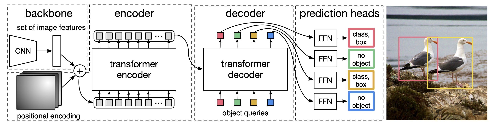
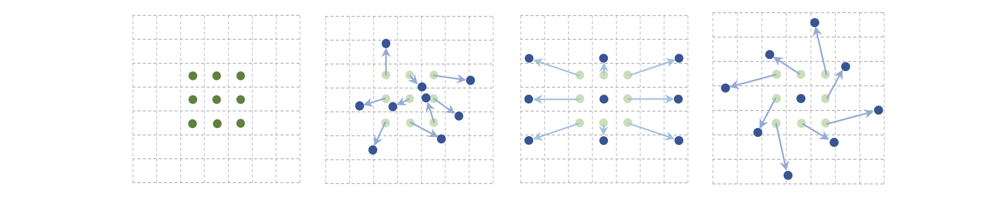
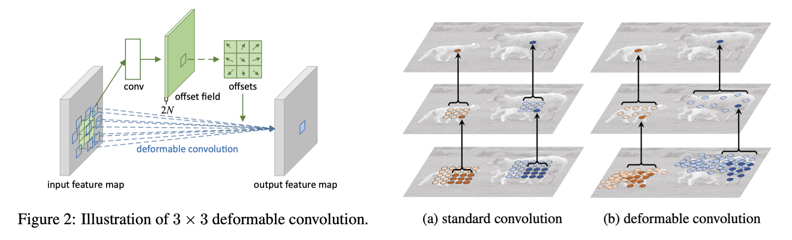
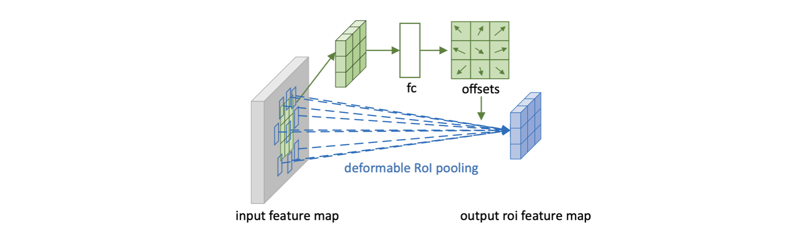
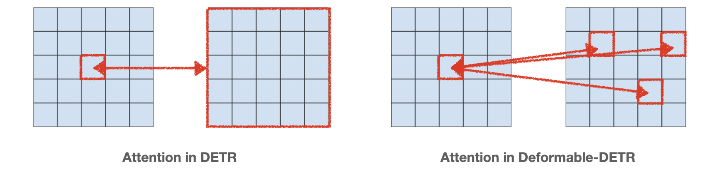
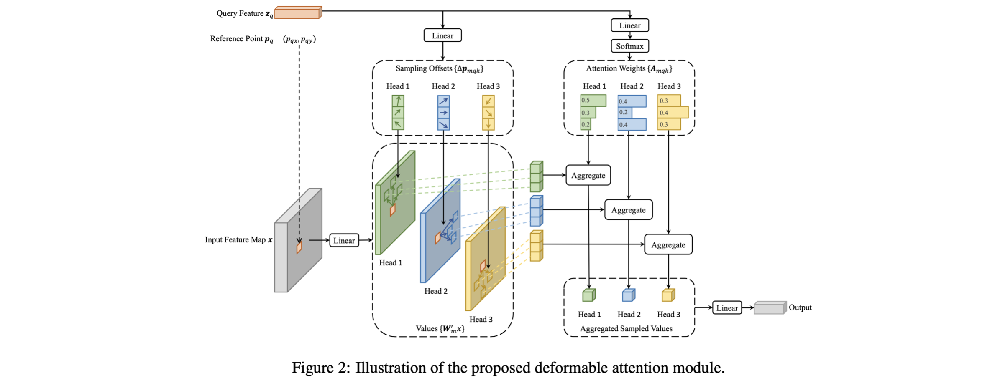
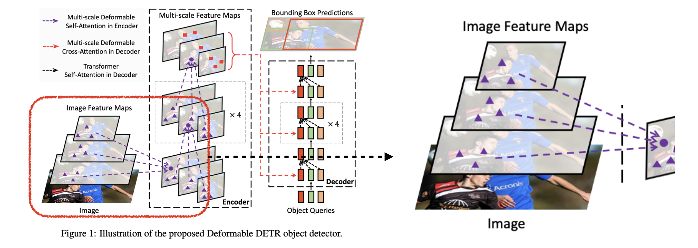
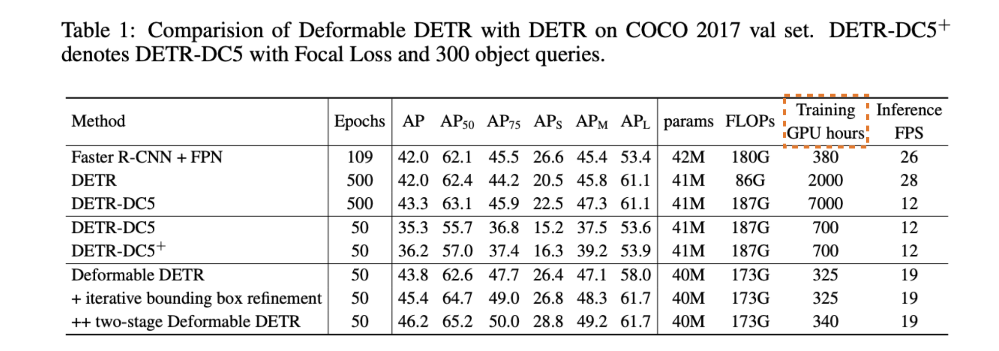
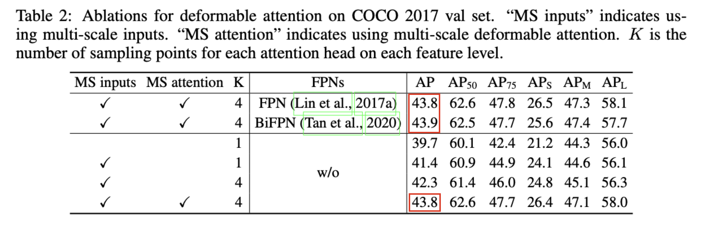

> ICLR 2021에서 발표된 "Deformable DETR: Deformable Transformers for End-to-End Object Detection" 논문을 정리합니다. 

## Introduction

Deformable DETR을 이해하기 위해서는 먼저 선행 연구인 DETR과 Deformable Convolutional Network에 대해 이해해야 합니다. 아래에서 이 두 기술에 대해 짧게 언급하고 넘어가도록 하겠습니다. (Object detection과 관련된 기본 용어들은 [이전 포스팅](https://yuhodots.github.io/deeplearning/23-06-10/)을 참고하시면 좋습니다.)

##### DETR: Detection Transformer

Object detection 분야에서 일반적으로 사용되고 있던 CNN-based 모델들은, NMS나 RPN 같은 hand-designed components를 많이 필요로 했습니다. 따라서 DETR의 저자들은 object detection 분야에서 Transformer와 Bipartite matching loss를 통해 NMS나 RPN과 같은 customized layer를 없애는 end-to-end 구조의 새로운 모델을 제안하였습니다. 아래 그림을 통해 DETR의 전체적인 구조를 파악할 수 있습니다.

<i>Taken from Carion, Nicolas, et al.</i>

1. 먼저 CNN backbone으로 image feature를 추출합니다. Image feature는 $C(2048) \times H \times W$ 의 shape을 가지는데, 1x1 conv 사용하여 $C=256$으로 차원을 줄여서 256 dimension의 $H\times W$ tokens를 만들어 냅니다.
2. 이후 image feature map에 positional encoding 더하여 transformer encoder에 입력합니다. 그러면 encoder가 $H\times W$ 개의 pixel 간의 관계를 학습하게 됩니다. 가까운 위치의 pixel만 보는 CNN과 다르게, attention을 통해 더 global한 정보를 학습할 수 있게 됩니다.
3. Decoder에는 object queries와 encoder output을 입력합니다. 이 때 object query는 $N$개(max obejct 수)입니다. Learnable parameter인 object query는 딱히 어떤 특정한 의미를 갖는 값이라기 보다는, prediction head 단에서 '예측 결과를 담기 위한 빈 공간' 정도로 이해하시면 좋습니다. 
4. Decoder output을 각각 feed forward network에 입력하여 class 예측과 bbox 예측을 출력합니다.
5. Loss로는 bipartite matching (i.e., Hungarian algorithm)을 사용합니다. 식은 아래에서 확인이 가능한데, hungarian algorithm이 clustering accuracy에 자주 활용되는 것 처럼, prediction과 GT 사이 최적 매칭을 찾고 그 매칭에 대한 loss를 뽑는다고 이해하시면 됩니다. 만약 $N=100$이라면, 위 사진의 예시에서 2개는 bird로 예측하고 98개는 no object로 예측하면 정답입니다.
6. 추가적으로 no object GT가 상대적으로 많기 때문에 no object에 대해서는 loss weight을 스케일링하여(낮춰) 학습 밸런스를 맞춥니다.

$$
\hat{\sigma}=\underset{\sigma \in \mathfrak{S}_N}{\arg \min } \sum_i^N \mathcal{L}_{\text {match }}\left(y_i, \hat{y}_{\sigma(i)}\right)
\\ \mathcal{L}_{\text {Hungarian }}(y, \hat{y})=\sum_{i=1}^N\left[-\log \hat{p}_{\hat{\sigma}(i)}\left(c_i\right)+\mathbb{1}_{\left\{c_i \neq \varnothing\right\}} \mathcal{L}_{\text {box }}\left(b_i, \hat{b}_{\hat{\sigma}}(i)\right)\right]
$$

##### Deformable Convolutional Network

DCN은 비교적 과거(2017년)에 제안된 개념입니다. DCN의 저자들은 conventional CNN의 conv 연산과 pooling 연산이 fixed geometric structures를 가지기 때문에 여러 변형들에 유연하게 대처하기 어렵다는 점을 지적합니다. 그리고 이를 해결하고자 deformable convolutional layer과 deformable RoI pooling layer를 고안하여 더 유연하게 특징을 추출하는 방법을 제안합니다. 

<i>Taken from Jifeng Dai, et al.</i>

그림으로 보면 가장 첫 번째 그림이 conventional CNN의 receptive field이며, 그 다음 그림들 처럼 receptive field가 형성되면 여러 형태에 대해 더 유연하게 특징 추출이 가능하게 됩니다.

<i>Taken from Jifeng Dai, et al.</i>

Deformable Convolution은 아래의 순서로 동작합니다.

1. 왼쪽 그림에는 흰색으로 색칠되어있는 offset 계산을 위한 새로운 conv layer가 있습니다. 
2. 이 새로운 conv layer를 input feature map의 복제본인 offset field에 적용하여 offsets을 뽑아냅니다.
3. 이후에, offset이 적용된 conv 연산을 수행합니다. 즉, 기존 conv 연산은 $\mathbf{y}\left(\mathbf{p}_0\right)=\sum_{\mathbf{p}_n \in \mathcal{R}} \mathbf{w}\left(\mathbf{p}_n\right) \cdot \mathbf{x}\left(\mathbf{p}_0+\mathbf{p}_n\right)$ 였다면, deformable conv 연산은 $\mathbf{y}\left(\mathbf{p}_0\right)=\sum_{\mathbf{p}_n \in \mathcal{R}} \mathbf{w}\left(\mathbf{p}_n\right) \cdot \mathbf{x}\left(\mathbf{p}_0+\mathbf{p}_n+\Delta \mathbf{p}_n\right)$으로 표현됩니다.

<i>Taken from Jifeng Dai, et al.</i>

Deformable RoI Pooling은 아래의 순서로 동작합니다.

1. Input feature map을 fc layer에 forwarding 시켜서 offsets을 뽑아냅니다. 
2. Deformable convolution과 동일하게, offset이 적용된 RoI pooling을 수행하여 최종 feature map을 생성합니다.

### Deformable-DETR

DETR이 object detection 분야에 새로운 방식을 제안하였지만 여전히 몇 가지 한계점은 존재했습니다. 

먼저, DETR은 큰 물체에 대해 잘 탐지하였지만, 작은 물체에 대한 성능은 과거 detector 알고리즘 들에 비해 현저히 성능이 떨어졌습니다. DETR은 attention 모듈을 통해 멀리 떨어진 pixel을 볼 수 있어서 큰 물체에 대해서는 성능이 향상되지만, 오로지 backbone feature 하나에만 의존하여 multi-scale feature는 활용하지 않아 작은 물체는 탐지하기가 힘듭니다. 이 외에도 학습 convergence 속도가 Fast R-CNN 대비 10~20배 정도 느린 것도 문제점이었습니다.

따라서 Deformable-DETR의 저자들은 본 논문에서 deformable attention module을 통해 convergence 속도를 높이고, 동시에 multi-scale feature를 활용하여 small object 성능을 높이는 방법을 제안합니다. 

##### Deformable Attention Module

기존 DETR에서의 attention은 왼쪽 그림 처럼 모든 feature map 위치에 대해 적용됩니다. 따라서 attention 계산을 위한 computational cost가 높습니다. 하지만 Deformable-DETR에서의 attention은 오른쪽 그림처럼 특정 정해진 개수만큼의 sampling point에 대해서만 수행됩니다. 이러한 방식의 연산은 앞서 보았던 deformable convolution network와 매우 유사합니다.

<i>Taken from Xizhou Zhu, et al.</i>

$$
\operatorname{DeformAttn}\left(\boldsymbol{z}_q, \boldsymbol{p}_q, \boldsymbol{x}\right)=\sum_{m=1}^M \boldsymbol{W}_m\left[\sum_{k=1}^K A_{m q k} \cdot \boldsymbol{W}_m^{\prime} \boldsymbol{x}\left(\boldsymbol{p}_q+\Delta \boldsymbol{p}_{m q k}\right)\right]
$$

Deformable-DETR의 encoder에 대해 더 자세히 살펴보겠습니다. (저자들은 Transformer 내의 encoder를 위 그림 처럼 변경하였지만, 기존 우리가 알고 있던 attention mechanism과 달라서 헷갈릴 수 있으니 주의해야 합니다)

1. 특정 pixel에 대한 feature를 (query feature)를 linear layer($2MK$)에 넣어, 각 attention head 마다의 offsets을 $K$개 뽑아냅니다. 여기서 $M$은 attention head의 개수, $K$는 sampling offsets의 개수입니다.
2. 각 offset points에 lienar projection $W’$를 적용하고 이를 values로 둡니다.
3. 이번에는 query feature를 linear layer($MK$)에 넣어서 각 attention head 마다의 softmax prob(attention score)을 뽑아냅니다.
4. 각 attention head마다 얻어낸 softmax prob과, 미리 계산해두었던 values를 곱해서 aggregated sampled values를 만들어 냅니다.
5. 이 $M$개의 aggregated sampled values를 최종 linear layer에 넣어서 하나의 업데이트된 feature를 뽑아내고 이를 update된 query feature로 사용합니다.

사실 엄밀히 따지자면 위 프로세스는 attention이라고 말할 수 없습니다. query와 key 사이의 attention score를 계산하는 것이 아니라, attention score를 linear layer 기반으로 뽑아냈기 때문입니다. 하지만 attention을 사용하는 것이 linear layer를 사용하는 것 대비 25%정도 느려져서 linear layer를 했다고 저자들은 말하고 있습니다. 

복잡한 구조를 가지고 있지만, 그냥 단순하게 '특정 reference point에 대한 feature를 주변 sampled offsets 정보를 기반으로 업데이트 한다' 정도로 이해하시면 될 것 같습니다.

##### Multi-Scale Deformable Attention Module

그 다음으로 저자들은 Deformable Attention Module 구조에 multi-scale feature를 적용하는, Multi-Scale Deformable Attention Module를 소개합니다. 사실 Deformable Attention Module에서
 크게 달라지는 점은 없습니다. 그저 offset points에 대한 sampling을, 여러 layer의 feature map에 대해 수행한다는 점만 차이를 가집니다. 

<i>Taken from Xizhou Zhu, et al.</i>

$$
\operatorname{MSDeformAttn}\left(\boldsymbol{z}_q, \hat{\boldsymbol{p}}_q,\left\{\boldsymbol{x}^l\right\}_{l=1}^L\right)=\sum_{m=1}^M \boldsymbol{W}_m\left[\sum_{l=1}^L \sum_{k=1}^K A_{m l q k} \cdot \boldsymbol{W}_m^{\prime} \boldsymbol{x}^l\left(\phi_l\left(\hat{\boldsymbol{p}}_q\right)+\Delta \boldsymbol{p}_{m l q k}\right)\right]
$$

이 때 주의할 점이 몇 가지 있는데, 먼저 multi-scale feature map의 channel은 모든 layer에서 256으로 동일하게 맞춰줘야 합니다. 여러 layer에서 얻어낸 sampled offsets을 기반으로 attention을 수행하기 때문에 당연한 절차입니다. 그 다음으로 layer 마다의 scale이 다르기 때문에 식에서 reference point $\hat p$는 (0, 0)~(1, 1)
 사이의 값을 갖는 normalized 값 사용하고 layer에 맞게 re-scale 과정을 거치게 됩니다.

#####  Decoder of Deformable-DETR

Decoder에서 object query 간의 self-attention은 기존 DETR과 완전히 동일합니다. 다만 encoder output과 object query 간의 cross-attention은 기존  DETR과 약간은 차이를 가집니다.

1. 먼저, object query($1, N, 256$)를 linear layer에 태워, object query에 대한 reference point($1, N, 2$) 얻어냅니다. Deformable attention을 위해서는 reference point라는 값이 필요한데, object query에는 따로 reference point가 존재하지 않기 때문에 이를 학습 기반으로 얻어내는 과정입니다.
2. 그리고 그 다음으로는, encoder output feature map과 object query 사이에 deformable attention을 적용하면 끝입니다.

##### Two Variants

추가적으로 저자들은 논문 내에서 두 가지 variants에 대해서도 소개합니다. 

- Iterative Bbox Refinement: 논문 내에서 'each decoder layer refines the bounding boxes based on the predictions from the previous layer'라고 설명하고 있는데, “Raft: Recurrent all-pairs field transforms for optical flow” 논문에 대한 선행 이해가 필요하여 제대로 이해하지는 못했습니다.
- Two-Stage Deformable DETR: Two-stage object detector들 처럼 region proposal 뽑도록 모듈을 먼저 학습시키고, 해당 RPN 모듈이 object가 있다고 제안해준 곳의 feature를 object query로 활용하는 방식입니다. 기존 Deformable-DETR의 object query는 아무런 의미 없이 초기화 되었다면, Two-Stage Deformable DETR에서는 더 좋은 값으로 object query가 초기화 되었다는 것을 의미합니다.

### Experiments

<i>Taken from Xizhou Zhu, et al.</i>

DETR과 비교하여 확실히 ${AP}_{s}$ 성능과 convergence 속도 측면에서 성능이 개선된 것을 확인할 수 있습니다.

<i>Taken from Xizhou Zhu, et al.</i>

당연하게도 multi-scale feature 관련 제일 유명한 방법은 FPN을 backbone으로 사용하는 것도 가능합니다. 다만 이미 multi-scale deformable attention에서 multi-scale feature를 활용하고 있기 때문에 둘 사이에 큰 성능 차이는 없었다고 합니다.

### DETR-based Detectors

Deformable-DETR도 한계점이 존재합니다. DETR 보다 개선된 모델이기는 하나 여전히 object query에 대한 아무런 prior가 없다는 점과, 여전히 학습을 위해 bipartite matching이라는 동일한 loss를 사용한다는 점입니다. 특히나 bipartite matching은 초기 단계에서 학습이 불안정하기 때문에 보완이 필요하다고 합니다.

따라서 여러 후속 연구들이 제안되었는데, 먼저 DAB-DETR과 DN-DETR은 object query에 대한 적합한 prior와 bipartite matching 외에 추가 auxiliary loss 제안하여 성능을 더욱 개선하였습니다. 그리고 그 다음 논문으로 DINO-DETR은  Deformable-DETR, DAB-DETR, 그리고 DN-DETR의 장점을 결합 및 더욱 개선하여 성능을 높였습니다.

올해 8월에는, Deformable-DETR 같은 multi-scale 디자인은 사실 필요가 없다고 제안하는 "DETR Doesn’t Need Multi-Scale or Locality Design"라는 논문도 제안되었다고 하는데 혹시 관심있는 분들은 살펴보시면 좋을 것 같습니다.

## Reference

- Jifeng Dai, et al. "Deformable convolutional networks." Proceedings of the IEEE international conference on computer vision. 2017.
- Carion, Nicolas, et al. "End-to-end object detection with transformers." European conference on computer vision. Cham: Springer International Publishing, 2020.
- Xizhou Zhu, et al. "Deformable DETR: Deformable Transformers for End-to-End Object Detection." International Conference on Learning Representations. 2021.

