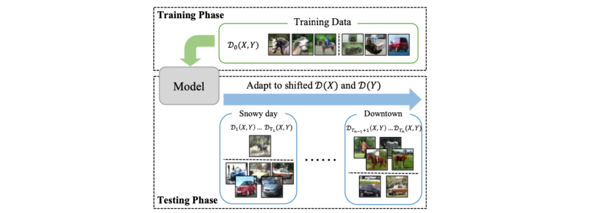
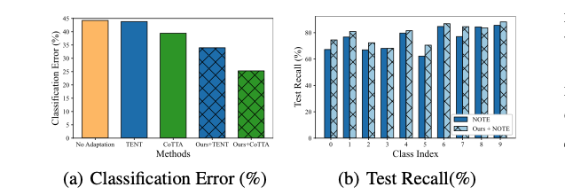
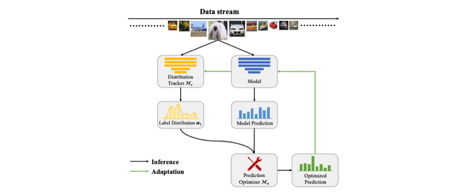
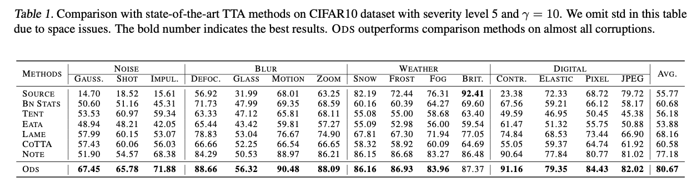
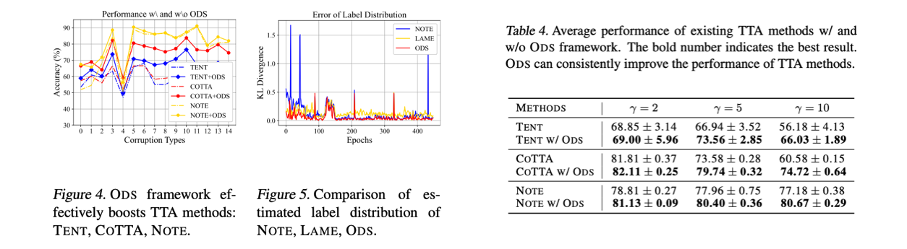

> ICML 2023 oral paper로 선정된 "ODS: Test-Time Augmentation in the Presence of Open-World Data Shift" 논문을 정리합니다. 

### Introduction

Test-time adaptation(TTA)이란, source data $D_0(X,Y)$를 학습한 source model $f_{\theta_0}$을 가지고, source data로 부터 distribution shifting된 test data에 대해서 잘 adaptation 하는 task를 말합니다.

<i>Taken from Zhi Zhou, et al.</i>

일반적으로 TTA 세팅은 $X$에 대한 covariate shift만을 가정합니다. 하지만 본 논문에서는 $Y$에 대한 label distribution shift 또한 real-world에서 빈번히 발생하는 문제이기에 이를 대응할 수 있어야 한다고 주장하며, TTA with Open-world Data Shift (AODS)라는 새로운 문제상황을 설정합니다.

특히, 이런 $X,Y$에 대한 distribution shift가 동시에 존재하는 AODS에서는 아래 figure 처럼 기존의 TTA 알고리즘(TENT, CoTTA)들이 효과가 없거나 약함을 보이며, AODS를 대응하기 위한 방법으로 Distribution tracker $\mathcal M_T$와 Prediction optimizer $\mathcal M_o$라는 방법을 제안합니다.

<i>Taken from Zhi Zhou, et al.</i>

### Problem and Analysis

##### Terminology

- $X,Y,Z$: 각각 sample, labels, feature representation
- $D_t(X)$, $D_t(Y)$: Covariate distribution, label distribution at timestamp $t$
- $w_{t,k}$: Estimated label distribution at $t$
- $BSE$: Balanced source error $\max _{y \in \mathcal{Y}} \mathcal{D}_0(\hat{Y} \neq y \mid Y=y)$. $D_0$에 대한 $f_{\theta_t}$의 성능을 의미
- $\Delta_{C E}(\hat{Y})$: Conditional error gap $\max _{y \neq y^{\prime} \in \mathcal{Y}}\left|\mathcal{D}_0\left(\hat{Y}=y^{\prime} \mid Y=y\right)-\mathcal{D}_t\left(\hat{Y}=y^{\prime} \mid Y=y\right)\right|$. Source error와 $t$ error 사이의 gap이 큰 경우를 의미하고, TTA 알고리즘을 적용한 feature representation의 일반화 성능 판단에 사용
- $K$: number of classes

##### Problem Formulation

AODS는 시간에 따라 달라지는 $D_t(X)$와 $D_t(Y)$에 대해 모델이 잘 adapt하여 좋은 testing time performance를 달성하는 것이 목적입니다.

1. Class-balanced source data $D_0(X,Y)$에 대해 모델을 학습하고 $\theta_0$ 취득
2. 실제 환경에 모델을 deploy하는데, 이 환경은 $D_t(X)$와 $D_t(Y)$가 시간에 따라 변함 (shifting 발생)
3. 각 timestamp $t$마다 모델은 예측을 뱉고, 이 unlabeled test data에 대한 예측 기반으로 파라미터를 업데이트: $θ_t$ → $θ_{t+1}$

##### Problem Analysis

$t$ 시점에서 estimated label distribution이 $w_{t,k}$라고 할 때, 일반적으로 $k$ label에 대한 모델 예측 결과를 아래와 같이 조정이 가능합니다. 결국 $w_{t,k}$라는 prior를 가지고 모델의 예측을 조정해준다고 생각하면 됩니다. (logit에 대해 조정을 가해서 곱이 아닌 ln 합으로 표현되었지만 큰 차이는 없습니다)
$$
\hat{Y}_o=\underset{y \in \mathcal{Y}}{\arg \max } f_{\theta_t}(Y=y \mid X)+\ln w_{t, k}
$$
$w_{t,k}$ 기반으로 조정된 예측에 대해서, source data에서의 error와 $t$에서의 error 사이 차이에 대한 upper bound는 아래와 같이 정리됩니다. 유도 과정은 Appendix A.에 나타나 있고 식들이 나타내는 정확한 의미들이 잘 이해가 되지는 않았지만, 저자들은 이 이론적인 분석결과의 첫 번째 term에서 $w_t$를 잘 추정해야 ODS 성능이 좋아진다는 것을 알 수 있게 되어, 이 점에 영향을 받아 알고리즘을 고안하게 되었다고 말하고 있습니다. 
$$
C\left\|\mathbf{1}-\frac{\mathcal{D}_t(Y)}{\boldsymbol{w}_t}\right\|_1 B S E(\hat{Y})+2(K-1) \Delta_{C E}(\hat{Y})
$$

### ODS Adaptation

ODS 상황에서 데이터에 대한 직접적인 모델 fitting은 성능 저하를 유도하고, 그렇다고 해서 기존 TTA method를 그대로 사용하는 것은 앞서 figure에서 본 것 처럼 suboptimal 방법입니다. 따라서 저자들은 먼저 Distribution Tracker $\mathcal M_T$라는 모듈을 통해서 $w_t$를 추정하고, 그 후에 Prediction optimizer $\mathcal M_o$를 사용하여 model prediction을 optimize하는 절차를 거칩니다. 전체적인 과정은 아래 figure에서 확인하실 수 있습니다. 

<i>Taken from Zhi Zhou, et al.</i>

먼저, ODS adaptation에 대한 objective는 다음과 같습니다.
$$
\min _{\theta_t} \frac{1}{N_t} \sum_{i=1}^{N_t} \sum_{k=1}^K S\left(\boldsymbol{w}_t\right)_k f_{\theta_t}\left(Y=k \mid \boldsymbol{x}_i\right) \log f_{\theta_t}\left(Y=k \mid \boldsymbol{x}_i\right)
$$
여기서 $S(w_t)$는 $\operatorname{Normalize}\left({1}-{w}_t\right)$를 의미하는데, 각 class에 대해 $w_t$ 크기의 역으로(inversely) weight을 걸어주기 위한 장치입니다. 이렇게 해야 unbalanced dataset에 대해서도 balace를 맞추는 학습이 가능해집니다.

그 뒤의 term은 entropy minimization term를 의미합니다. TTA에서의 optimize는 test data에 대한 optimize를 의미하기 때문에 당연하게도 class label이 존재하지 않습니다. 따라서 cross-entropy를 사용할 수 없고 unsupervised manner로 학습하게 됩니다. 

추가적으로, 위 objective는 $w_t$만 있다면 다른 TTA 방법에도 적용할 수 있는 objective입니다. 따라서 저자들은 Experiments 파트에서 다른 TTA 방법에 해당 ODS adaptation objective를 결합한 실험들도 수행합니다. 

##### Distribution Tracker $\mathcal M_T$

위에서 설명한 ODS adaptation을 위해서 첫 번째로 할 일은 $w_t$를 추정하는 것입니다. 가장 단순하게 사용할 수 있는 label distribution에 대한 추정값은 $w_t = \frac{1}{N_t} f_{\theta_0}(Y|x_i)$입니다. 즉, test data에 대한 $f_{\theta_0}$ 예측을 평균내서 그것을 추정값으로 그대로 사용하는 것입니다. 하지만 TTA 상황에서는 $X$에 대한 covariate shift가 존재하기 때문에 $\frac{1}{N_t} f_{\theta_0}(Y|x_i)$를 그대로 사용하는 것이 좋지 않다고 하고, 따라서 저자들은 새로운 방법을 제안합니다.

$$
\boldsymbol{w}_t=\frac{1}{N_t} \sum_{i=1}^{N_t} \boldsymbol{z}_i
$$
여기서 $z_i$는 instance-wise label vector이며 데이터 샘플 하나하나 마다 class label을 추정하도록 최적화 되는 값입니다. 그리고 $w_t$는 $z_i$ 집합의 평균으로 추정합니다. $z_i$는 아래의 식을 통해 최적화됩니다.
$$
\min _{\boldsymbol{w}_t} \sum_{i=1}^{N_t}\left[\boldsymbol{z}_i^{\top} \log f_{\theta_0}\left(Y \mid \boldsymbol{x}_i\right)+\boldsymbol{z}_i^{\top} \log \boldsymbol{z}_i-\sum_{j=1}^{N_t} s_{i j} \boldsymbol{z}_i^{\top} \boldsymbol{z}_j\right]
$$
두 번째, 세 번째 term은 entropy minimization와 consistency term를 의미하며 (첫번째 term은 정확히 무슨 의도로 넣은 것인지 해석이 잘 안 되어서 넘어갔습니다) 여기서 $s_{i,j}$는 $x_i, x_j$에 대한 $f_{\theta_t}$ feature similarity를 의미합니다. 실제 구현에서는 LAME (Malik Boudiaf, et al. 2022)에서 사용한 iterative solution 방식을 활용했다고 합니다.

$$
z_{i, k}^{(n+1)}=\frac{f_{\theta_0}\left(Y \mid \boldsymbol{x}_i\right) \exp \left(\sum_j s_{i, j} z_{j, k}^{(n)}\right)}{\sum_{k^{\prime}} f_{\theta_0}\left(Y \mid \boldsymbol{x}_i\right) \exp \left(\sum_j s_{i j} z_{j, k^{\prime}}^{(n)}\right)}
$$

##### Prediction Optimizer $\mathcal M_o$

그 다음으로 할 일은 $w_t$를 활용하여 최종 예측을 optimize하는 것입니다. 우리는 이미 $w_t$를 가지고 있으니, 앞서 언급했던 식인 $\hat{Y}_o=\underset{y \in \mathcal{Y}}{\arg \max } f_{\theta_t}(Y=y \mid X)+\ln w_{t, k}$으로 예측을 수행해도 상관은 없습니다. 하지만 이 방법을 사용하는 것은 class가 많은 경우에 성능 저하가 발생하기 때문에 아래의 conservative aproach를 사용했다고 합니다. 
$$
\hat{\boldsymbol{y}}_{i, k}=\frac{\sqrt{\boldsymbol{z}_{i, k} f_{\theta_t}\left(Y=k \mid \boldsymbol{x}_i\right)}}{\sum_{k^{\prime} \in \mathcal{Y}} \sqrt{\boldsymbol{z}_{i, k^{\prime}} f_{\theta_t}\left(Y=k^{\prime} \mid \boldsymbol{x}_i\right)}}
$$
해당 식은 softmax 형태이기에 서로 다른 class 간의 상대적 우의를 확인하게 되고, 따라서 $\underset{y \in \mathcal{Y}}{\arg \max } f_{\theta_t}(Y=y \mid X)+\ln w_{t, k}$에 비해 상대적으로 안정적인 예측 결과를 뱉게 됩니다. 위의 식을 $\mathcal M_o$으로 표현한다면, 최종적으로는 $\mathcal M_o$와 $w_t$를 통해 $\hat Y_o = \mathcal M_o(f_{\theta_t}(Y=k|x), w_t)$라는 결과를 얻게 됩니다.

##### Summary

전체 과정을 순서대로 표현하면 다음과 같습니다.

1. Source data에 학습된 model $f_{\theta_0}$과 현재 current adapted model $f_{\theta_t}$ 구비
2. $f_{\theta_0}$과 $f_{\theta_t}$를 사용하여 $w_t = \frac{1}{N_t}\sum z_i$를 최적화. 이 때 $z_i$는 $\frac{f_{\theta_0}\left(Y \mid \boldsymbol{x}_i\right) \exp \left(\sum_j s_{i, j} z_{j, k}^{(n)}\right)}{\sum_{k^{\prime}} f_{\theta_0}\left(Y \mid \boldsymbol{x}_i\right) \exp \left(\sum_j s_{i j} z_{j, k^{\prime}}^{(n)}\right)}$에 의해 최적화되고, $\theta_t$는 $s_{i,j}$를 계산할 때 사용
3. $$w_t$$를 얻은 뒤에는 $\hat{\boldsymbol{y}}_{i, k}=\frac{\sqrt{\boldsymbol{z}_{i, k} f_{\theta_t}\left(Y=k \mid \boldsymbol{x}_i\right)}}{\sum_{k^{\prime} \in \mathcal{Y}} \sqrt{\boldsymbol{z}_{i, k^{\prime}} f_{\theta_t}\left(Y=k^{\prime} \mid \boldsymbol{x}_i\right)}}$을 통해 예측을 수행
4. 최종 예측 기반으로 $\theta_t$를 최적화: $\min _{\theta_t} \frac{1}{N_t} \sum_{i=1}^{N_t} \sum_{k=1}^K S\left(\boldsymbol{w}_t\right)_k f_{\theta_t}\left(Y=k \mid \boldsymbol{x}_i\right) \log f_{\theta_t}\left(Y=k \mid \boldsymbol{x}_i\right)$. 실험에서는 test batch를 64로 두는데, test batch에 대해 한 번 forward 할 때 마다 모델이 업데이트 됨
5. 데이터 셋(CIFAR-10-C, 100-C)이 순차적으로 들어오는 과정에서 위의 프로세스 반복적으로 수행

### Experiments

##### Dataset

데이터 셋은 기존 TTA 방법들에서 사용한 CIFAR10-C과 CIFAR100-C을 사용합니다. CIFAR10/100 데이터셋에 추가적으로 15개 종류의 corrupting을 추가한 데이터셋입니다.

다만 여기에 label distribution shift를 추가하는데, 단순히 특정 major class sample이 minor class sample에 비해 N배 많도록 수정합니다. 만약 실험 결과 테이블에 $\gamma=5$라고 표현되어 있다면, major A class가 minor B, C, D classes에 비해 5배 많다는 것을 의미합니다.

##### Empirical Results

Existing TTA method와 비교하여 ODS가 성능적 우위를 보입니다.

또한 다른 TTA 방법에 ODS 방식을 접목하는 경우 이들의 성능을 더 끌어올려 줄 수 있습니다. 

Distribution tracker $\mathcal M_T$와 Prediction optimizer $\mathcal M_o$가 추가되면서 성능이 상승하는데, 이 중 특히 $\mathcal M_o$를 넣어주는게 중요하다는 것을 표에서 확인 가능합니다.

### Reference

- Boudiaf, M., Mueller, R., Ben Ayed, I., and Bertinetto, L. Parameter-free online test-time adaptation. In Proceed- ings of the IEEE/CVF Conference on Computer Vision and Pattern Recognition, pp. 8344–8353, 2022.
- Zhi Zhou, et al. "ODS: Test-Time Adaptation in the Presence of Open-World Data Shift." ICML 2023.
- Taesik Gong, et al. "NOTE: Robust continual test-time adaptation against temporal correlation." *Advances in Neural Information Processing Systems* 35 (2022): 27253-27266.

