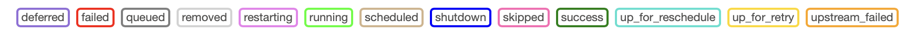
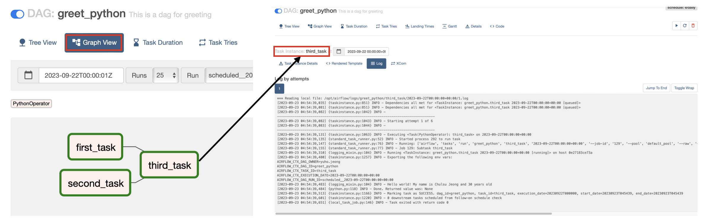

> Apache airflow는 에어비앤비에서 만든 워크플로우 관리 시스템입니다. 본 포스팅에서는 기초적인 airflow DAGs 작성 예시와 사용법을 정리합니다.

### Basics

- DAG: Task의 집합
- Task: Airflow DAGs의 기본 실행 단위
- Operator: Task 구현을 위한 템플릿. 제일 기본적으로는 BashOperator와 PythonOperator가 존재하고, 그 외에 SQL Operator, Http Operator 등 존재
- Sensor: 외부 이벤트에 대해 특정 조건 만족하는지 주기적으로 확인
- XComs (i.e., cross-communications): XComs를 통해 task간 정보 주고받을 수 있음. JSON은 지원하지만 dataframe 같은 용량이 큰 데이터는 지원하지 않음. 따라서 데이터 용량이 큰 경우에는 특정 다른 공간에 저장한 뒤 저장된 위치를 XComs로 전달하는게 일반적인 디자인 패턴
- Task Lifecycle: `no_status` $\to$ Scheduler  $\to$ `{status}`  $\to$ Executor  $\to$ `{status}`  $\to$ Worker  $\to$ `{status}`



### Installation

로컬 가상환경에서 pip를 통해 airflow를 설치하여 사용하거나, airflow docker 이미지를 pull 받아 사용하는 방법이 존재합니다. 이 중 docker를 활용하는 방식을 권장드립니다.

##### Airflow w. PIP Install

1. [공식 저장소](https://github.com/apache/airflow)에서 airflow 버전 및 다운 방법을 확인하여 다운 받습니다.
2. `export AIRFLOW_HOME=.` 환경 변수 설정을 합니다.
3. Airflow DB, 웹 서버, 스케줄러를 각각 실행합니다:   `airflow db init`, `airflow webserver -p 8080`, `airflow scheduler`
4. `airflow users create --help` 명령어를 통해 유저 설정 방법을 확인하고, username, password를 설정합니다. 
5. localhost:8080/ 에 접속하여 웹서버가 잘 작동하는지 확인합니다.

#####  Airflow w. Docker

1. 다음 명령을 통해 compose file을 다운받습니다: `curl -Lf0 'https://airflow.apache.org/docs/apache-airflow/2.0.1/docker-compose.yaml"`
2. ``mkdir ./dags ./logs ./plugins`` 명령을 통해 기본 디렉토리들을 생성합니다.
3. 초기화 및 compose 파일 실행을 순서대로 진행합니다: `docker-compose up airflow-init`, `docker-compose up -d`
4. localhost:8080/ 에 접속하여 웹서버가 잘 작동하는지 확인합니다.
5. webserver 컨테이너에서 `airflow users create --help` 명령어를 통해 유저를 생성할 수 있습니다. (기본 유저는 name:airflow, passwd: airflow)

### DAGs

`docker-compose.yaml` 파일에서 `AIRFLOW__CORE__LOAD_EXAMPLES` 옵션을 true로 설정하면 다양한 DAG 예시를 확인하실 수 있습니다.

##### Example Code: Hello World!

[이 곳](https://github.com/yuhodots/airflow/blob/main/dags/greet_python.py)에서도 간단한 예시 코드를 확인 가능합니다.

- `start_date`: 시작되는 기준 시점. 즉, 실제 실행은 'start_date + 주기'부터 시작
- `execution_date`: 실제 실행 날짜가 아닌 예약을 시도한 시간 (historical name for what is called a *logical date*)
- `catchup`: current date과 start date에 차이가 있어 과거 데이터에 대해서도 DAG가 실행 되어야하는 경우 활용. False로 지정시에는 최근 DAG만 실행
- `backfill`: 스케줄 시점이 지나간 DAG 실행할 때 활용
- `retries`:  task가 실패했을 때 재실행을 시도
- `retry_delay`: 재시도 전에 wait할 시간

```python
from datetime import datetime
from airflow import DAG
from airflow.operators.bash import BashOperator

default_args = {
  'owner': 'yuhodots',
  'retries': 5,
  'retry_delay': timedelta(minutes=2)
}

with DAG(
	dag_id='first_dag',
  default_args=default_args,
  description='first dag'
  start_date=datetime(2023, 9, 1, 2),
  schedule_interval='@daily'
) as dag:
  
  task1 = BashOperator(
  	task_id='first_task',
    bash_command="echo hello world, this is the first task!"
  )
  task2 = BashOperator(
  	task_id='second_task',
    bash_command="echo hello world, this is the second task!"
  )
  task1 >> task2	# same with `task1.set_downstream(task2)`
```

```python
from datetime import datetime
from airflow import DAG
from airflow.operators.python import PythonOperator

default_args = {
  'owner': 'yuhodots',
  'retries': 5,
  'retry_delay': timedelta(minutes=2)
}

def greet(name, age):
  print(f"Hello world! My name is {name} and {age} years old")

with DAG(
	dag_id='first_dag',
  default_args=default_args,
  description='first dag'
  start_date=datetime(2023, 9, 1, 2),
  schedule_interval='@daily'
) as dag:
  
  task1 = PythonOperator(
  	task_id='first_task',
    python_callable=greet,
    op_kwargs={'name': 'Yuho Jeong', 'age': 27}
  )

  task1
```

`with DAG (...) as dag:` 대신에 아래와 같은 형태도 가능합니다.

```python
from airflow.decorators import dag
from airflow.operators.python import PythonOperator

def greet(name, age):
  print(f"Hello world! My name is {name} and {age} years old")

@dag(...)
def greet_dag():
    task1 = PythonOperator(
  		task_id='first_task',
    	python_callable=greet,
    	op_kwargs={'name': 'Yuho Jeong', 'age': 27}
  	)
    task1
    
dag = greet_dag()
```

##### XComs

XComs를 통해 task간 정보를 주고받는 것은 TaskInstance 객체의 xcom_push, xcom_pull 메소드를 통해 가능합니다.

```python
from airflow.decorators import dag
from airflow.operators.python import PythonOperator
from airflow.models import TaskInstance

def test_xcoms_push(ti: TaskInstance):
  ti.xcom_push(key="first_item", value=['first_item'])
  ti.xcom_push(key="second_item", value=['second_item'])

def test_xcoms_pull(ti: TaskInstance):
  item1 = ti.xcom_pull(key="first_item", task_ids="test_xcoms_push")
  item2 = ti.xcom_pull(key="second_item", task_ids="test_xcoms_push")
  print(item1, itme2)

@dag(...)
def dag_function():
    task1 = PythonOperator(
  		task_id='test_xcoms_push',
    	python_callable=test_xcoms_push,
  	)
    task2 = PythonOperator(
  		task_id='test_xcoms_pull',
    	python_callable=test_xcoms_pull,
  	)
    task1 >> task2
    
dag = dag_function()
```

##### Connection

Webserver의 Admin 탭에서 connection 설정을 할 수 있습니다. Connection은 외부 연결을 관리해주며, 일반적으로 클라우드에 존재하는 DB 서버, Datalake 등의 연결을 목적으로 활용됩니다.


##### Graph View & Log

DAG 구조를 graph view를 통해 한 눈에 확인이 가능하고, 각 노드의 실행 결과는 각 노드를 클릭하면 나오는 log 내에서 확인이 가능합니다.



### Debugging

DAG 스크립트 파일의 가장 아래에 해당 코드를 추가해줍시다. 그러면 vscode 같은 IDE에서 디버깅이 가능합니다! (with `.vscode/launch.json`)

```python
# with DAG(...) as dag:

if __name__ == "__main__":
    dag.test()
```

### References

아래의 자료들을 같이 참고하면 좋습니다.

- Apache Airflow DAGs: https://airflow.apache.org/docs/apache-airflow/stable/core-concepts/dags.html
- Airflow Tutorial for Beginners - Full Course in 2 Hours 2022: https://www.youtube.com/watch?v=K9AnJ9_ZAXE&t=37s
- Google Gloud DAG documents: https://cloud.google.com/composer/docs/how-to/using/writing-dags?hl=ko
