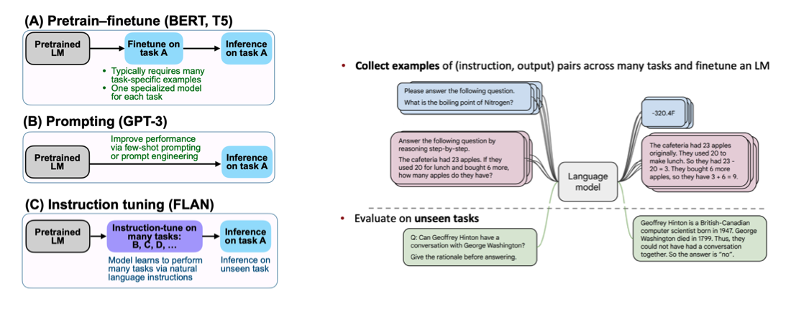
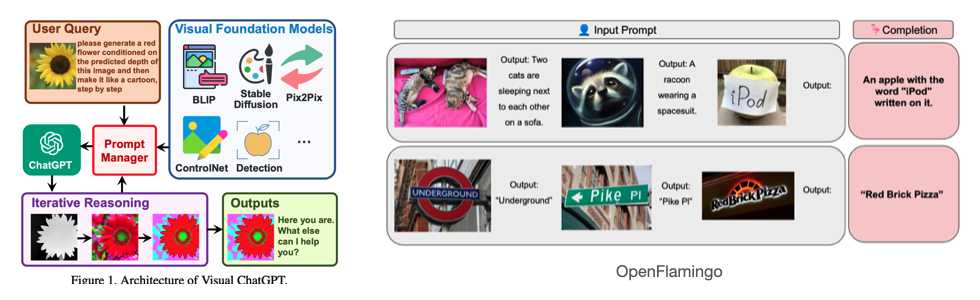
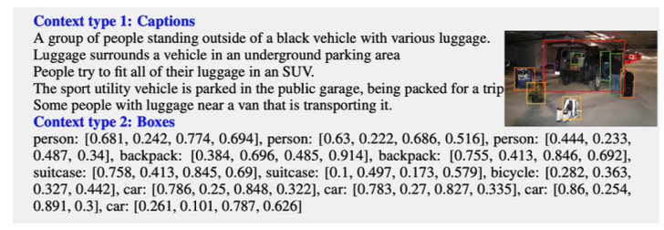
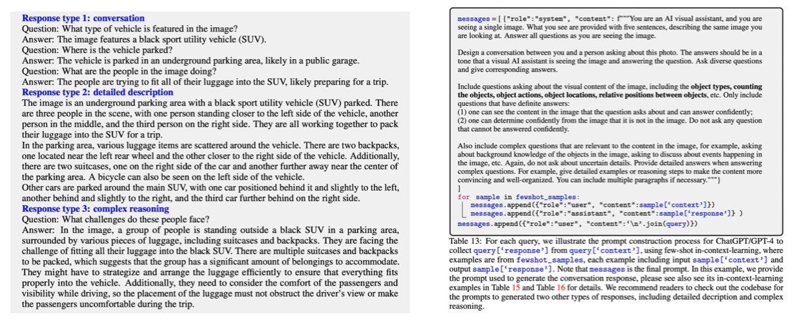
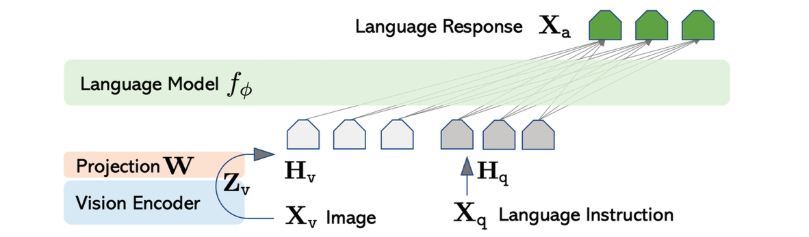
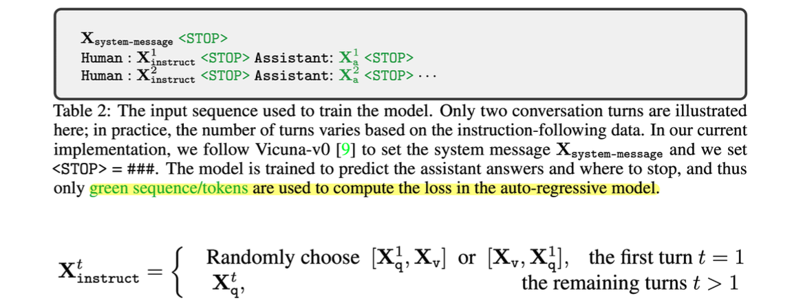
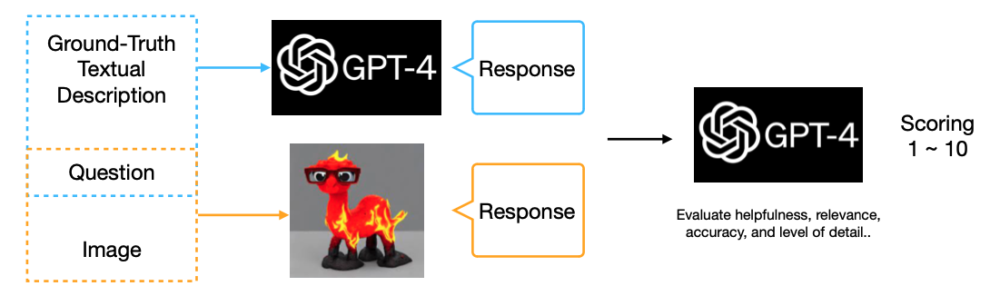
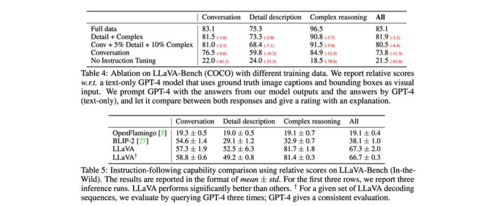
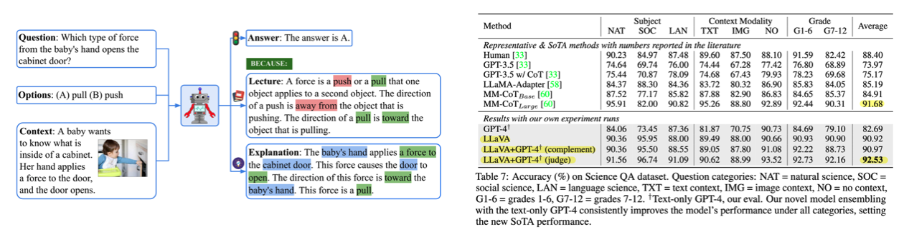

> NeurIPS 2023에서 oral paper로 선정된 Visual Instruction Tuning 논문을 정리합니다. 해당 논문은 LLaVa라는 이름으로도 알려져 있는데, multimodal learning 분야에서 image와 text pair를 가지는 intruction tuning dataset을 만들고 이를 활용하여 multi-task multimodal LLM을 만드는 시도를 한 첫 논문입니다.

### Introduction

최근에 NLP 분야에서는 Alpaca, Vicuna, GPT-4-LLM 등, machine-generated instruction-following data를 사용해서 zero-shot 성능을 높이는 LLM 모델들이 많이 등장하고 있습니다. 하지만 이런 연구들은 language model에만 치중되어 있기 때문에 본 논문의 저자들은 multimodal space에서 machine-generated instruction-following data을 만들고 모델을 학습시키는 방법을 제안합니다.

들어가기 앞서 본 논문의 contribution을 먼저 살펴보면 다음과 같습니다.

1. Multimodal space에서 instruction-following data를 만들었습니다.
2. 해당 데이터를 활용하여 large multimodal model을 학습하였습니다.
3. 평가를 위한 multimodal instruction-following benchmark를 제공합니다.
4. 이 모든 것을 오픈소스로 제공하고 있습니다.

### Related Works

관련 연구로는 먼저 instruction tuning이 있습니다. 특정 task에서 pre-trained LLM을 활용하기 위해서 초기에는 pretrain-finetune 방식을 사용하였습니다. 먼저 masked language modeling (MLM)으로 backbone을 학습하고, 그 뒤에 task에 맞게 fine-tuning을 하는 방식이었습니다. 이후 연구들에서는 모델에 적절한 few-shot prompt를 제공하는 incontext-learning 방식을 사용하기도 하였습니다.

최근에는 여러 task에 대한 instruct-response pair 형태의 데이터를 제공하여 튜닝하는 instruction tuning 방식을 많이 사용하고 있습니다. 이러한 instruction tuning 방식들이 좋은 zero-shot 성능을 내고 있습니다.

또 다른 관련 연구들로는 Multimodal instruction-following agent나 Multimodal LLMs 등이 있습니다. (Habitat, InstructPix2Pix, VisualChatGPT, OpenFlamingo, LLaMA-Adapter, etc.) 하지만 이들은 오직 하나의 task만을 위한 모델/에이전트이거나 vision-language instruction-following data로 튜닝된 모델들이 아니기 때문에 성능도 충분하지 않습니다. 따라서 이러한 점들이 LLaVa와 차이를 가집니다.

### Multi-Modal Instruction-Following Data

##### Textual Description

본 논문에서는 multimodal instruction-following data를 만들기 위해서 GPT-4/ChatGPT를 활용하는 방식을 제안합니다. 즉, GPT-4/ChatGPT를 strong teacher로 여기고 이들의 응답을 ground truth로 활용하는 방식입니다. 하지만 GPT는 기본적으로 text-only model이기 때문에 image input을 넣어줄 수가 없습니다.

따라서 저자들은 이미지 입력 없이 multimodal instruction-following data을 만들어내기 위해서 caption과 bounding box라는 두 가지 정보를 GPT에 추가로 제공합니다. 이를 통해 GPT는 text 만으로도 마치 image를 보고있는 것 처럼 대답할 수 있게 됩니다. 참고로, caption과 bounding box 정보 제공 위한 데이터셋으로는 COCO dataset을 사용합니다.

- Caption: 다양한 관점에서 visual scene을 묘사하는 text입니다.
- Bounding box: scene 내의 물체의 위치를 [x_min, y_min, x_max, y_max] 형태로 제공(localize)합니다.

##### Response Type

Textual description 기반으로 아래 세 종류의 instruct-response pair를 만들어냅니다.

- Conversation: 이미지 내에 어떤 물체가 있는지, 몇 개가 있는지, 위치는 어떤지 등에 대한 질문과 답변을 제공합니다.
- Detailed description: 이미지에 대한 자세한 설명과 묘사를 제공합니다. (e.g., Describe the following image in detail 형태로 질문)
- Complex reasoning: conversation, detailed description은 visual contect에 대한 질문과 답변이었다면, complex reasoning에서는 더 깊이있는 생각이나 추리를 요구하는 질문과 답변을 제공합니다. 

Response type에 대한 예시와 데이터 생성을 위해 사용한 프롬프트 예시는 아래 사진의 오른쪽에서 확인 가능합니다.

### Visual Instruction Tuning

##### Architecture

모델의 구조는 Vicuna model $f_\phi$과 CLIP visual encoder, 그리고 projection layer $\mathbf W$의 조합으로 이루어집니다. Vicuna는 당시 language task에 대해 가장 좋은 instruction following 성능을 보이는 모델이라서 사용하였고, projection layer는 CLIP image feature를 word embedding space에 맞게 변환시키기 위한 목적으로 사용하였습니다.

만들어진 multimodal instruction-following data를 실제 학습에 사용할 때는 multi-turn conversation data의 형태로 제공되는데 자세한 방법은 다음과 같습니다.

1. Prompt engineering을 위해 system message를 가장 처음으로 제공합니다.
2. Human instruct와 assistant answer가 반복되는 multi-turn 형태의 데이터를 구성합니다.
3. 가장 첫 instruct에 대해서는 text와 image를 함께 제공하는데, text와 image의 앞 뒤 순서는 랜덤하게 선정합니다.
4. Stop token과 assistant answer에 대해서만 loss를 계산합니다.

##### Two-Stage Training

학습은 two-stage로 수행됩니다. 먼저 feature alignment를 위한 pre-training을 진행합니다. 이 단계는 $ \mathbf H_v$를 word embedding과 잘 align 시키기 위한 과정입니다. 학습을 위해서 전체 데이터셋을 사용하지는 않고 일부만 필터링해서 사용하였고, single-turn conversation data만 사용하였습니다. Projection matrix $\mathbf W$만 튜닝하고 나머지 파라미터는 freeze 합니다. 이 이후에는 end-to-end fine-tuning을 수행합니다. CLIP visual encoder는 freeze하고 나머지 파라미터들을 튜닝합니다. 

### Experiments

##### Multimodal Chatbot

본 논문에서는 multimodal LLM 성능 평가를 위해 multimodal chatbot과 SienceQA task를 벤치마크로 제공합니다. Multimodal chatbot task에 대해서는 답변에 대한 성능을 정량적으로 평가한다는 것이 애매한데, 이 때 저자들은 GPT-4를 기반으로 정량적 평가를 수행하는 방법을 제안합니다. 

자세한 방법은 다음과 같습니다. GPT-4에는 textual description과 question을 입력하여 response를 얻고, LLaVa에는 image와 question을 입력하여 response를 얻어냅니다. 그리고 이 두 response를 다시 GPT-4에 입력하여, LLaVa의 결과가 얼마나 GPT-4와 유사한지에 대해 점수를 출력합니다. 그 결과를 아래의 table에서 확인하실 수 있습니다. 

##### ScienceQA

ScienceQA 데이터셋에 대해서도 평가를 수행합니다. ScienceQA 데이터셋은 과학 토픽에 대해서 multimodal question과 multiple choice를 제공하여 모델이 정답을 얼마나 잘 맞추는지를 측정하는 데이터셋입니다. 

여기서는 GPT-4와 LLaVa의 ensemble을 두 가지 버전을 제공하고 있고, 이 중에서 GPT-4 judge는 ScienceQA SoTA인 MM-CoT 보다 더 높은 성능을 보이고 있습니다.

- GPT-4 complement: GPT-4가 답변에 실패하면 LLaVa가 답변 제공
- GPT-4 judge: GPT-4와 LLaVa의 답변이 서로 다르면 둘의 답변을 모아 GPT-4에 다시 프롬프트로 제공

### References

[^1]:Jason Wei, et al. "Finetuned Language Models are Zero-Shot Learners." *International Conference on Learning Representations*. 2022.
[^2]: Anas Awadalla, et al. "Openflamingo: An open-source framework for training large autoregressive vision-language models." *arXiv preprint arXiv:2308.01390* (2023).
[^3]: Haotian Liu, et al. "Visual Instruction Tuning." NeurIPS 2023.
[^4]:  Pan Lu, et al., "Learn to Explain: Multimodal Reasoning via Thought Chains for Science Question Answering," The 36th Conference on Neural Information Processing Systems (NeurIPS), 2022.
