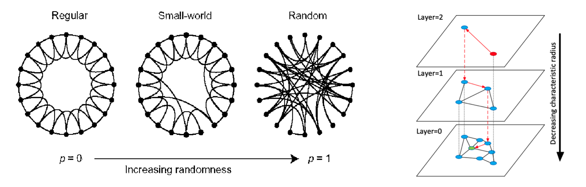

> 데이터 기반의 의사결정을 하거나 AI 알고리즘/rule을 서비스에 추가하기 위해서, 여러 다양한 데이터를 가공하고 DB에 넣고 querying 할 필요가 있습니다. 본 포스팅에서는 이와 관련된 vector DB 사용법 부터 기본적인 SQL query 문, 시각화 방법 등을 기록합니다.

### Qdrant

- Qdrant는 vector DB로 보기보다는 vector search engine으로 봐야 함
- Qdrant $\to$ Collection $\to$ Shard $\to$ Segment. 이 부분은 다른 search engine 들과 비교해보면 좋을듯
- Collections: points(vectors with a payload)의 집합
- Points: vector와 payload(optional)로 구성
- Payload: vector와 함께 저장 가능한 추가 정보
- Search: 기본적으로 dot, cos, euc similarity search 제공
- Index: 필터링 속도 향상을 위한 payload index와 vector search 속도 향상을 위한 vector index 존재

##### Vector Search with HNSW

HNSW는 벡터 검색 알고리즘 중 하나인데 qdrant의 작동을 이해하기 위해 중요합니다. NHN Forward [발표](https://www.youtube.com/watch?v=hCqF4tDPNBw)에서도 잘 설명해주고 있어 이를 참고 하였습니다.

- k-Nearest Neighbor: 검색 대상 벡터와 모든 벡터와의 거리를 계산하여 가장 가까운 k개를 리턴하는 방식
- Approximate Nearest Neighbor (e.g., ANNOY): Spotify에서 개발한 tree-based ANN 기법으로 정확도를 조금 줄이는 대신 검색 속도를 높임. 전체 벡터를 여러 공간으로 분할하여 tree 형태의 자료구조 만들어 검색 수행. 데이터 들어올 때 마다 자료구조 다시 만들어야 해서 데이터 추가시 빌드 비용 높음
- Hierarchical Navigable Small World: [Skip-list](https://en.wikipedia.org/wiki/Skip_list)와 Navigable small world 개념에 영향을 받은 방식
  - 아래 이미지의 오른쪽을 보면 이해가 쉬운데, 초록색 query에 대해서 빨간색 start point 부터 검색을 시작할 때, 한 번 nearest neighbor을 찾을 때 마다 깊은 layer로 내려간다고 생각하면 됨 (greedy search)
  - 데이터 추가가 쉽고, 데이터 경향성에 따라 성능 차이 있음. 클러스링 데이터 대해 응답속도 빠르고 재현율도 높음
- HNSW challenges: (1) 여전히 데이터 index 빌드 타임 소요 (2) 100% 정확도/재현율 보장하지 않음 (3) Sequetial read pattern을 가져서 병렬화 불가능. Qdrant는 이런 점들 보완하기 위해 quatization & oversampling 활용
- Filterable HNSW(payload-based refinement): post-filtering, pre-filtering이 비효율적이기 때문에 in-place filtering 방식으로 구현

<center><p><i>Taken From, Yury A. Malkov, et al.</i></p></center>

##### Python qdrant client

1. Client initialization

```python
from qdrant_client import QdrantClient
from qdrant_client.http.models import Distance, VectorParams, PointStruct
from qdrant_client.http.models import Filter, FieldCondition, MatchValue
client = QdrantClient("localhost", port=6333)
```

2. Collection 생성

```python
client.create_collection(
    collection_name="test_collection",
    vectors_config=VectorParams(size=4, distance=Distance.DOT),
)
```

3. Vector 추가

```python
operation_info = client.upsert(
    collection_name="test_collection",
    wait=True,
    points=[
        PointStruct(id=1, vector=[0.05, 0.61, 0.76, 0.74], payload={"city": "Berlin"}),
        PointStruct(id=2, vector=[0.19, 0.81, 0.75, 0.11], payload={"city": "London"}),
        PointStruct(id=3, vector=[0.36, 0.55, 0.47, 0.94], payload={"city": "Moscow"}),
    ],
)
```

4. Query 실행

```python
# run a query without filter
search_result = client.search(
    collection_name="test_collection", query_vector=[0.2, 0.1, 0.9, 0.7], limit=2
)

# run a query with filter
search_result = client.search(
    collection_name="test_collection",
    query_vector=[0.2, 0.1, 0.9, 0.7],
    query_filter=Filter(must=[FieldCondition(key="city", match=MatchValue(value="London"))]),
    limit=2,
)
```

### SQL

##### Basics

```
SELECT 컬럼
FROM 테이블 
WHERE 조건 
GROUP BY 묶는 기준 
ORDER BY 정렬 기준 
LIKE 문자열 조건 
LIMIT 데이터 출력수
	OFFSET 앞 부터 N개 제외
	...;
```

##### Join

`employees` 테이블과 `departments` 테이블에 대해 ChatGPT가 제공해준 join 예시들

| employee_id | employee_name | department_id |
| ----------- | ------------- | ------------- |
| 1           | John Doe      | 101           |
| 2           | Jane Smith    | 102           |
| 3           | Mike Brown    | NULL          |

| department_id | department_name |
| ------------- | --------------- |
| 101           | Human Resources |
| 102           | Finance         |
| 103           | IT              |

- `INNER JOIN`: 두 테이블에서 일치하는 값이 있는 레코드 반환

```sql
SELECT employees.employee_name, departments.department_name
FROM employees
INNER JOIN departments 
	ON employees.department_id = departments.department_id;
```

| employee_name | department_name |
| ------------- | --------------- |
| John Doe      | Human Resources |
| Jane Smith    | Finance         |

- `LEFT JOIN` (LEFT OUTER JOIN): 왼쪽 테이블의 모든 레코드와 오른쪽 테이블의 일치하는 레코드 반환

```sql
SELECT employees.employee_name, departments.department_name
FROM employees
LEFT JOIN departments
	ON employees.department_id = departments.department_id;
```

| employee_name | department_name |
| ------------- | --------------- |
| John Doe      | Human Resources |
| Jane Smith    | Finance         |
| Mike Brown    | NULL            |

- `RIGHT JOIN` (RIGHT OUTER JOIN): 오른쪽 테이블의 모든 레코드와 왼쪽 테이블의 일치하는 레코드 반환

```sql
SELECT employees.employee_name, departments.department_name
FROM employees
RIGHT JOIN departments 
	ON employees.department_id = departments.department_id;
```

| employee_name | department_name |
| ------------- | --------------- |
| John Doe      | Human Resources |
| Jane Smith    | Finance         |
| NULL          | IT              |

- `OUTER JOIN` (FULL OUTER JOIN): 왼쪽 또는 오른쪽 테이블에 일치하는 항목이 있는 모든 레코드 반환

```sql
SELECT employees.employee_name, departments.department_name
FROM employees
FULL OUTER JOIN departments 
	ON employees.department_id = departments.department_id;
```

| employee_name | department_name |
| ------------- | --------------- |
| John Doe      | Human Resources |
| Jane Smith    | Finance         |
| Mike Brown    | NULL            |
| NULL          | IT              |

- `UNION`: 각 select 의 결과 집합(set)을 결합. UNION을 위한 각 열 개수가 모두 동일해야 하고, 데이터 타입이 유사해야 하며, 순서도 동일해야 함.
  - `UNION`은 중복 rows를 지우므로, 중복을 허용하려면  `UNION ALL` 사용

```sql
SELECT employee_name FROM employees WHERE department_id = 101
UNION
SELECT employee_name FROM employees WHERE department_id = 102;
```

| employee_name |
| ------------- |
| John Doe      |
| Jane Smith    |

##### Advanced

- `LIKE`:  '%'는 N개의 문자, '_'는 1개의 문자를 의미

- `GROUP BY`: 같은 값을 가진 rows를 그룹지어 줌. `COUNT()`, `MAX()`, `MIN()`, `SUM()`, `AVG()`과 같은 집계함수와 주로 같이 사용됨
  - SELECT문의 모든 열이 집계함수이거나 GROUP BY 절에 존재해야함
  - 집계함수 없이 아래 예시 같이 사용하는 경우에 중복을 제거한 unique rows를 확인해볼 수 있음

```sql
select column1, column2, column3, column4
from schema.table
group by 1, 2, 3, 4
```

- `CASE WHEN condition THEN result1 ELSE result2 END`

```sql
SELECT
  employee_name,
  CASE
    WHEN department_id IS NULL THEN 'No Department'
    ELSE (SELECT department_name FROM departments WHERE department_id = employees.department_id)
  END AS department_status
FROM employees;
```

| employee_name | department_status |
| ------------- | ----------------- |
| John Doe      | Human Resources   |
| Jane Smith    | Finance           |
| Mike Brown    | No Department     |

- 이 외에도 `SELECT INTO`, `INSERT INTO`, `EXISTS`, `HAVING`, `ANY`, `ALL` 등 존재
- Key 종류: super key, candidate key, primary key, foreign key, composite key, alternate key
- Normalization: 1NF, 2NF, 3NF, BCNF
- Entity Relationship Diagram(ERC)를 그리기 위해 https://dbdiagram.io/home 활용하면 좋음. 특히, 다대다 관계를 가진 경우에 junction(join) table을 만들어주면 좋음
- Query Optimization: Query plan을 보면 쿼리가 어떻게 실행되고 있는지 확인 가능하여 어떤 부분 튜닝이 필요한지 파악할 수 있음
- 더 찾아볼 내용: Constraints, Referential integrity, etc...

### NoSQL

##### MongoDB

```json
{
    "$and": [
        {
            "key_name1": {"$regex": "some_value1"}
        },
        {
            "key_name2": {
                "$not": {"$regex": "some_value2"}
            }
        },
        {
        		"key_name3": "some_value3"
        }
    ]
}
```

### Advanced Topics

추가 DB 관련 개념들을 아래에 적고, 관련하여 참고될만한 링크들을 기록합니다.

- Master, Transaction, History tables
- Design pattern: ODS, DW, DM, ETL, CDC, EDW, OLAP
- Partitioning, Sharding, Replication, Indexing, Stored procedure
- ETL patterns: https://aws.amazon.com/ko/blogs/big-data/etl-and-elt-design-patterns-for-lake-house-architecture-using-amazon-redshift-part-1/
- Links
  - https://yannichoongs.tistory.com/232
  - https://aiday.tistory.com/123
  - https://code-lab1.tistory.com/202
  - https://hudi.blog/db-partitioning-and-sharding/

### References

- https://qdrant.tech/documentation/quick-start/
- [Qdrant: Getting Started with Qdrant](https://www.youtube.com/watch?v=lFMKUCNw5ac)
- [Qdrant: Image Classification with Qdrant Vector Semantic Search](https://www.youtube.com/watch?v=sNFmN16AM1o)
- [Qdrant: Open Source Vector Search Engine and Vector Database Andrey Vasnetsov](https://www.youtube.com/watch?v=lFMKUCNw5ac)
- [[NHN FORWARD 22] 대충? 거의 정확하다! 벡터 검색 엔진에 ANN HNSW 알고리즘 도입기 (feat. SWIG Golang)](https://www.youtube.com/watch?v=hCqF4tDPNBw)
- Yury A. Malkov, et al. "Efficient and robust approximate nearest neighbor search using Hierarchical Navigable Small World graphs"

