> 2023 가짜연구소 7기: '최신연구동향 쉽고 재미있게 작성하기' 그룹에 참여하여 작성한 글을 이곳에 공유합니다.  Weakly-Supervised Instance Segmentation을 주제로 선정하여 최신 연구 동향에 대한 글을 작성하였습니다. 인공지능에 대한 기본적인 이해, 특히 CV 분야에 대한 이해도가 있는 분들을 독자층으로 하고 있습니다.

### Introduction

컴퓨터 비전 분야의 대표적인 문제들로는 classification, object detection, image segmentation가 존재합니다.

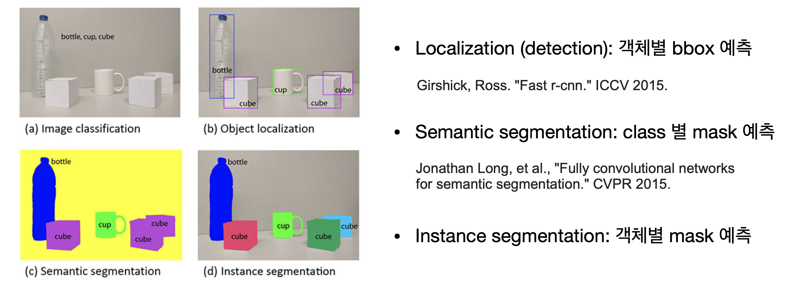

이 중에서 객체별 mask(이미지 내에서 물체가 존재하는 영역)를 예측하는 image segmentation에도 세부적으로 여러 종류가 존재합니다.

- Semantic segmentation: 이미지 내에서 물체들의 종류 별 mask를 예측하는 문제를 말합니다. 예를 들면, 컵이 존재하는 영역의 mask, 큐브가 존재하는 영역의 mask, 페트병이 존재하는 영역의 mask를 각각 예측하면 됩니다.
- Instance segmentation: 동일한 종류의 물체에 대해서도 따로 분할하여 mask를 예측하는 문제를 말합니다. 예를 들어, 첫번째 큐브가 존재하는 영역의 mask, 두번째 큐브가 존재하는 영역의 mask, 세번째 큐브가 존재하는 영역의 mask를 같은 종류라고 하더라도 모두 따로 예측할 수 있어야 합니다.
- Panoptic segmentation: 물체 뿐만 아니라 배경(stuff)에 대한 segmentation을 수행하면서도, 물체 하나하나 또한 mask를 예측하는 문제를 말합니다.

딥러닝 모델을 학습시키기 위해서는 모델이 보고 배울 정답값(GT)이 필요합니다. Segmentation의 GT는 물체가 존재하는 영역의 mask, 그리고 물체에 대한 종류(class) 정보로 구성되어 있습니다. 하지만 이러한 정답 값 말고도, 덜 자세한 형태의 정보를 정답 값으로 사용하는 경우도 있는데 이를 ‘weak-supervision’이라고 말합니다. Bounding boxes, Labeled points, Scribbles 등의 weak-supervision이 존재합니다.

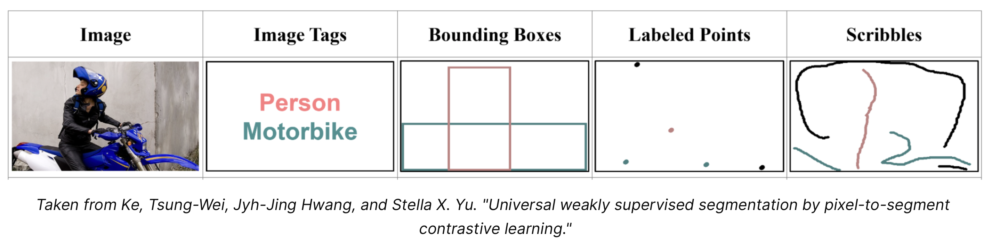

### Instance Segmentation

##### Unsupervised Methods

‘이미지 내에 물체의 mask(contour)를 코드 기반으로 얻어내려면 어떻게 해야할까?’라는 생각을 기반으로 1990년대부터 관련 연구는 계속 진행되어 왔습니다.

딥러닝 이전에는 mask GT 값 기반으로 모델을 업데이트 하는 방식보다는, 이미지 내의 색상, 밝기, 질감 등의 정보를 가지고 영역을 분리하고 mask 예측을 수행하는 unsupervised learning 방식을 많이 사용하곤 했습니다.

- K-means clustering: pixel(or feature)에 대해 k-means clustering 알고리즘을 수행합니다. 같은 cluster에 속하는 image pixel(or feature)를 하나의 더 큰 pixel 단위인 super-pixel로 여기고, super-pixel끼리 영역 분할을 수행합니다.
- Level-set methods: urface function을 어떤 특정 수식(energy function) 기반으로 업데이트 하고, 최종 업데이트의 결과물을 활용하여 segmentation을 수행합니다.
- Graph Cuts (Boykov and Jolly, 2001): 이미지를 하나의 graph로 여기고, pixel은 graph node로 여긴 뒤에, 유사하다고 판단되는 graph node (즉, pixel) 끼리 연결지어 영역을 분할합니다. 후속 논문으로 제일 유명한 논문은 Grabcut (Carsten Rother, et al., 2004) 입니다.
- Multiscale Combinatorial Grouping (MCG) (Pablo Arbela ́ez, et al., 2014): 이미지에 따라 이미지 내에 존재하는 물체의 스케일이 달라지기 때문에, 이런 Multi-scale에 대응이 가능한 방법을 제안하는 방법입니다.

가장 최근에 제안된 Multiscale Combinatorial Grouping (MCG) 알고리즘은 아래의 순서로 작동합니다. 

1. Image의 크기(resolution)를 서로 다르도록 여러 개 만듭니다 (image pyramid)
2. 서로 다른 resolution의 이미지에 대해서 각각 contour map을 형성합니다. Contour map을 형성하기 위해서는 색상, 밝기, 질감 등의 정보들을 사용합니다.
3. 이들의 크기가 모두 일치하도록 다시 재조정합니다. 그러면 contour map은 서로 다르지만 크기는 같은 여러 개의 이미지를 얻어낼 수 있는데, 이들을 적당히 합쳐줘서 하나의 contour map을 갖도록 만듭니다.
4. 그리고 최종적으로 얻어진 countour map을 또 적절히 grouping 합니다. (SVM, random forest 등 활용)

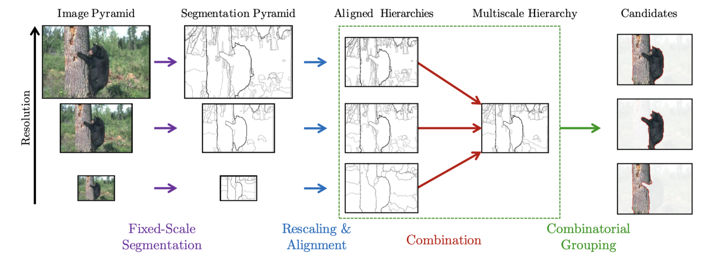

##### Deep Instance Segmentation

딥러닝의 발전에 따라 자연스럽게 segmentation 분야에서도 딥러닝 방식을 적용하려는 시도가 점점 늘어나게 됩니다. Instance segmentation을 딥러닝 기반으로 풀려는 시도는 2014년 Hariharan et al.의 논문 “Simultaneous detection and segmentation (SDS)”에서 찾아볼 수 있는데, 해당 논문은 object detection과 semantic segmentation을 하나의 모델로 합치는 시도를 하였습니다.

이후 연구인 Mask-RCNN에서도 instance 단위로 segmentation을 수행하기 위해서 object detection과 semantic segmentation의 방식을 활용합니다. 즉, object detection 통해 검출한 객체에 대해서 mask 예측을 수행하는 방식입니다. 논문이 발표될 당시 제일 유명한 object detection 모델은 Faster-RCNN(NeurIPS 2015)이었기에, Faster-RCNN의 구조에 mask 예측을 위한 mask head를 장착하였습니다.

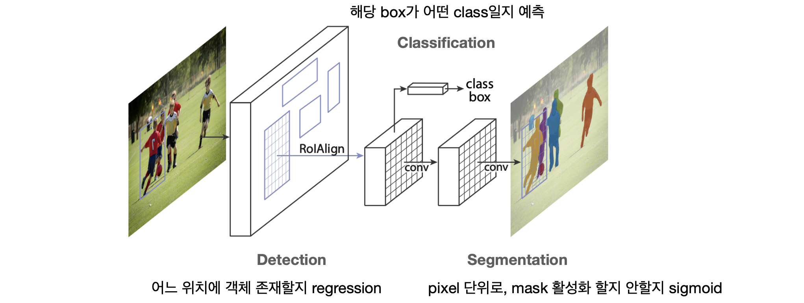

Mask RCNN 이후로 여러 Instance segmentation 모델들이 개발되어왔지만, 이 중에서 성능도 좋고 후속 연구에서 자주 언급되는 논문을 하나 꼽자면 “Conditional Convolutions for Instance Segmentation"(CondInst)을 말할 수 있습니다. 특히, 이후 후술할 BoxInst, BoxTeacher 등에서도 CondInst의 모델 구조를 선택하였습니다.

Mask RCNN은 mask를 만들어내기 위한 mask head를, 여러 입력 값에 대해 공유한다는 특징을 가지고 있습니다. 즉, mask head는 하나로 고정되어 있지만, mask head에 입력되는 입력값만 달라집니다. 하지만 이런 경우에, 만약 A, B라는 사람이 이미지 내에서 매우 가까운 위치에 존재할 때, A사람에 대해 B사람을 배경으로 예측하는 것이 쉽지가 않습니다. 왜냐하면 mask head로 들어오는 입력 값이 서로 차이가 크지 않기 때문입니다. 따라서, 저자들은 입력에 따라서 mask head가 동적으로 변화할 수 있도록 방법을 제안합니다.

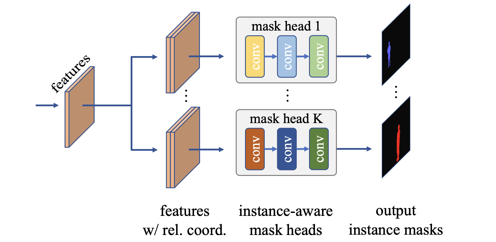

작동 순서는 다음과 같습니다.

1. 이미지 입력을 모델에 넣어 (multi-resolution) feature를 뽑아냅니다.
2. feature 기반으로 instance 마다의 mask head의 weight을 동적으로 결정합니다.
3. mask head와 feature 기반으로 mask 예측을 만들어 냅니다.

Mask RCNN은 물체가 어디에 존재할지 먼저 제안을 하고, 이에 대해 crop을 하고, 이 crop 된 이미지에 대한 mask 예측을 수행하는 과정이 필수적이었습니다. 하지만 CondInst의 경우엔 입력에 대해 모두 다른 mask head를 사용하기 때문에 crop과 같은 기작이 필요하지 않게 되었습니다.

### Weakly-Supervised Instance Segmentation

딥러닝 이전까지의 image segmentation 방식은 unsupervised learning 방식이어서 mask GT가 필요치 않았지만, 딥러닝 이후에 supervised learning 방식을 segmentation에 적용하려다 보니 문제가 생기게 됩니다. Segmentation 모델 학습을 위해서는 mask GT가 필요한데, mask GT를 만들기 위해서는 COCO dataset 기준으로 1개 객체당 평균 79.2초가 소요되었습니다. 비용이 너무 높았기 때문에 더 저렴한 비용의 라벨링 방식이 요구되었습니다.

##### Box-Supervised Methods

Semantic segmentation 분야에서 이런 문제를 타개하고자 한 논문으로는 BoxSup과 Box2Seg가 존재합니다. BoxSup(Jifeng Dai, et al., ICCV 2015)은 box supervision와 MCG를 활용하여 pseudo labels 만들고 이 pseudo label을 활용하여 FCN을 학습시킵니다. Box2Seg(Viveka Kulharia, et al., ECCV 2020)는 box supervision에 GrabCut을 적용해서 mask 예측을 얻어내고 이를 pseudo label로 활용합니다.

BoxSup, Box2Seg 등이 물체의 bounding box 정보를 활용하여 segmentation 모델을 학습시키는 방법을 제안하였지만 이들은 모두 MCG나 GrabCut 같은 unsupervised learning 방식에 의존하였고, box supervision에 적합한 새로운 loss를 제안하지는 않았습니다. 따라서 학습에 여러 세부 단계들이 필요하였고 하나의 통합된 framework 형태가 아니었습니다. 따라서 BoxInst(Zhi Tian, CVPR 2021)의 저자들은 box supervision에 적합한 두 가지 loss term을 제안하여 여러 단계를 거칠 필요 없는 하나의 통합된 형태의 box-supervised method를 제안하였습니다.

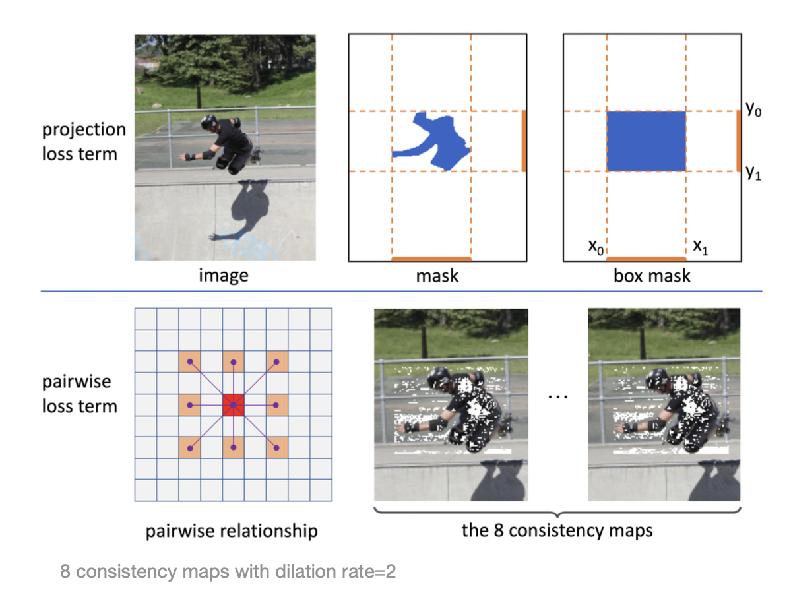

- Projection loss term: 모델의 mask예측의 x, y축 방향 projection과, box GT가 얼마나 비슷한지를 측정합니다.
- Pairwise loss term: 두 pixel 사이의 색상이 유사하면 이 둘이 같은 label을 가지는 경우가 많다고 주장하며, 가까운 pixel에 대해서 유사한 색상을 가지면 같은 객체로 예측되도록 유도합니다.

BoxInst에서 말하는 가정이(’비슷한 색상은 같은 instance 일 것이다’라는 가정) 너무 단순해서, 물체와 배경을 제대로 구분하지 못하는 경우가 존재합니다. 따라서 BoxLevelSet(Wentong Li, et al., ECCV 2022)의 저자들은 다른 방법들을 시도하는데, 과거에 segmentation 분야에서 종종 사용되던 level set method를 가져옵니다. 모델의 예측을 한번에 수행하는게 아니라, level set method를 활용해서 mask 예측을 점진적으로 업데이트하는 과정을 거치고, 업데이트된 최종 mask 예측을 모델 출력으로 사용합니다.

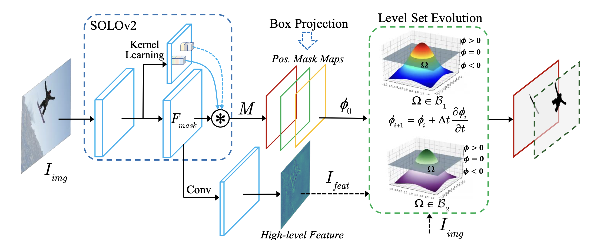

##### Box + Point-Supervised Methods

BoxInst 같은 box-supervised method가 이미 존재하지만, 여전히 성능은 충분하지 않았습니다. 그렇다고 해서 fully-supervised 방식을 사용하기에도 비용이 너무 많이 들게 됩니다. 따라서 Pointly-Supervised Instance Segmentation (Bowen Cheng, et al., CVPR 2022) 논문의 저자들은 box-supervison과 더불어 point-supervision도 사용해보자는 의견을 제시하고, 이 때 point-supervision을 box-supervision 기반으로 만드는 효율적인(빠른) 방법을 제안합니다.

1. 작업자가 Bbox를 만들면, 이 bbox 안에서 랜덤하게 point가 찍힘
2. 이 점에 대해서 작업자가 foreground와 background 라벨링을 또 한 번 수행함
3. 이 작업은 객체당 15초 정도 소요됨. 즉, fully supervised 방식 대비 5배 정도 빠른 라벨링 가능

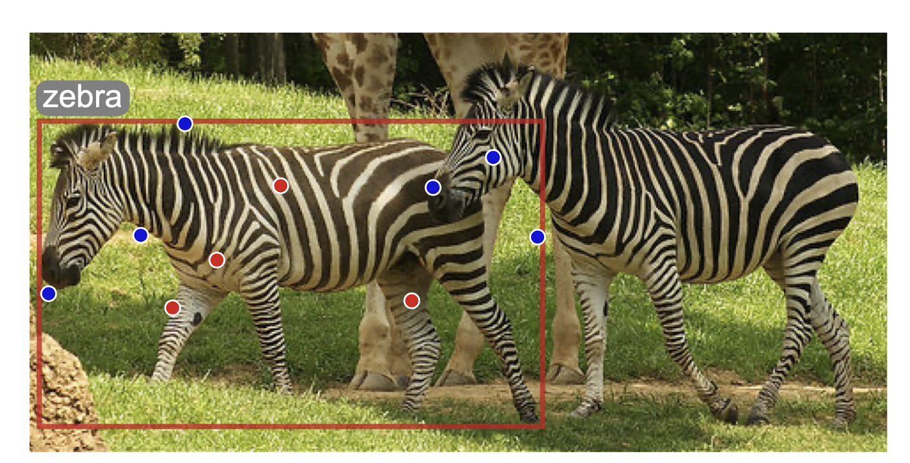

그리고 저자들은 이렇게 만든 point supervision이 다른 '모든' instance segmentation pipeline에도 적용 가능케하는 방법을 고안합니다. 즉, 이 point supervision을 가지고 mask loss를 계산하는 방법을 고안하여 제안합니다. 이 방법을 통해 fully supervised의 94~98% 정도 성능을 달성하였습니다.

1. 예측은 기존 instance segmentation의 모델과 동일하게 수행한 다음,
2. GT points에 대해서 loss 계산을 하는데, prediction points는 prediction mask들의 bilinear interpolation을 사용. 이 방법은 기존 instance segmentation 모델에 대해 구조상으로는 변경될 것이 따로 없음

##### Point-Supervised Methods

이 외에도 Point만을 사용해서 instance segmentation 모델을 학습시키는 방법들도 존재한다고 합니다 (읽지는 못했습니다).

- WISE-Net (Issam H Laradji, et al., ICIP 2020)
- BESTIE (Beomyoung Kim, et al., CVPR 2022)
- AttentionShift (Mingxiang Liao, et al., CVPR 2023)

### Semi-Supervised Methods w. Weak-Supervision

BoxInst 좋지만 이제는 full-supervision 없이 모델 성능을 더욱 발전시킬 수 있는 방법이 없을까에 대한 고민도 필요한 시기가 되었습니다. 이에 대해 BoxTeacher(Tianheng Cheng, CVPR 2023)의 저자들은 ‘high-quality pseudo label’을 만들어내는 것이 성능 향상에 도움 될 것이라 주장합니다. 처음에는 그냥 BoxInst의 예측을 정답으로 여겨서 instance segmentation 모델을 학습시키면 안되나?라는 생각에 그렇게 시도해봤더니(figure 상에서 self-training으로 표기), BoxInst 보다 성능이 낮아져서 다른 방법을 고안하게 됩니다.

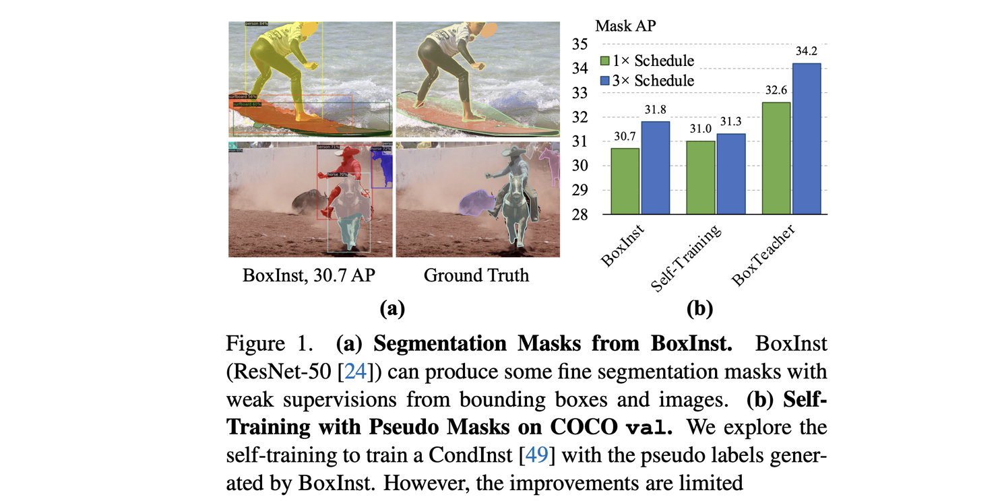

새로 제안한 방법은 다음과 같습니다.

1. Teacher - Student 구조로 모델 학습시키고(Backbone으로는 CondInst 활용), 이미지 입력에 strong augmentation 적용
2. 모든 모델 예측을 pseudo label로 사용하는게 아니라, box GT와 충분히 비슷하고(high IoU), 모델이 강한 확신 보이는(high confidence) 예측만 필터링해서 pseudo label로 사용
3. 추가적으로, 예측 noise 줄이는 loss 고안해서 적용

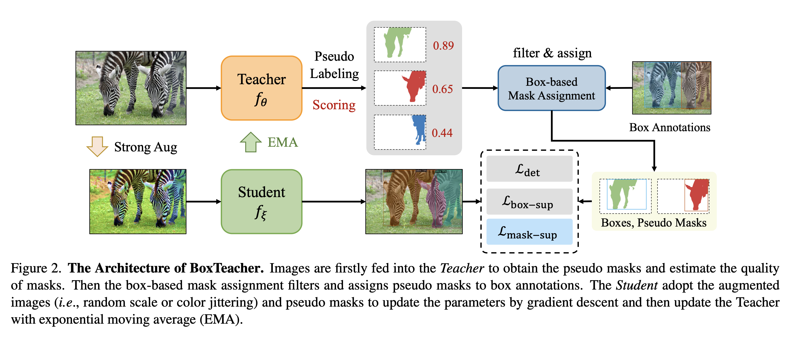

BoxTeacher와 동일한 시기에 진행된 연구로는, 예측 기반으로 pseudo-label을 만든 후 self-training 하자고 주장하는 논문인 SIM(Ruihuang Li, et al., CVPR 2023)도 있습니다. 심지어 backbone도 BoxTeacher 논문과 동일하게 CondInst 활용합니다. 두 논문의 motiviation이 완전히 동일하다고 생각하시면 됩니다.

여기서도 역시나 BoxInst 예측을 그대로 pseudo label로 활용하면 안되는 이유에 대해서 언급합니다. BoxInst에서 사용하는 pair-wise affinity loss는 비슷한 색상의 foreground, background 구분 잘 하지 못하는 문제가 발생하기 때문입니다. 이에 따라, semantic(class) level로 지식 공유하면 품질 좋아질 것이라는 생각을 하게 되지만, 당연하게도 semantic segmentation mask를 가지고는 각각의 객체를 구분하지는 못합니다. Semantic segmentation 방식은 같은 class면 다른 객체여도 모두 하나의 mask로 예측하기 때문입니다.

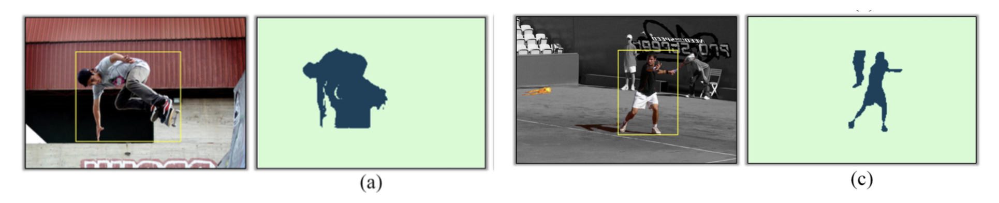

따라서 저자들은 semantic mask와 instance mask 둘 다 활용해서 pseudo-label 만들자는 생각을 하게됩니다. 대략적인 동작은 다음과 같습니다.

1. 잘 학습된 instance segmentation 모델(CondInst or Mask2Former) 구비
2. Class-wise Prototypes라는 것 활용해서 semantic(class) mask 예측
3. Instance mask 예측
4. Semantic mask와 instance mask를 적절히 조합하여 최종 pseudo mask 얻음
5. 이 pseudo mask를 가지고 모델 학습
6. 이 외에도 Copy-paste라는 데이터 증강 방법도 사용…

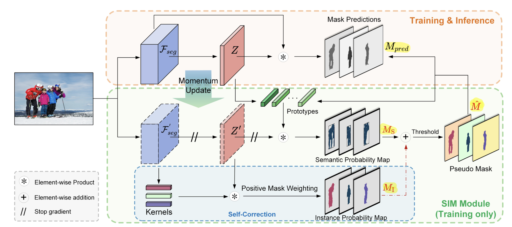

Instance segmentation 모델의 예측으로 pseudo-label을 만들 때 생기는 문제점이 False-Negative(Missing), False-Positive(Noise) 케이스들입니다. 즉, 객체를 ‘아예 잡지 못하거나’, ‘잘못된 영역을 객체라고 잡는 문제’가 발생할 수 있습니다.

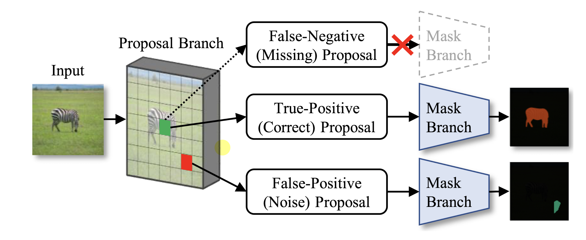

따라서 The Devil is in the Points (Beomyoung Kim, et al., CVPR 2023) 논문의 저자들은 이 두 가지 False case를 해결해준다면 성능을 높여줄 수 있을 것이라 생각하였고, 이를 위해서 (라벨링에 cost가 적은) point label을 활용하게 됩니다.

1. 만약 dataset의 10%만 fully labeled 되어있다면, 나머지 90%는 point supervision을 부여함. 당연히 이 부분은 사람이 만들어야하지만, 객체 하나 당 point 하나이기 때문에 비용은 적음
2. (Step 1): Fully-labeled data로 먼저 Teacher network와 MaskRefineNet이라는 모듈을 학습함.
   - MaskRefineNet: `Teacher의 mask 예측`, `이미지`, `Instance Point`를 입력으로 받아서, mask 예측을 개선시키는 네트워크임. 즉, Point label을 사용해서 더 좋은 예측으로 mask를 업데이트!
   - Teacher 학습시에는 데이터셋에 point supervision이 존재하지 않기 때문에, mask 예측의 center point를 입력 point로 사용
   - Student 학습시에는 데이터셋에 point supervision이 존재하기 때문에 해당 point supervision 활용
3. (Step 2): Teacher의 예측을, MaskRefineNet 기반으로 개선시킨 후에, 개선된 mask를 pseudo-label로 사용함
4. 이 외에도 adaptive strategy라는 pseudo label 좀 더 보완하는 방법도 추가 제안함

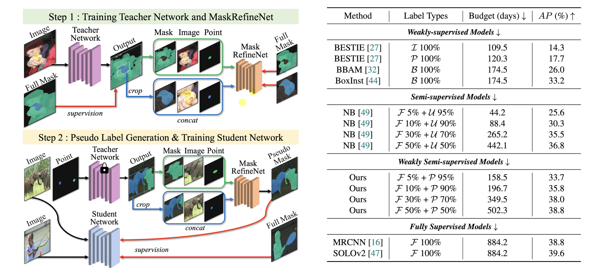

결과적으로 50%의 fully-supervised data만 가지고도 fully-supervised method 성능에 도달하였습니다. (다만, 오해하면 안되는게, 나머지 50%는 point supervision 추가적으로 제공한 것입니다). 또한 5%만 가지고도 기존 semi-supervised SOTA를 훨씬 뛰어넘었습니다.

### References

- Boykov, Yuri Y., and M-P. Jolly. "Interactive graph cuts for optimal boundary & region segmentation of objects in ND images." *Proceedings eighth IEEE international conference on computer vision. ICCV 2001*. Vol. 1. IEEE, 2001.
- Rother, Carsten, Vladimir Kolmogorov, and Andrew Blake. "" GrabCut" interactive foreground extraction using iterated graph cuts." *ACM transactions on graphics (TOG)* 23.3 (2004): 309-314.
- Pablo Arbeláez, et al. "Multiscale combinatorial grouping." *Proceedings of the IEEE conference on computer vision and pattern recognition*. 2014.
- Bharath Hariharan, et al. "Simultaneous detection and segmentation." *Computer Vision–ECCV 2014: 13th European Conference, Zurich, Switzerland, September 6-12, 2014, Proceedings, Part VII 13*. Springer International Publishing, 2014.
- Kaiming He, et al. "Mask r-cnn." *Proceedings of the IEEE international conference on computer vision*. 2017.
- Zhi Tian, Chunhua Shen, and Hao Chen. "Conditional convolutions for instance segmentation." *Computer Vision–ECCV 2020: 16th European Conference, Glasgow, UK, August 23–28, 2020, Proceedings, Part I 16*. Springer International Publishing, 2020.
- Jifeng Dai, Kaiming He, and Jian Sun. "Boxsup: Exploiting bounding boxes to supervise convolutional networks for semantic segmentation." *Proceedings of the IEEE international conference on computer vision*. 2015.
- Viveka Kulharia, et al. "Box2seg: Attention weighted loss and discriminative feature learning for weakly supervised segmentation." *European Conference on Computer Vision*. Cham: Springer International Publishing, 2020.
- Zhi Tian, et al. "Boxinst: High-performance instance segmentation with box annotations." *Proceedings of the IEEE/CVF Conference on Computer Vision and Pattern Recognition*. 2021.
- Wentong Li, et al. "Box-supervised instance segmentation with level set evolution." *European conference on computer vision*. Cham: Springer Nature Switzerland, 2022.
- Bowen Cheng, Omkar Parkhi, and Alexander Kirillov. "Pointly-supervised instance segmentation." *Proceedings of the IEEE/CVF Conference on Computer Vision and Pattern Recognition*. 2022.
- Tianheng Cheng, et al. "Boxteacher: Exploring high-quality pseudo labels for weakly supervised instance segmentation." *Proceedings of the IEEE/CVF Conference on Computer Vision and Pattern Recognition*. 2023.
- Ruihuang Li, et al. "SIM: Semantic-aware Instance Mask Generation for Box-Supervised Instance Segmentation." *Proceedings of the IEEE/CVF Conference on Computer Vision and Pattern Recognition*. 2023.
- Beomyoung Kim, et al. "The Devil is in the Points: Weakly Semi-Supervised Instance Segmentation via Point-Guided Mask Representation." *Proceedings of the IEEE/CVF Conference on Computer Vision and Pattern Recognition*. 2023.
