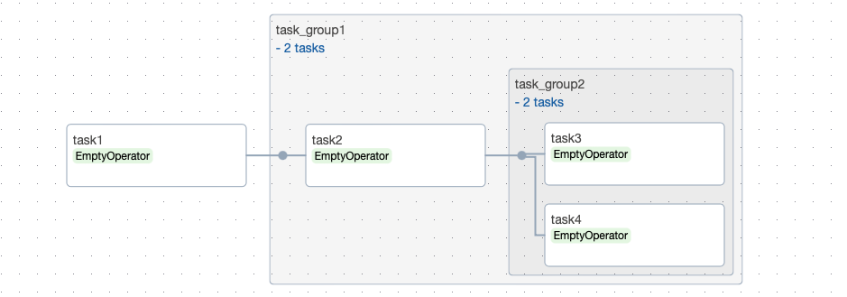
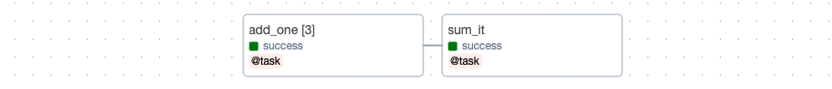
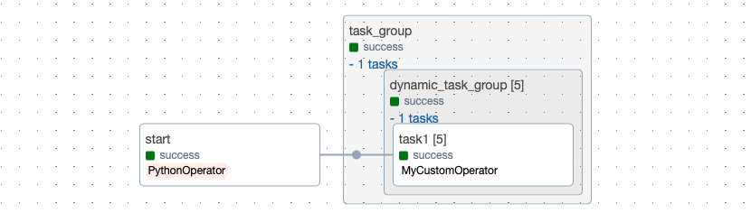

### TaskGroups

Airflow DAG를 짤 때 여러 task를 연결시키다 보면 graph view가 많이 복잡해지곤 합니다. 이를 해결하기 위해서 airflow에서는 task들을 hierarchical groups으로 정돈할 수 있도록 돕는 TaskGroup이라는 기능을 제공하고 있습니다. 아래의 샘플코드처럼 `task_group` 데커레이터를 통해 간단하게 사용해볼 수 있습니다.

```python
@dag(dag_id="hello_world", start_date=datetime(2023, 12, 1, tzinfo=pendulum.timezone("Asia/Seoul")))
def hello_world():
    task1 = EmptyOperator(task_id="task1")
    @task_group(group_id="task_group1")
    def task_group1():
        task2 = EmptyOperator(task_id="task2")   

        @task_group(group_id="task_group2")
        def task_group2():
            task3 = EmptyOperator(task_id="task3")  
            task4 = EmptyOperator(task_id="task4") 
            [task3, task4]
        
        [task2 >> task_group2()]

    [task1 >> task_group1()]

dag = hello_world()
```

Airflow graph UI에서 해당 task group을 클릭하여 내부 요소들을 열고 닫아가며 확인할 수 있습니다.



### Dynamic Task Mapping

또 다른 유용한 기능으로는 dynamic task mapping이 존재합니다. Task의 수를 사전에 미리 알 필요 없이, runtime에서 주어진 data를 기반으로 동적으로 병렬 task를 생성하고 싶을 때 dynamic task mapping를 사용해볼수 있습니다. 제 경우에는 ETL 프로세스에서 여러 조건별 데이터 배치 처리가 필요할 때 dynamic task mapping을 활용하고 있습니다.  

샘플코드처럼 `expand()` method를 통해 간단하게 사용해볼 수 있습니다. 아래 예시는 airflow 공식 문서의 예제입니다.

```python
@dag(dag_id="dynamic_dag", start_date=datetime(2023, 12, 1, tzinfo=pendulum.timezone("Asia/Seoul")))
def dynamic_dag():
    @task
    def add_one(x: int):
        return x + 1

    @task
    def sum_it(values):
        total = sum(values)
        print(f"Total was {total}")

    added_values = add_one.expand(x=[1, 2, 3])
    sum_it(added_values)

dag = dynamic_dag()
```



### Dynamic Task Mapping with TaskGroups

동일한 방식으로 task 뿐만 아니라 task group에 대한 dynamic task mapping 또한 가능합니다. 

```python
def set_mapped_args():
    dummy_mapped_args = [1, 2, 3, 4, 5]
    Variable.set("output_of_start", dummy_mapped_args, serialize_json=True)

@dag(
    dag_id="dynamic_task_group_dag",
    schedule="0 0 * * *",  # i.e., daily
    catchup=False,
    start_date=datetime(2023, 12, 1, tzinfo=pendulum.timezone("Asia/Seoul"))
)
def dynamic_task_group_dag():
    start = PythonOperator(
        task_id="start",
        python_callable=set_mapped_args,
    )

    @task_group(group_id="task_group")
    def task_group_node():
        mapped_args = Variable.get("output_of_start", default_var=[], deserialize_json=True)

        @task_group(group_id="dynamic_task_group")
        def dynamic_task_group_node(mapped_args):
            task1 = MyCustomOperator(task_id='task1', mapped_args=mapped_args)
            task1

        if mapped_args:
            dynamic_task_group_node.expand(mapped_args=mapped_args)

    [start >> task_group_node()]

dag = dynamic_task_group_dag()
```



다만 이 때 주의할 점이 있는데, expand를 통해 task group에 전달된 값은 실제로 dag가 수행되기 전까지는 MappedArgument object로 real value가 아닙니다. 해당 task group이 실제로 실행될 때에 비로소 real value를 resolve할 수 있는데, 저의 경우에는 아래처럼 MappedArgument의 resolve method를 활용하여 real value를 runtime에 얻어내는 방식으로 DAG 코드를 작성하였습니다.

```python
from airflow.models.baseoperator import BaseOperator

class MyCustomOperator(BaseOperator):

    def __init__(self, mapped_args, **kwargs) -> None:
        super().__init__(**kwargs)
        self.mapped_args = mapped_args

    def execute(self, context):
        self.cur_value = self.mapped_args.resolve(context)
```

### Reference

- https://airflow.apache.org/docs/apache-airflow/stable/authoring-and-scheduling/dynamic-task-mapping.html#dynamic-task-mapping
- https://airflow.apache.org/docs/apache-airflow/stable/authoring-and-scheduling/dynamic-task-mapping.html#dynamic-task-mapping
- https://airflow.apache.org/docs/apache-airflow/stable/core-concepts/dags.html#taskgroups

