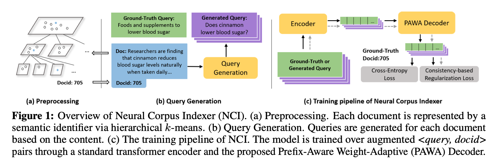
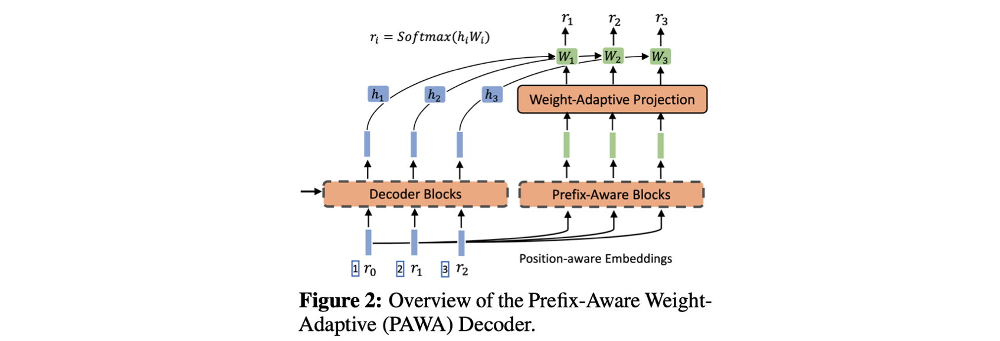
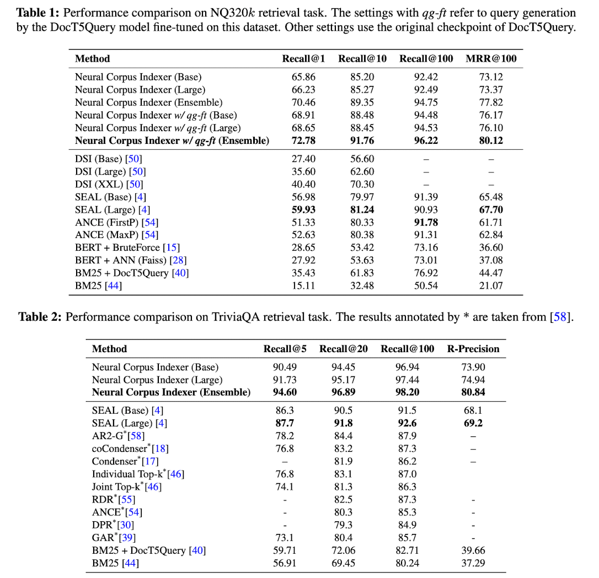

> NeurIPS 2022에서 발표된 A Neural Corpus Indexer for Document Retrieval 논문을 정리합니다.

### Introduction

Document retrieval과 ranking은 웹 검색 엔진에 있어서 key stage들입니다. 본 논문은 document retrieval을 딥러닝 기반으로 수행하는 end-to-end 방법을 제안하며 이전 연구 대비 큰 성능 향상을 이뤄냈습니다.

Document retrieval은 일반적으로 term-based 방법과 semantic-based 방법으로 나뉩니다. Term-based 방법은 TF-IDF을 생각해볼 수 있는데 문서의 semantic 정보를 뽑아내기 힘들며 비슷한 문서여도 다른 단어를 사용했다면 검색에 실패할 수 있습니다. Semantic-based 방법의 경우엔 검색 query와 문서의 representation을 기반의 ANN(apporximate. Nearest Neighbor)이 대표적인데 이 또한 하나의 벡터로 문서의 semantic을 모두 담아내기 어렵고 query와 문서를 같은 space 상에 표현해야만 합니다.

따라서 본 논문의 저자들은 이러한 단점을 보완하여 높은 성능을 달성하기위한 몇가지 정교한 방법들을 제안합니다.

1. Semantic identifier: hierarchical k-means를 활용하여 문서의 semantic을 잘 담아낸 identifier(docid)를 만듭니다. 
2. Query generation: 문서를 잘 표현하는 query들을 생성하여 모델 학습에 활용합니다.
3. Prefix-aware weight-adaptive decoder: hierarchy level에 따라 decoder weight을 조절합니다.
4. Consistency-based regularization loss: 학습에서의 over-fitting을 방지합니다.

### Neural Corpus Indexer

<i>Taken From Wang et al.</i>

Neural corpus indexer(NCI)는 sequence-to-sequence 모델입니다. NCI는 검색 query를 입력으로 받고, document identifier(docid)를 출력합니다. 따라서 많은 양의 \<query, docid\> pair로 모델 학습이 수행됩니다.

##### Document Representation with Semantic Identifiers

먼저 모든 문서에 대해 docid를 부여해야 합니다. 저자들은 비슷한 document들 끼리 가까운 docid를 가지기를 원했고 이를 위해서 hierarchical clustering을 활용합니다.

일단 먼저 모든 문서를 BERT 기반으로 벡터화합니다. 그리고 해당 document 벡터들에 hierarchical k-means 알고리즘을 적용합니다. 그러면 $r_i \in [0,k)$, routing path는 $l=\{r_0, r_1, ..., r_m\}$이라고 할 때, 모든 문서를 root $r_0$으로 부터 시작하는 tree structure로 표현할 수 있게 됩니다. 이해를 돕기위해 예시를 들어보자면, docid=012와 docid=013은 level 0과 1에서 같은 군집에 속하는 문서입니다. $c$가 한 군집에 존재하는 document 수라고 할 때 모든 실험에서 $k=30, c=30$를 사용하였다고 합니다.

##### Query Generation

오직 검색 query만 입력으로 받아 정답 document identifier를 잘 찾아내기 위해서는, 어떻게해야 해당 벡터가 document semantic을 잘 알아채고 identifier를 만들어낼 수 있을지를 고민해야합니다.

이를 위해 학습에서부터 document semantic을 모델에 잘 흘려보내줄 필요가 있는데, 이를 위해 저자들은 document 정보를 입력으로 받아서 여러개의 query를 만들어내는 query generation 단계를 제안합니다. 여기서는 DocT5Query와 Document As Query라는 방법을 활용했으며 이렇게 생성된 query들은 training loss에 활용됩니다 (cross-entropy와 consistency-based loss에서 모두 활용).

##### Prefix-Aware Weight-Adaptive Decoder

<i>Taken From Wang et al.</i>

주어진 입력 query에 대해 docid를 예측하는 과정은 아래 식으로 표현됩니다.
$$
p(l \mid x, \theta)=\prod_{i=1}^m p\left(r_i \mid x, r_1, r_2, \ldots, r_{i-1}, \theta_i\right)
$$
$3_15_25_3$에서 $5_2$와 $5_3$이 서로 다른 것이고, $1_11_25_3$과 $2_14_25_3$가 서로 다른 것 처럼, tree level에 따라, prefix에 따라 토큰이 달라지는 것을 인지하기 위해 $3_15_25_3$과 같은 identifier를 (1,3)(2,5)(3,5) 형태로 먼저 표현합니다.

그 뒤에는 decoder가 서로 다른 prefix를 인지할 수 있도록 만들기 위해서, prefix에 따라 달라지는 weight $W_{ada}$을 만들고 이를 토큰 임베딩과 곱해주고 이 값에 softmax를 취해서 tree level별 docid를 뽑아냅니다.
$$
W_{a d a}^i=\text { AdaptiveDecoder }\left(e ; r_1, r_2, \ldots, r_{i-1}\right) W_i
$$

##### Training and Inference

학습에서는 검색 query와 query generation을 통해 생성된 document query 모두에 대해서 consistency-based regularization과 cross-entropy loss를 적용하여 모델을 학습시킵니다. 
$$
\mathcal{L}_{\text {reg }}=-\log \frac{\exp \left(\operatorname{sim}\left(\mathbf{z}_{i, 1}, \mathbf{z}_{i, 2}\right) / \tau\right)}{\sum_{k=1, k \neq 2}^{2 Q} \exp \left(\operatorname{sim}\left(\left(\mathbf{z}_{i, 1}, \mathbf{z}_{i, k}\right) / \tau\right)\right.}
$$

$$
\mathcal{L}(\theta)=\sum_{(q, d) \in \mathcal{D}}\left(\log p(d \mid E(q), \theta)+\alpha \mathcal{L}_{r e g}\right)
$$

추론 단계에서는 먼저 encoder network를 통해 query embedding을 뽑아낸 뒤에, decoder network에서 beam search를 수행합니다. Beam search에 대한 설명은 [이곳](https://en.wikipedia.org/wiki/Beam_search), 자세한 pseudocode은 논문의 Appendix B3에서 확인하실 수 있습니다.

### Experiments

데이터셋은 Natural Questions와 TriviaQA라는 데이터셋을 사용하였고, 각각 320k, 78k의 query-document pair로 이루어져있습니다. Metric으로는 Recall@N, MRR(Mean Reciprocal Rank), R-precision을 사용하였는데, 모두 주어진 query 기반으로 얼마나 문서를 잘 찾아내느냐를 측정하는 metric입니다. 

<i>Taken From Wang et al.</i>

### Conclusion

NCI를 통해 성능상으로 큰 발전을 이뤄낼 수 있었지만 여전히 몇 가지 한계점이 존재합니다. 첫번째는 오픈 데이터셋 수준이 아니라 실제 web scale에서는 document의 수가 훨씬 많아지기 때문에 더 큰 model capacity가 필요하다는 점입니다. 두번째는 real-time으로 사용하기 위해서 빠른 inference 속도가 요구된다는 점입니다. 마지막으로는, 새문서가 시스템에 추가되는 과정이 까다롭다는 점입니다. 문서가 추가될 때 마다 hierarchical clustering을 통해 문서마다의 semantic identifier를 재설정해주는 과정이 필요합니다.

