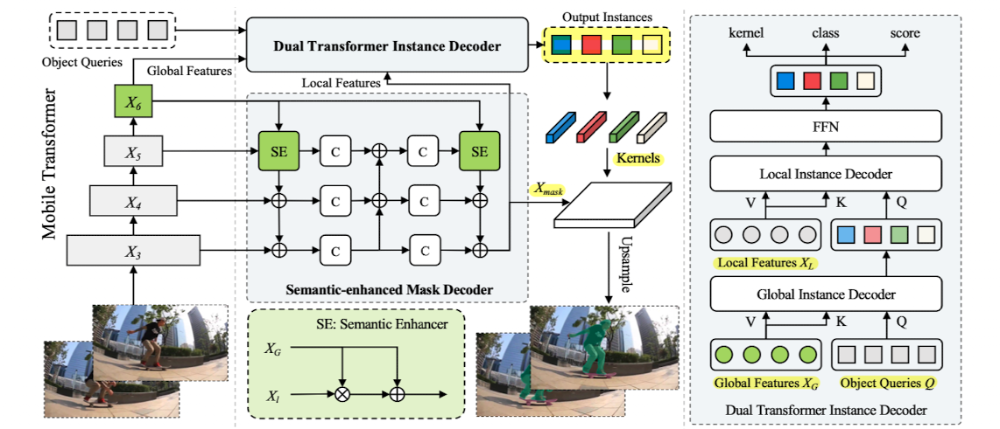
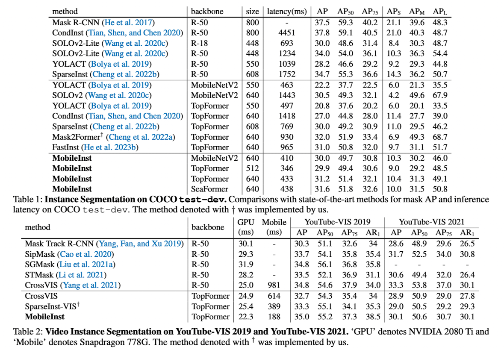

> AAAI 2024에서 발표된 "MobileInst: Video Instance Segmentation on the Mobile" 논문을 정리합니다.

### Introduction

Video 데이터에 대한 instance segmentation을 모바일 환경에서 수행하는 것은 중요하지만 아직 어려운 task 중 하나입니다. Instance에 대한 mask 추론을 frame 단위로 수행하는 것은 많은 연산량과 메모리를 요구하기도 하고, 또 해당 instance/object를 트래킹하는 것도 쉽지 않기 때문입니다. 따라서 본 논문에서는 모바일 환경에서의 video instance segmentation에 특화된 MobileInst라는 방법을 제안합니다. 

1. [*Architecture*] Multi-level semantic feature를 활용하는 mobile vision transformer 구조(e.g., TopFormer, SeaFormer)를 채택합니다.
2. [*Efficiency*] Query-based(e.g., DETR) dual-transformer instance decoder와 semantic-enhanced mask decoder 구조를 제안합니다.
3. [*Object tracking*] kernel reuse 방법, 그리고 kernel association 방법을 활용합니다.

### MobileInst

##### Overall Architecture

MobileInst는 먼저, multi-level pyramid features를 활용하기 위해서 mobile transformer 구조를 활용합니다. 앞서 제안된 TopFormer(Zhang et al.)과 SeaFormer(Wan et al.)의 구조를 따라 conv block과 transformer block의 연결 구조로 이루어져있고, local feature와 global feature를 뽑아 이를 모두 활용하게 됩니다.

1. 이미지를 입력으로 받고 local feature($X_3,X_4, X_5$)와 global feature($X_6$)를 추출합니다.
2. Dual transformer instance decoder에는 global feature를, Semantic-enhanced mask decoder에는 multi-level features (local & global feature)를 전달합니다.

##### Dual Transformer Instance Decoder

구조상 mobile transformer backbone의 다음 단계인 dual transformer는, DETR과 같은 query-based detector의 object query 방법을 활용합니다. DETR에서 제안된 object query는 이전의 dense detector 방법론들과 다르게 NMS나 RPN 같은 hand-designed, heuristic post-processing 방법을 제거함으로써 추론 단계의 효율성을 높일 수 있는 방법입니다. (DETR과 관련된 설명은 [이전 포스팅](https://yuhodots.github.io/deeplearning/23-08-19/#detr-detection-transformer)을 참고하시면 좋습니다.)

Object query를 instance segmentation task에서 활용하고자 하는 이유는 다음과 같습니다.

1. 이미지상 전면(foreground)에 존재하는 visual instance를 잘 포착하는 방향으로 학습되기 때문에 instance feature를 담고있는 것이 보장됩니다.
2. 하나의 query에 하나의 object가 매칭되도록 학습되기 때문에, N개의 query 예측은 N개의 instance 예측을 의미하게 됩니다.
3. 서로 다른 인접한 frame에서의 동일한 object query는 동일한 instance를 포착/표현하는 경향을 보입니다. 

하지만 6-stage인 기존 decoder를 그대로 사용하는 것은 계산이 오래 걸리고, 또 단순히 layer 수만 줄이는 것은 성능 저하를 가져오기 떄문에, 기존 DETR의 decoder 구조를, global instance decoder와 local instance decoder로 구성된 2-stage dual decoder 형태로 변경하게 됩니다.

- Global instance decoder: global feature를 value와 key로, object query를 query로 두고 어텐션 수행. 이 단계를 통해, global feature가 가지고 있는 high-level semantic과 coarse localization 정보를 object query로 흘려보내줌
- Local instance decoder: local feature를 value와 key로, object query를 query로 두고 어텐션 수행. 여기서의 local feature는 semantic-enhanced mask decoder의 output인 mask feature를 사용 (다만 효율성을 위해 1/64로 downsampling)

##### Semantic-enhanced Mask Decoder

여러 스케일의 물체에 대응하기 위해서, FPN처럼 top-down, bottom-up multi-scale fusion을 활용합니다. 저자들은 contextual 정보를 강화하기 위해 semantic enhancer라는 모듈을 넣어 global feature를 충분히 섞어준다고 주장하는데, 해당 모듈이 가지는 의미나 novelty에 대해서는 명확히 언급된 내용이 없어, 개인적으로는 FPN과 큰 차이를 가지지 않는 구조라고 생각합니다. 

Figure 상에서 C는 3x3 covolution을 의미하며, 출력된 $X_\text{mask}$는 1/8 scale을 가집니다. $X_\text{mask}$​와 kernel을 통해 최종 segmentation mask를 얻게됩니다.

##### Tracking with Kernel Reuse and Association

DETR 논문에서 잠깐 언급되었던 것처럼 동일한 query는 동일한 영역/물체를 표현하는 경향이 있기 때문에, mask kernel을 동일한 instance를 트래킹하기 위한 장치로써 활용할 수 있습니다. 따라서 저자들은 frame 마다 새로 kernel을 계산하는 것이 아니라, 인접한 frame에 대해서는 이전 frame과 동일한 kernel을 사용하는 kernel reuse 방법을 소개합니다.
$$
\begin{aligned}
M^t & =K^t \cdot X_{\text {mask }}^t \\
M^{t+i} & =K^t \cdot X_{\text {mask }}^{t+i}, i \in(0, \ldots, T-1)
\end{aligned}
$$
하지만 해당 방법은 long-time sequence나 급격한 변화가 있는 frame에 대해서는 제대로 동작하는 것이 보장되지 않습니다. 따라서 이를 해결하기 위해 MinVIS(Huang, Yu, and Anadkumer) 논문에서 제안된 query matching 방법을 kernel에 적용합니다(i.e., kernel association). (*query matching에 대한 내용 추가하기*)

##### Temporal Training via Query Passing

추론에서 뿐만 아니라 학습 단계에서도 temporal information을 충분히 활용할 수 있도록 모델을 학습시는 방법도 제안합니다. 즉, 추론 단계에서 인접한 frame에 대해서는 kernel을 그대로 사용할 것이기 때문에 이를 학습때부터 잘 배우도록 유도하는 과정입니다. 

1. Frame $t$​와 $t+\delta$를 랜덤 샘플링합니다. 
2. Global feature에 대해서는 $t$ 시점의 결과를 사용하고, local feature와 mask feature에 대해서는 $t+\delta$ 시점의 결과를 사용하여, mask output을 얻어냅니다. 
3. 해당 mask output을 $t+\delta$ 시점의 target mask와 비교하여 loss를 계산하고, 모델을 학습시킵니다. 

##### Loss Function

Loss function으로는 DETR의 bipartite matching loss와 SparseInst(Cheng et al)의 image/video instance segmentation loss를 그대로 사용합니다. 
$$
\mathcal{L}=\lambda_c \cdot \mathcal{L}_{c l s}+\lambda_{m a s k} \cdot \mathcal{L}_{m a s k}+\lambda_{o b j} \cdot \mathcal{L}_{o b j}
$$

### Experiments

COCO test-dev와 YouTube-VIS 데이터셋에 대해 실험을 수행하였습니다.

