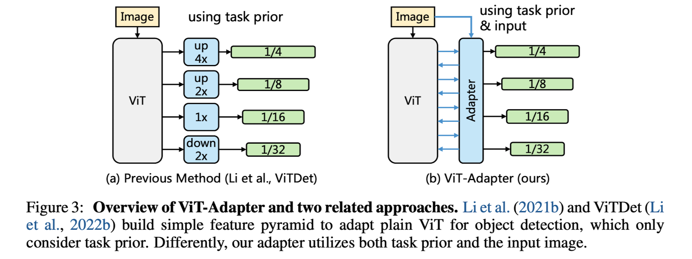
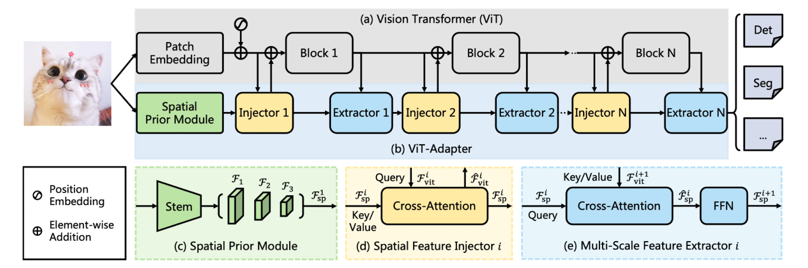
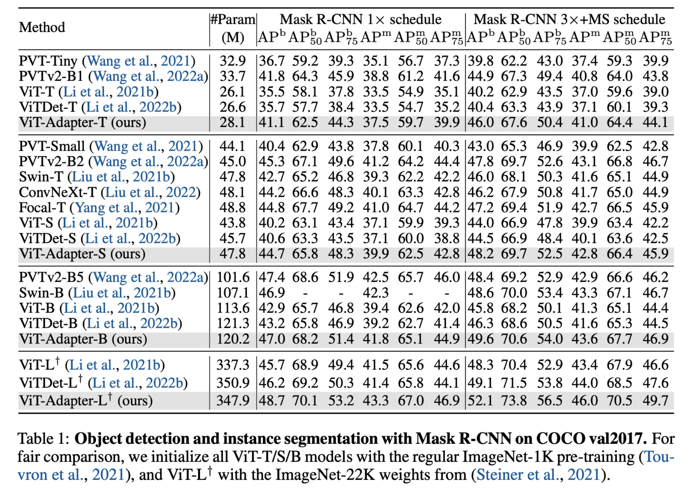
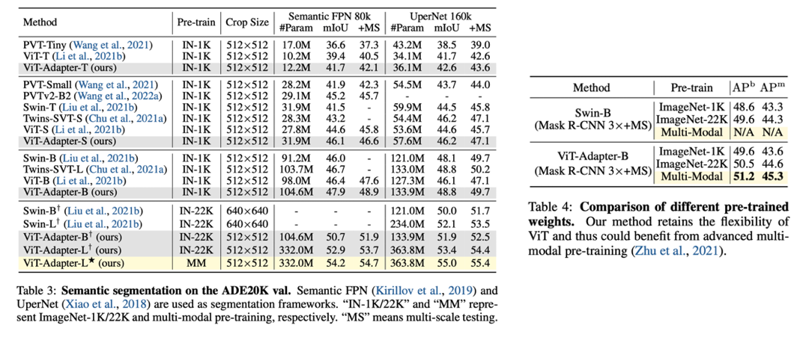

> ICLR 2023 Spotlight으로 선정된 Vision Transformer Adapter for Dense Predictions 논문을 정리합니다.

### Introduction

ViT가 고안된 이후로 여러 vision task에서도 transformer 구조를 적극적으로 활용하고 있습니다. 하지만 object detection이나 image segmentation 같은 dense prediction task에서는 plain(vanilla) ViT가 성능이 그렇게 좋지는 않습니다. 왜냐하면 dense prediction task에 대해서는 multi-resolution feature와 spatial feature를 잘 뽑아내는 것이 중요한데, ViT는 image-related prior knowledge가 따로 없기 때문입니다. 그래서 일반적으로 vision-specific task에서는 SwinT와 같은 image-related inductive bias가 적용된 모델을 주로 사용하곤 합니다.

하지만 이런 SwinT 부류는 transfer learning시 전체 모델을 fine-tuning 해야한다는 단점과, pre-training 단계에서도 SwinT 기반으로 pre-training된 weight만 사용해야 한다는 한계가 존재합니다. 따라서 본 논문의 저자들은 vision-specific task의 성능을 높이면서도 ViT의 flexibility를 그대로 유지하는 ViT Adapter 라는 구조를 제안합니다. ViT 구조를 그대로 가져가게 되면, input-data의 형태에 대한 가정이 따로 없기 때문에 여러 multi-modal data를 pre-training 단계에서 활용할 수 있고, 이에 따라 semantic-rich representation을 학습하는 것도 가능해집니다. 

### Related Works

##### ViTDet

ViT 구조를 dense prediction에서 활용하는 방법으로는 ViTDet이 존재합니다. 하지만 해당 구조는 ViT에 feature를 injecting 해주는 기작이 따로 없고, 또한 input image를 새로운 모듈의 입력으로 활용하지 않고 ViT의 intermediate feature 만을 활용하기에 ViT Adapter와는 차이를 가집니다. 

ViT에 대한 설명은 [이전 게시글](https://yuhodots.github.io/deeplearning/23-05-27/)에서 확인 가능합니다.

##### Adapter

Adapter는 2019년에 제안된 Parameter Efficient Fine-Tuning (PEFT)의 초기 방법론 중 하나이며, Transformer 구조에 일부 weight을 추가해서, 일부 weight만 튜닝하더라도 LLM 전체를 fine-tuning 하는 효과를 얻기 위해 사용되는 모듈입니다. 더 과거에는 이러한 방식이 inference learning task를 푸는데에 적용되기도 하였습니다.

### Vision Transformer Adapter

##### Overall Architecture

ViT Adapter의 전체적인 구조는 다음과 같습니다.

1. Spatial Prior Module로 이미지를 입력해줍니다. 이를 통해 3가지 target resolution에 대한 spatial feature map을 얻어냅니다. 해당 feature map은 flatten 되고 concatenated 되어서 다음 레이어인 Spatial Feature Injector로 전달됩니다.
2. Spatial Feature Injector에서는, ViT feature와 spatial feature 사이에 cross-attention을 수행하고, 결과 feature를 ViT로 주입해줍니다.
3. 그 다음 레이어인 Multi-Scale Feature Extractor에서도 ViT feature와 spatial feature 사이 cross-attention을 수행하고, spatial feature를 강화합니다.
4. 이 과정을 N 번 반복하며, 최종 feature는 다시 3가지 target resolution으로 split 하고 reshape 합니다.
5. 최종적으로 얻어진 multi-resolution feature를 dense prediction task에 활용하게 됩니다.

##### Spatial Prior Module

Spatial Prior Module은 CNN 구조를 활용하여 local semantics(spatial prior)를 얻어내기 위한 모듈입니다. 

1. ResNet에 있는 standard covolutional stem 구조를 그대로 활용합니다.
2. Input image를 conv stem에 입력으로 전달하여, 1/8, 1/16, 1/32 resolution의 feature를 얻어냅니다. 이후 각각의 feature들은 1x1 convolution을 적용하여 D dimension으로 동일하게 맞춰줍니다.
3. 해당 3가지 resolution의 feature map을 flatten & concatenate 하여 그 다음 레이어로 전달합니다.

$$
\mathcal{F}_{\mathrm{sp}}^1 \in \mathbb{R}^{\left(\frac{H W}{8^2}+\frac{H W}{16^2}+\frac{H W}{32^2}\right) \times D}
$$

##### Feature Interaction 1. Spatial Feature Injector

Spatial Feature Injector는 spatial prior를 ViT 내부로 잘 흘려보내주기 위한 모듈입니다.

1. ViT feature를 query, $\mathcal{F}_{\mathrm{sp}}$를 key, value로 하는 cross-attention을 수행합니다. (Computational cost를 위해서 sparse attention인 deformable attention을 사용합니다)
2. Cross-attention을 통해 얻어진 feature를, 아래의 식을 통해(i.e., sum) ViT에 다시 넣어줍니다.
3. 다만 학습안정성을 위해서 $\gamma$​​를 0으로 초기화된 learnable parameter로 둡니다.

$$
\hat{\mathcal{F}}_{\mathrm{vit}}^i=\mathcal{F}_{\mathrm{vit}}^i+\gamma^i \operatorname{Attention}\left(\operatorname{norm}\left(\mathcal{F}_{\mathrm{vit}}^i\right), \operatorname{norm}\left(\mathcal{F}_{\mathrm{sp}}^i\right)\right)
$$

##### Feature Interaction 2. Multi-Scale Feature Extractor

Multi-Scale Feature Extractor는, 업데이트된 ViT feature를 통해 spatial feature를 다시 강화해주는 모듈입니다.

1. Spatial Feature Injector와는 반대로, $\mathcal{F}_{\mathrm{sp}}$를 query, ViT feature를 key, value로 하는 cross-attention을 수행합니다. 
2. 여기서도 동일하게 sparse attention인 deformable attention을 사용합니다.

Feature interaction(즉, Spatial Feature Injector & Multi-Scale Feature Extractor)을 총 4회 반복하게 되고, 최종 Multi-Scale Feature Extractor를 통해 얻어진 feature를 split 하고 reshape 하여 3가지 resolution의 feature map으로 복원합니다.

### Experiments

MMDetection 기반으로 실험 환경을 구현하였고, COCO dataset에 대해서 object detection, image segmentation 성능을 측정하였습니다. Table 1을 보면 동일 pre-training에 대해 ViT와 ViTDet이 비해 ViT Adapter의 성능이 많이 좋다는 것을 확인할 수 있습니다. 특히, Table 3, 4에서는 ImageNet22k with multi-modal pre-training을 적용하였는데 SwinT 보다 좋은 성능을 보이는 것을 확인할 수 있습니다. 

Spatial Prior Module에서 CNN 구조를 활용하였기 때문에, high-pass filter의 특징도 확인 가능합니다. (CNN와 ViT에 대한 자세한 차이는 "How Do Vision Transformer Work?" 논문에서 확인 가능)

