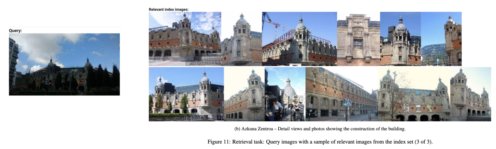
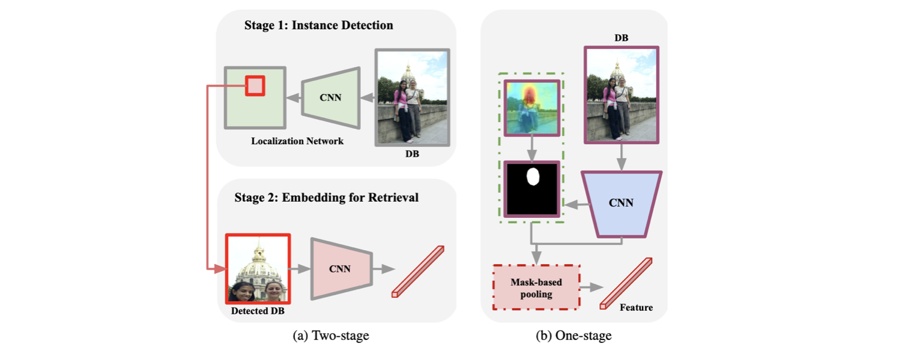
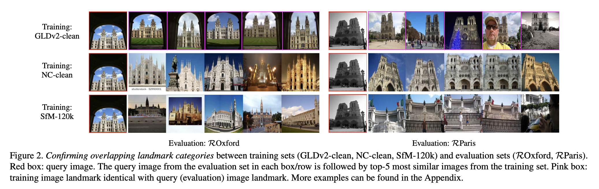
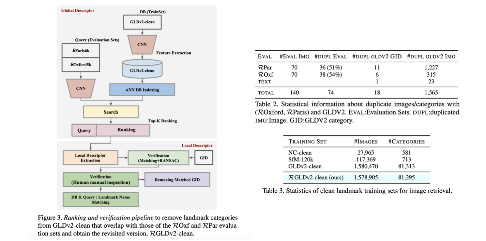
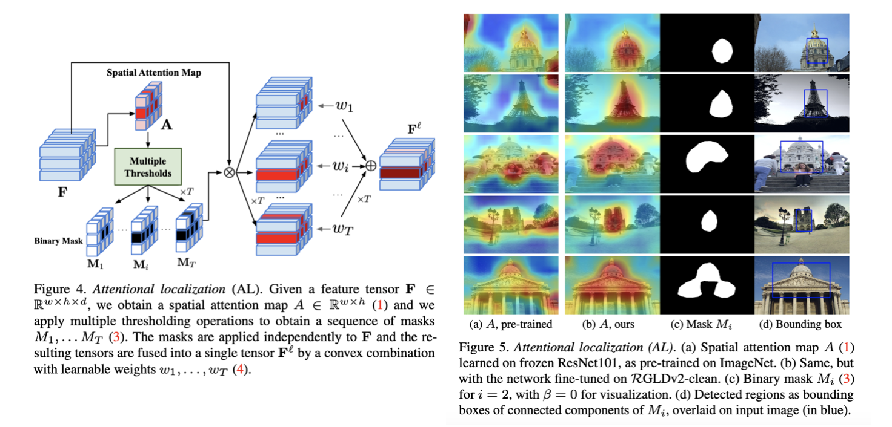
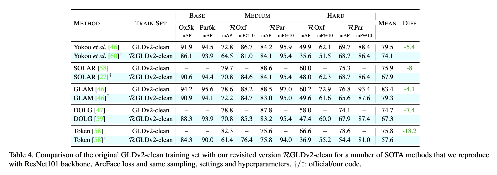
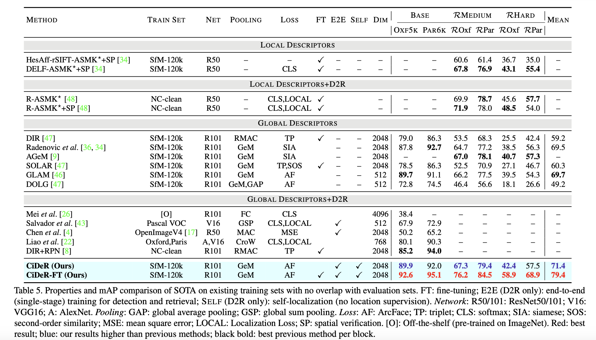
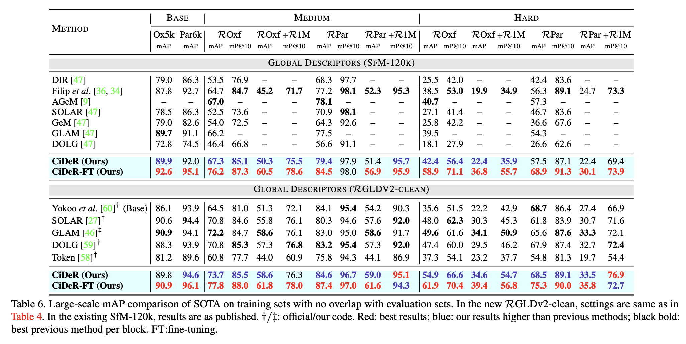

> CVPR 2024에서 발표된 On Train-Test Class Overlap and Detection for Image Retrieval 논문을 정리합니다.

### Introduction

##### Image Retrieval

Image retrieval task는 주어진 query 이미지 상에 특정 object를 검출한 뒤에 해당 object와 매칭되는 internal db 상의 다른 이미지를 찾아내는 task입니다. 아래 이미지처럼 주어진 건축물에 대해 관련된 이미지를 잘 찾아내는 것이 task의 목적입니다. 

##### Previous Works: Two-Stage Training Process

Image retrieval을 위한 가장 일반적인 방법은 two-stage training process를 활용하는 것입니다. Two-stage 방식은, 먼저 주어진 query 이미지에 대해서 localization network를 기반으로 instance detection을 수행합니다. 그 다음에는 검출된(detected, cropped) instance에 대해서 embedding을 추출한 뒤 가장 유사한 image embedding을 DB 상에서 검색합니다. 추가적으로 DB 검색 단계에서는 cropped된 image embedding만 활용하는 것이 아니라, global descriptors라는 이미지 단위의 feature를 활용하는 경우도 존재합니다.

이런 방식의 추론을 위해서는 당연스럽게도 localization network와 feature extractor를 각각 따로 학습시켜야 하며, feature extractor의 학습을 위해서는 이미지 상 object(instance)에 대한 location supervision 또한 필요하게 됩니다. 

##### Contributions

따라서 본 논문의 저자들은 image retrieval task에 대해 꼭 localization network와 feature extractor를 각각 따로 학습시켜야하는지, location supervision이 꼭 필요한지에 대해 의문을 제기하며, location supervision이 필요없는 attention map 기반의 end-to-end image retrieval method (i.e., CiDeR)을 제안합니다.

또한, 기존에 benchmark dataset으로 사용하던 Google Landmarks v2 (GLDv2)의 문제점을 언급하며, 데이터 정제를 통해 개선된 Revisiting Google Landmarks v2 (RGLDv2-clean)을 공개합니다. 

### Revisiting Google Landmarks v2

##### Training and Evaluation of Image Retrieval Task

Image retrieval task의 benchmark evaluation set은 Revisited Oxford and Paris (ROxford, RParis)이고, training set은 Google Landmarks v2 (GLDv2)입니다. 기본적으로 benchmark training set에서는 아래의 두 가지 기준이 존재합니다.

- Depict particular landmarks
- To not contain landmarks that overlap with those in the evaluation sets.

하지만 GLDv2는 ROxford, RParis에 대해 두 번째 기준을 어기고 있다는 것을 아래 figure를 통해 확인 가능합니다.

따라서 GLDv2를 통해 학습된 모델들은 evaluation set의 landmark를 이미 학습에서 본 적이 있기 때문에 그 성능이 과장되어 있을 수 있습니다. 

##### Identifying Overlapping Landmarks

저자들은 GLDv2 데이터에 대한 모델 기반 검수와, 검수자를 통한 검수를 수행합니다.

1. Local featuer와 descriptor(GID)로  eval query에 대한 train set 이미지들 매칭
2. 해당 이미지를 3명의 사람이 직접 보면서 검수
. 한 명이라도 같은 카테고리라고 말하면 삭제
3. 추가적으로 Oxford, Paris 들어가는 GID 삭제

결과적으로 GLDv2에서 evaluation set과 18개의 중복 GID를 발견하였고, 이를 제거하여 RGLDv2-clean을 제작하였습니다. 

### Single-Stage Pipeline for D2R

##### Motivation

Prior works에서 자주 사용하는 two-stage process는 아래와 같은 단점들이 존재합니다.

- Representation learning을 위해 location supervision 있어야 함
- End-to-End 학습 아닌, detection, representation 모델 각각 따로 학습
- 두 번의 forward pass 거쳐야 하므로, 이미지 당 search cost 높음

따라서 저자들은 localization step을 spatial attention으로 대체하여 location supervision이 필요없는 end-to-end learning process 만들었습니다. 이 방식을 논문 상에서 attentional localization (AL)이라 명명합니다. 

##### Attentional Localization (AL)

1. Feature map에 1x1 conv를 적용하여 spatial attention map을 얻어냄
2. T개의 threshold에 따라 T 개의 binary(bit) mask를 생성함 (실험에서는 T=2로 설정)

3. Binary mask와 feature map으로 convex combination(weighted sum) 수행하여 feature fusion
4. 최종 feature인 $\mathbf F^l$를 image retrieval에 사용

##### Components

단순히 feature fusion된 feature를 그대로 사용하는 것은 아니고, image retrieval 분야에서 자주 활용되는 테크닉을 모두 활용하였다고 합니다. 

가장 먼저는 backbone network로 feature를 뽑고, SENet이나 ASPP, SKNet 같은 방법으로 feature map을 업데이트한 뒤에, 논문에서 제안한 attentional localization을 적용하고, 최종적으로 GeM(Generalized Mean Pooling) 방법을 통해 D dimension의 feature를 뽑아내게 됩니다. 

### Experiments

가장 먼저는 RGLDv2-clean으로 training set을 변경하였을 때 기존 prior works들의 성능이 얼마나 하락하는지를 보입니다.

그 다음으로는 CiDeR 방법의 성능을 보입니다.

### References

Song, et al. "On Train-Test Class Overlap and Detection for Image Retrieval." CVPR 2024.
