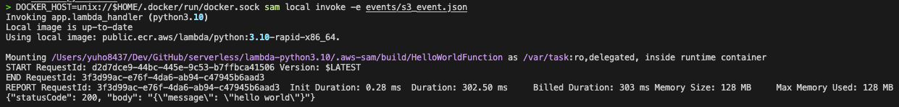
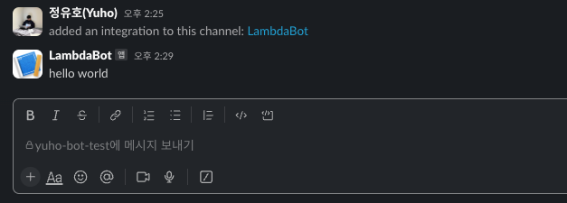
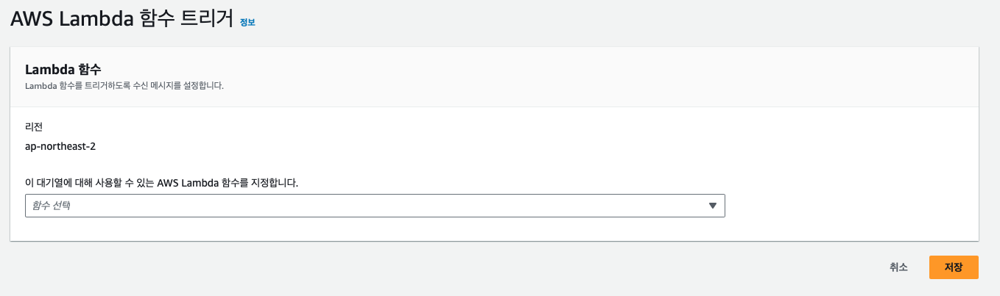

> AWS Lambda, AWS SQS를 통해 이벤트를 전달 받고, 특정 이벤트에 대한 경고 알림을 slack으로 전송하는 방법에 대해서 기록합니다. Lambda 개발은 vscode의 AWS Toolkit을 활용하였고, slack 알림은 slack webhook bot을 활용하였습니다.

### AWS Serverless Application Model (SAM)

1. AWS SAM CLI 설치: https://docs.aws.amazon.com/serverless-application-model/latest/developerguide/install-sam-cli.html
2. VScode AWS Toolkit plugin 설치
3. VScode AWS Toolkit에서 AWS 로그인
4. Lambda 항목을 우클릭 후 Create Lambda SAM Application
5. `lambda_handler` function 안에 코드 작성
6. Build: requirements에 필요 패키지 작성 후 `sam build` 명령어 통해 이미지 빌드. 패키지 설치 필요없는 경우에는 `-—skip-pull-image` 옵션 통해 image pull 스킵가능. `sam build` 명령 사용하면 `.aws-sam` 폴더 생김

```
sam build (--skip-pull-image)
```

7. Test(invoke): `event.json`에 예시 event 작성 후, 로컬 lambda function을 테스트 해볼 수 있음. 함수 테스트 전에는 변경된 함수 적용 위해 build 필요. `sam local start-api` 명령어 사용하면 http://127.0.0.1:3000 서버 형태로 실행되어서 postman 통한 디버깅도 가능

```
sam local invoke -e events/event.json

# If you have an error when finding docker, run command below
DOCKER_HOST=unix://$HOME/.docker/run/docker.sock sam local invoke -e events/event.json
```



8. Deployment: 배포를 위한 설정은 `template.yaml` 파일에서 가능

```
sam deploy # 최초 배포시 --guided 옵션 추가
```

9. Lambda를 테스트하기 위한 테스트 이벤트는 [이곳](https://github.com/aws/aws-lambda-go/tree/main/events/testdata)에서 참고 가능
10. Role 설정 필요. [kakao style의 테크 블로그](https://devblog.kakaostyle.com/ko/2017-05-13-1-aws-serverless-1/) 참고
    - SQS 관련 필요 권한: `sqs:ReceiveMessage`, `sqs:DeleteMessage`, `sqs:GetQueueAttributes`
    - Lambda 관련 필요 권한: `lambda:InvokeFunction`
    - CloudWatch 관련 필요 권한: `logs:CreateLogGroup`, `logs:CreateLogStream`, `logs:PutLogEvents`
    - 만약 S3 권한 필요시 AmazonS3FullAccess 같은 role 부여

### Slack Webhook Bot

1. Slack App을 생성한 뒤, 'Incoming Webhooks' section에서 'Activate Incoming Webhooks'을 On 설정
   - WebHook?: https://docs.tosspayments.com/resources/glossary/webhook
   - 클라이언트가 서버를 호출하는게 아닌, 서버에 특정 이벤트가 발생했을 때 클라이언트를 호출하기 때문에 '역방향 API'라고도 불림
2. 'Incoming Webhooks' section에서 'Add New Webhook to Workspace'를 통해 Webhook 사용할 채널 추가
3. 생성된 Webhook URL 확인 및 복사
4. curl 통해서 잘 작동하는지 테스트. 그리고 Lambda 내에서 해당 Webhook url 활용

```
curl -s -d "payload={'text':'hello world'}" "YOUR_WEBHOOK_URL"
```



### AWS Simple Queue Service (SQS)

1. AWS SQS를 생성 및 액세스 정책 설정
   - 특정 서비스(e.g., S3)에 SNS 걸어두고 해당 SNS를 SQS가 구독하는 형태가 일반적
2. 생성한 SQS의 Lambda 트리거로, 위에서 만든 Lambda를 설정
3. 저장 후 결과 확인



4. Message를 직접 확인하고싶은 경우, SQS의 '메세지 전송 및 수신'에 들어가서 메세지를 직접 폴링해보고 결과를 확인해볼 수 있음

### Summary

1. 특정 이벤트 발생 (e.g., SNS)
2. SQS를 통해 이벤트가 Lambda로 전달
3. 해당 이벤트에 대해 alert 필요한지를 Lambda 내 lambda_handler에서 확인
4. Alert 필요한 경우, slack webhook url로 message 전송
5. Slack 채널에서 alert 확인

