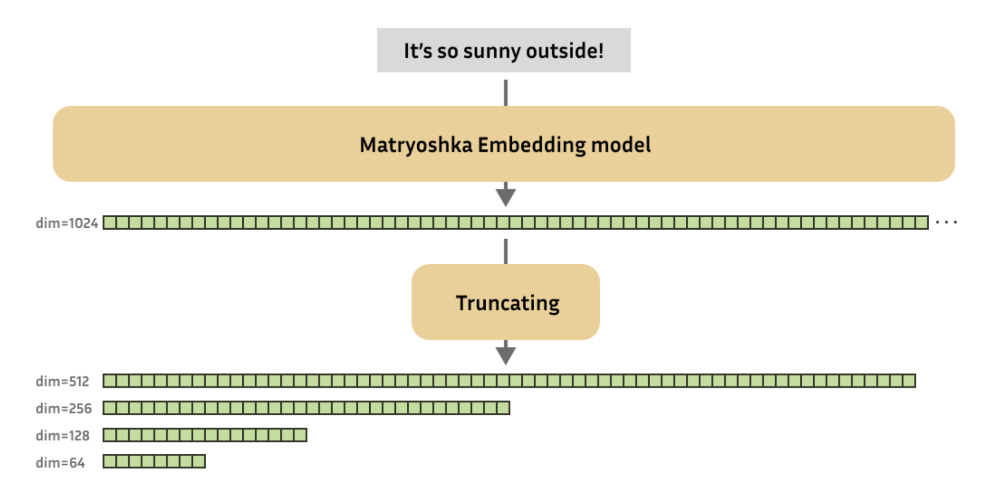
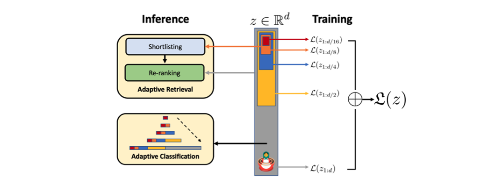
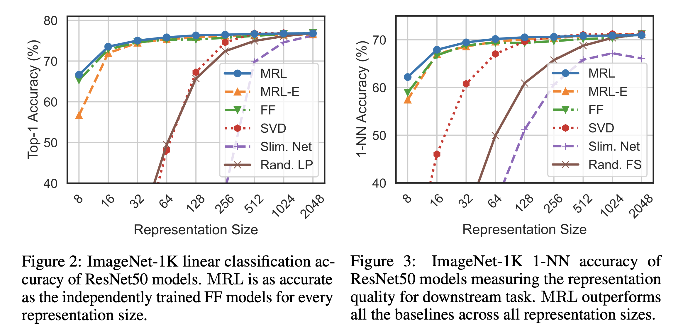
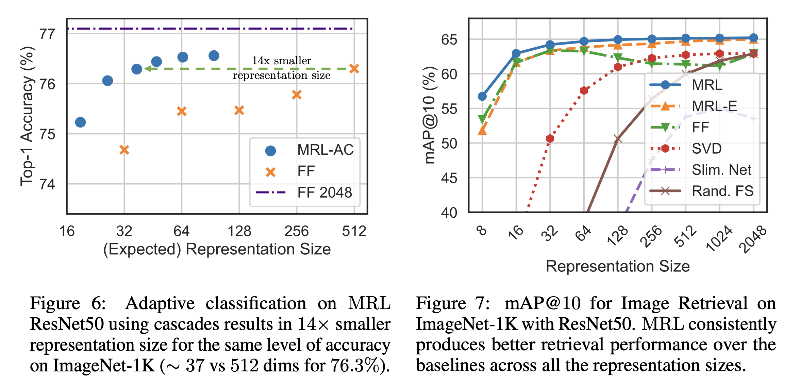

> NeurIPS 2022에서 발표된 Matryoshka Representation Learning 논문을 정리합니다.

이미지나 텍스트의 embedding을 뽑고자 할 때 여러 pre-trained backbone을 활용하는 경우가 많은데, 이 때 필요에 따라 특정 dimension으로 embedding을 맞춰줘야 하는 경우가 꽤나 빈번하게 발생합니다. 단순히 일부 값만 뽑아 사용하기에는 어떤 dimension number가 유용한지 판단할 수 없고, 따라서 PCA와 같은 linear projection 방법을 사용하거나 projection layer를 붙여 fine-tuning을 하곤 합니다. 하지만 이러한 방식은 기존 성능이 충분히 유지되지 않거나 추가 학습이 필요하다는 단점이 있습니다. 그래서 '배포 시점에서 필요한 feature dimension을 바로 선택해서 사용할 순 없을까'하는 고민이 개인적으로 항상 있었습니다. 

그러다 최근에 NomicAI의 nomic-embed-text-v1.5를 사용할 일이 있었는데, 해당 embedding은 단순 slicing으로 원하는 embedding dimension을 선정하더라도 성능이 유지된다고 주장하고 있었습니다. 여기에 적용된 방법이 Matryoshka Representation Learning이라는 것을 확인하여 해당 논문을 읽게 되었고, 관련 내용을 아래에 정리하여 공유합니다.

### Introduction

들어가기에 앞서 논문에서 소개하는 key contribution은 다음과 같습니다. 

- Adaptive deployment을 위한 flexible representation을 얻을 수 있음
- Large-scale classification과 retrieval 분야에서 14배까지 빠르면서도 기존 baseline 성능을 유지 할 수 있음
- 해당 방법은 vision, language, VLM 등 여러 modality로도 매끄럽게 adpatation이 가능함

해당 논문을 적용 가능한 대표적인 분야는 classification과 retrieval 분야인데, 특히 retrieval 분야는 web scale 데이터에서도 embedding search를 빠르게, 효율적으로, 그리고 정확하게 수행할 수 있는 능력이 중요합니다. 이 때 대부분 이슈가 되는 영역이 label 수($L$), 데이터 양($N$), 그리고 embedding size($d$) 입니다. 

Label 수와 관련되어 보편적으로 사용되고 있는 방법은 Approximate Nearest Neighbor Search(ANNS)이나 Hierarchical Navigable Small World(HNSW) 같은 hierarchy 기반의 방법들이고, 특히 이 중 HNSW는 $O(dlog(N))$ 방법이지만 성능은 exact retrieval $(O(dN)$만큼이나 좋다는 장점을 가지고 있습니다 (HNSW에 대한 간단한 설명을 [이전 글](https://yuhodots.github.io/Operations/23-11-19/)에서 확인 가능합니다).

본 논문에서 제안하는 Matryoshka Representation Learning(이하 MRL)은 embedding size $d$에 집중하고, high dimension vector와 search 방법론들 사이에 좋은 intermediate abstraction을 제공함으로써 ANNS과 같은 retrieval을 더욱 효율적으로 할 수 있도록 돕습니다. 

### Matryoshka Representation Learning

<i>Taken from, https://huggingface.co/blog/matryoshka</i>

위의 figure는 MRL의 장점을 직관적으로 표현하고 있습니다. 그리고 아래의 figure를 통해서는 MRL의 학습 방식을 직관적으로 확인하실 수 있습니다. 

<i>Taken from, Aditya Kusupati, et al.</i>

MRL은 각 데이터 포인트 $x$에 대한 embedding vector $z$의 처음 $m$ 차원 각각을 독립적으로 작동할 수 있게 합니다. 각 $m$ 차원을 {8, 16, . . . , 1024, 2048}으로 선택했다고 했을 때, 각 $m$ dimension 마다 독립적인 linear classifier $\mathbf W_m$만들고, 각 linear classifier의 output에 대한 loss를 계산하고 aggregate(weighted sum)합니다. 결론적으로는 아래 식을 통해 MRL이 학습되며, 실험에서 weight $c_m$은 모든 dimension에 대해 1로 고정합니다.
$$
\min _{\{\mathbf{W}(m)\}_{m \in \mathcal{M}}, \theta_F} \frac{1}{N} \sum_{i \in[N]} \sum_{m \in \mathcal{M}} c_m \cdot \mathcal{L}\left(\mathbf{W}^{(m)} \cdot F\left(x_i ; \theta_F\right)_{1: m} ; y_i\right)
$$

$\mathbf W$를 dimension 별로 여럿 두는 것이 아니라 $W_m = W_{1:m}$ 형태로 하나의 weight만 두고 slicing하는 weight-tying 방식을 선택할 수도 있습니다. 이 방식은 linear classifier의 weight 수가 절반으로 줄기 때문에 memory cost를 줄일 수 있고 extremely large output space일때 효과적입니다. 해당 방식을 논문에서는 MRL-E(Efficient Matryoshka Representation Learning)로 명명하고 있습니다. 

### Applications

<i>Taken from, Aditya Kusupati, et al.</i>

실험에서는 하이퍼파라미터 서치를 따로 하지 않고 baseline 실험들의 하이퍼파라미터를 그대로 사용하였습니다. ImageNet 1K에 대해 linear classification 성능과 1-NN 성능을 측정하였는데, 첫번째 실험에서는 FF(Fixed feature) model (i.e., convetional trained model)과 MRL의 성능이 모든 representation size에서 동일하였고, 두번째 실험에서는 MRL가 lower dimension에서 강점을 갖는다는 것을 확인하였습니다. FF model과 성능이 비슷하지만 MRL는 배포 시점에서 자유롭게 dimension을 골라서 사용할 수 있으니 효과적이라고 볼 수 있습니다.

<i>Taken from, Aditya Kusupati, et al.</i>

Adaptive classification task를 위해서는 dimension 별로 maximum softmax probability에 대한 threshold를 validation set에 대해 학습하고, 이를 MRL의 representation의 dimension을 결정하는데에 사용합니다. Baseline과 동일한 수준의 accuracy를 14배 작은 모델 만으로도 달성할 수 있었습니다. ImageNet 1K에 대한 retrieval task에서는 Basleline 보다 3%정도 성능 향상이 있었고 특히 256 dimension 아래에서 더 유용했습니다. 

##### Further Analysis

Robustness를 측정하기 위해 저자들은 ImageNet 1K 말고 다른 데이터셋에 대한 실험도 진행하였으며, ImageNet-A에 대해서는 baseline 만큼 성능이 보장되었고, ImageNet 1K를 쿼리로하여 ImageNet V2에 대한 retrieval을 했을 때는 basline 보다 mAP@10에서 3%정도의 향상이 있었습니다. 

Few-shot & Long-tail 데이터 셋에 대해서도 실험을 진행하였는데 기존 base classes에 대한 성능을 유지하면 novel classes에 대해 2%정도의 성능 향상이 있었다고 합니다.

### Conclusion

제 경우에는 CLIP에서 text encoder 파트를 nomic text embedding v1.5 512 dimension으로 대체하기 위해 해당 방식을 사용하였는데, 이런 경우 뿐만 아니라 RAG와 같은 embedding search에서도 상당히 유용하게 써볼 수 있겠다는 생각이 들었습니다.

서비스에서 원하는 dimension을 adaptation이나 추가 튜닝 없이 slicing하여 사용한다는 것이 생각보다 큰 강점이라서, 실서비스 단에서 활용하기에 꽤 좋은 방식이라는 생각이 들었습니다. 

### Reference

Kusupati, Aditya, et al. "Matryoshka representation learning." *Advances in Neural Information Processing Systems* 35 (2022): 30233-30249.
