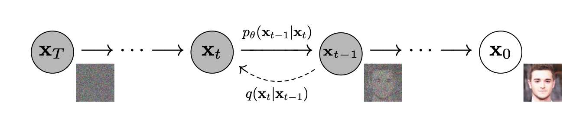
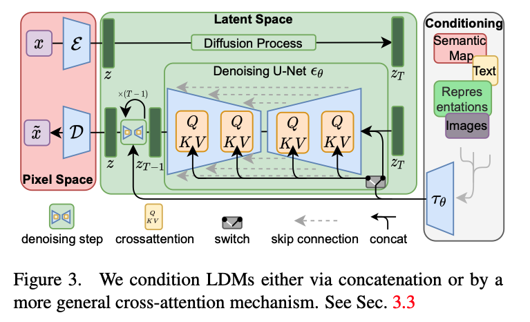

> Generative model의 종류, task, metrics, 그리고 관련 서비스 등을 정리합니다. 

### Types of Models

##### Diffusion Models 

Diffusion models 은 노이즈로부터 점진적으로 데이터를 복원하는 과정을 학습하여 새로운 데이터를 생성합니다.

**DDPM (Denoising Diffusion Probabilistic Models)**은 데이터에 점진적으로 노이즈를 추가한 후(forward process), 이를 역으로 제거하는 과정(reverse process)을 학습합니다. 역방향 과정에서 각 단계의 실제 데이터와 복원된 데이터 간의 차이를 최소화하는 방식으로 훈련됩니다.

- Forward process: 여러 단계에 걸쳐 데이터에 가우시안 노이즈를 추가하여 점점 더 노이즈가 많은 상태로 만듭니다. $\begin{gathered}
  q\left(\mathbf{x}_t \mid \mathbf{x}_{t-1}\right):=\mathcal{N}\left(\mathbf{x}_t ; \sqrt{1-\beta_t} \mathbf{x}_{t-1}, \beta_t \mathrm{I}\right), 
  \mathbf{x}_t=\sqrt{1-\beta_t} \mathbf{x}_{t-1}+\sqrt{\beta_t} \epsilon
  \end{gathered}$

- Backward process 학습된 디노이징 네트워크를 사용해 각 단계에서 노이즈를 제거하여 원래 데이터를 복원합니다.

- Loss: 각 단계에서 디노이징 오류를 최소화하는 것이 학습 목표이며 이를 위해 variational lower bound of negative log-likelihood를 사용합니다.

  $\begin{aligned}
  L_{V L B}= & \underbrace{-\log p_\theta\left(\mathbf{x}_0 \mid \mathbf{x}_1\right)}_{\mathbf{L}_0}+\underbrace{\mathbf{D}_{K L}\left(p\left(\mathbf{x}_T \mid \mathbf{x}_0\right) \| p_{\mathbf{x}_T}\right)}_{\mathbf{L}_T}
  +\underbrace{\sum_{t>1} \mathbf{D}_{K L}\left(p\left(\mathbf{x}_{t-1} \mid \mathbf{x}_t, \mathbf{x}_0\right) \| p_\theta\left(\mathbf{x}_{t-1} \mid \mathbf{x}_t\right)\right)}_{\mathbf{L}_{t-1}}
  \end{aligned}$

**NCSM (Noise Conditional Score Models)**은 score function를 추정하는 방식으로 데이터를 복원합니다. 모델이 데이터의 log-likelihood의 gradient를 다양한 노이즈 수준에서 예측하도록 학습하는 것이 목표입니다.

- Score matching: log-likelihood의 gradient인 score function $\nabla_x\log p(x)$을 학습함으로써 probability density function을 추정합니다.
- Langevin dynamics: score matching에서 구한 score function을 활용하여 데이터를 샘플링하는 방법입니다.
- Loss: score matching loss을 최적화합니다. $\sum_{i=1}^L \lambda(i) \mathbb{E}_{q_{\sigma_i}(\mathbf{x})}\left[\left\|\nabla_{\mathbf{x}} \log q_{\sigma_i}(\mathbf{x})-s_\theta(\mathbf{x}, i)\right\|^2\right]$

**SDE Generative Models**은 diffusion process을 continuous-time stochastic processes으로 일반화한 모델입니다. 순방향과 역방향 과정 모두 데이터가 노이즈 하에서 시간에 따라 어떻게 변화하는지를 설명하는 미분 방정식으로 표현됩니다. 역방향 SDE를 사용해 학습된 데이터 분포에서 샘플링을 합니다.

- Forward SDE: DDPM과 유사하게 데이터를 continuous-time SDE로 노이즈가 섞이도록 만듭니다.
- Backward SDE: 역방향 과정은 데이터를 점진적으로 노이즈에서 복원하는 또 다른 SDE로 모델링합니다.
- Loss: DDPM과 유사하지만, 기존 식이 continuous-time processes에 맞게 조정됩니다.
- Training: stochastic process 이론에서의 기법을 사용하여 reverse SDE를 학습합니다.

각각의 차이점은 다음과 같습니다.

- Noise Modeling

  - DDPMs: 고정된 timestep 통해 discrete-time diffusion process을 사용하여 노이즈를 추가합니다.
  - NCSMs: score-based 접근 방식을 사용하여 노이즈가 섞인 데이터의 로그 가능도 기울기를 추정합니다.

  - SDE models: continuous-time stochastic processes을 사용하여 노이즈 추가 및 복원을 모델링합니다.

- Mathematical Framework

  - DDPMs은 discrete time에서 동작하는 반면, SDE models은 continuous-time으로 확장

  - NCSMs은 score function (the gradient of the log density)을 추정하는데 중점을 두고, DDPM, SDE models은 노이즈 perturbation와 복원에 중점을 둡니다.

- Sampling Procedure

  - DDPMs: 학습된 디노이징 모델을 역으로 적용하여 단계별로 샘플링합니다

  - NCSMs: score 추정을 통해 점진적으로 데이터를 업데이트하는 Langevin dynamics을 사용합니다.

  - SDE models: continuous-time reverse SDE를 따라 샘플링을 진행합니다.

##### Generative Adversarial Networks (GANs)

GANs는 두 개의 신경망이 경쟁하는 구조로, generator는 실제 같은 데이터를 만들려고 하고, discriminator는 실제와 생성된 데이터를 구분하려고 합니다.

- Loss: $\begin{aligned}
  \min _G \max _D V(D, G)=
  \mathbb{E}_{\mathbf{x} \sim q_{\mathbf{x}}}[\log D(\mathbf{x})]+\mathbb{E}_{\mathbf{z} \sim p_{\mathbf{z}}(\mathbf{z})}[\log (1-D(G(\mathbf{z})))]
  \end{aligned}$
  - Generator loss: 생성자가 판별자를 속일 수 있을 정도로 실제 같은 데이터를 만들도록 유도합니다.
  - Discriminator loss: 실제 데이터와 생성된 데이터를 구분할 수 있도록 최적화합니다. 보통 binary cross-entropy loss을 사용합니다.
- Training: generator와 discriminator를 번갈아가며 훈련하고, batch normalization, feature matching, gradient penalty 등과 같은 기법을 사용하여 훈련을 안정화시킵니다.

##### Variational Autoencoders (VAEs)

VAEs는 데이터가 잠재 변수(latent variables)에서 생성된다고 가정하는 확률적 생성 모델입니다. 이 모델은 잠재 공간에서 데이터 공간으로의 매핑을 학습하며, 데이터 likelihood에 대한 variational lower bound을 최적화합니다.

- Structure: VAE는 데이터를 잠재 공간으로 매핑하는 인코더와, 잠재 변수를 다시 데이터 공간으로 매핑하는 디코더로 구성됩니다.
- Loss: $\begin{aligned}
  L(\theta, \phi ; \mathbf{x})= \underbrace{-\mathbf{D}_{K L}\left(p_\phi(\mathbf{z} \mid \mathbf{x}) \| p_\theta(\mathbf{z})\right)}_{L_{K L}}+ \underbrace{\mathbb{E}_{p_\phi(\mathbf{z} \mid \mathbf{x})}\left[\log p_\theta(\mathbf{x} \mid \mathbf{z})\right]}_{L_{\text {reconstruction }}}
  \end{aligned}$
  - Reconstruction loss: 디코더가 데이터를 얼마나 잘 복원하는지를 측정합니다.
  - KL divergence loss: 학습된 잠재 분포가 사전에 정의된 분포(주로 가우시안)에 얼마나 가까운지를 측정합니다.
- Training: 손실 함수를 최소화하기 위해 SGD을 사용하여 훈련되며,  reparameterization trick을 사용하여 샘플링 단계를 통한 backprob이 가능하도록 합니다.

##### Autoregressive Models

Autoregressive model은 데이터를 순차적으로 생성하며, 각 단계는 이전에 생성된 출력에 따라 달라집니다. 이 모델은 조건부 확률의 곱으로 데이터의 결합 확률을 추정합니다($q(\mathbf{x})=\prod_{i=1}^N q\left(\mathbf{x}_i \mid \mathbf{x}_1, \ldots, \mathbf{x}_{n<i}\right)$). 주로 순환 신경망(RNN)이나 Transformer를 사용하여 순차적인 데이터를 모델링합니다. 이미지의 경우, PixelRNN이나 PixelCNN 같은 아키텍처가 많이 사용됩니다.

##### Normalizing Flows

Normalizing flow는 간단한 분포(e.g., 가우시안)를 복잡한 분포로 변환하기 위해 일련의 가역적이고 미분 가능한 변환을 적용하는 모델입니다. 이 모델은 exact likelihood 계산과 효율적인 샘플링을 가능하게 합니다. 일련의 invertible transformations으로 구성되며, 이를 통해 데이터를 변환합니다.

### Generation Tasks

##### Unconditional Image Generation

Unconditional image generation은 condition 없이 이미지를 생성하는 방식입니다. 즉, 레이블, 텍스트, 또는 다른 가이던스 없이 이미지를 생성하는 방식입니다. 생성 모델은 학습 데이터의 분포를 먼저 학습하고, 해당 학습셋과 유사한 새로운 샘플을 생성하게 됩니다. 대표적인 예로는 GAN(Generative Adversarial Networks), VAE(Variational Autoencoder) 모델 등을 통해, random face generation, artistic image synthesis 등을 들 수 있습니다.

##### Conditional Image Generation

Conditional image generation은 클래스 레이블, 텍스트 설명, 스케치 등과 같은 입력이나 조건을 기반으로 이미지를 생성하는 방식입니다. 모델은 주어진 조건에 따라 이미지를 생성하게 됩니다. 이 경우, conditional GAN 또는 conditional diffusion model처럼 생성 프로세스가 특정 입력(레이블, 텍스트 등)에 의해 조정됩니다. Text-to-image나 image-to-image 같은 작업은 대부분 conditional image generation에 속합니다.

##### Image-to-Image Translation

Image-to-image translation은 한 유형의 이미지를 다른 유형의 이미지로 생성하는 작업을 말합니다. 생성된 이미지는 입력 이미지와 같은 구조를 유지하면서도 다른 도메인에 속하게 됩니다.

- Pix2Pix: 입력 이미지와 대응되는 target 이미지 쌍으로 학습된 GAN 기반 모델입니다.
- CycleGAN: 쌍으로 이루어진 데이터가 없을 때 구조를 보존하며 이미지를 변환하기 위해 cycle-consistency loss을 도입한 모델입니다.
- '스케치를 사진처럼 현실감 있는 이미지로 변환하기', '여름 사진을 겨울 장면으로 변환하는 스타일 전이' 등을 활용 예로 들 수 있습니다.

##### Text-to-Image Generation

Text-to-image generation은 텍스트 설명으로부터 이미지를 합성하는 작업입니다. 모델은 자연어 설명과 해당하는 시각적 표현을 학습하여 텍스트를 기반으로 이미지를 생성합니다.

- DALL-E와 Stable Diffusion이 대표적인 예입니다.
- '복잡한 장면 설명에 따라 이미지 생성', '추상적인 텍스트 프롬프트에서 예술적 창작물 생성' 등을 활용 예로 들 수 있습니다.

##### Super Resolution

Super resolution task는 저해상도 입력으로부터 고해상도 이미지를 생성하는 것을 목표로 합니다. 이미지의 세부 사항을 잃지 않으면서 품질을 향상시키는 데 사용됩니다.

- Super-Resolution GANs (SRGANs): adversarial learning을 사용하여 시각적으로 더 선명하고 현실적인 고해상도 이미지를 생성하는 모델입니다.
- ESRGAN (Enhanced SRGAN): 더 정교한 generator를 통해 더욱 선명하고 디테일한 이미지 재구성을 가능하게 한 SRGAN의 개선된 버전입니다.

##### Inpainting

Inpainting은 이미지의 누락된 부분을 채우는 작업입니다. 모델은 제공된 주변 정보를 바탕으로 전체 이미지를 자연스럽게 완성하는 것이 목표입니다.

- Context Encoders: 주변 픽셀로부터 맥락 정보를 학습하여 누락된 이미지 영역을 생성하는 모델입니다.
- Partial Convolutions: 학습 중 누락된 영역을 무시하고 유효한 픽셀에만 집중하는 inpainting task을 위해 설계된 특별한 convolution network입니다.

##### Video Generation

Video generation 은 이미지 생성 모델을 시간적 영역으로 확장한 작업입니다. 이 작업은 비디오를 구성하는 일련의 프레임을 일관되게 합성하는 것을 포함하며, video prediction 및 video-to-video translation과 같은 작업도 포함될 수 있습니다. Video GANs와 Stable Video Diffusion을 예로 들 수 있습니다. 

### Evaluation Metrics

생성형 모델을 평가하는 것은 특히 텍스트에서 이미지로의 생성이나 이미지 재구성 작업에서 모델이 얼마나 잘 작동하는지, 품질과 다양성 측면에서 평가하는 데 매우 중요합니다. 이를 위해 다양한 특화된 지표들이 사용되며, 각 지표는 생성된 출력물의 이미지 품질, 정확성, 사용자의 프롬프트와의 일치도 등 다양한 측면을 중점적으로 평가합니다. 아래는 주요 평가 지표에 대한 설명입니다.

##### Text-to-Image Generation Metrics

**DrawBench**는 텍스트를 기반으로 이미지를 생성하는 모델을 평가하기 위해 고안된 벤치마크로, 텍스트 설명으로부터 고품질의 이미지를 생성하는 모델의 성능을 평가합니다. 이 벤치마크는 복잡성과 주제가 다양한 프롬프트 세트를 제공하며, 모델이 텍스트 입력을 얼마나 잘 이해하고 이를 정확하게 이미지로 변환하는지 평가하는 것을 목표로 합니다. 결과는 일반적으로 인간 평가자가 주어진 텍스트 프롬프트와 생성된 이미지의 관련성을 기준으로 평가합니다.

**PartiPrompts는** 자연어 이해의 세부 사항에 중점을 두어, 모델이 텍스트에서 명시적이고 암묵적인 세부 사항을 모두 캡처하는지 확인하는 것을 목표로 합니다. DrawBench와 유사하게, 이 평가도 인간 평가자가 텍스트와 이미지 출력 간의 일치도를 점수로 매기는 질적 평가가 주로 이루어집니다.

**CLIPScore**는 CLIP 모델을 사용하여 생성된 이미지와 해당 입력 텍스트 간의 유사도를 점수화합니다. 이미지를 텍스트와 함께 동일한 잠재 공간에 임베딩하여, 두 가지가 의미적으로 얼마나 잘 일치하는지 평가할 수 있습니다. CLIPScore가 높을수록 입력 텍스트와 생성된 이미지 간의 일치도가 더 높다는 것을 의미합니다.

**R-Precision**는 생성된 이미지가 얼마나 텍스트에 정확하게 대응하는지를 측정합니다. 이는 CLIP 기반 모델에서 자주 사용됩니다.

**FID-I (FID for Text-to-Image)**는 Fréchet Inception Distance를 Text-to-Image Generation 평가에 사용할 때, 실제 데이터와 생성된 이미지 간의 특성 분포 차이를 측정합니다.

##### Image Reconstruction Metrics

**Peak Signal-to-Noise Ratio (PSNR)**은 이미지 재구성 품질을 평가하는 표준 지표로, 이미지의 최대 가능한 신호와 이를 방해하는 노이즈 간의 비율을 측정합니다. PSNR은 데시벨(dB)로 표현되며, 값이 클수록 이미지 재구성 품질이 좋음을 의미합니다. PSNR은 계산이 간단하지만, 복잡한 생성 작업에서는 사람의 이미지 품질 인식과 항상 잘 일치하지는 않습니다.

**Structural Similarity Index (SSIM)**는 두 이미지 간의 구조적 유사성을 비교하여 이미지의 품질을 측정합니다. 일반적으로 생성된 이미지와 참조 이미지 간의 구조적 정보를 중점적으로 평가하며, 이는 사람의 시각적 인식과 더 잘 일치합니다. SSIM은 특히 super-resolution, denoising와 같은 image-to-image task에서 구조적 정확성이 중요한 경우에 널리 사용됩니다.

**Multi-Scale Structural Similarity (MS-SSIM)**는 SSIM의 확장형으로, 여러 해상도에서의 구조적 유사성을 평가합니다. 이 방법은 고해상도 이미지 평가에서 더욱 정확한 결과를 제공합니다.

**Mean Squared Error (MSE)**는 이미지 재구성 작업에서 생성된 이미지와 목표 이미지 간의 픽셀 값 차이의 평균 제곱을 측정하는 일반적인 지표입니다. 계산이 용이하지만, 복잡한 생성 작업에서는 인식 품질을 항상 잘 반영하지는 않습니다.

**LPIPS (Learned Perceptual Image Patch Similarity)**는 전통적인 MSE, SSIM과 같은 지표들이 단순한 픽셀 단위 비교를 기반으로 하는 점과 달리, feature space에서 이미지를 비교함으로써 사람의 인식과 더 가까운 유사성 평가를 제공합니다.

##### Image Fidelity and Model Diversity

**Inception Score (IS)**는 생성된 이미지의 품질과 다양성 두 가지를 평가합니다. 사전 학습된 Inception network를 사용하여 생성된 이미지를 분류하고, IS가 높을수록 생성된 이미지가 다양하고(다양한 클래스에 해당) 품질이 높으며(각 이미지를 특정 클래스에 명확히 분류할 수 있음) 성능이 좋다고 평가됩니다. IS는 계산이 간단하지만, 이미지의 전체적인 시각적 품질보다는 Inception network가 분류한 다양성과 품질에 초점을 맞추기 때문에 때로는 오해를 불러일으킬 수 있습니다.

**Fréchet Inception Distance (FID)**는 생성된 이미지와 실제 이미지 간의 유사성을 평가하는 가장 널리 사용되는 지표 중 하나입니다. 이는 Inception network가 캡처한 실제 이미지와 생성된 이미지의 특성 분포 간의 거리를 측정합니다. FID 값이 낮을수록 생성된 이미지가 실제 데이터 분포에 더 가깝다는 것을 의미합니다. FID는 IS보다 더 견고하며, 이미지 품질과 다양성의 미세한 차이를 잘 포착할 수 있습니다.

**Precision and Recall**은 생성 모델의 품질과 다양성을 동시에 평가하는 방법으로, precision은 생성된 이미지가 얼마나 실제 이미지에 가까운지(품질)를, recall은 생성 모델이 실제 데이터 분포를 얼마나 잘 포괄하는지(다양성)를 측정합니다.

**Mode Score**는 Inception Score (IS)의 한계를 보완하기 위해 제안된 평가 지표로, 생성된 이미지의 diversity와 mode collapse를 보다 정확하게 평가하는 것을 목표로 합니다. Inception Score는 이미지 품질과 클래스 다양성을 평가하지만, 생성 모델이 데이터의 특정 모드(즉, 데이터 분포의 일부)를 잘 커버하지 못할 경우 이를 제대로 반영하지 못할 때가 있습니다. Mode collapse는 생성 모델이 다양한 이미지 대신 일부 모드만 생성하는 현상으로, Mode Score는 이를 더 명확하게 잡아내기 위한 지표입니다.

### GenAI Products

##### Text-to-Image

Text-to-Image 모델의 구조는 대부분 GPT나 VLM(CLIP) 등의 text encoder와 diffusion model과 같은 생성형 모델이 결합된 형태를 띄고 있습니다.

**Midjourney**는 텍스트 설명으로부터 매우 세밀한 이미지를 생성하는 데 중점을 둡니다.

- Category: Text-to-Image Generation.
  - 예술가들이 초기 아이디어 구상이나 컨셉 아트를 생성하는 데 사용
  - 마케팅: 광고와 브랜드 디자인에서 창의적인 비주얼 콘텐츠 제작에 활용
  - 게임 및 영화 산업: 게임 컨셉 아트와 영화의 비주얼 세계관을 구축하는데 도움

**DALL-E**는 텍스트 설명으로부터 이미지를 생성하며, 프롬프트에 따라 이미지의 일부를 편집하는 inpainting 작업도 수행할 수 있습니다.

- Category: Text-to-Image Generation, Inpainting
  - 프로토타입 설계: 제품 디자인 시각화 및 신속한 시제품 설계
  - 교육: 복잡한 개념을 시각적으로 설명하는 교재 제작
  - 의료 시각화: 의료 분야에서 텍스트 기반의 설명을 시각화하여 데이터 해석을 도울 수 있음

**Stable Diffusion**은 기본적으로 텍스트로부터 이미지를 생성하고 이미지를 수정하며, 누락된 부분을 채우는 inpainting, 이미지 해상도를 향상시키는 super resolution을 지원하여 여러 분야에서 활용될 수 있는 모델입니다.

- Category: Text-to-Image Generation, Image-to-Image Translation, Inpainting, Super Resolution
  - 디지털 일러스트레이션: 상업적 일러스트레이션 및 컨셉 아트 작업에서 사용
  - 의상 및 패션 디자인: 패션 아이템을 설계하고 시각적으로 확인
  - 소셜 미디어 콘텐츠 생성: 비주얼 콘텐츠를 효율적으로 제작해 광고 및 마케팅 캠페인에 활용

**NovelAI Image Generation**은 텍스트 프롬프트로부터 애니메이션 스타일의 이미지를 생성하는 데 중점을 두며, inpainting 기능도 제공합니다. 

- Category: Text-to-Image Generation, Inpainting
  - 애니메이션 스토리보드 제작: 애니메이션 시나리오를 시각적으로 표현해 볼 수 있음
  - 웹툰 및 만화 창작: 캐릭터 디자인이나 장면 구성을 쉽게 구현
  - 일러스트 작품 창작: 개인 창작자가 빠르게 높은 퀄리티의 이미지를 제작하는 데 사용

##### Video Generation

Video generation으로 유명한 generative model은 아래 3개 정도가 존재합니다.

- Stable Video Diffusion: Video Generation

- OpenAI Sora: Video Generation, Text-to-Image Generation

- Runway Gen-3: Video Generation, Text-to-Image Generation, Image-to-Image Translation

### Stable Diffusion

Stable Diffusion의 모델은 크게 U-Net, VAE, 그리고 텍스트 인코더로 구성됩니다.

- U-Net: 노이즈 제거 과정에서 사용되는 핵심 네트워크입니다. 이미지 생성에서 중요한 역할을 하는 이 아키텍처는 인코더-디코더 구조를 가지고 있습니다.

  - 인코더 (Encoder): 입력된 이미지나 노이즈가 점점 더 작은 공간 표현으로 압축됩니다. 이때 중요한 특징들을 추출해 점진적으로 압축합니다.

  - 디코더 (Decoder): 압축된 표현을 점진적으로 다시 확장하여 원래의 이미지 크기로 복원합니다. 디코더는 이미지에 포함된 세부 사항을 재구성하는 역할을 합니다.

  - 스킵 커넥션 (Skip Connections): 인코더와 디코더 사이에 연결된 경로로, 원본 이미지의 세부 정보를 유지하면서 더 나은 복원을 가능하게 합니다.

- VAE (Variational Autoencoder): Stable Diffusion은 잠재 공간(latent space)에서 이미지를 생성합니다. 고차원 이미지 공간에서 직접 작업하는 대신, VAE를 사용해 더 낮은 차원의 잠재 공간에서 작업합니다. VAE 인코더는 입력 이미지를 잠재 공간 표현으로 압축하고, VAE 디코더는 이 잠재 공간에서 다시 원래의 고차원 이미지로 복원하는 역할을 합니다.

- 텍스트 인코더: 주로 CLIP 모델이 사용되며, 텍스트를 잠재 공간으로 인코딩하여 U-Net에 결합됩니다. 텍스트 인코더는 입력된 텍스트 설명을 잠재 벡터로 변환하여 이미지 생성 과정에서 해당 텍스트 설명이 반영되도록 돕습니다.

Stable Diffusion의 학습은 DDPM을 기반으로 하며, 데이터에 점진적으로 노이즈를 추가하고 이를 역으로 복원하는 과정을 학습합니다.

