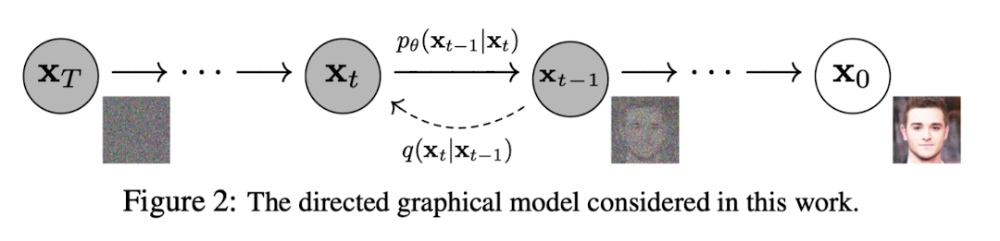
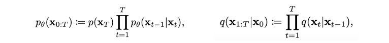
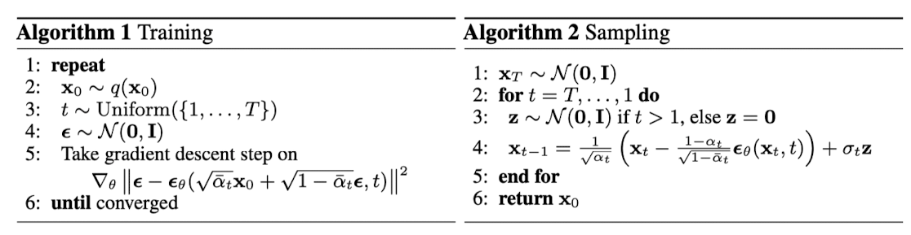
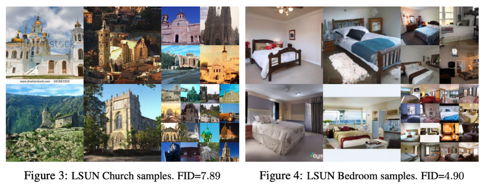
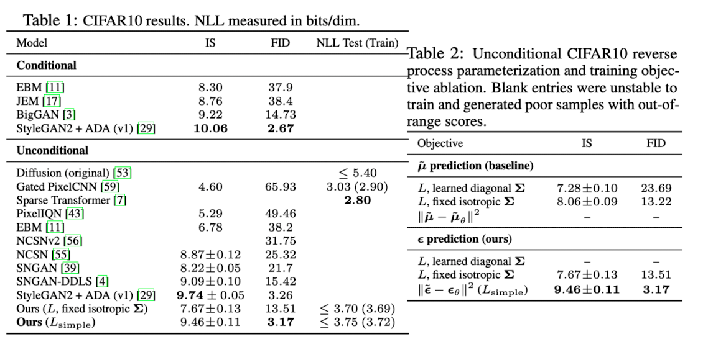
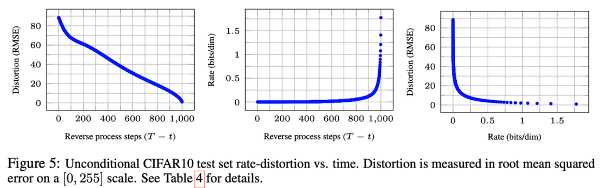
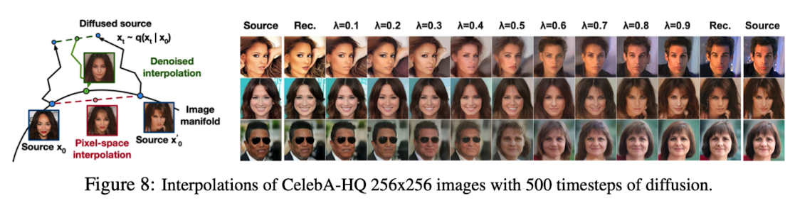

> 2020년에 발표되었던 Denoising Diffusion Probabilistic Models 논문을 정리합니다.

DDPM은 2020년 전 까지는 GAN 중심으로 연구되었던 생성형 모델링 분야를 diffusion 기반으로 전환을 이끌어낸 아주 중요한 논문 중 하나입니다. 

대부분의 generative model은 random noise를 샘플링 하고, 해당 random noise를 high quality sample로 만들어내는 방식으로 동작하는데, diffusion model도 마찬가지입니다. 위 이미지에서 처럼 $x_0$로 표현된 데이터에 noise를 순차적으로 주입하여 $\mathcal N(0, I)$으로 만든 뒤, 그 역 과정을 모델이 학습하는 방식으로 동작합니다. 그러면 모델은 결국 $\mathcal N(0, I)$에서 샘플링 된 random noise로 부터 high quality sample을 만들어낼 수 있게 됩니다.

### Background

Diffusion model에는 forward process(diffusion process) $q$와 backward process $p_\theta$라는 개념이 존재하며, 각각 아래의 식으로 표현됩니다. 

- $x_{1:T}$: $x_0$에서 $x_T$로 가면서 각 단계에서 점진적으로 노이즈가 추가되는 중간 상태
- $p_\theta(x_{T}) = \mathcal N (x_T;0, I)$ 형태로 정의하며 $p_\theta(x_{0:T})$는 Markov chain로 정의
- $x_1, \cdots, x_T$는 latent variable이고 $x_0$와 같은 차원인 pixel space에 존재

여기서, 모델을 의미하는 $p_\theta$의 목표는 $x_t$가 주어졌을 때, $x_{t-1}$가 어떤  $\mu$와 $\Sigma$를 가질지 예측하는 것입니다. 따라서 conditional probability $p_\theta$를 일단 아래와 같이 표현할 수 있습니다.
$$
p_\theta\left(\mathbf{x}_{t-1} \mid \mathbf{x}_t\right):=\mathcal{N}\left(\mathbf{x}_{t-1} ; \boldsymbol{\mu}_\theta\left(\mathbf{x}_t, t\right), \mathbf{\Sigma}_\theta\left(\mathbf{x}_t, t\right)\right)
$$
그리고 모델 학습 단계로 넘어가보면, 모든 생성모델은 $p_\theta(x_0)$의 likelihood를 높이는 것이 목표이므로, $-\log p_\theta(x_0)$를 최소화하도록 loss 식을 설정할 수 있고, 수식으로 작성시 아래와 같이 표현됩니다. 식의 자세한 유도 과정은 논문의 Appendix A에서 확인하실 수 있습니다.
$$
\mathbb{E}\left[-\log p_\theta\left(\mathbf{x}_0\right)\right] \leq \mathbb{E}_q\left[-\log \frac{p_\theta\left(\mathbf{x}_{0: T}\right)}{q\left(\mathbf{x}_{1: T} \mid \mathbf{x}_0\right)}\right]=\mathbb{E}_q\left[-\log p\left(\mathbf{x}_T\right)-\sum_{t \geq 1} \log \frac{p_\theta\left(\mathbf{x}_{t-1} \mid \mathbf{x}_t\right)}{q\left(\mathbf{x}_t \mid \mathbf{x}_{t-1}\right)}\right]=: L
$$

$$
\mathbb{E}_q[\underbrace{D_{\mathrm{KL}}\left(q\left(\mathbf{x}_T \mid \mathbf{x}_0\right) \| p\left(\mathbf{x}_T\right)\right)}_{L_T}+\sum_{t>1} \underbrace{D_{\mathrm{KL}}\left(q\left(\mathbf{x}_{t-1} \mid \mathbf{x}_t, \mathbf{x}_0\right) \| p_\theta\left(\mathbf{x}_{t-1} \mid \mathbf{x}_t\right)\right)}_{L_{t-1}} \underbrace{-\log p_\theta\left(\mathbf{x}_0 \mid \mathbf{x}_1\right)}_{L_0}]
$$

위의 loss 식에서 diffusion model에 해당하는 $L_{t-1}$을 더 살펴볼 필요가 있습니다. 여기서 $p_\theta(x_{t-1}|x_t)$가 닮아야하는 $q(x_{t-1} | x_t, x_0)$는 아래와 같이 표현됩니다. 이 때 $\beta_t$는 forward process에서 $t$ 시점 데이터의 variance를 의미합니다.
$$
\begin{aligned}
q\left(\mathbf{x}_{t-1} \mid \mathbf{x}_t, \mathbf{x}_0\right) & =\mathcal{N}\left(\mathbf{x}_{t-1} ; \tilde{\boldsymbol{\mu}}_t\left(\mathbf{x}_t, \mathbf{x}_0\right), \tilde{\beta}_t \mathbf{I}\right), \\
\text { where } \quad \tilde{\boldsymbol{\mu}}_t\left(\mathbf{x}_t, \mathbf{x}_0\right) & :=\frac{\sqrt{\bar{\alpha}_{t-1}} \beta_t}{1-\bar{\alpha}_t} \mathbf{x}_0+\frac{\sqrt{\alpha_t}\left(1-\bar{\alpha}_{t-1}\right)}{1-\bar{\alpha}_t} \mathbf{x}_t \quad \text { and } \quad \tilde{\beta}_t:=\frac{1-\bar{\alpha}_{t-1}}{1-\bar{\alpha}_t} \beta_t
\end{aligned}
$$
$q(x_{t} | x_{t-1})$를 기반으로 $q(x_{t-1} | x_t, x_0)$ 형태로 다시 표현하면 이런 형태가 되는구나.. 까지 받아들이면 Background 파트가 끝이 납니다.

### Diffusion Models and Denoising Autoencoders

DDPM 저자들은 diffusion model의 기본적인 loss 식을 하나씩 살펴보며 다시 정리합니다.
$$
\mathbb{E}_q[\underbrace{D_{\mathrm{KL}}\left(q\left(\mathbf{x}_T \mid \mathbf{x}_0\right) \| p\left(\mathbf{x}_T\right)\right)}_{L_T}+\sum_{t>1} \underbrace{D_{\mathrm{KL}}\left(q\left(\mathbf{x}_{t-1} \mid \mathbf{x}_t, \mathbf{x}_0\right) \| p_\theta\left(\mathbf{x}_{t-1} \mid \mathbf{x}_t\right)\right)}_{L_{t-1}} \underbrace{-\log p_\theta\left(\mathbf{x}_0 \mid \mathbf{x}_1\right)}_{L_0}]
$$
먼저 $L_T$ term을 확인해보겠습니다. 식에서 $p(x_T)$는  $\mathcal N(x_T; 0, I)$로 고정이고, $q(x_t|x_0)$는 $\beta_t$에 따라 달라집니다. 본 논문에는 $\beta_t$를 상수로 설정하였고, 따라서 $L_T$는 parameter 최적화와 아무 관련이 없게되어 무시할 수 있게 됩니다. 

그 다음으로는 $L_{t-1}$ term을 확인해보겠습니다. $q(x_{t-1}|x_t, x_0)$와 $p_\theta(x_{t-1}|x_t)$ 분포를 위 Background 파트에서 살펴본 내용 대로 다시 적어보면 아래와 같습니다.
$$
\begin{aligned}
q\left(\mathbf{x}_{t-1} \mid \mathbf{x}_t, \mathbf{x}_0\right) & =\mathcal{N}\left(\mathbf{x}_{t-1} ; \tilde{\boldsymbol{\mu}}_t\left(\mathbf{x}_t, \mathbf{x}_0\right), \tilde{\beta}_t \mathbf{I}\right), \\
\text { where } \quad \tilde{\boldsymbol{\mu}}_t\left(\mathbf{x}_t, \mathbf{x}_0\right) & :=\frac{\sqrt{\bar{\alpha}_{t-1}} \beta_t}{1-\bar{\alpha}_t} \mathbf{x}_0+\frac{\sqrt{\alpha_t}\left(1-\bar{\alpha}_{t-1}\right)}{1-\bar{\alpha}_t} \mathbf{x}_t \quad \text { and } \quad \tilde{\beta}_t:=\frac{1-\bar{\alpha}_{t-1}}{1-\bar{\alpha}_t} \beta_t
\end{aligned}
$$

$$
p_\theta\left(\mathbf{x}_{t-1} \mid \mathbf{x}_t\right):=\mathcal{N}\left(\mathbf{x}_{t-1} ; \boldsymbol{\mu}_\theta\left(\mathbf{x}_t, t\right), \mathbf{\Sigma}_\theta\left(\mathbf{x}_t, t\right)\right)
$$

여기서 우리가 학습해야하는 파라미터는 결국 $t$ 시점의 $q(x_{t-1}|x_t, x_0)$의 평균과 공분산을 예측하는 $\mu_\theta$와  $\Sigma_\theta$입니다. 그런데 논문에서는 $\Sigma_\theta$를 $\sigma_t^2I$ 형태의 time dependent constant로 설정합니다. 즉, $L_{t-1}$가 학습할 파라미터는 $\mu_\theta$ 밖에 없다는 것을 의미합니다. 따라서 이를 L2 loss 형태로 정리하면 아래와 같이 표현됩니다.
$$
L_{t-1}=\mathbb{E}_q\left[\frac{1}{2 \sigma_t^2}\left\|\tilde{\boldsymbol{\mu}}_t\left(\mathbf{x}_t, \mathbf{x}_0\right)-\boldsymbol{\mu}_\theta\left(\mathbf{x}_t, t\right)\right\|^2\right]+C
$$
그리고 이 식을 쭉쭉 정리하다보면 아래와 같은 형태로 단순화할 수 있습니다. 
$$
\mathbb{E}_{\mathbf{x}_0, \boldsymbol{\epsilon}}\left[\frac{\beta_t^2}{2 \sigma_t^2 \alpha_t\left(1-\bar{\alpha}_t\right)}\left\|\boldsymbol{\epsilon}-\boldsymbol{\epsilon}_\theta\left(\sqrt{\bar{\alpha}_t} \mathbf{x}_0+\sqrt{1-\bar{\alpha}_t} \boldsymbol{\epsilon}, t\right)\right\|^2\right]
$$
이렇게 단순화 하는 과정 속에서 ‘평균 $\tilde\mu$을 예측하는 문제가 아니라, noise $\epsilon$를 예측하는 문제로 바뀌었다’를 주목하시면 좋습니다. 이렇게까지 식이 정리되었다면 training과 sampling이 가능하게 됩니다. 

$L_0$ term은 $L_{t-1} (t>1)$ 식에 $t=1$을 넣은 경우와 유사하기에 $L_{t-1}$ term 안으로 합쳐주고, 기존의 $L_{t-1}$ term에서의 timestep 마다의 가중치를 전부 동일하게 가져가면 최종적으로 아래와 같은 simplified loss가 만들어집니다.
$$
L_{\text {simple }}(\theta):=\mathbb{E}_{t, \mathbf{x}_0, \boldsymbol{\epsilon}}\left[\left\|\boldsymbol{\epsilon}-\boldsymbol{\epsilon}_\theta\left(\sqrt{\bar{\alpha}_t} \mathbf{x}_0+\sqrt{1-\bar{\alpha}_t} \boldsymbol{\epsilon}, t\right)\right\|^2\right]
$$

### Experiments

실험을 위해 $T=1000$으로 설정하였고,  $\beta_t$는 $\beta_1=10^{-4}$에서 $\beta_T=0.02$로 선형적으로 증가하도록 설정하였습니다. Reveser process에서의 backbone은 U-Net을 사용하였고 매 timestep 마다의 U-Net은 동일한 모델을 parameter share하여 사용합니다. 

Quantitative result는 Inception Score(IS)와 FID를 사용했습니다. 

두 원본 이미지에 forward process를 수행 후에, linear interpolation된 noise를 다시 복원해내는 것도 가능합니다. 

### Reference

Ho, Jonathan, Ajay Jain, and Pieter Abbeel. "Denoising diffusion probabilistic models." *Advances in neural information processing systems* 33 (2020): 6840-6851.
