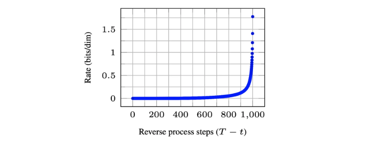
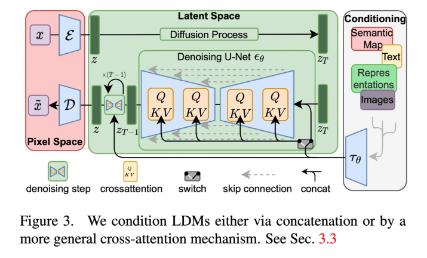
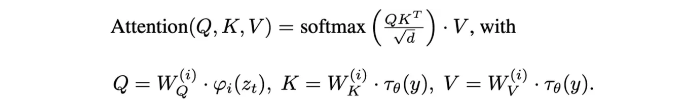
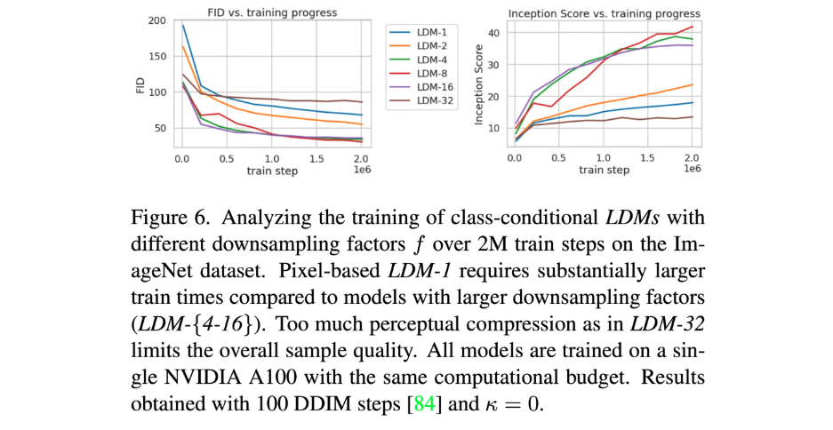
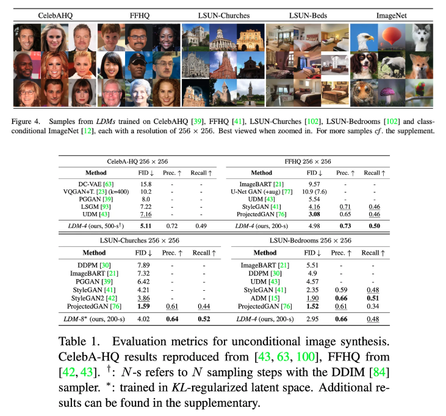
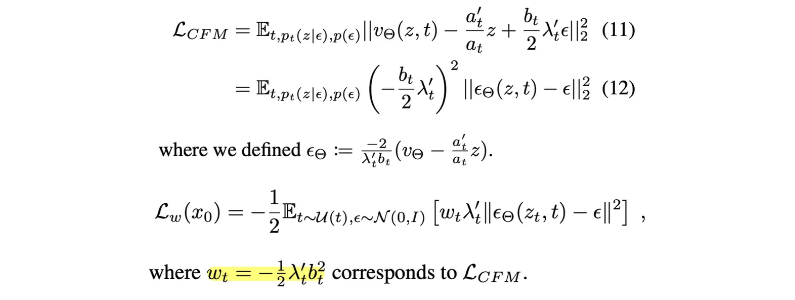
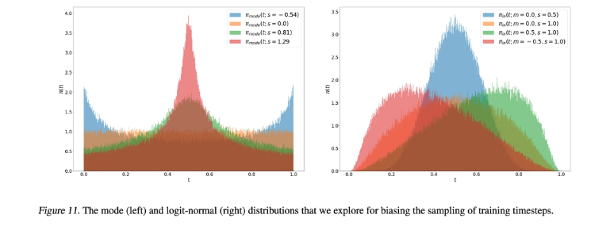
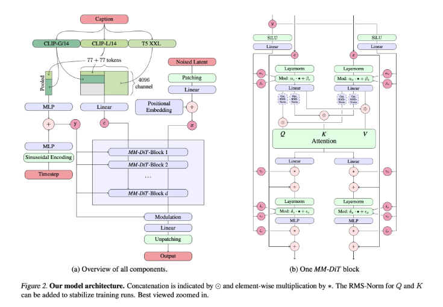
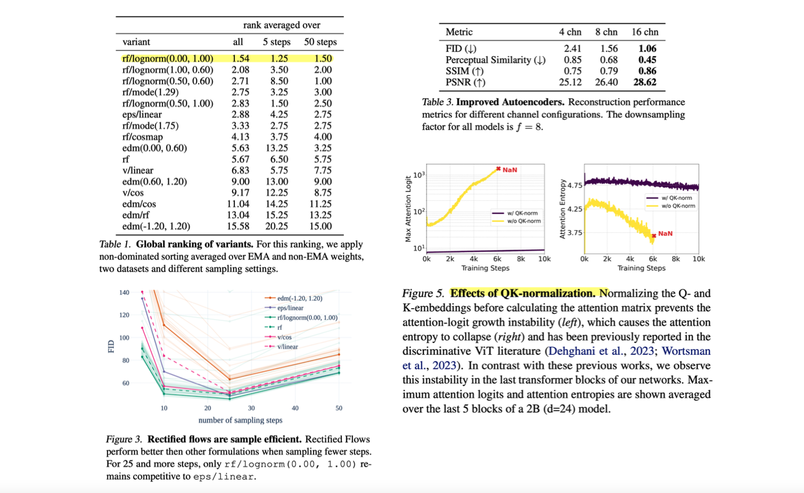

> 최근 몇 년 간의 Deep Generative Model의 발전 과정을 빠르게 훑고, 이 중 중요했던 diffusion과 flow matching 기반의 논문들을 리뷰합니다. 

### Introduction

최근 몇 년간 중요했던 논문들을 한 줄 요약해보면 다음과 같습니다.

- 2020.06 / DDPM: 데이터에 점진적으로 노이즈를 추가하는 forward process 과정 거친 후, 이를 역으로 제거하는 reverse process 학습
- 2019.07 / NCSN → 2020.12 / NCSN++: score function를 추정하여 데이터를 복원
- 2021.06 / LoRA: Parameter Efficient Fine-Tuning
- 2021.08 / LAION-400M: 대규모의 image-text pair 데이터셋
- 2021.12 / Stable Diffusion: pixel space가 아닌 latent space에서 diffusion 수행
- 2022.03 / LAION-5B: 대규모의 image-text pair 데이터셋 (LAION-400M 대비 14배)
- 2022.08 / DreamBooth: 3~5장 만으로 특정 주제나 스타일에 맞게 fine-tuning
- 2022.10 / Prompt-to-Prompt: 텍스트 프롬프트를 수정하여 이미지의 일부 속성을 변경
- 2022.12 / InstructPix2Pix: 자연어 명령을 기반으로 이미지를 수정할 수 있는 대화형 모델
- 2022.12 / DiT: Transformer 아키텍처를 기반으로 한 diffusion 모델
- 2023.02 / ControlNet: 이미지의 구조를 포즈, 스케치 등의 제어 조건을 통해 수정
- 2023.07 / SDXL: Stable Diffusion보다 더 큰 모델 아키텍쳐를 활용하여 더욱 사실적이고 디테일한 이미지를 생성
- 2023.08 / IPAdapter: 이미지를 프롬프트로 사용하여 새로운 이미지를 생성
- 2023.11 / ShareGPT4V: 강력한 image captioner 기능을 포함한 VLM
- 2022.10 / Flow Matching → 2024.03 / Stable Diffusion 3: Flow Matching 기법을 통해 diffusion process에서의 stochastic 노이즈 주입 없이 안정적인 이미지 생성 가능
- 2024.08 / Flux: Flow matching 기반의 높은 성능의 Text2Img 모델

2020년 DDPM 논문 이후로는 diffusion model이 우세했지만, 최근에는 flow matching 기반의 모델안 stable diffusion 3와 Flux 등이 제일 많이 활용되고 있습니다. DDPM에 대한 자세한 설명은 [이전 포스팅](https://yuhodots.github.io/deeplearning/24-11-09/)에서 설명하고 있으니 참고하시면 좋습니다. 

### Stable Diffusion

DDPM에서 부터 제안된 diffusion model들은 성능은 좋으나 학습/추론 속도에 있어서 매우 느리다는 단점을 가지고 있었습니다. 학습/추론 모두가 pixel space에서 진행되고, 여러번의 denoising step을 거쳐야 하기 때문에 매우 많은 양의 GPU로 오랜 시간 학습해야 했고, 이에 따라 고화질 이미지 생성이 어려웠습니다.

고화질 이미지 생성을 하기위해 먼저 살펴볼 내용은 Perceptual Compression과 Semantic Compression입니다.

- Perceptual Compression: 이미지의 시각적 특징을 압축하고 복원
- Semantic Compression: 이미지의 high-level 의미적 정보를 압축하고 복원

고화질 이미지 생성을 위해서는 Perceptual Compression과 관련된 ‘rate’을 올릴 수 있어야 하는데 그러기 위해서 diffusion model로는 적게는 25 step 부터 많게는 1000 step의 denoising step을 거쳐야 합니다. 따라서 diffusion model 기반으로 perceptual compression을 하는 것은 매우 비효율적이라는 것을 알 수 있습니다.

그래서 Stable Diffusion 논문의 저자들은 perceptual compression(즉, 시각적 특징을 압축하고 복원)을 위해서는 diffusion model에 비해 훨씬 효율적인 VAE를 활용하고, semantic compression(즉, high-level 의미적 정보를 압축하고 복원)을 위해서만 diffusion model을 활용하는 방식을 제안합니다.

##### Method

Perceptual compression을 위한 모델, 즉 VAE에서 중요한 것은 pixel loss를 통해 local realism을 살리고 bluriness를 피하는 것입니다. 그래서 이와 관련된 선행 연구들(perceptual loss와 patch-based adversarial loss)을 참고하였습니다. Latent vector $z$를 $h, w, c$ dimension이라 할 때, 기존 $H, W$에 대해 downsample factor $f = H/h = W/w$로 표현하면 $f$가 4 혹은 8인 경우 대체적으로 좋은 성능을 보였습니다. Latent space의 variance가 커지는 것을 막기 위해서 KL reg.와 VQ reg.를 추가하였습니다. (해당 regularization은 필수는 아니고 optional입니다.)

Semantic compression을 위한 모델, 즉 latent space에서의 diffusion model과 관련되어서는, DDPM처럼 noise에 대한 예측을 수행합니다. 대신 여기서는 pixel space $x_t$가 아닌 latent space $z_t$에 대한 예측을 수행합니다. $t$는 uniformly sampling 됩니다.

추가적으로 conditional image generation 기작도 쉽게 넣을 수 있습니다. 기존 $\epsilon_\theta(z_t, t)$를 $\epsilon_\theta(z_t, t, y)$의 형태로 변경해주면 됩니다. 저자들은 이를 UNet에 cross-attention layer를 삽입함으로써 구현합니다. Query head에는 이전 layer의 embedding이 입력되지만, key와 value head에는 conditioning embedding $y$가 입력됩니다.

최종적으로 latent diffusion model은 아래와 같이 정의됩니다.
$$
L_{L D M}:=\mathbb{E}_{\mathcal{E}(x), y, \epsilon \sim \mathcal{N}(0,1), t}\left[\left\|\epsilon-\epsilon_\theta\left(z_t, t, \tau_\theta(y)\right)\right\|_2^2\right]
$$

##### Experiments

Experiments에서는 먼저 perceptual compression tradeoffs에 대해서 분석하며, latent space의 dimension을 적절하게 설정하는 것의 중요성을 이야기 합니다. 

1. 너무 조금 압축하면 diffusion model이 perceptual compression을 많이 해야해서 느립니다 (이건 저자가 의도한 바가 아님)
2. 너무 많이 압축하면 information loss가 발생하여 높은 퀄리티를 달성하기 힘듦

Unconditional image generation 결과는 다음과 같습니다. 

### Stable Diffusion 3

그 다음으로는 비교적 최신 모델인 stable diffusion 3에 대해 이야기 해보겠습니다. Stable diffusion 3를 이해하기 위해서는 먼저, flow matching에 대해 이해하고 넘어가야 합니다. Diffusion model과 flow matching을 간단히 비교하자면 다음과 같습니다.

- Diffusion model
  - Forward process: gaussian noise를 점진적으로 추가해서 최종적으로 $\mathcal N(0, I)$ 만들자
  - Backward process: $t$ step에서 추가된 noise를 예측하고 제거하여, $\mathcal N(0, I)$에서 원본 데이터로 점진적으로 복원시키자
- Flow matching
  - Forward process: 데이터 포인트에서 시작해서 $\mathcal N(0, I)$로 이동하기 위한 확률 경로를 가정하고, 이 경로를 따라 데이터가 이동할 때의 vector field를 학습하자.
  - Backward process: 학습된 vector field를 사용하여, $\mathcal{N}(0, I)$에서 샘플링한 데이터를 경로를 따라 이동시키며 복구하자.

Flow matching을 이해하기 위해 먼저 알아야 할 주요 개념들은 아래와 같습니다.

- Flow $\psi_t(x_0)$: $x_0$를 입력으로 받으며, ‘초기에 $x_0$ 였던 데이터가 $t$ 시점에 어느 곳에 위치할지’를 의미
- Vector Field $u_t(\psi_t(x_0))$: $\psi_t(x_0)$를 입력으로 받으며, $\psi_t(x_0)$를 $t$로 미분한 값. ‘$t$ 시점의 데이터가 어느 방향으로 흘러갈지’를 의미. 즉 $\psi^{'}_t(x_0) = u_t$
- Conditional Flow Matching Loss $\mathcal L_{CFM}$

여기서 드는 의문점들이 있습니다.

- 예측 vector field $v_t$는 모델 기반으로 예측하면 되는데
- target vector field $u_t$는 어떻게 정의하지?

이 문제들을 해결하기 위해서는 먼저 ‘target flow’의 형태를 정의하는 과정이 먼저 필요하고, target flow는 $t=0$일 때 $x_0$이고, $t=1$일 때 $\mathcal N(0, I)$인 형태여야 합니다. 이 형태라면 어떤 것이든 가능합니다.

##### Simulation-Free Training of Flows

이제 논문으로 들어가도록 하겠습니다. 논문에서는 먼저, flow matching의 objective  $\mathcal L_{CFM}$를 diffusion 처럼 noise 기반으로 표현하려면 어떻게 해야하는지에 대해 쭉 설명합니다. $0<t<1$ 시점의 데이터는 아래의 형태로 정의되며, $a_0=1, b_0=0, a_1=0, b_1=1$ 값을 갖습니다.
$$
z_t=a_t x_0+b_t \epsilon \quad \text { where } \epsilon \sim \mathcal{N}(0, I)
$$
$\psi^{-1}_t(z|\epsilon)$은 결국 $x_0$을 의미하므로 아래와 같이 식을 적을 수 있습니다.
$$
\begin{aligned}
& \psi_t(\cdot \mid \epsilon): x_0 \mapsto a_t x_0+b_t \epsilon \\
& u_t(z \mid \epsilon):=\psi_t^{\prime}\left(\psi_t^{-1}(z \mid \epsilon) \mid \epsilon\right)
\end{aligned}
$$
여기서 다시  $\psi_t^{\prime}\left(x_0 \mid \epsilon\right)=a_t^{\prime} x_0+b_t^{\prime} \epsilon \text { and } \psi_t^{-1}(z \mid \epsilon)=\frac{z-b_t \epsilon}{a_t}$ 임을 이용하여 정리하면 아래와 같이 되고,
$$
z_t^{\prime}=u_t\left(z_t \mid \epsilon\right)=\frac{a_t^{\prime}}{a_t} z_t-\epsilon b_t\left(\frac{a_t^{\prime}}{a_t}-\frac{b_t^{\prime}}{b_t}\right)
$$
또  $\lambda_t = \log{\frac{a^2_t}{b^2_t}}$로 치환하여 정리하면 아래와 같이 정리됩니다.

##### Flow Trajectories: Rectified Flow

그렇다면 conditional flow matching의 식은 위처럼 적을 수 있다는 것은 알겠는데, 그러면 모델이 학습을 위해 활용할 target flow는 어떻게 가정하는 것이 좋을지는 아래에서 확인할 수 있습니다.

$t$  시점의 데이터의 위치를  $z_t$라고 하고, $t=0$일 때는 $x_0$이 되어야 하고, $t=1$일 때는 $\mathcal N(0, I)$가 되어야 한다고 했는데, 따라서 사용할 수 있는 forward process의 형태는 여러 개가 있습니다.

여러 가지의 form을 소개(e.g., EDM, Cosine, LDM-Linear)하지만, 저자들은 이중에서 data distribution과 standard normal distribution을 직선으로 연결하는 rectified flow를 선택합니다.
$$
z_t=(1-t) x_0+t \epsilon
$$
모델이 예측하기에 더 어려운 것은 중간의 t에 대한 예측이기에, 따라서 0과 1 사이의 중간지점에 대한 샘플링을 많이 하는 방법도 있지만 저자들은 loss의 가중치 역할을 하는 $w_t$를 변경하는 방식으로 이를 구현하였습니다. 원래는 rectified flow인 경우에 $w_t$는 $\frac{t}{1-t}$로 정의되는데, 이 값에 $\pi(t)$를 추가합니다: $w_t^\pi=\frac{t}{1-t} \pi(t)$

$\pi(t)$도 여러 form을 사용할 수 있습니다. 

##### Text-to-Image Architecture

기본적으로는 LDM(stable diffusion)의 셋업에 따라 pre-trained autoencoder를 사용했는데, backbone은 UNet이 아닌 DiT backbone을 기반으로 새로 제작하였습니다. LDM 논문 처럼 autoencoder와 text encoder는 pre-trained frozen 네트워크 사용하고, MM-DiT backbone는 학습하였습니다.

Multi-modal에 적합한 DiT라서 MM-DiT 입니다.

- $y$: timestep와 text에 대한 coarse-grained information(대략적 정보)을 입력으로 받아, text와 image에 modulation(shifting & baising)을 걸어주는 벡터입니다.
- $c$: text conditioning을 위한 text representation 입니다.
- $x$: 이미지 생성을 위한 noise latent 입니다

Text와 image embedding이 개념적으로 다르기 때문에, 각각 별도의 parameter를 통과하며 attention 시에만 합쳐진다는 것이 특징입니다. 

##### Experiments

적용한 방법이 제일 좋았다는 것을 보여주는 표, rf/lognorm(0.00, 1.00)은 sampling step도 10~30만 해도 충분하다는 결과, latent channel d가 깊을수록 더 이미지 품질이 좋았다는 결과, 고화질 학습에서는 attention logit이 너무 커져 발산하여서 Q와 K에 normalize 기작을 걸어주었다는 점 등의 다양한 실험 결과를 제공합니다.

### Flux

공식 논문이 없기 때문에 제공된 코드 기반으로 구조를 파악해야하는데, flux의 구조 분석을 수행한 reddit 글을 발견하여 아래에 링크 공유합니다. 

- https://www.reddit.com/r/LocalLLaMA/comments/1ekr7ji/fluxs_architecture_diagram_dont_think_theres_a/?rdt=57296

