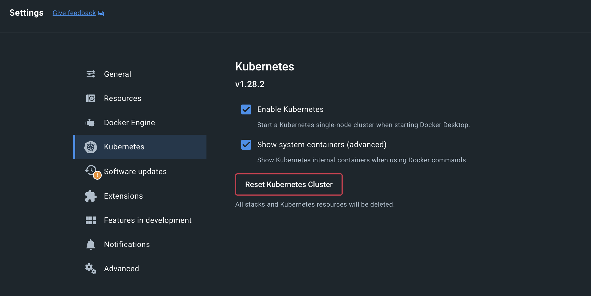

> Kubernetes는 컨테이너 오케스트레이션 플랫폼 중 하나로 다수의 컨테이너 어플리케이션을 운영 및 관리하고, 배포하고, 확장할 수 있는 여러 자동화된 기능들을 제공하고 있습니다. 본 포스팅에서는 Kubernetes의 기본 개념부터, kubectl, helm 등에 대해 기록합니다.

### Kubernetes Components

쿠버네티스 클러스터를 갖기 위해 필요한 요소들은 다음과 같습니다. 

- **컨트롤 플레인 컴포넌트**
  - **kube-apiserver**: Kubernetes API 서버로서 클러스터의 모든 요청을 처리하고 인증, 권한 부여, API 검증/설정을 담당
  - **etcd**: 모든 클러스터 데이터를 저장하는 고가용성 키-값 저장소로, Kubernetes의 상태를 유지
  - **kube-scheduler**: 새로 생성된 Pod에 적합한 노드를 선택하는 스케줄링 작업을 수행
  - **kube-controller-manager**: 노드, 레플리카, 엔드포인트 등의 상태를 지속적으로 관리하고 조정하는 컨트롤러들을 실행
  - cloud-controller-manager: 클러스터 자원을 관리하고 조정

- **노드 컴포넌트**
  - **kubelet**: 각 노드에서 실행되며 Pod 및 컨테이너의 상태를 관리하고 보고
  
  - **kube-proxy**: 네트워크 프록시로서 네트워킹을 관리하고 Kubernetes 서비스 간의 통신을 처리
  
  - **컨테이너 런타임** (Kubernetes CRI - containerd, CRI-O...): 컨테이너를 실행하고 관리하는 소프트웨어
  
- 애드온

  - DNS: Kubernetes 서비스 간의 이름 해석을 제공하여 네트워킹을 간소화

  - 웹 UI (대시보드): 클러스터의 상태를 모니터링하고 관리하기 위한 사용자 인터페이스를 제공

  - 컨테이너 리소스 모니터링: 각 컨테이너의 리소스 사용량을 추적하고 모니터링

  - 클러스터-레벨 로깅: 클러스터 내의 로그 데이터를 수집하고 저장하여 문제 해결과 감사에 사용

### Kubernetes Objects

쿠버네티스 시스템에서 영속성을 가지는 오브젝트 kubernetes objects라고 말하는데, 공식 홈페이지에서는 '하나의 의도를 담은 레코드'라고 설명하고 있습니다. 

- 어떤 애플리케이션이 동작 중이고, 어느 노드에서 위치하는지 기술
- 해당 애플리케이션이 이용할 수 있는 리소스 기술
- 해당 애플리케이션의 재구동 정책, 업그레이드 정책 등 여러 정책적 요소는 어떤지 기술

##### Object spec

```yaml
apiVersion: apps/v1
kind: Deployment
metadata:
  name: nginx-deployment
spec:
  selector:
    matchLabels:
      app: nginx
  replicas: 2 # tells deployment to run 2 pods matching the template
  template:
    metadata:
      labels:
        app: nginx
    spec:
      containers:
      - name: nginx
        image: nginx:1.14.2
        ports:
        - containerPort: 80
```

- **`apiVersion`**: 오브젝트를 생성에 사용되는 쿠버네티스 API 버전
  - POD: v1
  - Service: v1
  - ReplicaSet: apps/v1
  - Deployment: apps/v1

- **`kind`**: 오브젝트 종류
- **`metadata`**: 클러스터 내에서 오브젝트를 구분지어 주기 위한 정보
  - name: 오브젝트의 이름
  - labels: 비슷한 오브젝트들을 연결지어주는 레이블

- **`spec`**: 오브젝트에 대해 어떤 상태를 의도하는지에 대한 정보

##### Resources

- **Workloads**
  - **Pod**: 하나 이상의 컨테이너를 포함하는 가장 작은 배포 단위

  - ReplicationController: 원하는 수의 Pod를 유지하도록 관리 (거의 사용되지 않고 ReplicaSet으로 대체)

  - **ReplicaSet**: 특정 수의 Pod를 유지하도록 관리

  - **Deployment**: 애플리케이션의 선언적 업데이트를 제공

  - **StatefulSet**: 고유하고 안정적인 네트워크 식별자와 스토리지의 순서를 보장하는 애플리케이션을 관리

  - **DaemonSet**: 모든 (또는 일부) 노드에서 실행되는 Pod를 보장

  - **Job**: 일회성 작업을 관리하고 완료를 보장

  - **CronJob**: 일정에 따라 주기적으로 작업을 수행

- **Network**
  - **Service**: Pod 간의 네트워크 접속을 관리

  - **Ingress**: 외부 HTTP 및 HTTPS 트래픽을 클러스터 내의 서비스로 라우팅

  - **NetworkPolicy**: Pod의 네트워크 트래픽을 제어

  - 이 외, Endpoint, Network policy, Port forwarding...
- **Config**
  - **ConfigMap**: 애플리케이션 설정 데이터를 저장하고 관리

  - **Secret**: 민감한 데이터(예: 비밀번호, 토큰, 키)를 저장하고 관리

  - **ResourceQuota**: 네임스페이스 내에서 리소스 사용량을 제한

  - **LimitRange**: 네임스페이스 내의 리소스 사용량을 제한하고 요청과 한계를 정의
- **Access Control**
  - **ServiceAccount**: Pod에 권한을 부여하기 위한 사용자 계정

  - **Role**: 네임스페이스 내 리소스에 대한 권한을 정의

  - **ClusterRole**: 클러스터 전체에 걸쳐 리소스에 대한 권한을 정의

  - **RoleBinding**: 네임스페이스 내의 사용자/그룹에 역할을 부여

  - **ClusterRoleBinding**: 클러스터 전체의 사용자/그룹에 역할을 부여

- **Storage**
  - **PersistentVolume (PV)**: 클러스터 내의 스토리지 리소스를 나타냄

  - **PersistentVolumeClaim (PVC)**: 사용자와 Pod가 사용할 스토리지를 요청

  - **StorageClass**: 스토리지 제공자의 스토리지 설정을 정의

  - VolumeAttachment: 외부 스토리지 시스템의 볼륨을 클러스터의 노드에 연결

- etc.
  - **Namespace**: 논리적으로 클러스터 리소스를 그룹화

  - PodSecurityPolicy: Pod 보안 정책을 정의하여 Pod의 보안 설정을 제어

  - HorizontalPodAutoscaler: 애플리케이션의 부하에 따라 Pod의 수를 자동으로 조정

  - VerticalPodAutoscaler: Pod의 리소스 요청을 자동으로 조정

  - PodDisruptionBudget: 클러스터 관리 중에 서비스 가용성을 보장하기 위한 최소 Pod 수를 정의

  - CustomResourceDefinition (CRD): 사용자 정의 리소스를 정의하여 Kubernetes API를 확장


### Kubectl

Kubernetes API를 사용하여 쿠버네티스 클러스터의 컨트롤 플레인과 통신하기 위한 커맨드라인 툴을 kubectl 이라고 합니다. kubectl 관련 *[명령어](https://kubernetes.io/ko/docs/reference/kubectl/#명령어), [지원 리소스 타입](https://kubernetes.io/ko/docs/reference/kubectl/#리소스-타입), [출력 설정](https://kubernetes.io/ko/docs/reference/kubectl/#출력-옵션)* 등에 대한 더 자세한 설명은 공식 홈페이지에 기술되어 있습니다. 

```
kubectl [command] [TYPE] [NAME] [flags]
```

- `command`: 수행할 작업을 지정
  - **`get`**: 리소스 조회
  - **`create`**: 새로운 리소스 생성
  - **`apply`**: YAML 파일을 이용해 리소스를 생성 또는 업데이트
  - **`delete`**: 리소스 삭제
  - **`describe`**: 리소스의 상세 정보를 표시
  - `edit`: 리소스 편집
  - **`logs`**: 특정 Pod의 로그 조회

- `TYPE`: 리소스 타입을 지정. 리소스 유형은 단수형과 복수형을 모두 사용할 수 있음
  - `pod`, `pods`, `deployment`, `deployments`, `service`, `services`, `node`, `nodes`, `configmap`, etc.
  
- `NAME`: 작업할 리소스의 유형을 지정. 이름 생략시, 해당 리소스 유형의 모든 인스턴스를 대상으로 명령 적용
  - 리소스가 모두 동일한 타입인 경우: `TYPE1 name1 name2 name<#>`: `kubectl get pod example-pod1 example-pod2`
  - 여러 리소스 타입을 개별적으로 지정하고 싶은 경우: `TYPE1/name1 TYPE1/name2 TYPE2/name3 TYPE<#>/name<#>`: `kubectl get pod/example-pod1 replicationcontroller/example-rc1`
  
  - 하나 이상의 파일로 리소스를 지정하려는 경우: `-f file1 -f file2 -f file<#>`
  
- `flags`: 선택적 플래그

  - `-s` 또는 `--server`: 쿠버네티스 API 서버의 주소와 포트를 지정
  - `-n` 또는 `--namespace`: 명령을 실행할 네임스페이스를 지정
  - `-o` 또는 `--output`: 출력 형식을 지정 (`-o yaml`, `-o json`, `-o wide`)
  - `--kubeconfig`: 특정 kubeconfig 파일을 사용하도록 지정
  - `--context`: 명령을 실행할 kubeconfig 컨텍스트를 지정

### YAML

- 데이터 표현: 데이터는 key, value 형태로 표현됨
- Indentation: 기본적으로는 2칸을 권장(helm에서는 2칸만 지원)하며 4칸도 가능
- Boolean: true, false 뿐만 아니라 yes, no도 지원
- List: 하이픈('-')으로 표현
  - dict와 list를 abbrviate 형태로 표현도 가능함 
  - e.g., `martin: {name: Martin D'vloper, job: Developer, skill: Elite}`
  - e.g., `fruits: ['Apple', 'Orange', 'Strawberry', 'Mango']`


- Multiline string
  - `|`: 블록 내 줄바꿈 문자를 유지
  - `>`: 블록 내 줄바꿈 문자를 스페이스로 변환
  - `|-`: 마지막 줄바꿈을 제외하고 인식
- `---`: 문서의 시작 (optional)
- `...`: 문서의 끝 (optional)

### Core Concepts for CKA

- k8s에서 pod을 yaml 기반으로 선언하는 간단한 예제
  - `kubectl apply -f pod.yaml` 를 통해 적용 가능

```yaml
# pod definition
apiVersion: v1
kind: Pod
metadata:
  name: my-simple-pod
  labels:
    app: my-app
spec:
  containers:
  - name: my-container
    image: nginx:latest
    ports:
    - containerPort: 80
```

- **RepicaSets**: 특정 개수의 동일한 Pod이 항상 실행되도록 보장. 그러나 보통 Deployment를 통해 관리
  - 라벨 셀렉터를 사용해 관리할 Pod을 식별
  - 수동으로 업데이트 필요하며, 롤백 지원하지 않음
- **Deployments**: ReplicaSet의 상위 개념으로, Pod과 ReplicaSet에 대한 선언적 업데이트를 제공. 애플리케이션의 배포를 쉽게 관리하며, 무중단 업데이트를 보장
  - 롤링 업데이트 및 롤백 기능 제공

```yaml
# k8s yaml definition for ReplicaSet
apiVersion: apps/v1
kind: ReplicaSet
metadata:
  name: my-replicaset
spec:
  replicas: 3
  selector:
    matchLabels:
      app: my-app
  template:	# 위의 pod.yaml에서 내용 거의 그대로 가져오면 됨
    metadata:
      labels:
        app: my-app
    spec:
      containers:
      - name: my-container
        image: nginx:latest
```

- **Service**: Pod의 네트워크를 노출하고, 로드밸런싱을 제공하여 클러스터 내부와 외부에서 안정적으로 애플리케이션에 접근할 수 있도록 도와줌

| Type             | Internal | External | Description                                                  |
| ---------------- | -------- | -------- | ------------------------------------------------------------ |
| **ClusterIP**    | O        | X        | 클러스터 내부에서만 접근 가능한 내부 IP를 생성               |
| **NodePort**     | O        | O        | 테스트 또는 간단한 외부 노출을 위해, 클러스터 외부에서 접근 가능하도록 각 노드의 특정 포트를 열어즘 (**노드의 IP 사용**) |
| **LoadBalancer** | O        | O        | '클라우드 환경'에서 외부 로드밸런서를 자동으로 생성해 외부 접근을 제공. 클라우드 제공 업체(AWS, GCP, Azure 등)의 **네트워크 로드밸런서를 사용**하며, NodePort와 ClusterIP를 내부적으로 사용 |
| **ExternalName** | -        | O        | **DNS 이름을 사용**해 클러스터 외부 서비스로 요청을 라우팅. 클러스터 외부의 데이터베이스나 API 서버를 Kubernetes 네임스페이스 내부에서 사용할 수 있도록 설정하여 외부 서비스와의 통합 가능 |
| **Headless**     | O        | X        | Stateful 애플리케이션 또는 Pod 직접 접근                     |

- **Namespace**: 하나의 클러스터를 논리적으로 분리하여 여러 애플리케이션, 팀, 환경(예: 개발, 테스트, 프로덕션)을 독립적으로 관리할 수 있도록 하는 가상 클러스터
  - **default**: 특별히 지정하지 않은 리소스가 생성되는 기본 namespace
  - **kube-system**: Kubernetes 시스템 구성 요소(Pod, Service 등)가 포함된 namespace
  - **kube-public**: 모든 사용자가 읽기 가능한 공개 namespace
  - **kube-node-lease**: 각 노드의 상태를 추적하기 위해 사용
  - yaml apply 혹은 `kubectl create namespace my-namespace` 통해 생성 가능

```yaml
# kubectl apply -f namespace.yaml
apiVersion: v1
kind: Namespace
metadata:
  name: my-namespace
```

##### Scheduling

- Manual Scheduling
  - k8s에서 이미 생성된 pod의 nodeName 변경은 불가
  - 따라서 이미 생성된 pod에 node를 할당하려면, Binding object를 생성하고 binding API에 요청 보내기
- **Label**: 기본 형식은 `<prefix>/<name>` 형태인데 prefix는 선택사항이고, 일반적으로 도메인 이름 형식을 따름 (예: `example.com/mylabel`). `kubectl get pods --selector app=App1`과 같은 형태로 필터링 가능
  - `app`: 애플리케이션 이름.
  - `env`: 환경 정보 (예: `production`, `staging`, `dev`).
  - `tier`: 애플리케이션 계층 (예: `frontend`, `backend`, `database`).
  - `role`: 역할 정보 (예: `web-server`, `data-store`).
  - `function`: 특정 기능을 나타내는 라벨.

```yaml
apiVeision: v1
kind: Pod
metadata:
	name: simple-webapp
	labels:
		app: App1
		function: Front-End
```

- **Taints**: 노드에 적용되어 특정 파드가 해당 노드에 스케줄링되지 못하게 하는 메커니즘입니다. 노드에 Taint(오염)가 설정되면, 해당 Taint를 "참을 수 있는" 파드(Toleration)가 아니면 그 노드에 배치되지 않습니다.
  - Key: Taint의 이름 또는 속성 / Value: 선택 사항으로, Key에 대한 추가 정보 제공 / Effect: Taint의 효과를 정의하며, 아래 중 하나를 사용
  - **`NoSchedule`**: Taint를 참을 수 없는 파드는 이 노드에 배치되지 않음
  - **`PreferNoSchedule`**: 가능한 한 이 노드에 배치되지 않으나, 강제하지 않음
  - **`NoExecute`**: 즉시 노드에서 파드를 제거하며, 새 파드도 스케줄링되지 않음
  - 흥미로운 사실: Master node는 NoSchedule taints가 걸려있고, 어떠한 application pod도 뜨지 않음 

```yaml
key=value:effect
```

- **Toleration**: 파드가 특정 Taint를 "참을 수 있도록" 허용하는 설정입니다. Toleration이 없는 파드는 Taint가 있는 노드에 스케줄링될 수 없습니다.
  - Key: Taint의 Key와 일치해야 함
  - Operator: `Equal`는 Key와 Value가 일치해야 Toleration 인정 / `Exists`는 Key만 일치하면 Toleration 인정
  - Value: Taint의 Value와 일치해야 함 (Equal인 경우에만 사용)
  - Effect: Taint의 Effect와 일치해야 함

```yaml
apiVersion: v1
kind: Pod
metadata:
  name: toleration-example
spec:
  tolerations:
  - key: "dedicated"
    operator: "Equal"
    value: "web"
    effect: "NoSchedule"
  containers:
  - name: nginx
    image: nginx
```

- **Node Selector**: Pod를 특정 Node에 스케줄링하기 위한 가장 간단한 메커니즘. Pod의 스펙에 `nodeSelector` 필드를 정의하여 특정 라벨을 가진 Node에만 Pod를 스케줄링하도록 제한
  - 복잡한 조건이나 논리 연산(예: OR, NOT)을 지원하지 않음

```yaml
apiVersion: v1
kind: Pod
metadata:
  name: my-pod
spec:
  containers:
  - name: my-container
    image: nginx
  nodeSelector:
    disktype: ssd
```

- **Node Affinity**: Node Selector의 한계를 보완하며, 더 유연하고 고급 스케줄링 옵션을 제공
  - `requiredDuringSchedulingIgnoredDuringExecution`: 필수 조건, 만족하지 않으면 스케줄링되지 않음
  - `preferredDuringSchedulingIgnoredDuringExecution`: 선호 조건, 가능하면 스케줄링하되 반드시 만족할 필요는 없음
  - 다중 조건 지원 (예: AND, OR)

```yaml
apiVersion: v1
kind: Pod
metadata:
  name: my-pod
spec:
  affinity:
    nodeAffinity:
      requiredDuringSchedulingIgnoredDuringExecution:
        nodeSelectorTerms:
        - matchExpressions:
          - key: disktype
            operator: In
            values:
            - ssd
      preferredDuringSchedulingIgnoredDuringExecution:
      - weight: 1
        preference:
          matchExpressions:
          - key: region
            operator: In
            values:
            - us-west-1
  containers:
  - name: my-container
    image: nginx
```

- **Requirements & Limits**
  - no request & no limit: 하나의 pod이 너무 많은 node cpu 차지할 수 있음
  - no request & limit: 이 경우는 k8s에서 자동으로 request = limit으로 설정
  - request & limit: 특정 pod이 cpu 많이 필요한 작업을 할 때, limit 때문에 최고 효율 내지 못할 수 있음
  - request & no limit: 기본적인 cpu 보장 받으면서도 필요할 때 효율도 낼 수 있음
  - 대신 메모리의 경우엔, cpu와 달리 memory가 꽉 차면 pod을 일부 죽이는 수 밖에 없다.
- **DemonSets**: 클러스터의 모든 (또는 선택된) node에 특정 pod를 하나씩 실행하도록 보장하는 리소스
  - monitoring solution & logs viewer에 사용
  - kube-proxy나 weave-set도 DemonSet 중 하나임
- **Static Pods**: api server를 거치지 않고, 특정 node에서 직접 kubelet에 의해 관리되는 pod
  - 사용 예제: 클러스터의 기본 컴포넌트 실행(예: etcd, kube-apiserver, kube-controller-manager), API 서버 없이 동작해야 하는 고가용성 환경, 등
  - 장점: api server가 다운되더라도 pod를 유지 가능, Kubernetes 외부에서 독립적으로 실행 가능.
  - 단점: 중앙에서 관리할 수 없으며 수동 작업 필요, 상태나 변경 사항을 Kubernetes 클러스터에서 쉽게 확인하거나 수정할 수 없음.
- Scheduling Plugins: 아래 플러그인 외에도 커스텀 가능
  1. Scheduling queue: PrioritySort
  2. Filtering: NodeResourcesFit, NodeName, NodeUnschedulable, ...
  3. Scroing: NodeResourcesFit, ImageLocality, ...
  4. Binding: DefaultBinder

##### Application Lifecycle Management

- **Rolling Update**: `kubectl apply` 명령어를 사용하여 deployment를 업데이트하면, rollout update가 자동으로 수행됨
  - `kubectl rollout status deployment <deployment-name>`: rollout 상태 확인

  - `kubectl rollout restart deployment <deployment-name>`: deployment 업데이트하지 않고, rollout 방식으로 pod restart
- **Rollback**: Deployment를 이전 상태로 복구하는 작업
  - `kubectl rollout undo deployment <deployment-name>`: 바로 이전의 상태로 복구
  - `kubectl rollout history deployment <deployment-name>`: revision 기록 확인 (revision-number 확인 가능)
  - `kubectl rollout undo deployment <deployment-name> --to-revision=<revision-number>`: 특정 버전으로 복구
  - Kubernetes는 기본적으로 Deployment의 최대 10개 Revision을 기록. 이 제한은 `revisionHistoryLimit` 필드로 설정할 수 있음


- **ConfigMap**: 환경설정 데이터를 관리하기 위한 리소스

```yaml
apiVersion: v1
kind: ConfigMap
metadata:
  name: my-config
data:
  key1: value1
  key2: value2
```

```yaml
apiVersion: v1
kind: Pod
metadata:
  name: pod-using-configmap
spec:
  containers:
  - name: my-container
    image: nginx
    env:
    - name: MY_KEY1
      valueFrom:
        configMapKeyRef:
          name: my-config
          key: key1
```

- **Secret**: 민감한 데이터를 안전하게 저장하고 관리하기 위한 리소스. 기본적으로 Base64로 인코딩되어 저장되지만, 암호화되어 있지는 않음

```yaml
apiVersion: v1
kind: Secret
metadata:
  name: my-secret
type: Opaque
data:
  username: bXktdXNlcg==   # "my-user"의 Base64 값
  password: bXktcGFzcw==   # "my-pass"의 Base64 값
```

```yaml
apiVersion: v1
kind: Pod
metadata:
  name: pod-using-secret
spec:
  containers:
  - name: my-container
    image: nginx
    env:
    - name: USERNAME
      valueFrom:
        secretKeyRef:
          name: my-secret
          key: username
```

- Multi-Container Pods: 앱과 logger를 함께 들고다니고 싶을 때, 이런 경우 multi-contianer 형태의 pod 활용해봐도 좋음. localhost로 통신 가능

  - **Sidecar 패턴**: 애플리케이션 컨테이너와 이를 보조하는 컨테이너를 함께 실행 (e.g., 애플리케이션 컨테이너와 로그를 수집하는 Fluentd 컨테이너)
  - **Ambassador 패턴**: 특정 서비스와의 통신을 처리하는 컨테이너(프록시 역할)를 포함

  - **initContainer**: 애플리케이션 컨테이너가 시작되기 전에 실행되는 컨테이너. InitContainer는 초기화 작업을 수행하고 종료된 후에 애플리케이션 컨테이너 실행 (예시: 애플리케이션 컨테이너의 실행 전 데이터 준비, 권한 설정, 네트워크 연결 테스트, 디펜던시 다운로드 등)

```yaml
apiVersion: v1
kind: Pod
metadata:
  name: init-container-pod
spec:
  initContainers:
  - name: init-container
    image: busybox
    command: ["sh", "-c", "echo 'Initializing...' && sleep 5"]
    volumeMounts:
    - name: shared-data
      mountPath: /app/data
  containers:
  - name: app-container
    image: nginx
    volumeMounts:
    - name: shared-data
      mountPath: /usr/share/nginx/html
  volumes:
  - name: shared-data
    emptyDir: {}
```

##### Cluster Maintenance

- OS Upgrades
  - **Drain**: `kubectl drain <node-name> --ignore-daemonsets --delete-emptydir-data`, 노드에서 실행 중인 모든 pod을 다른 노드로 이동시키는 작업
    
  - **Cordon**: `kubectl cordon <node-name>`, 노드를 스케줄링 대상으로 지정하지 않도록 설정. 새로운 pod이 해당 노드에 할당되지 않도록 하기 위해 사용
    
  - **Uncordon**: `kubectl uncordon <node-name>`, cordon 상태를 해제하여 노드가 다시 pod을 받을 수 있도록 함

- Cluster Upgrades
  - 전략 1. Master node를 업데이트한 뒤에, worker node를 하나씩 업그레이드. 이 때, 업그레이드 할 worker node는 다른 node로 drain & uncordon

  - 전략 2. Master node를 업데이트한 뒤에, worker node를 하나씩 업그레이드. 이 때, 업그레이드시 대용으로 사용할 새로운 node 추가 

- Backup & Restore
  - 전략 1. Resource Configuration Backup: 모든 Kubernetes 리소스의 YAML 또는 Helm 차트를 GitHub 같은 버전 관리 시스템에 저장, `kubectl get all --all-namespaces -o yaml > cluster-backup.yaml`
  - 전략 2. ETCD Cluster Backup, `ketcdctl snapshot save <snapshot.db> ...` 이후에 `ketcdctl snapshot restore <snapshot.db> --data-dir=<new-data-dir>`

##### Security

- Basics
  - **Authentication**: "누가" 접근 가능한지
  - **Authorization**: 그들이 "어떤 행위"를 할 수 있는지
  - TLS(Transport Layer Security): 클라이언트와 서버 간의 통신을 암호화하여 데이터의 기밀성과 무결성을 보장하는 프로토콜
  - Certificate API: 클러스터 내에서 TLS 인증서를 관리하는 메커니즘을 제공


- KubeConfig: KubeConfig 파일을 사용하여 클러스터와 사용자 간의 인증 및 연결을 설정
  - **clusters**: 클러스터의 API 서버 정보를 포함. URL과 인증서 데이터가 주요 정보
  - **contexts**: 클러스터와 사용자 간의 연결을 정의
  - **users**: 클러스터에 접근하는 사용자 정보를 포함. 인증 토큰, 클라이언트 인증서 및 키가 주요 정보
- **API Groups**: Kubernetes 리소스(예: Pods, Services, Deployments 등)를 그룹으로 나누어 API 요청을 관리하는 구조
  - **Core Group** (Legacy API): `https://<k8s-apiserver>/api/v1` 형태로, Kubernetes에서 가장 기본적인 리소스를 포함, Pod, Service, Node, Namespace, ConfigMap, Secret, PersistentVolume (PV), PersistentVolumeClaim (PVC) 등
  - **Named API Groups**:  `https://<k8s-apiserver>/apis/<group>/v1` 형태로, Core Group 외의 기능을 추가하거나 확장하기 위해 사용
  - Named API Groups에는 **apps** (`/apis/apps/v1`): Deployment, StatefulSet, DaemonSet, ReplicaSet / **batch** (`/apis/batch/v1`): Job, CronJob / **autoscaling** (`/apis/autoscaling/v1`): HorizontalPodAutoscaler (HPA) / **networking.k8s.io** (`/apis/networking.k8s.io/v1`): Ingress, NetworkPolicy / **rbac.authorization.k8s.io** (`/apis/rbac.authorization.k8s.io/v1`): Role, ClusterRole, RoleBinding, ClusterRoleBinding 등 존재
- Authorization mode: Node, ABAC, RBAC, Webhook, AlwaysAllow, AlwaysDeny가 존재
- **RBAC** (Role-Based Access Control)
  - Role을 먼저 생성하고, RoleBinding 통해 유저를 Role에 연결하는 방식
  - **Namespaced**: **roles, rolebindings**, pods, replicasets, jobs, deployments, serviced, secrets, configmaps, PVC
  - **Cluster Scoped**: **clusterroles**, **cluterrolebindings**, nodes, PV, namespaces
- Accounts
  - User account: 실제 사람이 사용하는 계정 (admin, developer, ...)
  - **Service account**: 머신이 사용하는 계정  (prometheus, jenkins, ...)
- **Network Policy**
  - 기본적으로 Kubernetes에서는 모든 pod 간의 네트워크 트래픽이 허용. Network Policy를 사용하면 특정 pod에 대한 트래픽 허용/차단 규칙을 정의 가능
  - `podSelector`: 정책이 적용될 pod를 선택
  - `policyTypes`: 정책의 유형, ingress, egress 또는 둘 다 설정 가능
  - `ingress`: 들어오는 트래픽 규칙 정의
  - `egress`: 나가는 트래픽 규칙 정의
  - `rules`: 트래픽을 허용할 조건을 정의, `from`, `to`, `ports` 기입

```yaml
apiVersion: networking.k8s.io/v1
kind: NetworkPolicy
metadata:
  name: mixed-policy
  namespace: default
spec:
  podSelector:
    matchLabels:
      app: backend
  policyTypes:
    - Ingress
    - Egress
  ingress:
    - from:
        - podSelector:
            matchLabels:
              app: frontend
      ports:
        - protocol: TCP
          port: 8080
  egress:
    - to:
        - ipBlock:
            cidr: 172.16.0.0/12
      ports:
        - protocol: TCP
          port: 3306

```

##### Storage

| 스토리지 유형               | 설명                                                         | 사용 사례                                |
| --------------------------- | ------------------------------------------------------------ | ---------------------------------------- |
| EmptyDir                    | Pod 라이프사이클 동안 유지. Pod이 삭제되거나 재시작되면 데이터 소멸 | 캐시, 임시 파일 저장                     |
| HostPath                    | 노드 파일 시스템 경로 사용. 노드와 강하게 결합되어 Pod의 이동성이 제한됨 | 디버깅, 로그 저장                        |
| PersistentVolume (PV)       | 클러스터 관리자에 의해 관리. 클러스터 외부의 실제 스토리지를 Kubernetes 리소스로 추상화 | 지속적 데이터 저장, 스토리지 백엔드 연결 |
| PersistentVolumeClaim (PVC) | 애플리케이션이 PV를 요청할 때 사용하는 리소스. 요청 스토리지 크기 및 액세스 모드를 지정 | 애플리케이션-스토리지 연결               |
| StorageClass                | PV를 동적으로 프로비저닝하기 위한 템플릿 역할. 관리자 설정에 따라 PV를 자동으로 생성하며 `reclaimPolicy`(삭제, 보존 등) 설정 가능 | 다양한 백엔드 스토리지 지원              |

- PV로 사용 가능한 볼륨 유형: HostPath, NFS (Network File System), AWS EBS (Elastic Block Store), GCE Persistent Disk (PD), CSI (Container Storage Interface) 등
- Static Provisioning: 클러스터 관리자가 직접 PersistentVolume(PV)을 생성하고 구성한 다음, 이를 애플리케이션에서 PersistentVolumeClaim(PVC)으로 요청하여 사용하는 방식
- Dynamic Provisioning: PVC가 생성될 때 Kubernetes가 자동으로 적합한 PersistentVolume(PV)을 프로비저닝하는 방식. **StorageClass**를 사용하여 동작하며, 사용자는 스토리지 유형, 크기, 접근 모드만 지정하면 됨

```yaml
# PersistentVolume 
apiVersion: v1
kind: PersistentVolume
metadata:
  name: pv-example
spec:
  capacity:
    storage: 10Gi
  accessModes:
    - ReadWriteOnce
  persistentVolumeReclaimPolicy: Retain
  nfs:
    path: /nfs/share
    server: 192.168.1.1
```

```yaml
# PersistentVolumeClaim 
apiVersion: v1
kind: PersistentVolumeClaim
metadata:
  name: pvc-example
spec:
  accessModes:
    - ReadWriteOnce
  resources:
    requests:
      storage: 5Gi
```

```yaml
# PVC와 PV 연결:
volumes:
- name: persistent-storage
  persistentVolumeClaim:
    claimName: pvc-example
```

##### Network

- **Ingress**: 클러스터 외부에서 내부 서비스로 HTTP 및 HTTPS 트래픽을 라우팅하는 Kubernetes 리소스
  - `ingressClassName`: NGINX와 같은 Ingress Controller를 지정
  - `tls`: TLS를 설정하고 example.com에 대한 HTTPS 지원을 활성화. `secretName`은 TLS 인증서가 저장된 Kubernetes Secret의 이름
  - `rules`: 호스트(example.com)와 경로(/)를 정의하여 트래픽을 example-service로 전달
  - `nginx.ingress.kubernetes.io/rewrite-target`: 트래픽을 특정 경로로 리다이렉트
  - `nginx.ingress.kubernetes.io/ssl-redirect`: HTTP를 HTTPS로 강제 리다이렉트

```yaml
apiVersion: networking.k8s.io/v1
kind: Ingress
metadata:
  name: example-ingress
  namespace: default
  annotations:
    nginx.ingress.kubernetes.io/rewrite-target: /
    nginx.ingress.kubernetes.io/ssl-redirect: "true" # HTTP를 HTTPS로 리다이렉트
spec:
  ingressClassName: nginx # 사용하는 Ingress Controller
  tls:
  - hosts:
    - example.com
    secretName: example-tls-secret # TLS 인증서
  rules:
  - host: example.com
    http:
      paths:
      - path: /
        pathType: Prefix
        backend:
          service:
            name: example-service
            port:
              number: 80
```

##### ETC.

- Probe: 컨테이너에서 kubelet에 의해 주기적으로 수행되는 진단
  - **Liveness Probe**: 컨테이너가 "정상적으로 실행 중"인지 확인. 애플리케이션이 교착 상태(deadlock)에 빠질 가능성이 있을 때 활용 가능. 장기 실행 프로세스에서 특정 조건이 충족되지 않으면 복구가 필요한 경우 활용 가능
    
  - **Readiness Probe**: 컨테이너가 "트래픽을 처리할 준비"가 되었는지 확인. 애플리케이션 초기화(예: 데이터 로드)가 완료된 후 트래픽을 받도록 설정할 때 활용 가능. 외부 서비스(예: DB 연결)가 준비될 때까지 트래픽을 차단하고 싶을 때 활용 가능
    
  - **Startup Probe**: 애플리케이션의 "초기화 완료 여부"를 확인. 컨테이너가 처음 시작될 때만 사용되며, 초기화 시간에 따라 Liveness Probe보다 더 긴 대기 시간이 허용 (e.g., Triton Inference Server). 초기화 시간이 긴 애플리케이션(예: 복잡한 데이터 초기화 작업)이 있는 경우 활용 가능. 기존 Liveness Probe가 너무 일찍 실패를 반환해 컨테이너가 재시작되는 것을 방지하고 싶을 때 활용 가능


### Helm

Helm chart는 Kubernetes 애플리케이션을 정의하는 템플릿화된 YAML 파일들의 모음입니다. 하나의 chart는 애플리케이션을 배포하는 데 필요한 모든 Kubernetes 리소스를 포함하고 있습니다. 기본적인 구조는 다음과 같습니다.

- Chart.yaml: chart에 대한 메타데이터(이름, 버전, 설명 등)를 포함하는 파일
- values.yaml: chart에서 사용되는 기본값들을 정의하는 파일
- templates/: 실제 Kubernetes 리소스를 정의하는 템플릿 파일들이 위치한 디렉토리

values는 chart의 '템플릿 파일'들에 전달되는 변수 값들을 정의합니다. 기본값은 `values.yaml` 파일에 정의되며, 사용자 정의 값은 설치 시 `--values` 또는 `-f` 플래그를 사용하여 추가할 수 있습니다. values 파일을 통해 동일한 chart를 다양한 환경에서 재사용할 수 있습니다(가장 쉬운 예로는 dev, prod 분리)

```yaml
# values.yaml
replicaCount: 2
image:
  repository: nginx
  tag: stable
```

Template은 Kubernetes 리소스 정의를 동적이고 유연하게 만들기 위해 사용하는 템플릿 파일입니다. 정의된 변수들은 values 파일에서 정의된 값들로 치환되며, 이를 통해 Kubernetes 매니페스트를 동적으로 생성할 수 있습니다.

```yaml
# templates/deployment.yaml
apiVersion: apps/v1
kind: Deployment
metadata:
  name: {{ .Release.Name }}-deployment
spec:
  replicas: {{ .Values.replicaCount }}
  template:
    spec:
      containers:
        - name: nginx
          image: "{{ .Values.image.repository }}:{{ .Values.image.tag }}"
```

결과적으로, 전체적인 동작은 다음과 같습니다.

1. Helm chart는 Kubernetes 애플리케이션을 배포하는 데 필요한 모든 리소스 정의를 포함합니다.
2. values 파일을 통해 애플리케이션 배포에 사용할 값들을 설정합니다. 
3. template 파일은 values 파일의 값들을 사용하여 Kubernetes 리소스 매니페스트를 동적으로 생성합니다.
4. 최종적으로 Helm은 템플릿을 렌더링하여 완전한 Kubernetes 매니페스트 파일을 생성하고 이를 클러스터에 적용합니다. 미리 적용될 값을 확인해보기 위해서는 `--dry-run` 옵션을 사용해볼 수 있습니다 (`helm install NAME . --dry-run --values=values.yaml`).

다양한 helm 커맨드들은 공식 사이트의 [cheat sheet](https://helm.sh/docs/intro/cheatsheet/) 항목에서 확인 가능합니다.

### Local Development



도커 데스크탑의 설정에서 k8s 항목에 들어간 뒤, 'Enable Kubernetes'을 클릭하면 로컬 환경에 k8s 클러스터를 구축할 수 있습니다. 그럼 자동으로 k8s config인 `~/.kube/config`에 docker-desktop이라는 이름의 cluster가 추가된 것을 확인할 수 있습니다. 만약 'Show system containers' 버튼을 누르셨다면, 도커 데스크탑의 container 목록에서 k8s의 시스템 컨테이너(kube-apiserver, etcd, kube-scheduler, kube-controller-manager...)들이 추가된 것 또한 확인할 수 있습니다. 

### References

- https://kubernetes.io/ko/docs/home/
- https://helm.sh/ko/docs/
- https://www.json2yaml.com/
- https://docs.ansible.com/ansible/latest/reference_appendices/YAMLSyntax.html
