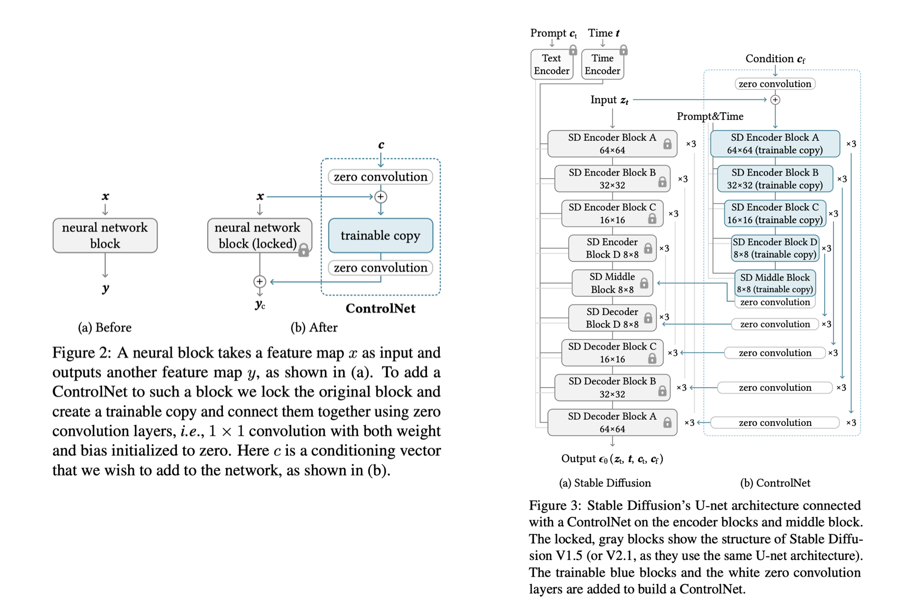
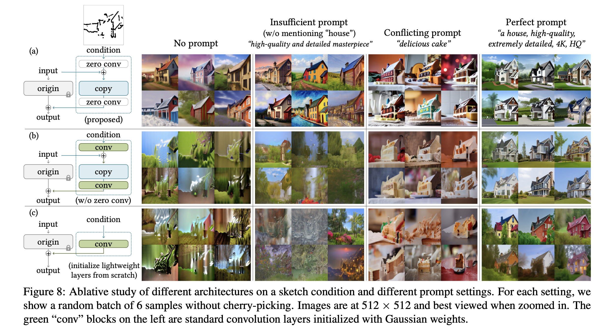
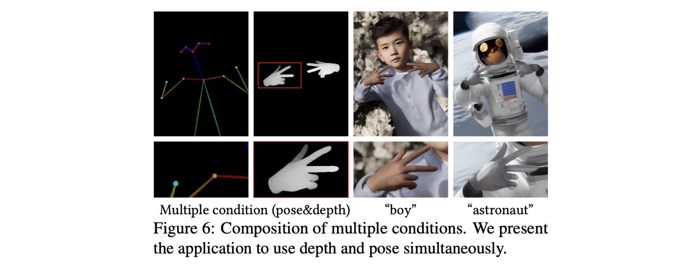
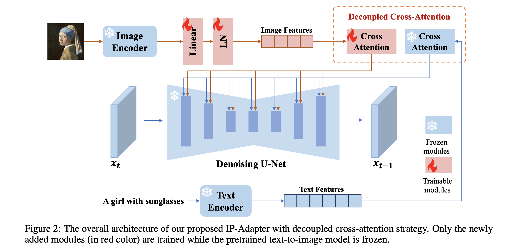
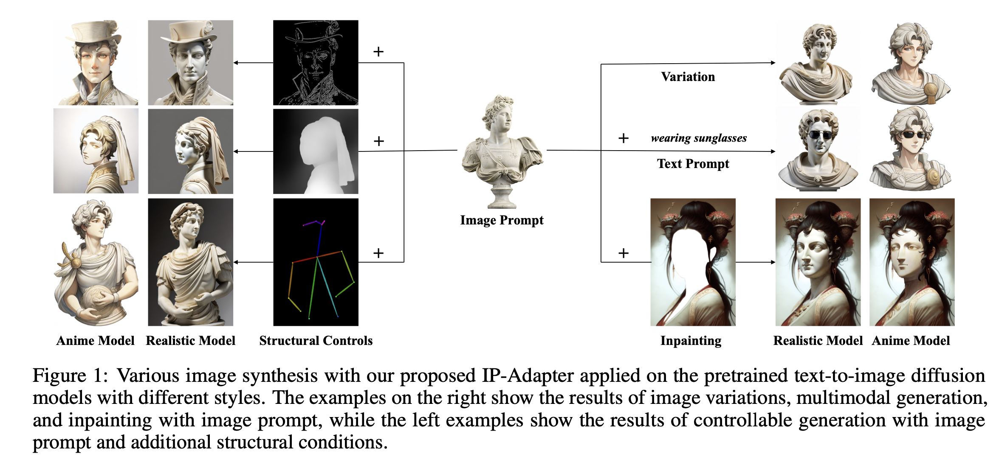
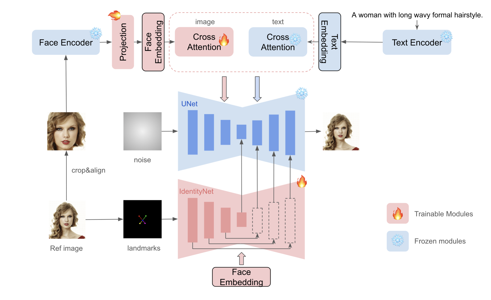
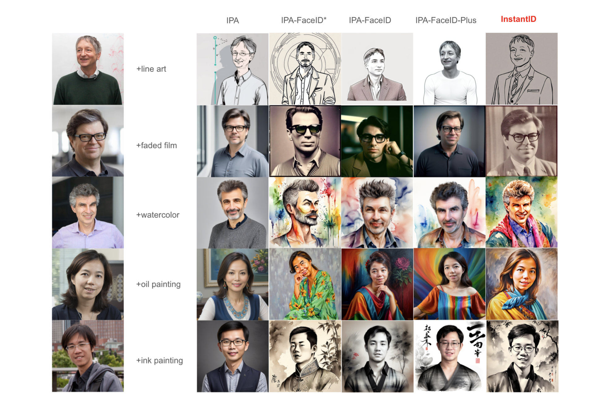
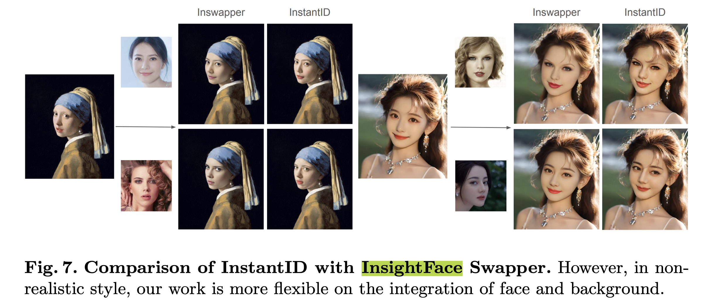

> Condition Image Genration과 관련된 여러 토픽과 논문들을 정리합니다.

### Preliminary

##### CFG scale

CFG(Classifier-Free Guidance) Scale은 diffusion 모델에서 **condition 기반 샘플링을 제어하기 위해 사용하는 스케일링 파라미터**를 의미합니다. Unconditional 샘플과 conditional 샘플의 가중치를 조절하여 모델의 출력 품질을 제어합니다.
$$
\tilde{\boldsymbol{\epsilon}}_\theta\left(\mathbf{z}_\lambda, \mathbf{c}\right)=(1+w) \boldsymbol{\epsilon}_\theta\left(\mathbf{z}_\lambda, \mathbf{c}\right)-w \boldsymbol{\epsilon}_\theta\left(\mathbf{z}_\lambda\right)
$$

- 값이 작을 때 (e.g., 1.0 이하): 모델이 더 자연스럽고 일반적인 샘플을 생성. -1인 경우에는 아예 프롬프트의 영향을 받지 않음

- 값이 클 때 (e.g., 7.0 이상): condition에 더 강하게 맞추려는 경향이 있음

- 일반적으로 CFG scale 7에서 11 사이가 최적의 결과를 제공

##### Negative Prompt

위의 CFG scale의 denoising 과정을 보면 'conditional sampling - unconditional sampling'의 형태로 수행됩니다.

Negative prompt는 위 방식에서의 unconditional sampling을 하이재킹하는 방식으로 구현됩니다. 즉, **'conditional sampling - unconditional sampling with negative prompt'**의 형태로 수행됩니다. 설명에 대한 시각 자료는 [이곳](https://stable-diffusion-art.com/how-negative-prompt-work/)을 참고하면 좋습니다.

##### CLIP Skip

CLIP skip은 **이미지 생성 과정에서 일부 (마지막 몇 개의) clip layer를 건너뛰는 것**을 의미합니다. 속도도 향상될 뿐만 아니라, 이미지 생성 품질도 좋아지는 경우가 있습니다.

CLIP의 깊은 레이어에서는 텍스트의 세밀한 설명과 관련이 있는데, 특정 모델에서는 이러한 세밀한 이해가 이미지 생성에 불필요한 노이즈를 추가할 수 있습니다. 따라서 CLIP skip은 과도한 노이즈를 줄이고 효율적으로 GPU 시간을 활용하는 데 유용합니다.

- 낮은 CLIP skip: 텍스트 설명을 세밀하게 반영
- 높은 CLIP skip: 텍스트의 디테일을 일부 희생
- 일반적으로 CLIP skip 1~2가 일반적으로 적합.
- 다만 LoRA나 Negative Prompt와 같은 기술 사용 시, clip에 의해 LoRA 변형되지 않는지 등에 대해 세밀하게 확인 필요

##### BF16 / FP16 / FP32

BF16 (Brain Float 16)은 **`1-bit sign, 8-bit exponent, 7-bit mantissa`**로 구성됩니다.

- Mantissa(유효 숫자)가 작기 때문에 정밀도가 낮지만, FP32와 동일한 exponent 비트를 사용하여 dynamic range가 넓음
- FP32에 가까운 수 범위(dynamic range)를 제공하며, 계산 속도가 빠르고, 메모리 사용량이 적음
- Neural network training과 inference에서 자주 사용되며, 특히 정밀도가 크게 중요하지 않은 상황(예: Gradient 계산)에서 유용함

FP 16은 **`1-bit sign, 5-bit exponent, 10-bit mantissa`**로 구성됩니다.

- BF16처럼 계산 속도가 빠르고, 메모리 사용량이 적음
- Dynamic range가 좁아, 큰 값이나 작은 값의 계산에서는 정밀도가 부족할 수 있음 (overflow/underflow 위험)

FP32는 **`1-bit sign, 8-bit exponent, 23-bit mantissa`**로 구성됩니다.

- 높은 정밀도를 제공하며, over/underflow 문제를 줄임
- 대신 메모리 사용량과 계산 비용이 높음

##### LoRA Alpha

LoRA에서 alpha는 **LoRA의 영향력을 조절하는 scaling factor**입니다. LoRA weight scale 또한 LoRA의 영향력을 조절하는 역할을 합니다. 일반적으로 LoRA는 다음과 같이 계산됩니다 (아래에서 dim은 LoRA의 차원을 의미)

```
output = original_weight + (lora_A @ lora_B) * (alpha / dim)
```

위 식에서 alpha / dim 부분이 LoRA의 영향력을 조절하는 부분입니다. 따라서 dim이 64이고 alpha가 32일 때 alpha / dim은 0.5가 됩니다. 즉, alpha=32이고, dim=64인 경우, inference에서 LoRA weight scale을 0.5로 설정하는 것은 **LoRA를 학습할 때 설정한 alpha와 dim의 비율과 동일한 효과**를 내는 것을 의미합니다.

### ControlNet

**UNet의 layer를 그대로 copy**해오고, 입력단과 출력단에는 weight, bias가 0으로 초기화된 **zero convolution layer**를 둡니다. 이 후 trainable copy와 convolution layer를 튜닝합니다.



아래는 zero initialized convolution이 중요했다는 것을 보여주는 결과입니다.



Training 방식은 기존의 stable diffusion loss와 동일합니다. 다만 텍스트 프롬프트는 50%를 랜덤하게 빈 문자열로 넣어주었다고 합니다. 학습 과정에서는 결과가 제대로 나오지 않다가 특정 step에서 갑자기 결과가 잘 나오는 'sudden convergence phenomenon'이 나타났다고도 말하고 있습니다. 

Inference 시에서는 여러 condition을 적용하는 것도 가능합니다. 단지 ControlNet을 하나 더 부착해주기만 하면 됩니다.



### IP-Adapter

여러 image prompt를 넣어줄 수 있는 방법론들이 있지만, 다음과 같은 문제점들이 존재했습니다.

- 모델 전체를 fine-tuning 한 image prompt 모델보다는 성능이 낮음
- 다른 방법론들은 diffusion model의 cross attention module을 활용하는 것이 적절하지 않음. 그래서 image feature와 text feature 병합하는 기작이, 지금은 단지 image feature를 text에 맞춰주는 것에 불과함. 이로인해 이미지 중심적인 feature가 사라지고, 단순히 대략적인 이미지 요소(e.g., 스타일) 정도만 컨트롤 가능한 수준임

IP-Adapter는 decoupled cross-attention 매커니즘을 통해 이러한 문제점을 개선하고자 하였습니다. 전체 구조는 아래와 같습니다.



1. Image prompt에서 **image feature를 추출**합니다.
2. **Decoupled cross attention**: Image feature를 사용한 cross attention와 text feature를 사용한 cross attention을 각각 수행한 뒤 합쳐줍니다.
3. 합친 feature를 UNet에서 활용합니다.

아래의 식을 통해서 text prompt와 image prompt가 각각 cross attention 수행한 뒤 합쳐지게 됩니다.
$$
\begin{array}{r}
\mathbf{Z}^{\text {new }}=\operatorname{Softmax}\left(\frac{\mathbf{Q} \mathbf{K}^{\top}}{\sqrt{d}}\right) \mathbf{V}+\operatorname{Softmax}\left(\frac{\mathbf{Q}\left(\mathbf{K}^{\prime}\right)^{\top}}{\sqrt{d}}\right) \mathbf{V}^{\prime} \\
\text { where } \mathbf{Q}=\mathbf{Z W}_q, \mathbf{K}=\boldsymbol{c}_t \mathbf{W}_k, \mathbf{V}=\boldsymbol{c}_t \mathbf{W}_v, \mathbf{K}^{\prime}=\boldsymbol{c}_i \mathbf{W}_k^{\prime}, \mathbf{V}^{\prime}=\boldsymbol{c}_i \mathbf{W}_v^{\prime}
\end{array}
$$
Inference stage에서는 image prompt의 강도를 조절 가능합니다.
$$
\mathbf{Z}^{\text {new }}=\operatorname{Attention}(\mathbf{Q}, \mathbf{K}, \mathbf{V})+\lambda \cdot \operatorname{Attention}\left(\mathbf{Q}, \mathbf{K}^{\prime}, \mathbf{V}^{\prime}\right)
$$
IP-Adapter의 학습 로직은 추론 로직과는 조금 다릅니다. 비록 추론시에는 레퍼런스 이미지를 넣는 방식으로 동작하지만, 학습시에는 따로 레퍼런스 이미지를 새로 만들지는 않고, **기존의 (텍스트, 이미지) 페어를 그대로 사용**하여, **IP-Adapter의 입력 값으로 이미지를 주고, 해당 이미지를 그대로 잘 복원하는 것을 목표**로 합니다.

IP-Adapter는 특정 포즈를 자유롭게 정의하면서 전반적인 색상 구성과 스타일을 잡아내는 데 유용한데 반해, ControlNet은 특정 포즈를 강제하는 데 적합합니다. 따라서 IP-Adapter와 ControlNet을 함께 사용하면 아래 예시처럼 세부적인 이미지 디테일이나 스타일을 보존하면서도 구조적 특징도 제어 가능합니다 (ex. ControlNet으로 구도를 설정한 뒤, IP-Adapter로 스타일을 세부적으로 조정).



IP-Adapter와 관련된 좋은 실습 예시 자료가 있어 아래에 공유합니다.

- https://www.internetmap.kr/entry/IP-Adapter-too-many

만약에 (1) 특정 레퍼런스 이미지의 특징을 반영하면서, (2) 특정 구조/형태로 제어한, 특정 스타일의 이미지를 생성하고 싶다면, **IP-Adapter를 통해 레퍼런스 이미지의 특징을 반영**하고, **ControlNet으로 구조를 제어**하면서, **원하는 스타일로 학습된 LoRA를 적용**해볼 수 있습니다. 

하지만 단순 IP-Adapter는 때로 세부 스타일이나 레퍼런스 이미지의 디테일이 결과 이미지에 충분히 반영되지 않는 경우가 자주 있습니다. 따라서 이런 경우에는 IP-Adapter Plus를 사용해볼 수 있습니다. 

### IP-Adapter Plus

IP-Adapter Plus는 IP-Adapter의 확장 버전으로, 레퍼런스 이미지의 세부적인 스타일과 레이아웃을 더 정밀하게 반영하는 모델입니다. 해당 모델은 별도 논문이 존재하는 것은 아니고 동일한 저자들이 논문을 업데이트하면서 새로 추가한 모델입니다.

단순한 이미지 개념 뿐만 아니라 세밀한 디테일까지 반영할 수 있어서, IP-Adapter를 활용해보실 생각이 있으시다면 IP-Adapter Plus 또한 함께 테스트 해보시는 것을 추천드립니다.

IP-Adapter Plus가 IP-Adapter에 비해 디테일을 잘 반영할 수 있는 원리는 다음과 같습니다.

1. Global embedding (cls token)과 local patch embedding을 모두 추출합니다. (기존 IP-Adapter는 global embedding만 사용)
2. 이를 IP-Adapter의 MLP에 통과시켜 이를 가공하고, 가공된 벡터를 cross-attention으로 전달합니다.

즉, IP-Adapter는 이미지 전체를 대표하는 축약벡터 하나만을 사용하는 것에 비해, IP-Adapter Plus는 이미지의 각 patch별 local vector까지 모두 사용하기 때문에 더 디테일하고 세밀한 이미지 정보를 반영 가능합니다.

### InstantID

**IP-Adapter 구조로 얼굴 영역의 디테일**을 잡아두고, **ControlNet 구조를 통해 이미지 상에서 얼굴의 구조적 영역**이 어디인지 잡아둬서 이 두 정보를 활용하여 ID를 보존한 채로 새로운 이미지를 생성하는 방식입니다.



다른 방법론들과의 비교 결과는 아래와 같습니다.



Face swapping과 관련하여 가장 널리 사용되는 InsightFace와 비교해봤을 때 둘 다 자연스럽고 좋은 성능을 내는 것을 확인 가능합니다.



좋은 실습 예시 자료가 있어 아래에 공유합니다.

- https://www.internetmap.kr/entry/Stable-Diffusion-InstantID

ID를 보존하는 방법과 관련하여 최근 나온 논문으로는 PuLID라는 높은 성능을 보이는 논문도 있으나, 나중에 정리하는 것으로 하겠습니다.

### Reference

- [Adding Conditional Control to Text-to-Image Diffusion Models (2023.02)](https://openaccess.thecvf.com/content/ICCV2023/papers/Zhang_Adding_Conditional_Control_to_Text-to-Image_Diffusion_Models_ICCV_2023_paper.pdf)
- [IP-Adapter: Text Compatible Image Prompt Adapter for Text-to-Image Diffusion Models (2023.08)](https://arxiv.org/abs/2308.06721)
- [InstantID: Zero-shot Identity-Preserving Generation in Seconds (2024.01)](https://arxiv.org/abs/2401.07519)
