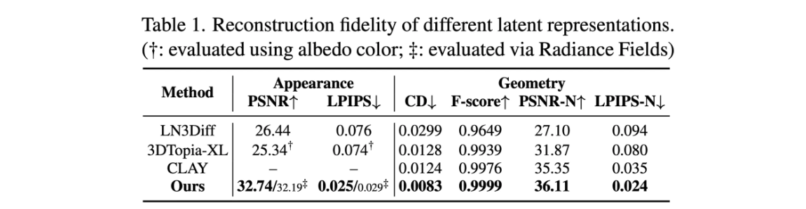

> "TRELLIS: Structured 3D Latents for Scalable and Versatile 3D Generation" 논문의 내용을 정리합니다.

### Introduction

3D 생성과 관련된 연구들은 여러 갈래가 존재합니다. Mesh 생성 기반 연구들은 디테일한 appearance 모델링 성능이 떨어지고, 반면 3D gaussian이나 Radience field(NeRF)를 생성하는 연구들은 외형적으로 높은 퀄리티의 렌더링을 자랑하지만 geometry 추출 부분이 아쉽다는 특징을 가집니다.

Mesh, 3D gaussian, Radience field 등 각각의 3D representation 특성이나 구조가 너무 다르기 때문에 하나의 네트워크 아키텍쳐로 통일하기 어렵고, 따라서 2D generation과 달리 하나의 네트워크나 latent space로 통합되기 어려웠습니다.

따라서 TRELLIS 논문의 목적은 '서로 다른 여러 3D representation을 하나로 통합하는 것'이며, 이전에 자주 다뤄지지 않은 주제라서 도전적이라고 주장합니다. (논문 상에서 사용되는 ‘representation’은 mesh, 3D gaussian, radience field와 같은 3D 표현 방법을 의미합니다) 먼저 TRELLIS는 아래의 작업들이 가능합니다.

1. Image-to-3D: 레퍼런스 이미지를 기반으로 3D 생성
2. Text-to-3D: Text 입력을 기반으로 3D 생성
3. Flexible editing
   - Detail variation: 전체적인 구조는 그대로 둔 상태로 디테일 요소들 변경
   - Local editing: 특정 영역만을 변경하고, 나머지 부분은 고정

### Preliminaries

- **Rectified Flow Transformer**: Flow를 어떤 수식으로 정의하느냐에 따라 여러 형태의 flow matching 모델이 존재하게 되는데, rectified flow가 최근에 제일 일반적으로 사용되는 flow입니다.  ‘데이터 포인트와 N(0, 1)’ 사이를 직선 경로로 연결하는 형태로 flow 정의합니다.
- **Shifted Window Attention**: Swin Transformer에서 나오는 개념입니다. ViT에 locality를 고려하기 위해 local window 내에서만 attention을 적용시키고, 다만 layer $l$에서는 window의 모서리 부분들끼리 인접해있는데 서로 attention 적용 안되니, 이를 $l+1$ layer에서는 shifting하여 attention 계산합니다.
  - Local Window Self-Attention (W-MSA): 각 layer에서 윈도우 단위로 self-attention을 수행 → 각 윈도우 내부에서만 정보 교환
  - Shifting Window Self-Attention (SW-MSA): 다음 layer에서는 윈도우를 일정 픽셀만큼 shift한 후, 다시 self-attention을 수행 → 결과적으로 이전 layer에서 직접 연결되지 않았던 다른 윈도우의 일부 토큰과 간접적인 정보 교환이 발생

### Methodology

전체적인 방법은 다음과 같습니다.

1. SLAT이라는 벡터 표현 공간을 잘 만들어내기 위한 Encoder & Decoder 학습
   - `Decoder`는 세 가지 타입으로 학습: Mesh / 3D Gaussian / Radience Field
2. Noise & text/image로 부터 SLAT을 생성해내기 위한 Transformer 학습
   - Two-stage 방식을 사용하여 SLAT 생성
     1. `Flow Transformer`: noise & text/image로 부터 structure를 생성해내기 위한 학습 수행
     2. `Sparse Flow Transformer`: structure에 대해 latent 값을 붙이기 위한 학습 수행
3. 각각 따로 학습된 이 세 가지 모델을 다 붙여서 하나의 ‘noise & text/image to 3D 모델’을 만들어냄
   1. `Flow Transformer`: noise & text/image → structure & text/image
   2. `Sparse Flow Transformer`: structure에 feature 부착 (SLAT)
   3. `Decoder`: SLAT → 3D Gaussian/RF/Mesh

##### Structured Latent Representation (SLAT)

$$
\boldsymbol{z}=\left\{\left(\boldsymbol{z}_i, \boldsymbol{p}_i\right)\right\}_{i=1}^L, \quad \boldsymbol{z}_i \in \mathbb{R}^C, \boldsymbol{p}_i \in\{0,1, \ldots, N-1\}^3
$$

- $N$은 3D grid의 spatial length, $L$은 active voxel의 총 개수
  - Default로는 $N$은 64으로 설정하였는데 $L$은 평균적으로 20K 정도 되었음
- 직관적으로 active voxels $p_i$는 3D asset의 대략적인 구조로 볼 수 있고,
- latent $z_i$는 외형 & 모양의 세세한 디테일을 잡는 요소라고 볼 수 있음

##### Structured Latents Encoding & Decoding

Active voxel에 대한 voxelized feature 는 DINOv2로 얻어냈다고 합니다.

1. 각 voxel을 multiview image에 각각 projection하고
   - Multiview image: 3D asset 하나마다 랜덤하게 카메라 view를 샘플링 (150개 2D image)
2. 해당하는 위치의 feature들을 average한 값을 voxelized feature로 활용
   - $f$의 dimension도 $z$ 처럼 $64^3$으로 설정하였음
     - $64^3 → 64^3$ 으로 encoding 하는 것임. 즉, 같은 dimension으로 encoding
     - 표현을 압축하는 용도라기 보다는, 여러 representation으로 decoding을 잘하기 위한 latent로 변형하는 용도

이런 방식으로 해도 작동하나? 싶지만, 실험적으로 이러한 방식이 3D asset을 reconstruct하는데에 충분하다는 것을 확인하였다고 합니다.

그리고, decoder를 부착하여 reconstruction loss 기반으로 encoder, decoder를 학습하였습니다. Decoding은 mesh, 3D gaussian, NeRF 총 세 개의 포맷으로 가능하도록 3개의 decoder를 두었습니다.

- Transformer 구조를 사용
- $z_i$가 normal distrubution 따르도록 KL penalty도 넣어줌
- Input feature $f$를 펼치고 sinusoidal positional encoding 넣어줌. 그래서 $L$ 길이의 토큰을 만들고 이것을 transformer 구조에 넣어줌
- Locality 특성을 고려하기 위해서 3D space 상에서의 shifted window attention을 적용함

##### Structured Latent Generation

Structured latent를 만들기 위해서 two-stage generation pipeline를 사용합니다.

1. **Sparse Structure Generation**: 이 단계에서는 sparse structure 즉, active voxel $\{p_i\}^L_{i=1}$을 만드는 것이 목표
   - $N\times N\times N$ 3D grid를 생성하는 것을 목표로 하였으나 이건 계산 비용 커서, $D \times D \times D \times C$의 low-resolution feature grid를 먼저 만들고, 이를 decoder 기반으로  $N\times N\times N$으로 디코딩하여 active voxels $\{p_i\}^L_{i=1}$ 생성하도록 구현
   - Flow transformer 사용되며, 각 feature grid는 positional encoding과 결합되어 flow transformer에 입력됨
   - Timestep 정보는 AdaLN와 gating mechanism에 활용됨
   - Text condition에는 CLIP 모델 feature 사용하고, image condition에는 DINOv2 feature를 활용하여 cross attention layer에 주입
2. **Structured Latent Generation**: 이 단계에서는 주어진 structure ${p_i}^L_{i=1}$에 대한 latent ${z_i}^L_{i=1}$를 생성
   - Sparse VAE encoder 처럼 serialise 하지 않고, downsampling 적용 후 upsampling
   - Timestep 정보는 AdaLN와 gating mechanism에 활용됨
   - $\mathcal G_S$와 $\mathcal G_L$이 각각 독립적으로 학습됨

##### 3D Editing with Structured Latents

- **Detail variation**: first stage에서 생성된 structure는 고정한 상태에서, second stage에 다른 text prompt를 적용
- **Region-specific editing**: Repaint라는 inpainting 방법론을 사용함. 주어진 bounding box 영역의 voxel만 수정하고 나머지는 그대로 두도록

### Experiments

실험 세팅은 아래와 같습니다.

- 4개의 public dataset에서 가져온 50만개의 3D asset을 학습에 활용
  - Objaverse, ABO, 3D-FUTURE, HSSD
- 3D asset 하나마다 150개의 2D image 사용
- 캡셔닝을 위해서는 GPT4o 사용
- Basic(342M), Large(1.1B), X-Large(2B) 3개의 모델 학습
  - XL: A100 GPU 64개로 400K step을 256 batchsize로 학습
- Inference는 CFG 3으로 맞추고 sampling step을 50으로 사용
- Evaluation은 학습에 활용되지 않은 Toys4k 데이터셋 사용했고, 논문 내 시각화 결과들은 GPT-4로 생성한 텍스트와 DALL-E로 생성한 이미지를 활용
- Appearance 평가를 위해서는 gaussian으로 디코딩 하였고, geometry 위해서는 mesh로 디코딩

##### Reconstruction Results

여러 지표에 대해서 최고 성능을 도달하였다고 합니다.

- Appearance fidelity: 외형이 실제 또는 참조 데이터와 얼마나 유사한지를 측정
- Geometry quality: 3D 객체의 구조적 정확성을 평가하는 데 사용

##### Generation Results

Text/image to 3D generation 관련하여 색감과 디테일 살아있고, 구조와 모양 정교하게 나오고, 물컵같은 투명한 물체도 핸들링 가능하고, 생성된 물체도 text와 잘 매치된다고 주장합니다.

68개는 text to 3D, 67개는 image-to-3D asset을 만들고 사람 평가 했는데, 그 결과도 좋았다고 합니다.

### Conclusion

TRELLIS 논문은 높은 성능을 내는 새로운 3D asset 생성 모델 제작하였고, Structured latent representation (SLAT)을 통해 여러 출력 포맷으로 디코딩이 가능했으며,  SLAT에 적합한 two-stage 생성 파이프라인을 만들었고 여러 실험을 통해 성능 뛰어나다는 것을 증명하였습니다.

### Reference

Xiang, Jianfeng, et al. "Structured 3d latents for scalable and versatile 3d generation." *arXiv preprint arXiv:2412.01506* (2024).
