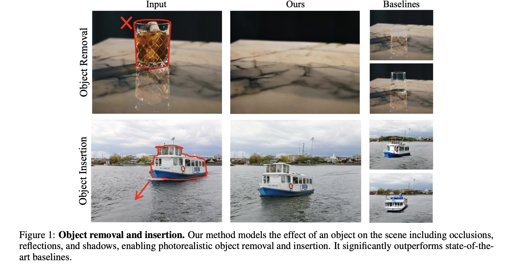
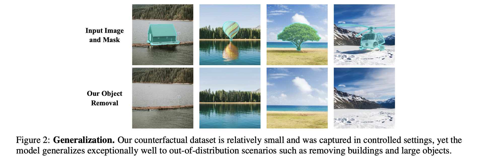
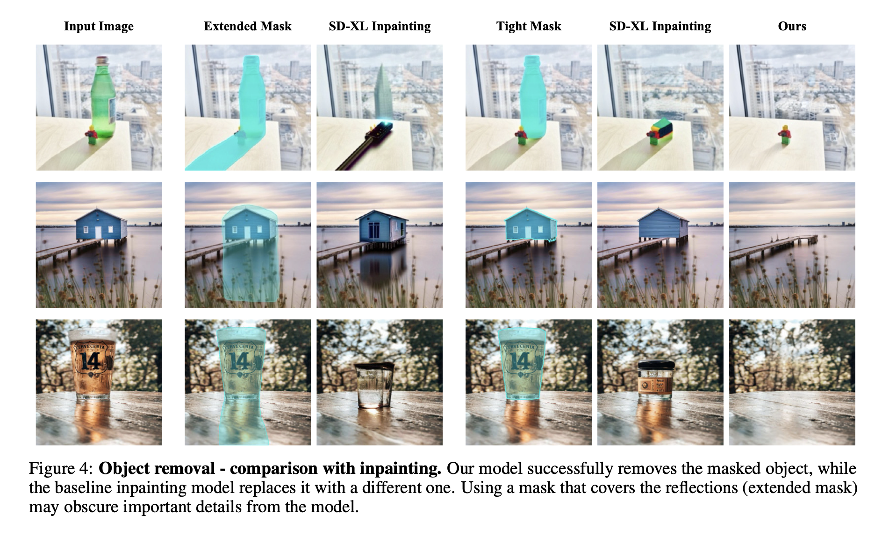
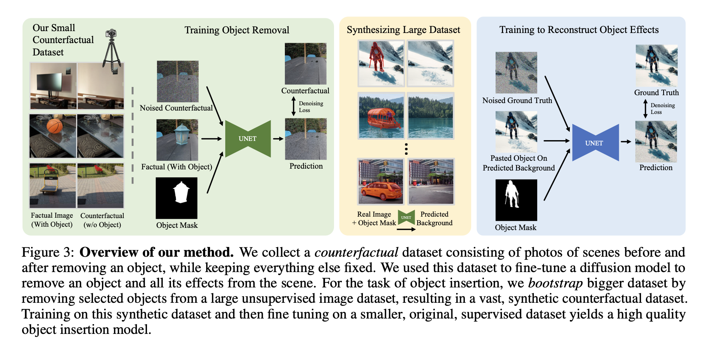
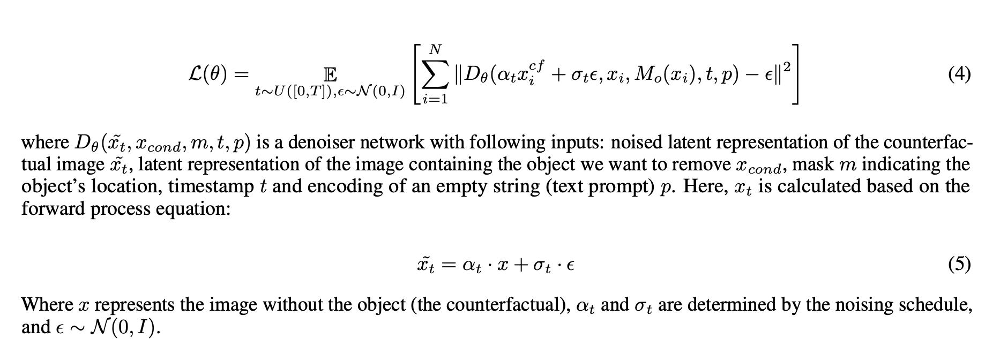
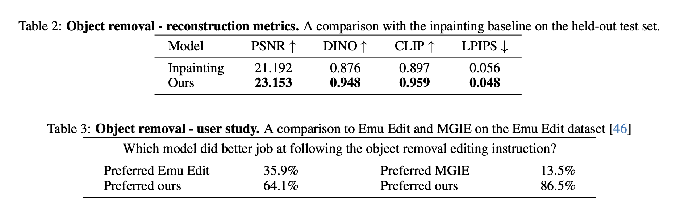
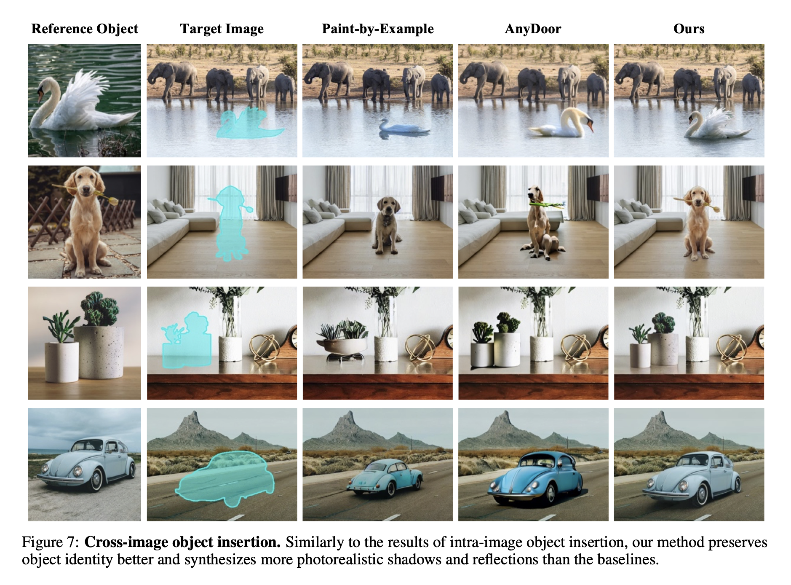
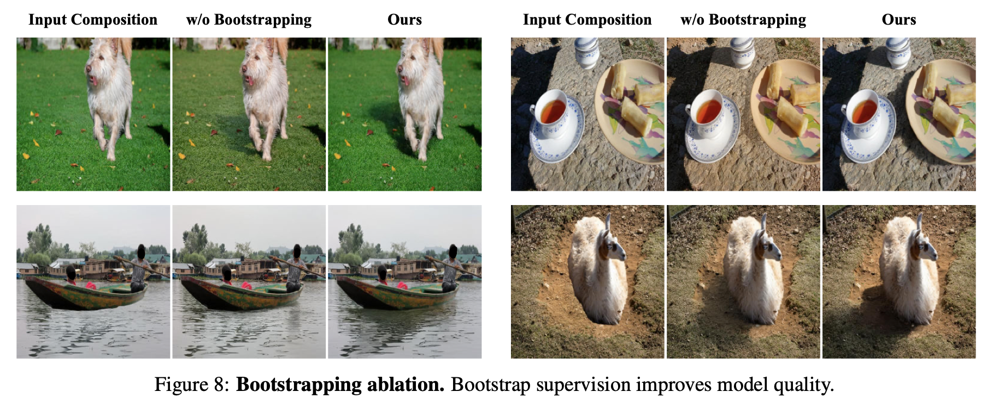

> ECCV 2024에 발표된 ObjectDrop 논문을 리뷰합니다.

### Introduction

여러 diffusion 기반의 editing 모델들은 최근에 정말 좋은 성능을 보이고 있지만, 물리적으로도 realistic한 이미지를 생성하는 것은 아직 쉽지 않습니다. 예를 들면 object removal 모델은 object에 의해 가려진 픽셀들을 대체해야 할 뿐만 아니라, object에 관련된 그림자(shadow)나 반사(reflection) 효과 또한 제거할 수 있어야 합니다. 

Diffusion-based inpainting이나 prompt-to-prompt 같은 self-supervised 방식의 이미지 편집 방법론들은 이런 점에서 한계를 가집니다. 이미 object가 있던  상태의 이미지 정보만 가지고 있기 때문에 counterfactual(반사실) image에 대한 정보가 부족하고, 따라서 이런 그림자나 반사 효과를 충분히 제거할 수 없습니다. 

따라서 본 논문은 잘 큐레이팅 된 "counterfactual"한 데이터셋에 대해 diffusion 모델을 학습시키는 접근법을 제안합니다. Counterfactual dataset은 다음의 pair로 구성된 데이터 셋을 의미합니다.

1. A factual image depicting the scene
2. A counterfactual image depicting the scene after an object change (adding/removing it)

이 데이터셋은 실제 사진사가 scene에 있는 object를 변경해가며 만들게 됩니다. 그리고 이 방식이 object removal에 대해서 다양한, 처음보는 object에 대해서도 잘 동작한다는 것을 논문 내에서 보여줍니다. 

다만 object insertion은 object removal 보다 더 까다로운 task이기 때문에 더 많은 양의 데이터를 필요로 했고, 따라서 저자들은 2-step approach를 취합니다.

1. Object removal model을 작은 counterfactual dataset 기반으로 학습
2. Object removal model을 사용하여 large unlabeled image dataset 내에 물체들을 제거하여 synthetic dataset 생성

이렇게 만들어진 large synthetic dataset으로 insertion model을 학습합니다. 이 방법을 저자들은 bootstrap supervision이라고 명시하고 있고, 결과적으로 EmuEdit, AnyDoor, Paint-by-Example 등의 최근 방법론 보다 더 좋다는 것을 보였습니다.

### Related Works

논문에서는 4가지 정도의 related work를 소개합니다.

- Image inpaiting: 현실성 있는 object removal, 즉 그림자나 반사를 제거하는 것을 잘 못한다고 합니다.
- Shadow removal methods: 그림자 영역의 mask를 사용하여 그림자 지우는 것을 목표로 하는 task입니다. 본 연구는 모든 object와 관련된 영역(그림자와 반사 포함)을 제거하기 위해 그림자 영역이 아닌, object의 영역 mask만을 필요로 하기에, 이 점에서 본질적인 차이를 가집니다.
- General image editing model: 텍스트 기반 이미지 편집 모델을 의미합니다. Multi-modal LLM 또한 효과적이나, ObjectDrop 방법론이 더 우수하다고 말하고 있습니다.
- Object insertion: AnyDoor 라는 최신 방법론이 좋지만, object에 대한 identity 보존이 안되는 경우가 있다고 합니다. 반면에 ObjectDrop의 방법은 identity 보존도 잘 한다고 합니다.

### Self-Supervision is Not Enough

Diffusion-based inpainting이나 prompt-to-prompt 같은 attention-based 방식 등이 있었는데, 이러한 self-supervised 방법들은 아래와 같은 한계점을 가집니다.

- Segmentation mask를 넓게 설정한 경우: object가 아닌 다른 영역의 pixel을 지우게 되어, 원치 않는 영역도 pixel을 재생성하게 되고 이 과정에서 오류가 생깁니다.
- Segmentation mask를 너무 타이트 하게 설정한 경우: 그림자, 반사등 object와 관련된 정보를 지울 수 없습니다.

### Object Removal

##### Collecting a counterfactual dataset

데이터셋 생성을 위해서는 2500장의 counterfactual pair를 수집하였으며, 전문 사진사가 삼각대가 장착된 카메라를 사용하여 사진을 촬영하였습니다.

1. Object $O$를 포함하고 있는 $X$(fatual image)를 촬영합니다.
2. 카메라의 이동이나 빛의 변화, 그리고 다른 물체들의 이동 등을 제한한 상태에서 물리적으로 object $O$를 제거합니다.
3. $X_{cf}$(counterfactual image)를 촬영합니다.
4. Object $O$에 대한 segmentation mask는 SAM 사용해서 생성하였습니다.
5. 최종 데이터셋은 $X$와 mask $M(X)$, 그리고 $X_{cf}$ 구성합니다.
6. 2500장 중에서 100장을 test 데이터셋으로 설정합니다. 

##### Counterfactual distribution estimation

직접 제작한 counterfactual dataset에 대해, large scale의 diffusion model을 학습시켜 object removal 모델을 획득합니다.

- $\tilde x$: latent representation counterfactual image
- $x$: latent representation of the image containing the object we want to remove
- $m$: mask
- $t$: timestemp
- $p$: text prompt encoding

이 때, 전통적인 inpainting 방식과는 다르게, masked pixel을 gray나 black pixel으로 대치하지 않았다고 합니다. 이러한 방식은 모델이 해당 mask 영역의 정보를 충분히 활용하는 것을 도와서 일부만 투명한 물체나 mask가 불충분한 케이스에 대해서 잘 대처할 수 있도록 도와주었다고 합니다.

##### Advantages over video supervision

Video로부터 얻어진 supervision을 사용하는 것도 가능하지만, 이 경우에는 심각한 한계점을 지닌다고 논문에서 말하고 있습니다.

1. Counterfactual dataset에서는 유일하게 바뀌는 것이 object이지만, video에서는 카메라 위치와 같은 다른 많은 특성이 바뀔 수 있습니다. 이는 object removal과 다른 특성 사이의 잘못된 상관관계를 만들 수 있다고 합니다.
2. Video로 부터 데이터셋을 만드는 방식은 움직이는 object에서만 작동합니다. 그리고 이 방식은 움직이기 어려운 물체(heavy, large, immobile objects)에 대해서도 잘 일반화되고, 실제 성능도 더 좋다고 합니다.

### Object Insertion

ObjectDrop을 object removal task 뿐만 아니라 object insertion까지 확장할 수 있습니다.

Object insertion은 object에 대한 이미지와 target image, 그리고 desired position에 대해서, 주어진 object가 포함된 target image가 어떻게 보일지를 예측하는 것이 목표입니다.

저자들은 상대적으로 작은 규모의 counterfactual 데이터셋(2,500개 샘플)이 object removal에는 성공적이지만, object insertion 훈련에는 불충분한 데이터라고 가정했습니다. 따라서 데이터의 양을 늘리기 위해 새로운 합성 방식을 사용하였습니다.

##### Bootstrapping Counterfactual Dataset

1. 위에 제시한 데이터셋을 통해 object removal model을 학습시킵니다.

2. Large external dataset에 대해서 합성 데이터셋을 만듭니다.

   - Foreground detector 사용해서 object를 detect 합니다.

   - Object removal model을 통해 scene에서 object와 shadow reflection을 제거합니다.
   - 다시 해당 이미지에 object 영역만 붙여넣습니다.

3. 이 데이터셋을 통해 object insertion을 위한 diffusion model을 finetune 합니다.

본 논문에서 이러한 방식을 bootstrap supervision이라고 부르고 있습니다.

더 자세하게는, (1) 총 14M 이미지를 모은 뒤에 이중에서 700K 적절한 이미지를 골르고, (2) 이에 대해 object removal을 수행한 뒤 결과가 괜찮은 데이터를 350K 골랐다고 합니다. 이는 object removal 모델을 학습시키기 위해 사용했던 데이터셋(2500장) 보다 140배가 많은 양입니다.

##### Diffusion Model Training

- Object removal에 대해서는 Latent Diffusion Model 사용했는데 pre-trained inpainting model 사용했습니다.
- 내부적으로 SDXL과 비슷한 구조로 가져갔습니다.
- Object insertion에 대해서는 pre-trained inpainting model을 사용하지 않았습니다.
- 합성 데이터가 충분히 realistic하지 않기 때문에 insertion task에서는 합성 데이터를 pre-training에만 사용합니다
- 마지막 단계에서는 직접 만든 (사진사가 촬영한) counterfactual 데이터셋으로 모델을 fine-tune 하였습니다.

### Experiments

Object removal task에 대한 quantitative result와 user study 결과입니다.

Object insertion에 대한 quantitative & qualitative result 입니다.

Bootstrap supervision의 효과를 figure에서 확인 가능합니다.

