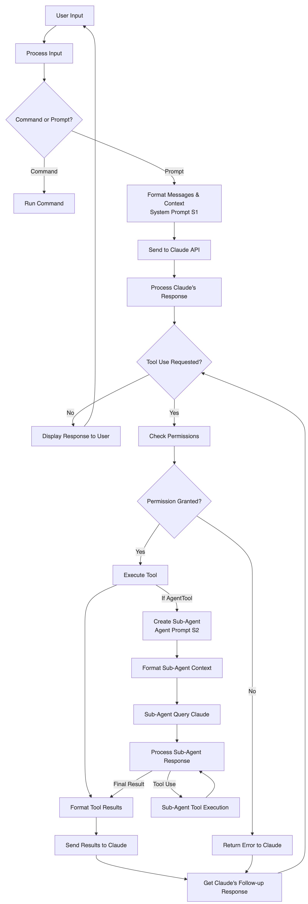
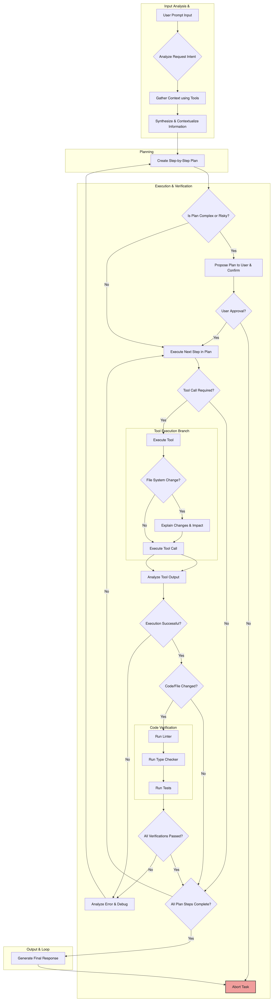

Gemini CLI와 Claude Code의 대략적인 동작을 이해하기 위해 mermaid diagram으로 시각화하였습니다. 

### Gemini CLI

Gemini CLI에게 직접 프롬프트로 'gemini cli의 전체적인 플로우를 mermaid diagram으로 시각화'하도록 요청하고, 해당 결과에 대해서 '실제 너(gemini cli)의 로직과 일치하는지 리뷰' 해달라고 요청하였습니다.

Hallucination이 존재할 수 있으니 참고용으로만 보시길 바랍니다.

### Claude Code

아래의 링크에서 전체 플로우를 가져왔고, 이 분도 동일하게 Claude Code에게 직접 플로우를 설명하도록 프롬프트를 입력하였다고 합니다. 

- https://github.com/abhinavsharma/claude-code-description?tab=readme-ov-file

##### Claude Code in Detail

Claude Code 소스코드를 보고 직접 분석하여 시각화 하신 분도 있습니다. 자세한 다이어그램은 아래 원문 링크를 참고하시길 바랍니다.

- https://gist.github.com/leehanchung/04c0c53fe839e6b1ad7570f026c2f988

### Summary

큰 틀에서 agent가 하는 일은 아래처럼 정리해볼 수 있겠습니다.

1. **Command 여부 확인**: 바로 수행가능한 command인지, 혹은 프롬프트를 분석한 뒤 tool을 호출해야하는지 판단

2. **Task의 복잡성 판단**: Task 수행을 위한 plan을 유저에게 검수 받아야하는 복잡한 일인지 아닌지 판단

3. **Planning**: Plan(ToDo List)를 만들고 순차적으로 실행
   - **각 Step에서 필요한 Tool 판단**: 이번 step에서 tool(혹은 sub-agent)을 사용해야하는지 판단. 사용해야한다면 어떤 tool이 적합한지 & 권한이 있는지 등 판단
   
   - **Tool 사용 결과가 적절했는지 판단**
   - **Plan 내 모든 step이 완료되었는지 판단**
   
4. **최종 응답을 정리 후 반환**

