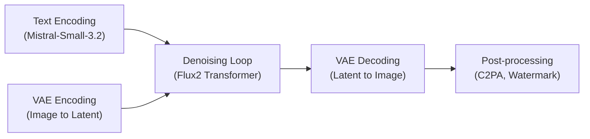
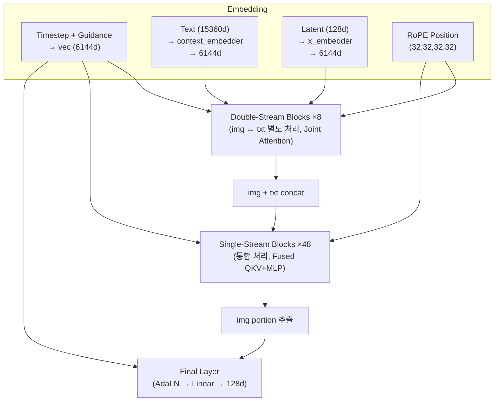
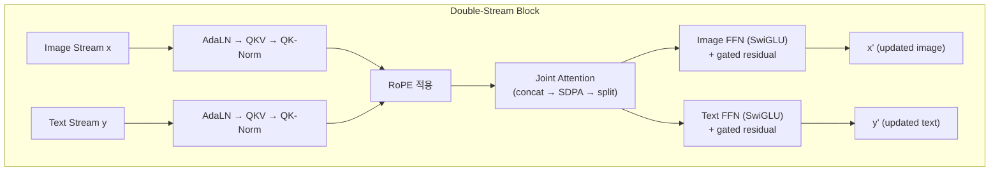
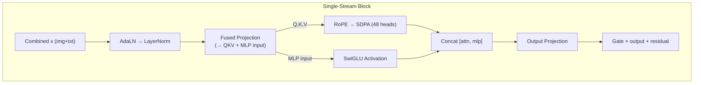
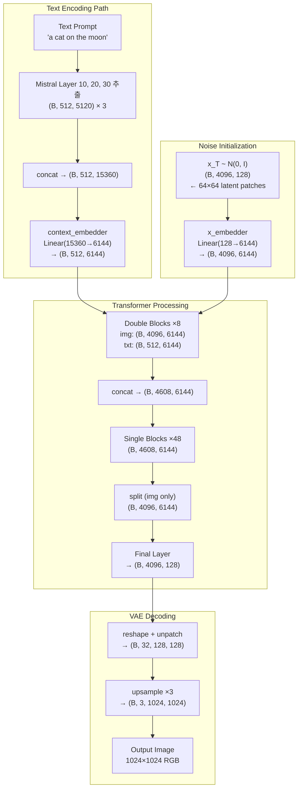
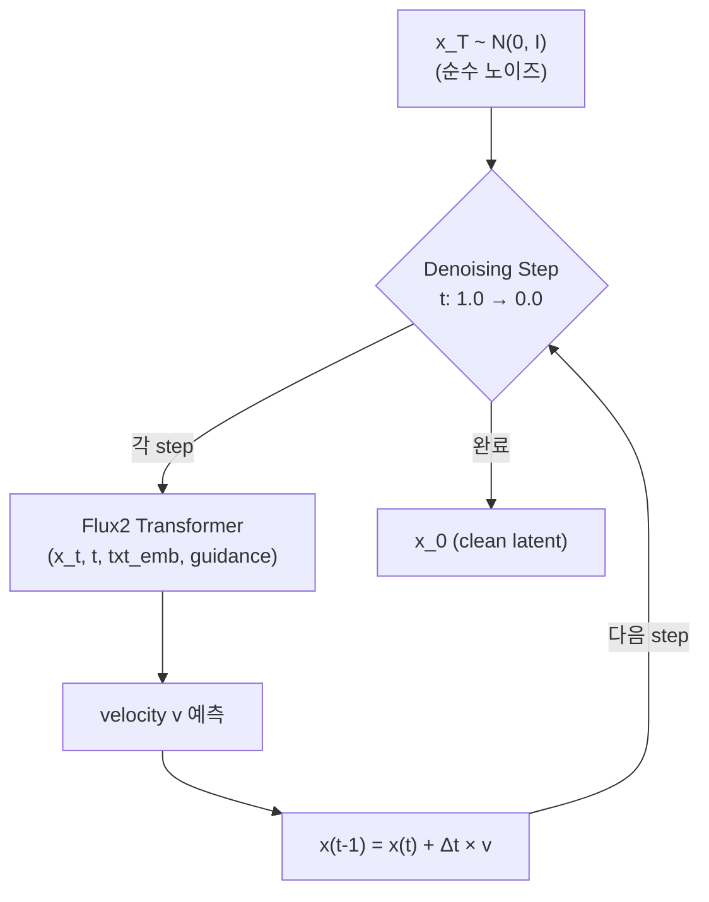

> Black Forest Labs의 FLUX.2 [dev] 32B 모델 아키텍처를 FLUX.1과 비교하며, 텍스트 인코더, Transformer 구조, VAE, Sampling 과정을 단계별로 살펴봅니다. 본 포스팅은 claude code에게 flux.2[dev] 구조를 분석시킨 내용을 바탕으로 작성되었으며, 글 또한 claude code를 기반으로 작성 및 정리되었습니다.

### Introduction

FLUX.1은 Stability AI에서 독립한 Black Forest Labs가 2024년에 공개한 flow matching 기반의 text-to-image 모델입니다.[^1] FLUX.1의 전체적인 배경과 flow matching에 대해서는 [이전 포스팅](https://yuhodots.github.io/deeplearning/24-12-04/)에서 다루고 있으니 참고하시면 좋습니다.

FLUX.1은 12B 파라미터로 당시 뛰어난 이미지 품질을 보여주었지만, 몇 가지 한계가 있었습니다.[^1][^2]

- **텍스트 인코더**: CLIP-L과 T5-XXL 두 개의 별도 모델을 동시에 로딩해야 하여 메모리 부담이 큼[^3]
- **이미지 편집**: 네이티브 편집 기능이 없어, InstructPix2Pix 등 별도 모델이 필요[^3]
- **입력 모달리티**: 텍스트만 입력 가능하여 이미지를 참조하는 멀티모달 생성이 불가능[^17][^18]
- **모델 다양성**: 단일 크기의 모델만 제공하여 다양한 컴퓨팅 환경에 대응하기 어려움[^1]

FLUX.2 [dev]는 이러한 한계들을 해결하기 위해 설계되었습니다.[^22] 텍스트 인코더를 멀티모달 LLM 하나로 통합하고[^4], 32B 파라미터로 모델 용량을 키우면서도 더 효율적인 블록 구성을 적용하였습니다.[^6] 네이티브 이미지 편집과 멀티모달 입력도 지원하며[^4], Klein 변형(9B, 4B)을 통해 경량화 옵션도 제공합니다.[^21] 이 글에서는 FLUX.2의 아키텍처를 FLUX.1과 비교하며 하나씩 살펴보겠습니다.

### Overall Pipeline

FLUX.2의 전체 추론 과정은 크게 다섯 단계로 나눌 수 있습니다.[^4]

**텍스트 프롬프트는 Mistral 기반의 텍스트 인코더**를 통해 임베딩으로 변환되고[^4], **이미지 편집 모드에서는 입력 이미지가 VAE를 통해 잠재 공간(latent space)으로 인코딩**됩니다.[^4] 이 두 정보가 Flux2 Transformer의 denoising loop에 들어가 노이즈로부터 이미지를 점진적으로 생성하고, 최종적으로 VAE 디코더가 잠재 벡터를 다시 이미지로 복원합니다.[^4]

FLUX.1과의 파이프라인 차이를 정리하면 다음과 같습니다.[^2][^3][^4][^6]

| 항목 | FLUX.1 [dev] 12B | FLUX.2 [dev] 32B |
|---|---|---|
| **Text Encoder** | CLIP-L + T5-XXL (2개) | Mistral-Small-3.2-24B (1개) |
| **입력 모달리티** | 텍스트만 | 텍스트 + 이미지 (멀티모달) |
| **이미지 편집** | 미지원 | 네이티브 지원 (single/multi-ref) |
| **VAE Scale Factor** | 8 | 16 |
| **Transformer** | 12B (Double 19 + Single 38) | 32B (Double 8 + Single 48) |

**FLUX.2에서는 이미지 편집 모드**도 지원합니다.[^4] 편집 대상 이미지를 VAE 인코더에 넣어 잠재 벡터로 변환한 뒤, 텍스트 프롬프트와 함께 Transformer에 입력하면 원본 이미지의 구조를 유지하면서도 프롬프트에 따라 수정된 이미지를 생성할 수 있습니다.[^4] 또한 참조 이미지(reference image)를 여러 장 입력하여 스타일이나 구도를 참고한 생성도 가능합니다.[^4] 이때 참조 이미지는 최대 768×768 해상도로 center crop된 뒤, 텍스트 인코더(Mistral)를 통해 처리됩니다.[^4]

### Text Encoder

FLUX.1 대비 FLUX.2에서 가장 눈에 띄는 변화 중 하나는 **CLIP + T5에서 Mistral로**의 텍스트 인코더 전면 교체입니다.[^3][^4]

##### FLUX.1의 방식: 두 모델의 조합

**FLUX.1은 CLIP-L(768차원)과 T5-XXL(4096차원)** 두 개의 텍스트 인코더를 사용했습니다.[^2] CLIP-L은 이미지-텍스트 정렬에 특화된 짧은 임베딩을 제공하고, T5-XXL은 긴 텍스트에 대한 풍부한 의미 임베딩을 제공합니다.[^17][^18] CLIP-L의 출력은 주로 전역적인 conditioning vector로 활용되었고, T5-XXL의 출력은 cross-attention을 위한 sequence 형태의 텍스트 임베딩으로 사용되었습니다.[^3]

하지만 이 방식에는 한계가 있었습니다. 두 모델을 동시에 로딩해야 하므로 **메모리 부담**이 컸고[^3], 각 모델의 출력 차원이 달라 **별도의 projection**이 필요했습니다.[^2] 또한 CLIP과 T5는 텍스트만 처리할 수 있어, **이미지를 참조 조건으로 활용하는 것이 불가능**했습니다.[^17][^18]

##### FLUX.2의 방식: 멀티모달 LLM 하나로 통합

**FLUX.2는 Mistral-Small-3.2-24B** 하나로 텍스트 인코딩을 처리합니다.[^4] 단순히 마지막 레이어의 출력만 사용하는 것이 아니라, **Layer 10, 20, 30에서 hidden state를 각각 추출**합니다.[^4] Mistral의 hidden size가 5120차원이므로, 세 레이어의 출력을 concat하면 $5{,}120 \times 3 = 15{,}360$차원의 텍스트 임베딩이 됩니다.[^6][^20]

여러 높이에서 사진을 찍듯이, 얕은 층(Layer 10)에서는 표면적인 구문 정보를, 중간 층(Layer 20)에서는 의미론적 정보를, 깊은 층(Layer 30)에서는 고차원적인 추론 정보를 추출한다고 이해할 수 있습니다.[^22] 이 방식은 **Qwen3-VL의 DeepStack 메커니즘과도 유사한 발상**입니다.[^19] DeepStack에서도 ViT의 마지막 레이어 뿐 아니라 중간 레이어들에서 visual feature를 추출하여 LLM의 서로 다른 레이어에 주입함으로써, **저수준 텍스처 정보부터 고수준 의미 정보까지 활용**할 수 있게 했습니다.[^19]

입력 처리 시에는 chat template과 system message를 적용하여 Mistral에 프롬프트를 전달합니다.[^4] 최대 512 토큰까지 처리할 수 있으며[^4], 이미지 입력이 있는 경우 최대 768×768 해상도까지 지원합니다.[^4] 또한 **NSFW 필터링**(threshold 0.85)을 통해 부적절한 콘텐츠를 걸러냅니다.[^4]

| 항목 | FLUX.1 | FLUX.2 |
|---|---|---|
| **모델** | CLIP-L + T5-XXL | Mistral-Small-3.2-24B |
| **모델 수** | 2개 | 1개 |
| **출력 차원** | 768 + 4,096 | 15,360 (5,120 × 3) |
| **추출 방식** | 마지막 레이어 | Multi-layer (L10, L20, L30) |
| **이미지 입력** | 불가 | 가능 (768×768) |

그렇다면 왜 이런 변화를 주었을까요? 첫째, 멀티모달 LLM을 사용함으로써 텍스트뿐 아니라 이미지 입력도 같은 인코더로 처리할 수 있게 되었습니다.[^20] 이를 통해 참조 이미지 기반의 생성이 가능해졌습니다.[^4] 둘째, 두 개의 별도 모델 대신 하나의 모델로 통합하여 파이프라인이 단순해졌습니다.[^22] 셋째, 15,360차원이라는 풍부한 임베딩 공간을 통해 더 세밀한 텍스트 조건 제어가 가능해졌습니다.[^22]

### Transformer

FLUX.2의 Transformer는 FLUX.1과 동일하게 Double-Stream Block과 Single-Stream Block의 조합으로 이루어져 있지만, 그 비율과 규모가 크게 달라졌습니다.[^2][^6]

| 항목 | FLUX.1 [dev] 12B | FLUX.2 [dev] 32B |
|---|---|---|
| **Hidden Size** | 3,072 (24 heads × 128d) | 6,144 (48 heads × 128d) |
| **Double-Stream Blocks** | 19 | 8 |
| **Single-Stream Blocks** | 38 | 48 |
| **in_channels** | 64 | 128 |
| **FFN Activation** | GELU | SwiGLU |
| **joint_attention_dim** | 4,096 | 15,360 |

FLUX.1에서는 Double Block 19개, Single Block 38개였지만, FLUX.2에서는 Double Block을 8개로 대폭 줄이고 Single Block을 48개로 늘렸습니다.[^2][^6] 그렇다면 왜 Double Block은 줄이고 Single Block은 늘렸을까요?

**Double Block은 이미지와 텍스트를 별도 스트림으로 처리하면서 joint attention으로 교류하는 구조**입니다.[^5] 초기에 두 모달리티 간의 정렬(alignment)을 잡아주는 역할을 합니다.[^22] 하지만 hidden size가 6,144로 두 배가 되면서 각 블록의 표현력이 훨씬 커졌기 때문에, **8개만으로도 충분한 정렬이 가능**해진 것입니다.[^22] 

Double Block은 이미지와 텍스트 각각에 별도의 QKV, FFN 파라미터를 유지하므로 파라미터 효율이 낮습니다.[^5] 반면 Single Block은 이미지와 텍스트를 하나의 시퀀스로 통합하여 하나의 파라미터 세트로 처리하므로 파라미터 대비 처리 효율이 높습니다.[^5] 이 부분을 늘려서 세밀한 생성 품질을 높이는 전략을 취한 것입니다.[^22]

또한 FLUX.1에서는 FFN activation으로 GELU를 사용했지만, FLUX.2에서는 SwiGLU로 전환했습니다.[^5][^6] SwiGLU는 $\text{SwiGLU}(x) = \text{SiLU}(xW_1) \otimes (xW_2)$ 형태로, 입력을 두 갈래로 나눠 하나에는 SiLU(Swish) 활성화를 적용하고 다른 하나와 element-wise 곱을 수행합니다.[^12] 게이팅 메커니즘이 추가되어 정보 흐름을 더 정교하게 제어할 수 있으며, LLM 분야에서 GELU 대비 일관되게 더 좋은 성능을 보여 최근 표준으로 자리잡고 있습니다.[^12]

##### 입력 임베딩

Transformer에 입력이 들어가기 전에 각각의 임베딩 레이어를 거칩니다.[^6]

- **x_embedder**: 이미지 잠재 벡터(128차원)를 `Linear(128 → 6144)`로 투영[^6]
- **context_embedder**: 텍스트 임베딩(15,360차원)을 `Linear(15360 → 6144)`로 투영[^6]
- **timestep_embedding**: 현재 timestep $t$를 sinusoidal 256차원 → MLP → 6,144차원으로 변환[^6]
- **guidance_embedding**: guidance scale $\gamma$를 timestep과 동일한 방식(sinusoidal 256차원 → MLP → 6,144차원)으로 변환하는 **별도의 MLP 레이어**입니다.[^6] 추론 시 사용자가 `guidance_scale=3.5`처럼 float 값을 지정하면, 이 스칼라 값이 `× 1000` 스케일링 → sinusoidal embedding(256d) → `MLPEmbedder(256 → 6144)` 순서로 처리됩니다.[^6] 생성된 guidance 임베딩은 timestep 임베딩과 **element-wise 덧셈**으로 합쳐져 하나의 conditioning vector가 됩니다.[^6]
  - 전통적인 CFG에서는 매 step마다 모델을 2번(conditional + unconditional) 돌린 뒤 외부에서 $v = v_{\text{uncond}} + \gamma(v_{\text{cond}} - v_{\text{uncond}})$로 보간해야 합니다.[^15] Guidance embedding은 $\gamma$ 값 자체를 모델 내부에 conditioning으로 주입하여, 모델이 한 번의 forward pass로 guided output을 직접 생성할 수 있게 합니다.[^6] 이를 통해 추론 비용이 절반으로 줄어듭니다.[^22]
  - Klein 모델들은 guidance embedding이 없으므로 CFG 없이 동작합니다.[^21]

이 conditioning vector가 AdaLN(Adaptive Layer Normalization)을 통해 각 블록에 전달되어, 현재 timestep과 guidance 강도에 맞게 블록의 동작을 조절합니다.[^6]

전체 Transformer 흐름을 다이어그램으로 나타내면 다음과 같습니다.

### Double-Stream Block

Double-Stream Block은 이미지와 텍스트를 각각 독립적인 스트림으로 처리하되, attention 단계에서만 합쳐서 서로의 정보를 교환하는 구조입니다.[^5] 마치 두 사람이 각자 메모를 정리하면서, 중간중간 서로의 메모를 보고 의논하는 것과 비슷합니다.[^22]

각 스트림(이미지/텍스트)은 다음의 과정을 거칩니다.

1. **AdaLN-Zero Modulation**: conditioning vector $\text{vec}$를 `Linear(6144 → 6144×6)`에 통과시켜 shift, scale, gate 값 6개를 생성합니다.[^5][^6] 이 중 3개(shift, scale, gate)는 attention용, 나머지 3개는 FFN용입니다.[^5] 이 값들이 Layer Normalization의 출력을 조절하여, 현재 timestep과 guidance에 맞게 블록의 동작을 적응시킵니다.[^5]
2. **QKV Projection**: Query, Key, Value를 생성합니다. `Linear(6144 → 6144×3)`으로 Q, K, V를 한 번에 생성한 뒤, 48개 head로 분할합니다 (head당 128차원).[^6]
3. **QK-Norm**: RMSNorm(128)으로 Q, K를 정규화합니다.[^5][^6] 고해상도 이미지 생성 시 attention logit이 너무 커져 학습이 발산하는 문제를 방지하는 역할을 합니다.[^9] Stable Diffusion 3 논문에서도 이 기법의 중요성을 강조한 바 있습니다.[^9]
4. **RoPE 적용**: Q, K에 위치 인코딩을 적용합니다.[^5][^6]
5. **Joint Attention**: 이미지와 텍스트의 QKV를 concat하여 하나의 SDPA(Scaled Dot-Product Attention)를 수행한 후 다시 분리합니다.[^5]
6. **FFN (SwiGLU)**: 각 스트림별로 `Linear(6144 → 36864) → SwiGLU → Linear(18432 → 6144)` 처리합니다.[^6] mlp_ratio가 3.0이므로 중간 차원이 $6144 \times 3 = 18432$가 됩니다.[^6]
7. **Gated Residual**: gate 값으로 가중된 출력을 원래 입력에 더합니다. Attention 출력과 FFN 출력 각각에 별도의 gate가 적용됩니다.[^5]

Joint Attention이 핵심입니다. 이미지의 Q, K, V와 텍스트의 Q, K, V를 sequence 차원으로 concat한 뒤 하나의 attention을 수행합니다.[^5] 이를 통해 이미지 토큰이 텍스트 토큰에 attend하고, 텍스트 토큰도 이미지 토큰에 attend할 수 있게 됩니다.[^5] Attention 후에는 다시 이미지와 텍스트 부분으로 분리하여 각 스트림으로 돌려줍니다.[^5]

이 구조의 장점은 두 모달리티가 서로의 정보를 참조하면서도, 각자의 표현 공간을 독립적으로 유지할 수 있다는 점입니다.[^22] 일반적인 cross-attention에서는 한쪽(보통 이미지)만 다른 쪽(텍스트)을 참조하지만, joint attention에서는 양방향으로 정보가 흐릅니다.[^9] 이 설계는 FLUX.1의 Stable Diffusion 3 기반 MM-DiT 구조에서 영감을 받았으며, FLUX.2에서도 동일한 원리를 유지하고 있습니다.[^9][^5][^6]

### Single-Stream Block

Double-Stream Block을 거친 뒤, **이미지와 텍스트는 sequence 차원으로 concat되어 하나의 통합 시퀀스**가 됩니다.[^6] 예를 들어 1024×1024 이미지 생성 시, 이미지 4,096 토큰과 텍스트 512 토큰이 합쳐져 4,608 토큰의 시퀀스가 됩니다.[^22] 이후 48개의 Single-Stream Block이 이 통합 시퀀스를 처리합니다.[^6]

##### Fused QKV + MLP

Single-Stream Block의 가장 큰 특징은 QKV projection과 MLP input projection을 하나의 linear layer로 통합(fuse)했다는 점입니다.[^5]

$$\text{linear1}: \text{Linear}(6144 \rightarrow 3 \times 6144 + 2 \times 18432 = 55296)$$

하나의 projection에서 Q, K, V(각 6,144차원)와 MLP 입력(SwiGLU를 위한 두 갈래, 각 18,432차원)을 동시에 생성합니다.[^5] 이렇게 하면 별도의 forward pass 두 번 대신 한 번의 큰 행렬 곱으로 처리할 수 있어 GPU 활용 효율이 높아집니다.[^23] GPU는 작은 행렬 곱을 여러 번 수행하는 것보다 큰 행렬 곱을 한 번 수행하는 것이 더 효율적이기 때문입니다.[^23]

생성된 Q, K에는 RMSNorm(QK-Norm)과 RoPE가 적용된 후 48개 head로 분할되어 SDPA가 수행됩니다.[^5][^6] MLP 입력은 SwiGLU 활성화를 거칩니다.[^6] 이후 attention 출력(6,144차원)과 MLP 출력(18,432차원)이 다시 concat되어 하나의 출력 projection을 거칩니다.[^5]

$$\text{linear2}: \text{Linear}(6144 + 18432 = 24576 \rightarrow 6144)$$

##### Gated Residual

최종 출력은 AdaLN에서 생성된 gate 값과 곱해진 뒤 residual connection으로 입력에 더해집니다.[^5] Double Block에서는 attention과 FFN 각각에 별도의 gate가 있었지만, Single Block에서는 하나의 gate로 통합된 출력 전체를 제어합니다.[^5] Gate 값은 학습을 통해 각 블록이 얼마나 강하게 입력을 변형할지를 결정합니다.[^10] 학습 초기에는 gate 값이 0에 가까워 residual connection이 지배적이고, 학습이 진행될수록 블록의 변형이 점진적으로 커지는 효과가 있습니다.[^10][^22]

48개의 Single-Stream Block을 모두 통과한 뒤에는, **이미지 부분만 추출(텍스트 부분 제거)**하고 Final Layer(AdaLN modulation → Linear(6144 → 128))를 거쳐 denoised latent를 출력합니다.[^6]

### Positional Encoding

FLUX.1과 FLUX.2 모두 Rotary Position Embedding(RoPE)을 사용하지만, 설정이 상당히 달라졌습니다.[^5][^6]

| 항목 | FLUX.1 | FLUX.2 |
|---|---|---|
| **axes_dims** | (16, 56, 56) | (32, 32, 32, 32) |
| **theta** | 10,000 | 2,000 |
| **총 차원** | 128 (16+56+56) | 128 (32+32+32+32) |

FLUX.1은 3축(시간 16 + 높이 56 + 너비 56)으로 위치를 인코딩했습니다.[^5] 높이와 너비에 대부분의 차원을 할당하고 시간 축에는 적은 차원을 부여한 형태입니다.[^5] 이 구성에서는 높이·너비 정보가 풍부한 대신, 시간 축의 표현력이 상대적으로 약합니다.[^22]

FLUX.2는 4축(32 + 32 + 32 + 32)으로 변경되었습니다.[^6] 모든 축에 동일한 차원을 균등하게 배분합니다.[^6] 이 변화는 **Qwen3-VL의 Interleaved MRoPE**에서도 발견된 것처럼, **특정 축에 주파수가 편중되는 불균형 문제를 해결하기 위한 것**으로 보입니다.[^22] Qwen3-VL에서는 시간(t), 높이(h), 너비(w) 성분을 임베딩 차원 전반에 걸쳐 교차 배치하여, 각 차원이 저주파수와 고주파수 대역에 균일하게 분포되도록 했습니다.[^19]

4번째 축이 추가된 이유는 **이미지 편집 모드에서 참조 이미지와 생성 이미지를 구분하기 위한 추가적인 위치 정보가 필요**하기 때문입니다.[^22] 생성 전용 모드에서도 이 4번째 축은 시퀀스 내 추가적인 구조 정보를 인코딩하는 데 활용될 수 있습니다.[^22]

또한 theta 값이 10,000에서 2,000으로 낮아졌습니다.[^5][^6] RoPE에서 theta는 회전 주파수의 기저(base)를 결정합니다.[^11] theta가 낮을수록 위치에 따른 회전 주기가 짧아져, 근접한 위치 간의 차이를 더 민감하게 포착할 수 있습니다.[^11] 반면 theta가 높으면 먼 거리의 위치 관계까지 인코딩할 수 있지만, 가까운 위치 간의 구분력이 떨어집니다.[^11] FLUX.2에서 theta를 낮춘 것은 scale factor 16으로 인해 더 압축된 잠재 공간에서 세밀한 공간 관계를 잡아내기 위한 선택으로 해석됩니다.[^22]

### VAE

VAE(Variational Autoencoder)는 이미지를 잠재 공간으로 압축하고 다시 복원하는 역할을 합니다.[^23] FLUX.2의 VAE에서 가장 큰 변화는 **scale factor가 8에서 16으로** 커진 것입니다.[^8][^7]

##### Scale Factor 8 vs 16

Scale factor는 입력 이미지 대비 Transformer에 입력되는 잠재 벡터의 공간 해상도 비율을 나타냅니다.[^23]

| 항목 | FLUX.1 | FLUX.2 |
|---|---|---|
| **VAE downsample** | 3회 (8×) | 3회 (8×) |
| **Patchification** | 파이프라인에서 수행 | VAE 내부 통합 |
| **실질 Scale Factor** | 8 (VAE) + 2 (patch) = 16 | 16 (VAE 내장) |
| **latent_channels** | 16 | 32 |
| **Transformer in_channels** | 64 (16×4) | 128 (32×4) |

실제로 두 모델 모두 동일한 `block_out_channels=[128, 256, 512, 512]`과 3회 downsample을 사용합니다.[^7][^8] 핵심 차이는 FLUX.2가 2×2 patchification을 VAE 내부에 통합(`patch_size=(2,2)`)했다는 점과, `latent_channels`가 16에서 32로 두 배가 되었다는 점입니다.[^7] 채널 수를 늘려서 더 압축된 공간에서도 정보를 보존합니다.[^22] 마치 넓은 책상 대신 서랍장을 사용하는 것처럼, 면적은 줄이되 깊이(채널)로 정보를 담는 방식입니다.[^22]

이로 인해 Transformer가 처리해야 할 시퀀스 길이는 동일하지만(1024×1024 기준 4,096 토큰), 각 토큰이 담는 정보량이 64차원에서 128차원으로 두 배가 됩니다.[^22]

##### Encoder 구조

Encoder는 3번의 downsample을 통해 공간 해상도를 $1/8$로 줄이고, 추가적으로 patch rearrangement(2×2 패치를 채널로 접기)를 통해 최종적으로 $1/16$의 scale factor를 달성합니다.[^7] 출력은 64채널(mean + logvar)에서 mean만 취해 32채널의 잠재 벡터가 됩니다.[^7]

```mermaid
flowchart TB
    subgraph Encoder["VAE Encoder"]
        E_IN["Input Image<br>(3ch, 1024×1024)"]
        E_CONV["Conv2d(3→128)"]
        E_D1["ResBlock×2 → Downsample<br>(128ch, 512×512)"]
        E_D2["ResBlock×2 → Downsample<br>(256ch, 256×256)"]
        E_D3["ResBlock×2 → Downsample<br>(512ch, 128×128)"]
        E_D4["ResBlock×2<br>(512ch, 128×128, no downsample)"]
        E_MID["Mid Block<br>(ResBlock → AttnBlock → ResBlock)"]
        E_OUT["GroupNorm → Swish<br>→ Conv2d(512→64ch)"]
        E_MEAN["mean 추출 → 32ch"]
        E_PATCH["Patch Rearrange (2×2)<br>(32ch, 128×128) → (128ch, 64×64)"]
        E_NORM["BatchNorm Normalize"]

        E_IN --> E_CONV --> E_D1 --> E_D2 --> E_D3 --> E_D4 --> E_MID --> E_OUT --> E_MEAN --> E_PATCH --> E_NORM
    end
```

참고로 FLUX.1과 FLUX.2의 VAE는 동일한 `block_out_channels=[128, 256, 512, 512]`과 3회 downsample 구조를 공유합니다.[^7][^8] 핵심 차이는 `latent_channels`가 16에서 32로 두 배가 되었다는 점입니다.[^7][^8] FLUX.1에서는 patchification이 파이프라인 레벨에서 수행되었지만, FLUX.2에서는 VAE 내부에 `patch_size=(2,2)`로 통합되어 있어 VAE 자체의 실질적 scale factor가 16이 됩니다.[^3][^7]

##### Decoder 구조

Decoder는 Encoder의 역과정입니다.[^23] 32채널 잠재 벡터를 받아 원본 해상도의 이미지를 복원합니다.[^7] 주목할 점은 Decoder의 각 level에서 ResBlock이 3개씩(Encoder는 2개) 사용된다는 것입니다.[^7] 이는 복원 과정이 압축 과정보다 더 어렵기 때문에, 더 많은 파라미터를 할당하여 디테일 복원 품질을 높이기 위한 설계입니다.[^22]

```mermaid
flowchart TB
    subgraph Decoder["VAE Decoder"]
        D_DENORM["Denormalize (BatchNorm 역변환)"]
        D_UNPATCH["Unpatch (2×2)<br>(128ch, 64×64) → (32ch, 128×128)"]
        D_CONV["Conv2d(32→512)"]
        D_MID["Mid Block<br>(ResBlock → AttnBlock → ResBlock)"]
        D_U4["ResBlock×3<br>(512ch, 128×128)"]
        D_U3["ResBlock×3 → Upsample<br>(512ch, 256×256)"]
        D_U2["ResBlock×3 → Upsample<br>(256ch, 512×512)"]
        D_U1["ResBlock×3 → Upsample<br>(128ch, 1024×1024)"]
        D_OUT["GroupNorm → Swish<br>→ Conv2d(128→3ch RGB)"]
        D_IMG["Output Image<br>(3ch, 1024×1024)"]

        D_DENORM --> D_UNPATCH --> D_CONV --> D_MID --> D_U4 --> D_U3 --> D_U2 --> D_U1 --> D_OUT --> D_IMG
    end
```

##### 차원 변화 추적 (1024×1024 이미지 생성 예시)

전체 추론 과정에서 텐서의 차원이 어떻게 변화하는지를 추적하면 다음과 같습니다.[^22]

### Sampling

FLUX.2의 sampling 과정은 FLUX.1과 마찬가지로 Rectified Flow 기반의 velocity prediction 방식을 사용합니다.[^4][^13]

##### Rectified Flow Velocity Prediction

기존 DDPM 등의 diffusion model에서는 각 timestep에서 추가된 노이즈 $\epsilon$을 예측하는 방식이었습니다.[^16] 반면 rectified flow에서는 데이터 분포와 노이즈 분포를 **직선으로 연결**하고, 이 직선 위에서의 velocity를 예측합니다.[^13][^14] $t$ 시점의 데이터는 다음과 같이 정의됩니다.

$$z_t = (1-t)x_0 + t\epsilon$$

$t=0$이면 원본 데이터 $x_0$이고, $t=1$이면 순수 노이즈 $\epsilon$입니다.[^13] 모델은 이 $z_t$에서의 velocity $v$를 예측하며, 하나의 denoising step은 다음과 같이 수행됩니다.

$$x_{t-1} = x_t + (t_{\text{prev}} - t_{\text{curr}}) \times v$$

$t$는 1(순수 노이즈)에서 0(깨끗한 이미지)으로 감소하므로, $t_{\text{prev}} - t_{\text{curr}}$는 음수가 되어 velocity 방향의 반대쪽, 즉 깨끗한 이미지 방향으로 이동하게 됩니다.[^22] 직선 경로를 따라 이동하기 때문에, 곡선 경로를 따르는 diffusion model 대비 적은 step으로도 높은 품질의 이미지를 생성할 수 있습니다.[^14]

##### Schedule 생성

Timestep schedule은 균일하게 $[1.0, ..., 0.0]$을 N 스텝으로 나누되, SNR(Signal-to-Noise Ratio) shift를 적용합니다.[^4] Shift 정도는 이미지 시퀀스 길이에 따라 $\mu = a \times \text{seq\_len} + b$로 결정됩니다.[^4] 이를 통해 고해상도 이미지일수록(시퀀스가 길수록) 스케줄이 적절히 조정됩니다.[^22]

##### Guidance

전통적인 CFG에서는 매 denoising step마다 모델을 2번 실행(conditional + unconditional)한 뒤 외부에서 보간합니다.[^15]

$$v = v_{\text{uncond}} + \gamma \times (v_{\text{cond}} - v_{\text{uncond}})$$

FLUX.2 [dev]는 이 방식 대신, guidance scale $\gamma$를 모델 내부에 embedding으로 주입합니다.[^6] 모델이 $\gamma$ 값을 인식한 상태에서 한 번의 forward pass만으로 guided output을 직접 생성하므로, 전통적인 two-pass CFG 대비 추론 비용이 절반입니다.[^6][^22] 이는 학습 과정에서 다양한 $\gamma$ 값에 대해 CFG가 적용된 결과를 직접 출력하도록 distillation된 것입니다.[^22]

### FLUX.2 Model Family

FLUX.2는 32B 모델 외에도 경량화된 Klein 변형을 제공합니다.[^21] Hidden size와 블록 수를 줄여 다양한 컴퓨팅 환경에서 사용할 수 있도록 하였습니다.[^21]

| 항목 | FLUX.2 [dev] 32B | Klein 9B | Klein 4B |
|---|---|---|---|
| **Hidden Size** | 6,144 (48 heads × 128d) | 4,096 (32 heads × 128d) | 3,072 (24 heads × 128d) |
| **Double Blocks** | 8 | 8 | 5 |
| **Single Blocks** | 48 | 24 | 20 |
| **Guidance Embedding** | Yes | No | No |

Klein 모델들은 guidance embedding이 없으므로 CFG 없이 동작하며, 더 적은 수의 Single Block으로 빠른 추론이 가능합니다.[^21] 흥미로운 점은 Klein 4B의 hidden size가 3,072로 FLUX.1 [dev] 12B와 동일하다는 것입니다.[^2][^21] 하지만 블록 수가 Double 5 + Single 20으로 FLUX.1의 Double 19 + Single 38보다 훨씬 적어, 파라미터 수는 4B에 그칩니다.[^2][^21] 즉, FLUX.1과 유사한 블록 폭(width)을 가지면서도 깊이(depth)를 줄여 경량화한 형태입니다.[^22]

모든 Klein 변형은 32B 모델과 동일한 VAE(scale factor 16, 128 in_channels)를 공유하므로, 잠재 공간의 표현력은 동일하게 유지됩니다.[^22] 차이는 Transformer 내부의 처리 용량에서만 발생합니다.[^22]

### Conclusion

마지막으로, FLUX.1과 FLUX.2의 주요 차이를 한 테이블로 정리합니다.[^2][^5][^6][^7][^8]

| 항목 | FLUX.1 [dev] 12B | FLUX.2 [dev] 32B |
|---|---|---|
| **Text Encoder** | CLIP-L + T5-XXL (별도 2개) | Mistral-Small-3.2-24B (1개) |
| **Text Embed Dim** | 4,096 (T5) + 768 (CLIP) | 15,360 (5,120 × 3 layers) |
| **in_channels** | 64 | 128 |
| **Hidden Size** | 3,072 (24 heads × 128d) | 6,144 (48 heads × 128d) |
| **Double Blocks** | 19 | 8 |
| **Single Blocks** | 38 | 48 |
| **RoPE axes** | (16, 56, 56) | (32, 32, 32, 32) |
| **RoPE theta** | 10,000 | 2,000 |
| **FFN Activation** | GELU | SwiGLU |
| **VAE latent_channels** | 16 | 32 |
| **VAE Scale Factor** | 8 (+ 파이프라인 patchify) | 16 (VAE 내장 patchify) |
| **Image Editing** | 미지원 | 네이티브 지원 |
| **Multimodal Input** | Text only | Vision-Language |
| **Model Family** | 단일 모델 | dev 32B + Klein 9B/4B |

핵심 변경 사항을 요약하면 다음과 같습니다.

- **텍스트 인코더 통합**: 두 개의 별도 모델(CLIP-L + T5-XXL)에서 멀티모달 LLM 하나(Mistral-Small-3.2-24B)로 전환. Multi-layer extraction(Layer 10, 20, 30)을 통해 더 풍부한 15,360차원 임베딩 생성[^4][^6]
- **Transformer 구조 재설계**: Hidden size를 3,072에서 6,144로 두 배 키우고, Double Block은 19→8로 줄이되 Single Block은 38→48로 늘려 효율성과 품질의 균형 개선. FFN은 GELU에서 SwiGLU로 전환[^2][^6]
- **VAE 깊은 압축**: latent_channels를 16에서 32로, in_channels를 64에서 128로 늘려 더 풍부한 잠재 표현 확보. Patchification을 VAE 내부에 통합[^7][^8]
- **RoPE 균등 분할**: 3축 불균등 배분(16,56,56)에서 4축 균등 배분(32,32,32,32)으로 전환. theta를 10,000에서 2,000으로 낮춰 세밀한 위치 인식 강화[^5][^6][^22]
- **네이티브 멀티모달**: 이미지 편집과 참조 이미지 기반 생성이 별도 모델 없이 기본 지원[^4]
- **모델 패밀리**: Klein 9B, Klein 4B 경량 변형을 통해 다양한 컴퓨팅 환경 대응[^21]

FLUX.2는 단순히 모델을 키운 것이 아니라, 각 구성 요소를 근본적으로 재설계하여 더 통합되고 효율적인 아키텍처를 만들어낸 사례입니다.[^22] 텍스트 인코더로 멀티모달 LLM을 채택한 것은 CLIP/T5 조합이 표준이었던 이미지 생성 모델 분야에서 새로운 방향을 제시하는 의미 있는 변화입니다.[^22] 앞으로 다른 이미지 생성 모델들도 이와 유사한 방향으로 진화할 가능성이 높다고 생각됩니다.[^22]

### Reference

[^1]: BFL 공식 발표 — Black Forest Labs FLUX.1/FLUX.2 공개
[^2]: FLUX.1-dev HuggingFace [`config.json`](https://huggingface.co/black-forest-labs/FLUX.1-dev) — `{attention_head_dim:128, guidance_embeds:true, in_channels:64, joint_attention_dim:4096, num_attention_heads:24, num_layers:19, num_single_layers:38, pooled_projection_dim:768}`
[^3]: diffusers [`pipeline_flux.py`](https://github.com/huggingface/diffusers/blob/main/src/diffusers/pipelines/flux/pipeline_flux.py) — FLUX.1 파이프라인 구현
[^4]: diffusers [`pipeline_flux2.py`](https://github.com/huggingface/diffusers/blob/main/src/diffusers/pipelines/flux2/pipeline_flux2.py) — FLUX.2 파이프라인 구현 (Mistral3ForConditionalGeneration, 편집 모드, NSFW 필터링, denoising loop, schedule 생성 등)
[^5]: diffusers [`transformer_flux.py`](https://github.com/huggingface/diffusers/blob/main/src/diffusers/models/transformers/transformer_flux.py) — FLUX.1 Transformer 구현. FluxTransformerBlock, FluxSingleTransformerBlock, Modulation 클래스. defaults: `axes_dims_rope=(16,56,56)`, `theta=10000`, GELU activation
[^6]: diffusers [`transformer_flux2.py`](https://github.com/huggingface/diffusers/blob/main/src/diffusers/models/transformers/transformer_flux2.py) — FLUX.2 Transformer 구현. defaults: `num_attention_heads=48, attention_head_dim=128, num_layers=8, num_single_layers=48, in_channels=128, joint_attention_dim=15360, mlp_ratio=3.0, axes_dims_rope=(32,32,32,32), rope_theta=2000, timestep_guidance_channels=256, guidance_embeds=True`. MLPEmbedder(256→6144), SwiGLU activation
[^7]: diffusers [`autoencoder_kl_flux2.py`](https://github.com/huggingface/diffusers/blob/main/src/diffusers/models/autoencoders/autoencoder_kl_flux2.py) — FLUX.2 VAE 구현. `latent_channels=32, patch_size=(2,2), block_out_channels=(128,256,512,512)`
[^8]: FLUX.1 VAE config — `latent_channels:16, scaling_factor:0.3611, block_out_channels:[128,256,512,512]`
[^9]: [Stable Diffusion 3 (Esser et al., 2024)](https://arxiv.org/abs/2403.03206) — MM-DiT, Joint Attention, QK-Norm
[^10]: [DiT (Peebles & Xie, 2023)](https://arxiv.org/abs/2212.09748) — AdaLN-Zero: gate의 zero initialization으로 각 블록이 identity function에서 시작. 단, FLUX.2에서 실제 zero init 적용 여부는 코드에서 직접 확인하지 못함
[^11]: [RoPE (Su et al., 2021)](https://arxiv.org/abs/2104.09864) — Rotary Position Embedding. $\theta_i = \text{base}^{-2i/d}$에서 base(theta)가 주파수 특성을 결정
[^12]: [SwiGLU (Shazeer, 2020)](https://arxiv.org/abs/2002.05202) — GLU Variants Improve Transformer
[^13]: [Flow Matching (Lipman et al., 2022)](https://arxiv.org/abs/2210.02747) — linear interpolation path, velocity prediction
[^14]: [Rectified Flow (Liu et al., 2022)](https://arxiv.org/abs/2209.03003) — 직선 경로의 장점
[^15]: [CFG (Ho & Salimans, 2022)](https://arxiv.org/abs/2207.12598) — Classifier-Free Diffusion Guidance
[^16]: [DDPM (Ho et al., 2020)](https://arxiv.org/abs/2006.11239) — noise prediction 방식
[^17]: [CLIP (Radford et al., 2021)](https://arxiv.org/abs/2103.00020) — 텍스트 전용 인코더
[^18]: [T5 (Raffel et al., 2020)](https://arxiv.org/abs/1910.10683) — 텍스트 전용 인코더
[^19]: [Qwen3-VL 기술보고서](https://arxiv.org/abs/2502.13923) — DeepStack, Interleaved MRoPE
[^20]: [Mistral AI 공식](https://mistral.ai/) — Mistral-Small-3.2-24B (vision-language model, hidden_size=5120)
[^21]: HuggingFace FLUX.2-dev-Klein 리포 config — Klein 9B/4B 모델 스펙
[^22]: Claude의 의견: 코드 분석에 기반한 해석, 비유, 계산, 전망 등 Claude가 직접 작성한 부분 (BFL 공식 논문이 미공개 상태이므로 공식 근거 없이 추론한 내용 포함)
[^22]: 일반지식: 특정 출처 없는 ML 일반 상식
- [Diffusion Models and Flow Matching (이전 포스팅)](https://yuhodots.github.io/deeplearning/24-12-04/)
