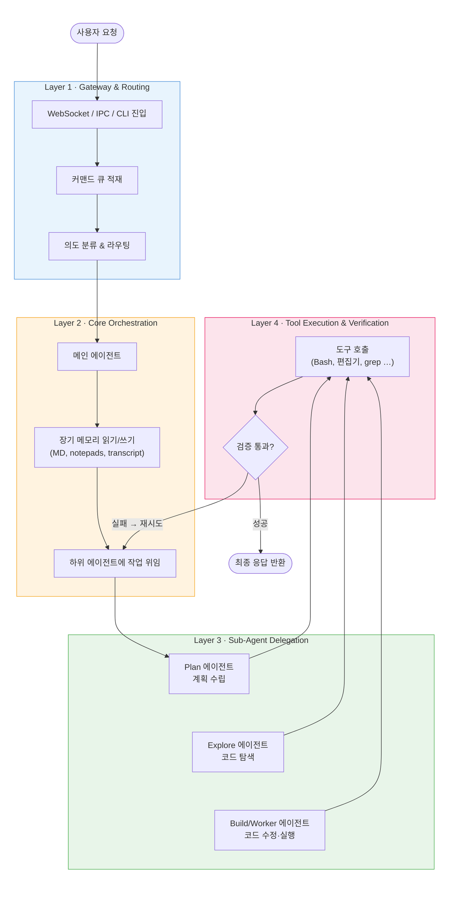
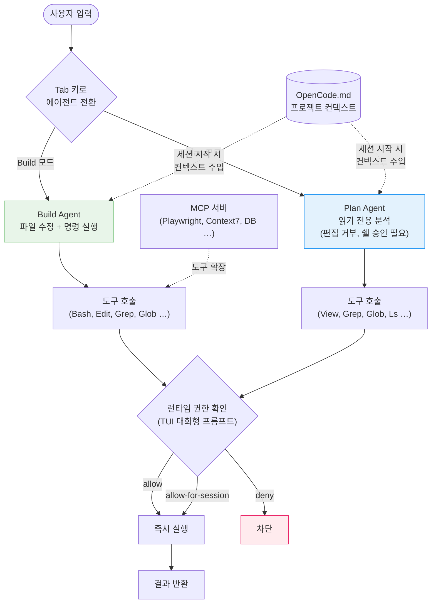
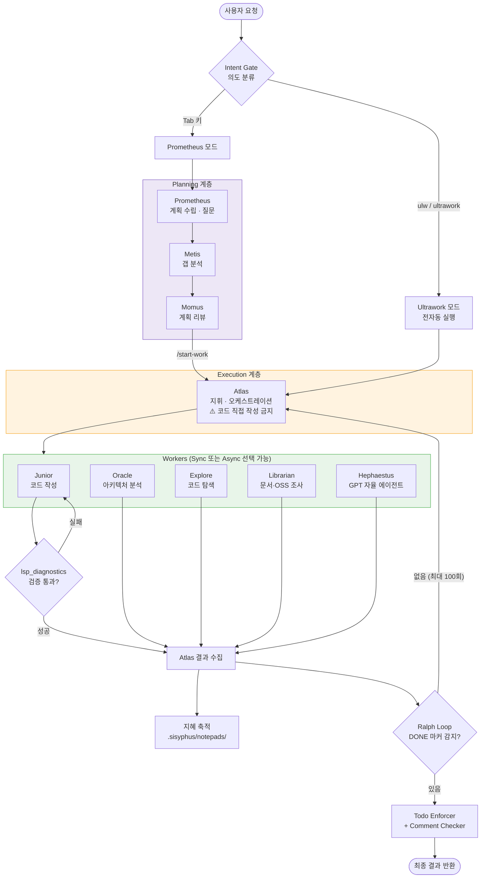
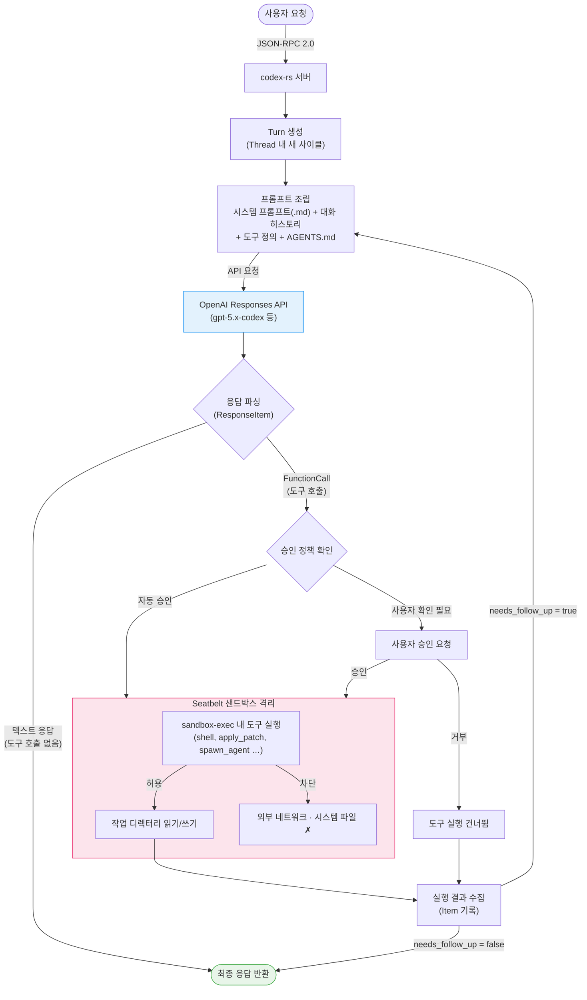
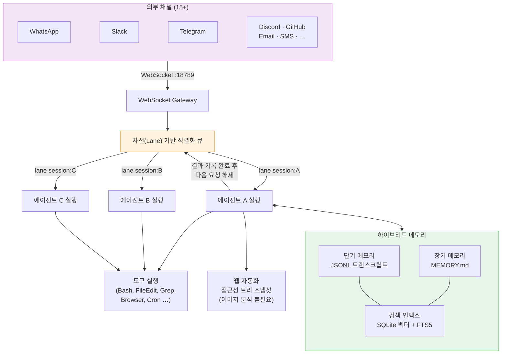

> 코딩 에이전트들이 내부적으로 어떻게 동작하는지 분석합니다. Claude Code, OpenCode, oh-my-opencode(Sisyphus), Codex, OpenClaw 등 주요 코딩 에이전트들의 오케스트레이션 파이프라인, 메모리 구조, 샌드박싱, 권한 제어 방식을 비교합니다. [이전 포스팅 1](https://yuhodots.github.io/deeplearning/25-07-28/), [이전 포스팅 2](https://yuhodots.github.io/deeplearning/25-09-06/)에서 코딩 에이전트의 대략적인 플로우와 Anthropic의 에이전트 설계 노하우에 대해 다뤘는데, 이번 포스팅에서는 각 에이전트들의 내부 동작을 좀 더 깊이 들여다봅니다.

> 본 포스팅은 claude code에게 여러 오픈소스 코딩에이전트를 분석시킨 내용을 바탕으로 작성되었으며, 글 또한 모두 claude code가 작성하였습니다. 제가 작성하는 것 보다 claude code에게 시키는 것이 더 품질 높은 글이 나오는 것 같습니다 😅

### LLM Applications

LLM 기반 애플리케이션의 아키텍처는 크게 세 단계로 발전해 왔습니다.

1. **Stateless 챗봇**: 단순히 프롬프트를 입력하면 답변을 반환하는 형태
2. **워크플로우 기반 시스템**: n8n, LangChain 등 코드가 실행 흐름을 정해두고, LLM을 그 흐름 안에서 호출하는 DAG(Directed Acyclic Graph) 형태
3. **자율형 에이전트**: LLM 자체가 실행 루프를 주도적으로 제어하며, 어떤 도구를 언제 사용할지 스스로 판단하는 형태

코딩 에이전트는 세 번째 단계에 해당합니다. 기존의 IDE 플러그인이나 코드 자동완성 도구와 다른 점은, 코딩 에이전트가 **Bash, 파일 시스템, grep 같은 OS의 기본 도구를 직접 조합하여 작업을 수행**한다는 것입니다. 특정 소프트웨어의 API에 종속되는 대신, 인간 엔지니어가 터미널에서 하는 것과 동일한 방식으로 코드를 읽고, 수정하고, 빌드하고, 테스트합니다.

이전 포스팅에서 정리했던 것처럼 이러한 에이전트의 기본 동작을 요약하면 다음과 같습니다.

1. **Command 여부 확인**: 바로 수행 가능한 command인지, 혹은 프롬프트를 분석한 뒤 tool을 호출해야 하는지 판단
2. **Task의 복잡성 판단**: Plan을 유저에게 검수 받아야 하는 복잡한 일인지 아닌지 판단
3. **Planning**: Plan(ToDo List)을 만들고 순차적으로 실행
   - 각 step에서 필요한 tool 판단 (어떤 tool이 적합한지, 권한이 있는지 등)
   - Tool 사용 결과가 적절했는지 판단
   - Plan 내 모든 step이 완료되었는지 판단
4. **최종 응답을 정리 후 반환**

이 과정이 단순해 보일 수 있지만, 실제로는 여러 기술적 난제가 수반됩니다. 큰 코드베이스를 탐색하면서 컨텍스트 윈도우가 넘치는 **컨텍스트 과부하**, 목표를 잃고 엉뚱한 방향으로 가는 **인지적 표류**, 환각에 의해 같은 명령을 반복하는 **무한 루프**, 그리고 `rm -rf /` 같은 위험한 명령을 실행할 수 있는 **권한 문제** 등이 있습니다. 최신 코딩 에이전트들은 이런 문제들을 **오케스트레이션(Orchestration) 메커니즘**이라는 통제된 구조를 통해 관리합니다.

### AI Coding Agents

현재 개발자 생태계에서 주요 코딩 에이전트들을 분석해보면, **오케스트레이션 파이프라인의 공개 여부**에 따라 폐쇄형과 개방형으로 나뉩니다.

| 에이전트 | 라이선스 | 코어 환경 | 주요 오케스트레이션 특징 |
| --- | --- | --- | --- |
| **Claude Code** | 독점 (비공개) | TypeScript 바이너리, 클라우드/로컬 하이브리드 | 일회성 에이전트 팀, 하드코딩된 시스템 프롬프트, CLAUDE.md 기반 정적 메모리 주입 |
| **OpenCode** | 오픈소스 | Go, TUI 기반 | Build/Plan 다중 에이전트 전환, 런타임 대화형 권한 제어, MCP 확장 |
| **oh-my-opencode** | 오픈소스 | TypeScript (OpenCode 플러그인) | Planning/Execution/Workers 3계층 위임, 지식 축적 시스템, Ralph Loop + LSP 검증 |
| **Codex** | 오픈소스 | Rust (codex-rs) | Thread→Turn→Item 상태 머신, JSON-RPC 기반 통신, Seatbelt 샌드박싱 |
| **OpenClaw** | 오픈소스 | TypeScript, Gateway Server | 차선(Lane) 기반 직렬화 큐, WebSocket 제어, SQLite + FTS5 하이브리드 메모리 |

폐쇄형인 Claude Code는 사용자 경험이 잘 다듬어져 있지만 내부 구조를 변경할 수 없고, 개방형 에이전트들은 다양한 모델 제공자(Provider)를 자유롭게 교체하며 오케스트레이션 파이프라인의 모든 계층을 개발자가 직접 수정할 수 있다는 점에서 차이가 있습니다.

### Common Pipeline

개방형 에이전트들은 각기 다른 구현을 가지고 있지만, 아래와 같은 4개 계층의 공통적인 파이프라인 구조를 공유합니다.

##### Layer 1: Gateway & Routing

사용자의 요청이 WebSocket, IPC, CLI 등을 통해 시스템에 진입하는 계층입니다. 여기서 비동기 요청의 충돌을 방지하기 위해 커맨드 큐에 요청을 적재하고, 요청의 의도를 분류하여 적절한 에이전트로 라우팅합니다.

##### Layer 2: Core Orchestration (Main Agent)

메인 에이전트가 작업의 전체적인 맥락을 파악하고, 장기 메모리 시스템(마크다운 설정 파일, 노트패드, 트랜스크립트 등)을 읽고 쓰면서 작업을 조율하는 계층입니다. 메인 에이전트는 보통 직접 코드를 작성하지 않고, 하위 에이전트들에게 작업을 위임합니다.

##### Layer 3: Sub-Agent Delegation

전문화된 서브 에이전트들이 실제 작업을 수행하는 계층입니다. 일반적으로 다음과 같은 역할로 분리됩니다.

- **Plan 에이전트**: 작업 계획을 수립하고 세분화
- **Explore 에이전트**: 코드베이스를 탐색하고 아키텍처를 분석
- **Build/Worker 에이전트**: 실제 코드를 수정하고 실행

##### Layer 4: Tool Execution & Verification

서브 에이전트가 로컬 도구(Bash, 파일 편집기, grep 등)를 호출하고, 그 결과를 검증하는 계층입니다. 검증에 실패하면 이전 단계로 돌아가서 재시도하며, 모든 검증을 통과해야만 최종 결과가 메인 에이전트로 반환됩니다.

아래 다이어그램은 이 4개 계층의 흐름을 시각화한 것입니다.



이 구조의 핵심은 **인지 부하의 분산**입니다. 단일 프롬프트로 모든 것을 해결하는 대신, 각 계층이 자신의 역할에 집중하고, 검증 루프를 통해 환각이나 실수를 자연스럽게 교정하는 구조입니다.

### Claude Code

Claude Code는 Anthropic의 생태계에 강하게 결합된 독점 도구입니다. 내부 오케스트레이션의 핵심 특징을 살펴보겠습니다.

##### System Prompt & Context

Claude Code의 소스코드를 분석한 결과에 따르면, 내부적으로 약 2,896 토큰 규모의 코어 시스템 프롬프트가 바이너리에 하드코딩되어 있습니다. 여기에 더해 Explore 서브 에이전트(516 토큰), Plan 에이전트(633 토큰), Task 에이전트(294 토큰) 등의 세부 프롬프트도 내장되어 있습니다.

사용자가 직접 개입할 수 있는 부분은 프로젝트 루트의 **CLAUDE.md** 파일을 통한 부분적인 지침 주입입니다. 코딩 스탠다드, 빌드 명령어, 프로젝트 컨벤션 등을 여기에 작성하면 에이전트가 이를 참고하여 작업을 수행합니다. 하지만 코어 런타임의 의사결정 로직 자체를 수정하는 것은 불가능합니다.

##### Agent Team (Ephemeral)

LangGraph나 AutoGen 같은 프레임워크가 세션 간 영구적 메모리를 지닌 에이전트를 코드로 정의하는 것과 달리, Claude Code의 에이전트 팀은 **일회성으로 동작**합니다. 사용자가 프롬프트를 통해 팀 구성을 지시하면, 작업을 위해 다수의 에이전트가 생성되어 병렬로 실행됩니다. 수석 에이전트(Lead Agent)가 작업을 조율하고 하위 작업을 할당한 뒤 결과를 병합합니다. 세션이 종료되면 이 팀은 재개(Resume) 기능 없이 소멸하며, 이는 빠르고 저렴하게 실험적인 워크플로우를 생성하는 데에 최적화된 구조입니다.

##### Programmatic Tool Call

모델이 도구(코드 편집기, 쉘 등)의 사용이 필요하다고 판단하면, 내부적으로 코드를 생성하여 해당 도구를 함수 형태로 호출합니다. 이때 API 실행은 일시 중단되며 `tool_use` 블록을 반환합니다. 도구 실행 과정에서 발생하는 중간 결과나 raw 데이터는 모델의 메인 컨텍스트 윈도우에 적재되지 않고, 도구 호출이 완료된 후 최종 결과만이 모델에게 전달됩니다.

각 도구는 JSON 스키마를 통해 엄격하게 정의됩니다. 64자 이내의 고유한 `name`, 도구의 목적을 설명하는 `description`, 그리고 매개변수의 타입과 구조를 정의하는 `input_schema`를 가져야 합니다. 이러한 구조적 제약은 환각에 의한 잘못된 도구 호출을 방지하고, 중간 데이터 처리가 모델의 토큰을 소모하지 않도록 하여 컨텍스트 윈도우의 효율성을 높입니다.

##### Internal Tools & Agent

Claude Code가 공개적으로 제공하는 핵심 도구는 다음과 같습니다.

| 도구 | 설명 |
| --- | --- |
| **Read** | 파일 읽기 (텍스트, 이미지, PDF, Jupyter 노트북 지원) |
| **Write** | 새 파일 생성 또는 전체 덮어쓰기 |
| **Edit** | 기존 파일의 문자열 정확 치환 (old_string → new_string) |
| **Bash** | 쉘 명령 실행 (최대 10분 타임아웃, 백그라운드 실행 지원) |
| **Glob** | 글로브 패턴 기반 파일 검색 (`**/*.ts` 등) |
| **Grep** | ripgrep 기반 정규식 콘텐츠 검색 |
| **WebFetch** | URL에서 콘텐츠를 가져와 마크다운으로 변환 |
| **WebSearch** | 웹 검색 수행 |
| **Agent** | 경량 서브 에이전트 생성 (병렬 리서치용, 소형 모델 사용) |
| **ToolSearch** | 지연 로딩된 도구를 키워드로 검색하여 활성화 |

에이전트 측면에서는 별도의 명명된 에이전트 시스템이 없고, 메인 모델이 직접 에이전트 역할을 수행합니다. **Agent** 도구를 통해 필요시 서브 에이전트를 생성하며, 이 서브 에이전트는 읽기 전용 도구만 사용 가능합니다. MCP 서버를 통해 Sentry, Slack, 데이터베이스 등의 외부 도구를 추가로 연결할 수 있습니다.

### OpenCode

OpenCode는 오픈소스 코딩 에이전트 중 권한 제어가 가장 정밀한 편입니다. 전체적인 오케스트레이션 흐름은 다음과 같습니다.



##### Internal Tools

OpenCode는 소스코드(`internal/llm/tools/`)에 다음과 같은 12개의 내장 도구를 정의하고 있습니다.

| 도구 | 설명 |
| --- | --- |
| **bash** | 쉘 명령 실행 (타임아웃 설정 가능) |
| **edit** | 파일 편집 (old_string/new_string 치환, 생성, 삭제) |
| **write** | 파일 생성 또는 덮어쓰기 |
| **view** | 파일 내용 읽기 (줄 번호, offset/limit 지원) |
| **glob** | 글로브 패턴 기반 파일 검색 |
| **grep** | 정규식 기반 콘텐츠 검색 |
| **ls** | 디렉터리 트리 구조 출력 |
| **patch** | 여러 파일에 걸친 변경을 한 번에 적용 |
| **fetch** | URL에서 콘텐츠를 가져와 마크다운으로 변환 |
| **sourcegraph** | Sourcegraph GraphQL API를 통한 퍼블릭 레포지토리 코드 검색 |
| **diagnostics** | LSP 진단 결과 조회 (에러/경고, LSP 클라이언트 설정 시 활성화) |
| **agent** | 읽기 전용 서브 에이전트 생성 (glob, grep, ls, sourcegraph, view만 사용 가능) |

##### Agents

내장 에이전트는 4종이며, 핵심은 **coder**와 **task**입니다. Tab 키로 즉시 전환할 수 있습니다.

| 에이전트 | 역할 | 사용 가능 도구 |
| --- | --- | --- |
| **coder** (= Build) | 전체 도구 접근 가능한 코딩 에이전트 | 12개 전체 |
| **task** (= Plan 서브에이전트) | 읽기 전용 탐색/분석 | glob, grep, ls, sourcegraph, view |
| **summarizer** | 대화 기록 컨텍스트 압축 | - |
| **title** | 세션 제목 자동 생성 (최대 80 토큰) | - |

사용자 정의 명령어를 추가할 때는 `.opencode/commands/` 디렉터리에 마크다운 파일을 만들면 됩니다. 파일명이 슬래시 명령어의 이름이 되고, 파일 내용 전체가 프롬프트 템플릿으로 사용됩니다. `$NAME` 형식의 인수 플레이스홀더도 지원합니다.

##### Runtime Permission Control

OpenCode의 권한 제어는 사전에 파일로 설정하는 방식이 아니라, **런타임에 TUI 대화형 프롬프트**를 통해 이루어집니다. 에이전트가 쉘 명령이나 파일 수정 등 위험 가능성이 있는 도구를 호출하면, TUI 화면에 해당 작업 내용이 표시되고 사용자에게 승인을 요청합니다.

사용자는 세 가지 선택지 중 하나를 고릅니다.

- **allow**: 이번 한 번만 허용
- **allow-for-session**: 현재 세션 동안 동일한 유형의 작업을 자동 허용
- **deny**: 차단

이 방식의 장점은 에이전트의 실제 행동을 보면서 맥락에 맞게 판단할 수 있다는 점입니다. 정적 설정 파일로는 예측하기 어려운 상황별 판단을 사용자가 실시간으로 내릴 수 있어, 에이전트의 환각으로 인한 위험한 명령 실행(e.g., `rm -rf`)을 효과적으로 차단합니다.

##### Context Initialization & MCP

OpenCode는 `/init` 명령어로 프로젝트 구조를 자동 분석하여 `OpenCode.md` 파일을 생성합니다. 이 파일에는 빌드/린트/테스트 명령어와 코드 스타일 가이드라인 등이 기록되어 에이전트가 프로젝트 맥락을 빠르게 파악할 수 있도록 도와줍니다.

또한 **MCP(Model Context Protocol)** 서버를 통해 기능을 확장할 수 있습니다. Playwright(브라우저 자동화), Context7(라이브러리 문서 조회), Database(DB 스키마 조회) 등의 MCP 서버를 연결하면 에이전트가 해당 도구를 활용할 수 있게 됩니다. oh-my-opencode에서는 이를 한 단계 발전시켜 각 skill이 자체 MCP 서버를 가져오는 **embedded MCP** 방식을 사용하여, 필요할 때만 도구를 활성화하고 컨텍스트 윈도우가 불필요하게 비대해지는 것을 방지합니다.

### oh-my-opencode (Sisyphus)

OpenCode를 기반으로 구축된 확장 플러그인인 oh-my-opencode는 **Sisyphus**라는 오케스트레이션 시스템을 도입했습니다. 아래는 Sisyphus의 전체 오케스트레이션 파이프라인입니다.



단일 벤더에 종속되지 않고, Claude를 오케스트레이션에, GPT를 논리적 추론에, Gemini를 프론트엔드 작업에 병렬 할당하는 식으로 다양한 모델을 적재적소에 배치합니다. 프로젝트 README에서는 이를 "OpenCode가 Debian이라면, oh-my-opencode는 Ubuntu"라고 비유합니다.

##### Internal Tools & Agents

oh-my-opencode는 OpenCode의 도구를 상속하면서, 멀티 에이전트 시스템과 전용 도구를 추가합니다.

| 에이전트 | 기본 모델 | 역할 | 쓰기 권한 |
| --- | --- | --- | :---: |
| **OmO (Sisyphus)** | claude-opus | 메인 오케스트레이터. 요구사항 파악, 코드베이스 평가, 서브 에이전트 위임 | O |
| **Oracle** | gpt-5.4 | 아키텍처 자문, 코드 리뷰, 디버깅. 순수 추론 전용 (도구 없음), 32k 토큰 사고 예산 | X |
| **Librarian** | gemini-flash | 외부 문서 조회, 멀티 레포 분석, OSS 리서치 | X |
| **Explore** | grok-code-fast | 빠른 코드베이스 검색. "X가 어디에?" 질문 전문 | X |
| **Hephaestus** | gpt-5 계열 | GPT-native 자율 에이전트. 독립적 판단으로 작업 수행 | O |
| **Multimodal Looker** | gpt-5.4 | PDF, 이미지, 다이어그램 등 미디어 파일 분석 | X |
| **Metis** | (상위 모델) | Prometheus의 갭 분석 보조. 32k 토큰 사고 예산 | X |
| **Momus** | (상위 모델) | 계획 리뷰 및 검증. 32k 토큰 사고 예산 | X |

에이전트 간 통신에는 다음의 전용 도구가 사용됩니다.

| 도구 | 사용 주체 | 설명 |
| --- | --- | --- |
| `call_omo_agent` | OmO | 서브 에이전트 호출 |
| `background_task` | OmO | Async 에이전트를 백그라운드로 실행 |
| `background_output` / `background_cancel` | OmO | 백그라운드 작업 결과 수집 또는 취소 |
| `context7` | Librarian | 라이브러리 문서 실시간 조회 |
| `websearch_exa` | Librarian | 웹 검색 |
| `grep_app` | Librarian, Explore | GitHub 코드 검색 |
| `lsp_goto_definition` / `lsp_find_references` / `lsp_symbols` | Explore | LSP 기반 코드 탐색 |
| `ast_grep_search` | Explore | AST 패턴 매칭 기반 코드 검색 |
| `look_at` | 모든 에이전트 | Multimodal Looker를 트리거하여 미디어 파일 분석 |

##### Intent Gate & Execution Mode

Sisyphus는 사용자의 요청을 받으면 바로 실행하지 않고, 먼저 **Intent Gate**를 통해 요청의 진정한 의도를 분류합니다. 연구인지, 구현인지, 조사인지, 버그 수정인지를 판단한 뒤 적절한 에이전트와 워크플로우로 라우팅합니다.

실행 모드는 크게 두 가지입니다.

- **Ultrawork 모드**: `ultrawork` 또는 `ulw`를 입력하면 전자동으로 동작. 코드베이스 탐색, 패턴 분석, 구현, 진단 검증까지 에이전트가 스스로 판단하여 완료까지 진행
- **Prometheus 모드**: Tab 키로 진입. Prometheus가 실제 엔지니어처럼 사용자에게 명확한 질문을 던져 요구사항을 정밀하게 파악한 뒤 계획을 수립. 이후 `/start-work`를 실행하면 Atlas가 활성화되어 계획에 따라 작업을 분배

##### 3-Layered Delegation Model

Sisyphus의 핵심 아키텍처는 Planning / Execution / Workers의 3계층 위임 구조입니다.

1. **Planning 계층** - Prometheus(계획 수립) + Metis(갭 분석) + Momus(리뷰): 사용자의 요구사항을 분석하고 `.sisyphus/plans/*.md` 형태로 작업 계획을 생성. Metis는 Prometheus가 놓친 부분을 포착하고, Momus는 계획의 명확성과 검증 가능성을 검토
2. **Execution 계층** - Atlas(지휘/오케스트레이션): 계획을 읽고, 파일 탐색과 명령어 실행을 통해 결과를 검증하는 권한은 있지만, **코드를 직접 작성하거나 수정하는 것은 금지**. 실제 코드 작업은 반드시 Workers에게 위임
3. **Worker 계층** - Sisyphus-Junior(코드 작성), Oracle(아키텍처 분석), Explore(코드베이스 검색), Librarian(문서/OSS 조사), Hephaestus(GPT-native 자율 에이전트) 등: 각자의 전문 영역에서 실제 작업을 수행

Worker 계층에서 주목할 점은 **Sync/Async 실행 선택**입니다. 모든 에이전트는 `call_omo_agent` 도구의 `run_in_background` 매개변수를 통해 동기(응답 대기) 또는 비동기(백그라운드 병렬) 실행을 선택할 수 있습니다. Atlas는 작업 성격에 따라 Junior나 Oracle처럼 결과를 즉시 확인해야 하는 경우 Sync로, Librarian이나 Explore처럼 독립적인 조사 작업은 Async로 병렬 실행합니다. 5개 이상의 에이전트가 동시에 작업할 수 있어서, 한 에이전트가 코드를 작성하는 동안 다른 에이전트가 패턴을 조사하고 또 다른 에이전트가 문서를 확인하는 식으로 마치 실제 개발 팀처럼 동작합니다.

##### Category-based Model Routing

oh-my-opencode의 멀티모델 지원에서 핵심적인 메커니즘은 **Category 시스템**입니다. 에이전트가 하위 에이전트에게 작업을 위임할 때, 특정 모델명을 지정하는 것이 아니라 작업의 성격에 맞는 카테고리를 지정합니다. 카테고리는 자동으로 최적의 모델에 매핑됩니다.

```jsonc
// oh-my-opencode.json 설정 예시
{
  "agents": {
    "sisyphus": { "model": "anthropic/claude-opus-4-6" },
    "oracle": { "model": "openai/gpt-5.4" },
    "librarian": { "model": "google/gemini-3-flash" },
    "explore": { "model": "github-copilot/grok-code-fast-1" }
  },
  "categories": {
    "visual-engineering": { "model": "google/gemini-3.1-pro" },
    "ultrabrain": { "model": "openai/gpt-5.3-codex" },
    "quick": { "model": "anthropic/claude-haiku-4-5" },
    "deep": { "model": "openai/gpt-5.3-codex" }
  }
}
```

이 설정은 글로벌(`~/.config/opencode/oh-my-opencode.json`)과 프로젝트 로컬(`.opencode/oh-my-opencode.json`)에 각각 둘 수 있으며, 런타임에 모델 제공자가 다운되더라도 fallback 체인을 통해 다른 제공자로 자동 전환됩니다.

##### Hash-anchored Edits (LINE#ID)

코딩 에이전트의 고질적인 문제 중 하나는 파일 편집 시 모델이 **기존 코드를 정확히 재현하지 못해 edit이 실패**하는 것입니다. oh-my-opencode는 **LINE#ID 콘텐츠 해싱** 방식으로 이 문제를 해결합니다. 편집 대상 라인을 텍스트 매칭이 아닌 해시값으로 식별하여, 모든 편집을 적용 전에 검증합니다. 이 방식 덕분에 **Grok Code Fast 1 모델의 편집 성공률이 6.7%에서 68.3%로 크게 향상**되었습니다.

##### Wisdom Accumulation Mechanism

Atlas 에이전트의 가장 독창적인 기능입니다. 하위 에이전트가 작업을 마칠 때마다 Atlas는 그 응답에서 **성공적인 패턴, 아키텍처 관례, 실패 원인 등을 추출하여 프로젝트 내부에 마크다운으로 물리적으로 기록**합니다.

```
.sisyphus/notepads/{plan-name}/
├── learnings.md       # 코드 컨벤션, 패턴, 성공적인 접근법
├── decisions.md       # 아키텍처적 선택 사항과 근거
├── issues.md          # 발생한 문제점, 차단 요인(Blockers)
└── problems.md        # 미해결 이슈, 기술 부채
```

이 지식의 물리적 축적은 **에이전트가 동일한 실수를 반복하는 것을 방지**하고, 후속 에이전트들이 일관된 코드 패턴을 유지하도록 돕습니다.

##### Persistence Loop & LSP Validation

oh-my-opencode의 핵심적인 차별점으로, 두 가지 보완적인 메커니즘이 작업 완성도를 강제합니다.

첫 번째는 **Ralph Loop**(`/ralph-loop` 또는 `/ulw-loop`)입니다. 이 자기참조적 실행 루프는 작업이 완전히 완료되었음을 나타내는 `<promise>DONE</promise>` 마커가 감지될 때까지 최대 100회 반복하며, **에이전트가 작업을 중도에 포기하는 것을 방지**합니다.

두 번째는 **lsp_diagnostics 검증**입니다. Sisyphus-Junior는 작업 완료를 보고하기 전에 반드시 LSP(Language Server Protocol) 진단 도구인 `lsp_diagnostics`를 실행하여 **문법적 오류나 lint 에러가 없는지 확인**해야 합니다. 이 검증을 통과하지 못하면 작업 완료로 인정되지 않습니다.

이 외에도 **Todo Continuation Enforcer**(유휴 상태의 에이전트를 작업으로 복귀시킴)와 **Comment Checker**(AI가 남긴 불필요한 주석을 자동 제거) 같은 보조 메커니즘이 있습니다. 이러한 discipline 메커니즘들의 조합을 통해, 코딩 에이전트가 복잡한 작업을 80%만 수행하고 나머지를 인간에게 넘기는 '게으른 에이전트(Lazy Agent)' 현상을 구조적으로 방지합니다.

### OpenAI Codex

OpenAI의 Codex(codex-rs)는 코어 런타임을 **Rust**로 구축하여 높은 파일 시스템 IO 성능과 메모리 안전성을 확보했습니다. 전체 아키텍처를 다이어그램으로 표현하면 다음과 같습니다.



##### Internal Tools

Codex는 다른 코딩 에이전트 대비 도구의 종류가 특히 다양합니다. `codex-rs/core/src/tools/`에 정의된 주요 도구를 카테고리별로 정리하면 다음과 같습니다.

| 카테고리 | 도구 | 설명 |
| --- | --- | --- |
| **파일 시스템** | `read_file`, `list_dir`, `grep_files`, `apply_patch`, `view_image` | 파일 읽기, 디렉터리 탐색, 정규식 검색, 패치 적용, 이미지 분석 |
| **실행** | `shell`, `container.exec`, `write_stdin` | 쉘 명령 실행 (Seatbelt 샌드박스 내), 컨테이너 실행, 프로세스에 stdin 입력 |
| **계획** | `update_plan` | 구조화된 작업 계획 생성 및 업데이트 |
| **멀티 에이전트** | `spawn_agent`, `send_input`, `resume_agent`, `wait`, `close_agent` | 서브 에이전트 생성, 입력 전송, 재개, 대기, 종료 |
| **MCP** | `list_mcp_resources`, `read_mcp_resource` | MCP 리소스 목록 조회 및 읽기 |
| **인터랙티브** | `js_repl`, `request_user_input`, `web_search`, `image_generation` | JavaScript REPL, 사용자 입력 요청, 웹 검색, 이미지 생성 |

특히 `spawn_agent` → `send_input` → `wait` → `close_agent` 패턴을 통한 **프로그래매틱 멀티 에이전트 관리**가 가능하며, `spawn_agents_on_csv`로 CSV 데이터 기반 에이전트 일괄 생성도 지원합니다.

##### Thread → Turn → Item 상태 머신

에이전트와의 모든 상호작용은 3단계의 명시적인 상태 머신으로 관리됩니다.

- **Thread**: 사용자와 에이전트 간의 장기적인 대화 컨텍스트 전체
- **Turn**: 사용자의 단일 요청과 그에 따른 에이전트의 후속 작업 전체
- **Item**: 사용자 메시지, 도구 호출, 명령어 실행 결과, 파일 변경 사항 등 최소 단위의 입출력

이러한 계층적 상태 관리 덕분에 복잡한 비동기 작업 중에도 세션의 무결성을 보장할 수 있습니다.

##### JSON-RPC-based Communication

Codex는 클라이언트와 서버 간 통신을 위해 **JSON-RPC 2.0** 프로토콜을 사용합니다. 기본 전송 방식은 표준 입출력(stdin/stdout)을 통한 줄바꿈 구분 JSON이며, 실험적으로 WebSocket도 지원합니다. 메시지는 `*Params`(요청), `*Response`(응답), `*Notification`(알림) 형태의 명명 규칙을 따릅니다. `codex-rs/app-server-protocol/src/protocol/v2.rs`에 `Thread`, `Turn` 등의 구조체와 함께 `TurnStartedNotification`, `TurnCompletedNotification`, `ItemStartedNotification`, `ItemCompletedNotification` 등의 알림 타입이 정의되어 있어, 클라이언트가 에이전트의 실행 상태를 실시간으로 추적할 수 있습니다.

##### Seatbelt Sandboxing

macOS 환경에서 Codex는 Apple의 내장 샌드박스 유틸리티인 **Seatbelt**(`/usr/bin/sandbox-exec`)를 사용하여 하위 프로세스를 실행합니다. 쉘 도구가 호출될 때마다 `CODEX_SANDBOX_NETWORK_DISABLED=1` 또는 `CODEX_SANDBOX=seatbelt` 환경 변수가 설정됩니다. 이 격리 환경에서는 다음이 원천 차단됩니다.

- 에이전트가 쉘을 통해 외부로 임의의 네트워크 요청을 전송하여 데이터를 유출하는 행위
- 작업 디렉터리를 벗어나 시스템의 민감한 파일에 접근하는 행위

보안 격리가 핵심적인 설계 철학으로 자리 잡고 있어서, 개발자 기여 지침에도 샌드박스 관련 환경 변수를 우회하거나 수정하는 코드를 추가하지 말라는 명시적인 규칙이 있습니다.

### OpenClaw

OpenClaw는 단순한 코딩 에이전트를 넘어 WhatsApp, Slack, Telegram 등 15개 이상의 외부 채널과 연동되는 로컬 호스팅 기반의 자율형 에이전트 런타임입니다. 포트 18789를 사용하는 로컬 WebSocket 게이트웨이를 통해 동시다발적 요청을 오케스트레이션합니다. 아래는 OpenClaw의 전체 흐름입니다.



##### Internal Tool Groups

OpenClaw는 도구를 **그룹(group)** 단위로 관리하여 권한 정책을 간결하게 설정합니다. 주요 도구 그룹과 대표 도구는 다음과 같습니다.

| 그룹 | 대표 도구 | 설명 |
| --- | --- | --- |
| **group:runtime** | `exec`, `process` | 쉘 명령 실행 (포그라운드/백그라운드/PTY), 프로세스 관리 (목록/로그/kill) |
| **group:fs** | `read`, `write`, `edit`, `apply_patch` | 파일 시스템 읽기/쓰기/편집/패치 |
| **group:web** | `web_search`, `web_fetch` | 웹 검색 (Perplexity/Brave/Gemini 등), URL 콘텐츠 추출 |
| **group:ui** | `browser`, `canvas` | 브라우저 자동화 (탭/스크린샷/클릭/입력), 캔버스 렌더링 |
| **group:sessions** | `sessions_spawn`, `sessions_send`, `sessions_history` | 서브 에이전트 세션 생성, 메시지 전송, 히스토리 조회 |
| **group:memory** | `memory_search`, `memory_get` | 장기 메모리 검색 및 조회 |
| **group:messaging** | `message` | 15개+ 외부 채널로 메시지 전송/수신/검색/편집/삭제 |
| **group:automation** | `cron`, `gateway` | 크론 작업 관리, 게이트웨이 설정/재시작 |
| **특수 도구** | `image`, `pdf`, `nodes` | 이미지/PDF 분석, 페어링된 디바이스(Android/iOS/macOS) 제어 |

도구 프로파일로 `minimal`(session_status만), `coding`(fs+runtime+sessions+memory), `messaging`(메시징+세션), `full`(전체)을 선택할 수 있어서, 에이전트의 용도에 맞게 도구 접근 범위를 제한합니다.

##### Lane-based Serialization Queue

다수의 비동기 요청이 쏟아지는 에이전트 시스템에서 가장 까다로운 문제 중 하나는 **레이스 컨디션(Race Condition)**입니다. 여러 비동기 함수가 동시에 동일한 파일 시스템이나 메모리 상태를 수정하려 하면 컨텍스트 붕괴나 파일 손상이 발생할 수 있습니다.

OpenClaw는 이 문제를 **차선(Lane) 기반 직렬화 커맨드 큐**로 해결합니다. **시스템에 유입되는 모든 메시지나 크론 작업은 각 세션의 고유한 레인(`lane session:<key>`)에 할당되어 큐에 적재**됩니다.

```typescript
// 세션 키 기반으로 큐에 적재하여 세션당 하나의 실행만 보장
runEmbeddedPiAgent enqueues by session key (lane session:<key>)
```

**특정 세션 내에서는 이전 에이전트 실행이 완전히 종료되어 결과가 파일에 기록되고 메모리에 반영되기 전까지 다음 요청의 실행이 보류**됩니다. 이처럼 동시성을 제한하는 것은 성능의 한계가 아니라, 세션 히스토리의 무결성을 유지하기 위한 의도적인 설계입니다.

##### Hybrid Memory Architecture

컨텍스트 윈도우의 제약을 극복하기 위해 OpenClaw는 다층적인 메모리 구조를 가지고 있습니다.

- **단기 메모리**: 세션에서 발생하는 대화와 도구 호출 내역을 JSONL 형식의 트랜스크립트 파일로 디스크에 기록
- **장기 메모리**: 중요한 아키텍처 정보나 사용자 선호도를 **MEMORY.md 마크다운 파일에 저장**
- **검색 인덱스**: **내장 SQLite**를 활용하여 **임베딩 기반 벡터 검색**(의미론적 일치)과 **FTS5 키워드 검색**(정확한 구문 일치)을 동시에 수행

에이전트가 과거 정보에 접근해야 할 때, 이 하이브리드 검색을 통해 방대한 로그에서 필요한 컨텍스트만을 빠르게 추출하여 프롬프트에 동적으로 주입합니다.

##### Web Automation with Semantic Snapshot

로컬 브라우저 제어 시 화면 캡처나 픽셀 좌표에 의존하는 대신, 브라우저의 **접근성 트리(Accessibility Tree)**를 기반으로 의미론적 스냅샷을 추출합니다. 텍스트 박스나 버튼의 레퍼런스 ID를 추출하여 모델에게 제공하므로, 이미지 분석 과정 없이도 적은 비용으로 안정적인 웹 자동화가 가능합니다.

### AST-based Code Search

과거 개발 보조 도구들은 텍스트 기반의 정규 표현식으로 코드를 검색했지만, 최근 오픈소스 코딩 에이전트들은 **AST(Abstract Syntax Tree)** 기반의 파싱 도구인 ast-grep을 오케스트레이션 루프의 핵심 탐색 도구로 활용합니다.

예를 들어, 코드베이스에서 "하드코딩된 시크릿 키를 반환하는 함수"를 찾으려 할 때, **텍스트 검색은 줄바꿈이나 띄어쓰기, 변수명 차이로 정확도가 떨어집니다**. AST 기반 검색은 코드의 논리적 구조를 이해하기 때문에 이런 표면적 차이에 영향받지 않습니다.

에이전트가 ast-grep 규칙을 생성하고 검증하는 과정은 다음과 같습니다.

1. **예제 생성**: 모델이 검색 의도에 부합하는 가상의 타겟 예제 코드를 작성
2. **규칙 초안 작성**: 예제 코드를 정확히 잡아낼 YAML 규칙 초안을 작성

```yaml
# 에이전트가 생성한 ast-grep 규칙 예시
id: async-with-await
language: javascript
rule:
  kind: function_declaration
  has:
    pattern: await $EXPR
  stopBy: end
```

3. **CST 덤프 및 디버깅**: `--debug-query=cst` 플래그로 **CST(Concrete Syntax Tree)**를 덤프하여, 패턴이 트리의 어느 노드에 매칭되는지 확인하고 교정
4. **전체 스캔 적용**: 샌드박스에서 검증이 완료된 규칙으로 실제 프로젝트 전체를 스캔 (`ast-grep scan --rule ...`)

이러한 다단계 검증 루프를 통해 코딩 에이전트는 코드의 표면적인 텍스트 형태에 구애받지 않고, 논리적으로 동일한 구조를 가진 블록을 정밀하게 찾아낼 수 있습니다. 이는 검색 정확도를 높이는 것뿐 아니라, 불필요한 파일을 읽어 컨텍스트 공간을 낭비하는 것도 방지합니다.

### Summary

이번 포스팅에서 분석한 코딩 에이전트들의 핵심 설계 원칙을 정리하면 다음과 같습니다.

- **인지 부하의 분산**: 단일 에이전트가 모든 것을 처리하는 대신, 계획/탐색/실행/검증 역할을 분리된 에이전트들에게 위임하여 각자의 전문 영역에 집중하도록 합니다. oh-my-opencode처럼 `run_in_background` 매개변수를 통해 에이전트를 병렬로 운용하는 것도 이 원칙의 확장입니다.
- **의도 분류 후 라우팅**: 사용자의 요청을 바로 실행하지 않고, Intent Gate를 통해 의도를 분류한 뒤 적절한 에이전트와 모델로 라우팅합니다. Category 시스템을 통해 모델명이 아닌 작업 성격 기반으로 자동 매핑하는 방식은 멀티모델 오케스트레이션의 핵심입니다.
- **컨텍스트 경제학**: 컨텍스트 윈도우를 희소한 자원으로 취급하며, 중간 결과를 메인 컨텍스트에 적재하지 않고 도구 실행으로 오프로드하거나, 하위 에이전트가 핵심만 압축하여 상위에 전달하는 방식으로 효율을 극대화합니다. Embedded MCP를 통해 필요한 도구만 선택적으로 활성화하는 것도 같은 맥락입니다.
- **구조적 안전장치**: 런타임 대화형 권한 제어(OpenCode), OS 수준 샌드박싱(Codex의 Seatbelt), 차선 기반 직렬화 큐(OpenClaw), 해시 기반 편집 검증(oh-my-opencode의 LINE#ID) 등을 통해 환각이나 비동기 충돌로 인한 위험을 아키텍처 수준에서 차단합니다.
- **영속적 품질 검증**: 자기참조적 실행 루프(Ralph Loop)와 LSP 진단 검증을 조합하여 코드의 완성도를 기계적으로 강제합니다. Todo Enforcer, Comment Checker 등의 보조 메커니즘도 에이전트의 discipline을 유지하는 데 기여합니다.
- **장기 메모리와 지식 축적**: 작업 중 발견된 패턴과 실패 원인을 물리적으로 기록(oh-my-opencode의 notepads, OpenClaw의 MEMORY.md)하여 동일한 실수의 반복을 방지하고 일관된 코드 품질을 유지합니다.

결국, 코딩 에이전트의 핵심은 "얼마나 똑똑한 모델을 쓰는가"보다 "**비결정론적인 모델의 출력을 어떻게 통제된 구조 안에서 신뢰할 수 있는 결과물로 변환하느냐**"에 있습니다. 이는 단일 모델의 한계를 인정하고, 모델마다 다른 기질(Claude의 깊은 사고, GPT의 아키텍처적 추론, Gemini의 시각적 이해, Haiku의 빠른 처리)을 인정한 위에서 각 모델을 적재적소에 배치하는 멀티모델 오케스트레이션이 자연스러운 방향임을 시사합니다. 이러한 정밀한 오케스트레이션 파이프라인이 코딩 에이전트를 단순한 LLM API 래퍼에서 실질적인 소프트웨어 엔지니어링 도구로 끌어올린 핵심 기술이라고 할 수 있습니다.

### References

- [Claude Code Architecture (Reverse Engineered) - Vikash Rungta](https://vrungta.substack.com/p/claude-code-architecture-reverse)
- [oh-my-opencode Orchestration Guide - GitHub](https://github.com/code-yeongyu/oh-my-opencode/blob/dev/docs/guide/orchestration.md)
- [How Claude Code works - Claude Code Docs](https://code.claude.com/docs/en/how-claude-code-works)
- [Claude Code Agent Teams](https://cobusgreyling.medium.com/claude-code-agent-teams-ca3ec5f2d26a)
- [OpenCode vs Claude Code - Morph](https://www.morphllm.com/comparisons/opencode-vs-claude-code)
- [Programmatic tool calling - Claude API Docs](https://platform.claude.com/docs/en/agents-and-tools/tool-use/programmatic-tool-calling)
- [The Complete Guide to AI Agent Memory Files](https://medium.com/data-science-collective/the-complete-guide-to-ai-agent-memory-files-claude-md-agents-md-and-beyond-49ea0df5c5a9)
- [anomalyco/opencode - GitHub](https://github.com/anomalyco/opencode)
- [Permissions | OpenCode](https://opencode.ai/docs/permissions/)
- [oh-my-opencode AGENTS.md - GitHub](https://github.com/code-yeongyu/oh-my-opencode/blob/dev/AGENTS.md)
- [Codex CLI - OpenAI for developers](https://developers.openai.com/codex/cli/)
- [Codex App Server - OpenAI](https://developers.openai.com/codex/app-server/)
- [codex/AGENTS.md - GitHub](https://github.com/openai/codex/blob/-/AGENTS.md)
- [Technical Deep Dive into OpenClaw's Architecture](https://towardsaws.com/unlocking-the-lobster-way-a-technical-deep-dive-into-openclaws-architecture-061f342e2f50)
- [Sisyphus loop for 100% task completion - Reddit](https://www.reddit.com/r/ClaudeAI/comments/1qi39gt/i_found_a_way_to_force_100_task_completion_using/)
