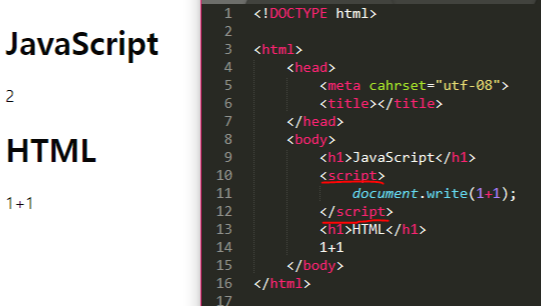
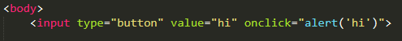
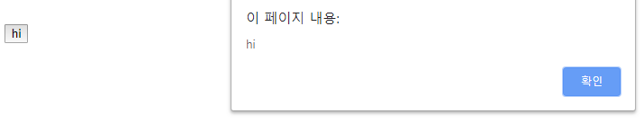

> 이 글은 ‘오픈튜토리얼스-생활코딩’의 Egoing님의 [강의](https://opentutorials.org/course/3083)를 정리했음을 먼저 밝힙니다. 

웹 프로그래밍에서 JavaScript의 중요한 측면은 ‘사용자와 상호작용을 한다는 점'입니다. 웹 브라우저는 한 번 화면에 출력이 되면 자기 자신을 바꿀 수 있는 능력이 없습니다. 하지만 JavaScript를 이용하면 이런 단점을 어느정도 보완할 수 있게 됩니다. JavaScript는 HTML 코드를 제어하고 이를 통해 웹 페이지를 훨씬 동적으로 디자인할 수 있게 만들어 줍니다. 

오늘은 JavaScript를 본격적으로 배워보기에 앞서서, 꼭 알고 가야 할 세가지 토픽에 대해 살펴보도록 하겠습니다.

### Script태그

 기본적으로 JavaScript는 HTML의 위에서 작동하는 언어입니다. 하지만 이 둘은 완전히 다른 문법으로 작성됩니다. 그렇다면 겉보기에는 매우 달라 보이는 이 둘을 어떻게 하면 적절하게 접목시킬 수 있을까요? 바로 `Script` 태그를 활용하면 됩니다.

이를 위해 HTML코드로 JavaScript가 시작된다는 것을 알려주어야 합니다. 컴퓨터는 `<script>` 태그를 사용한 지점부터 태그가 끝나는 지점까지 작성된 코드를 JavaScript로 인식하게 됩니다. 

위의 예시에서는 `document.write(1+1)`부분을 JavaScript코드로 인식하게 됩니다

### 이벤트 (Event)

자바스크립트가 사용자와 상호작용하는데 핵심적인 내용으로 또 ‘이벤트’라는 것이 있습니다. 예를 들어, hi라고 적힌 버튼을 한 번 만들어 봅시다. 그리고 버튼을 누르면 경고창이 뜨게 해 봅시다.

 코드를 살펴보면 `onclick`이라는 속성이 있습니다. `onclick`이라는 속성에는 반드시 JavaScript가 와야 하는데 이 속성 값에 대해서는 웹 브라우저가 기억하고 있다가, 사용자가 클릭이라는 이벤트를 줬을 때 속성값에 따라 자바스크립트 코드가 실행됩니다.

 이처럼 웹 브라우저 상에서 일어나는 일들을 사건(event)이라고 합니다. 위의 예시처럼 `onclick` 또한 이벤트 중 하나이죠. 사실 모든 이벤트를 고려한다면 무한한 이벤트들이 있겠지만, 프로그래머들은 그 중에서 자주 사용되는 기념할 만한 이벤트들을 따로 정리해 두었습니다. 대략 10개에서 20개 정도의 이벤트가 있는데, 우리가 이를 잘 활용한다면 사용자와 상호작용하는 웹페이지를 만들 수 있습니다. 어떤 이벤트들이 있는지 찾고 싶을 때는 구글링 하시는 것을 추천 드립니다.

### 콘솔 (Console)

 지금까지 우리는 JavaScript를 실행하기 위해서 파일을 만들어서 실행시켜 보았습니다. 하지만 아주 간단한 내용을 실행시켜보고 싶을 때는 콘솔(console)을 이용해서 쉽게 코드를 실행시켜 볼 수 있습니다. 크롬의 경우에는 웹페이지의 빈 공간을 우클릭 후 ‘검사’를 누르거나, 아니면 ‘Ctrl + Shift + J’단축키를 사용해서 콘솔을 켤 수 있습니다.

 콘솔에서 실행시키는 JavaScript 코드는 현재 켜져 있는 웹페이지를 대상으로 작동하기 때문에 은근히 유용하게 사용할 수 있는 경우가 많습니다. 예를 들어 페이스북 아무 게시글이나 들어가서 ‘크롬 개발자 도구 – Elements’를 켜봅시다. 그리고 수많은 댓글 데이터 중 랜덤으로 몇 개의 데이터를 랜덤으로 추출하는 코드를 console에 입력하게 되면, 수 천개의 댓글 중 랜덤으로 몇 명을 쉽게 추첨할 수 있게 됩니다.