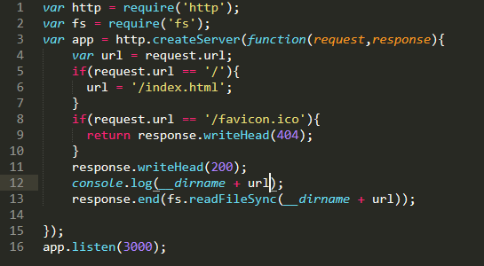
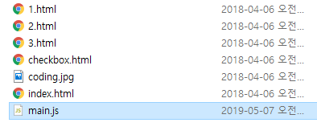
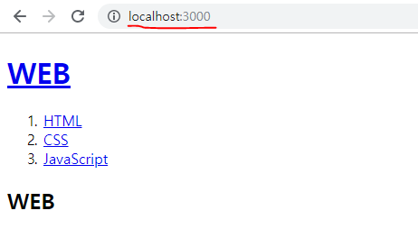

> 이 글은 ‘오픈튜토리얼스-생활코딩’의 Egoing님의 [강의](https://opentutorials.org/course/3332/21032)를 정리했음을 먼저 밝힙니다.

 WEB은 크게 웹 브라우저와 웹서버로 나누어 볼 수 있습니다. 웹 브라우저에 주소를 입력해서 서버에 요청을 하면, 웹 서버는 주소에 따른 요청을 찾아서 응답해주는 관계에 있습니다. 아파치를 통해 웹 서버를 구동시킬 수도 있지만, Node.js는 기본적으로 웹 서버를 내장하고 있기 때문에 웹 서버의 역할로서 활용할 수도 있습니다. 

### 웹 서버로서의 Node.js

서버를 구동시킬 수 있는 파일을 만들어봅시다. 일단은 코드 내용에 대해서 이해는 하지 않으셔도 됩니다.

 그리고 window는 cmd에 들어가서, mac은 terminal에 들어가서 각자 main.js가 들어있는 폴더로 디렉토리를 설정하고, 그 뒤에는 node main.js 명령어를 통해 main.js 파일을 실행시켜 줍시다. 그러면 서버가 실행되게 됩니다. 이 작업을 모두 거친 후에 크롬 주소창에 localhost:3000을 입력해서 서버가 잘 구동되는지 확인해 봅시다.  

 이렇게 node.js가 웹 서버의 기능을 한다는 것을 확인 할 수 있습니다.

### Template literals

 프로그래밍에서 문자열을 표현할 때 우리는 주로 작은따옴표(' ')와 큰따옴표(" ")를 활용하곤 합니다. 그렇기 때문에 대부분의 프로그래밍 언어에서는 문자열 사이사이에 내가 원하는 변수의 값을 넣어주기 위해서는 플러스나 마이너스 연산자, 혹은 반점을 활용하는 등 중간에 문자열을 끊어주게 됩니다.

하지만 자바스크립트에서는 문자열을 중간에 끊어주지 않아도 문자열 사이에 내가 원하는 변수 값을 넣어줄 수 있도록 'template literal'이라는 편리한 기능이 존재합니다. 심지어 이 기능은 '\n'을 사용하지 않고 그저 엔터만으로도 줄바꿈을 실행시킬 수 있습니다.

이 기능을 사용하기 위해서는 키보드의 물결표시(~)와 함께 존재하는 **그레이브 액센트(`)**를 입력해야 합니다. 기존에 작은따옴표 혹은 큰따옴표를 입력해주던 것 대신에 그저 그레이브액센트를 사용해주면 됩니다. 개인적으로는 '\n' 대신 그냥 엔터를 입력할 수 있다는 점이 신기했었는데, 다른 분들도 template literal을 활용해서 편리하게 코드를 작성하시면 좋을 것 같습니다. 