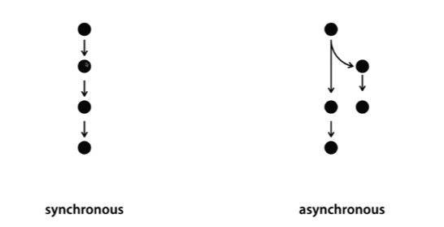

> 이 글은 ‘오픈튜토리얼스-생활코딩’의 Egoing님의 [강의](https://opentutorials.org/course/3332/21032)를 정리했음을 먼저 밝힙니다.

### 동기와 비동기

 Node.js를 더 잘 알기 위해서는 '동기와 비동기'에 대한 이해가 필요합니다. 동기는 영어로 synchronous, 비동기는 영어로 asynchronous이며 사전적 정의는 아래와 같습니다.

- **동기 (synchronous)**: 데이터 통신에서 직렬 전송을 하기 위해 일정한 클록 펄스에 동기시켜 데이터의 송수신을 하는 방식
- **비동기 (asynchronous)**: 동기통신과 대응되는 말로 통신을 하는 두 장치가 서로 데이터를 송수신할 때 일정한 속도를 유지하는 것이 아니라, 미리 약속된 신호에 의해 통신하는 방식

 여러가지 일이 있을 때, 하나를 완료해야 다음 일을 시작하고, 또 다음 일을 완료해야 다음 일을 시작하는 것을 '동기'라고 합니다. 이와는 달리 여러가지 일이 있을 때 오래 걸리는 일을 다른 사람에게 맡겨놓고 끝나면 자신에게 알리도록 한 뒤, 자신은 바로 다음 일을 시작하는 것을 '비동기'라고 합니다. 

 

 동기와 비동기가 코드레벨에서 어떤 차이점을 갖게 될까요? Node.js에서 파일을 핸들링하는 모듈인 File System(fs)을 한 번 살펴보겠습니다. https://nodejs.org/dist/latest-v10.x/docs/api/fs.html 링크에 접속하면 File System에 관련 된 많은 contents가 존재하는데 자세히 살펴보면 똑같은 이름인데 Sync가 있냐 없냐만 차이나는 것들이 보입니다. `fs.readFile`과 `fs.readFileSync` 처럼 말이죠. 

자세히 살펴보면 path와 options까지는 동일한데, readFile은 callback이라는 것이 추가적으로 존재하는 것을 확인 할 수 있습니다. **callback**을 간단히 설명하면 **이벤트에 의해 호출되는 함수**를 말합니다. 함수의 인자로 함수가 이용되는 것을 말하기도 합니다. 이에 대해서는 나중에 살펴볼 기회가 있을테니 일단 건너뛰고, 동기와 비동기에 따라 코드가 어떻게 실행되는지 예시를 들어 보겠습니다. 우리가 내용에 'A'가 들어있는 'FILE1'을 만들었다고 가정 해봅시다. 그리고 아래처럼 코드를 실행시켜 본다고 가정하겠습니다. (코드를 제대로 짠 것인지는 모르겠지만 그냥 이해를 도울 정도로만 작성하였습니다.)

- `var result= fs.readFileSync(파일 경로); console.log(result); console.log('B');` : A -> B순으로 출력

- `fs.readFile(파일 경로,function(err,result){ console.log(result); }); console.log('B');` : B -> A순으로 출력

  첫 번째 줄은 동기적으로 실행 했기 때문에 순서대로 결과가 출력됩니다. 하지만 두 번째 줄은 비동기적으로 실행했기 때문에 fs.readFile코드가 진행되는 동안에도 다음 console.log('B')를 실행시키기 때문에 먼저 처리가 끝난 B부터 출력이 됩니다. Node.js는 기본적으로 비동기를 선호하기 때문에 동기적으로 코드를 실행시키고 싶다면 그에 알맞은 방법을 찾아서 위의 예시처럼 Sync같은 것을 붙여줘야 합니다.

### 패키지 매니저와 PM2

 Node.js에는 **NPM**이라는 패키지 매니저가 있습니다. NPM을 이용해서 우리가 서버를 실행시킬 때 유용한 **PM2**라는 프로그램을 다운받아 봅시다. http://pm2.keymetrics.io/ 이 링크로 들어가면 `npm install pm2 -g` 라는 글자가 적혀있는데 이는 NPM을 사용해 PM2를 설치하라는 말 입니다. 리눅스, 맥은 터미널, 윈도우는 명령창에서 `npm install pm2 -g` 라는 명령을 그대로 입력해서 설치하면 됩니다. 만약 permission관련 오류가 생긴다면, 명령 앞에 sudo를 붙여서 관리자 권한으로 설치할 수 있습니다.

자 그러면 PM2를 설치하면 어떤 점이 좋을까요? PM2는 우리의 애플리케이션을 감시하는 역할을 합니다. 만약 우리의 파일이 실행 중에 어떤 일이 생겨서 꺼진다면, PM2는 그 즉시 우리의 파일을 다시 실행시켜 줍니다. 또한, 우리가 파일 내 코드를 수정하면 PM2는 그 즉시 파일을 재실행 시켜서 웹 페이지에 바로 적용되도록 합니다. PM2가 없다면 우리가 직접 재실행 해야만 변경된 코드가 적용 될 텐데 말이죠.

만약 수정된 코드에 에러가 있다면 `pm2 log` 라는 명령을 통해 에러를 확인할 수 있습니다. 이렇게 PM2는 우리의 애플리케이션을 더욱 강인하게 생존할 수 있도록 도와주는 프로그램이라고 할 수 있습니다. 