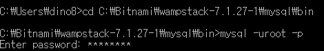
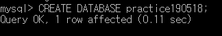
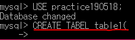
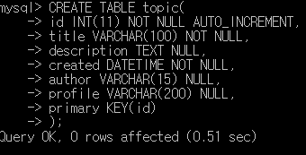

>  이 글은 ‘오픈튜토리얼스-생활코딩’의 Egoing님의 [강의](https://www.opentutorials.org/course/3162)를 정리했음을 먼저 밝힙니다.

### 데이터 베이스의 목적

 데이터 베이스와 스프레드 시트를 비교해 봅시다. 스프레드 시트와 데이터 베이스는 둘 다 표의 형태로 정보를 출력 할 수 있습니다. 또한 정보에 대해서 ID값이 큰 순서대로 정렬하기, 날짜 순으로 정렬하기 등 편리한 기능들이 존재합니다. 하지만 스프레드 시트는 사용자가 버튼을 클릭하는 것을 통해 데이터를 제어하는 반면, 데이터 베이스는 SQL이라고 하는 컴퓨터 언어를 이용해서 데이터를 제어하게 됩니다. 즉, 코드를 통해서 데이터를 관리 할 수 있다는 말이죠.

### MySQL 설치

저는 window 운영체제를 사용하고 있어서 bitnami WAMP를 통해 mysql을 설치해보겠습니다. 

이 [링크](https://bitnami.com/stack/wamp)에 들어가셔서 bitnami WAMP를 설치하신 뒤, 어느 디렉토리에 저장이 되어있는지 잘 확인해 주시길 바랍니다. 저의 경우에는 C드라이브의 bitnami라는 디렉토리 안에 wampstack-7.1.27-1 라는 디렉토리가 생성되었습니다. 

 이제 wampstack-7.1.27-1 폴더를 들어가서, mysql 폴더, bin폴더를 거쳐 그 안에 mysql.exe파일을 실행시켜야 합니다. 하지만 이 파일을 그냥 더블클릭을 해서 실행시키는 것이 아닌 코드로서 제어하기 위해 window cmd를 통해 실행을 시켜야 합니다. 아래의 사진과 같이 먼저 cd를 통해 적절한 디렉토리로 이동 후 mysql을 실행시키고, WAMP를 설치할 때 입력했던 비밀번호를 입력해줍시다. 아래는 cmd에서 제가 입력한 명령어 입니다.

### MySQL의 구조

 정보는 간단하게 생각하면 표(table)의 형태로 저장됩니다. 하지만 정보가 계속 쌓이면서 표가 매우 많아지면 우리가 원하는 정보를 찾기가 어려워 지는데, 이를 해결하기 위해서 연관된 표 끼리 그루핑(Grouping)하는 과정이 필요합니다. 그리고 이 그루핑 한 표들을 보관하는 폴더같은 것이 있는데 이것을 데이터 베이스라고 합니다.

  우리가 현재 배우고 있는 전체적인 것을 데이터 베이스라고 하는데 표(table)들을 그루핑하는 것 또한 데이터 베이스라고 하니 말이 조금 헷갈립니다. 그래서 표를 연관된 것끼리 그루핑하는 것을 MySQL에서는 **스키마(Schema)**라고 부르기도 합니다. 마지막으로 이 데이터들이 저장되어있는 공간은 **데이터 베이스 서버**라고 합니다. 

<b>데이터 베이스 > 스키마 > 데이터</b> 라고 생각하면 됩니다!

### MySQL 서버 접속

 데이터 베이스의 장점에는 '**보안, 권한 제어 기능**' 등이 있습니다. 이런 기능들을 사용하기 위해서는 먼저 데이터베이스 서버에 접속해야 하는데 서버에는 다양한 사용자로서 접속을 할 수 있습니다. 그 중 일반적으로 관리자의 의미로 사용되는 사용자이름은 uroot이며 관리자에게는 모든 기능이 열려있습니다. 하지만 모든 기능이 열려있다는 것은 그만큼 위험성도 높다는 것이기 때문에, 중요한 일이 있을 때 말고는 새로운 사용자를 만들어서 관리를 하는게 안전합니다.

### Schema의 사용

 구글같은 검색엔진을 사용해서 'MySQL create database'라고 [검색](https://dev.mysql.com/doc/refman/8.0/en/creating-database.html )을 해봅시다. 들어가보면 `CREATE DATABASE 데이터베이스이름;` 이라는 명령어를 통해 데이터베이스를 생성할 수 있다고 나와있습니다. 명령어의 끝에는 세미콜론(;)을 붙이는 것을 잊지 않으셔야 합니다.

 그렇다면 데이터베이스가 잘 생성되었는지 어떻게 확인할 수 있을까요? 이것 또한 검색엔진을 통해서 알아봅시다. 명령어를 이미 알고있는 것도 중요하지만 그보다 더 중요한건 검색엔진을 통해 원하는 명령을 찾아 사용하는 것입니다. 저는 `SHOW DATABASES;` 명령어를 사용하였습니다. 

 그리고 마지막으로 내가 만든 데이터베이스를 사용하겠다고 MySQL에게 알려주어야 합니다. 이 때는 'USE 데이터베이스이름;' 명령어를 사용하면 됩니다. 그러면 이제 MySQL은 이 Schema에 있는 표를 대상으로 명령어를 실행시키게 됩니다. (이전 포스팅에서도 말했듯이 데이터베이스와 스키마라는 용어는 MySQL에서는 동일하게 생각하시면 됩니다.)

### SQL이란?

 SQL이 무슨 뜻인지에 대해 알아보도록 하겠습니다. SQL은 **Structured Query Language**의 약자입니다. 관계형 데이터베이스는 기본적으로 표의 형태로 정보를 정리정돈 하게되는데, 이 표의 형태로 정리정돈한 모습에 대해서 '구조화 되어있다, **Structured**인 상태이다.'라고 말하게 됩니다. 또, 우리가 데이터 베이스에게 무언가를 요청하고, 질의하는 것에 대해서 **Query**라고 말하며 데이터 베이스와 프로그래머가 공통으로 이해할 수 있는 **Language**로 전송한다는 것이 전체적인 의미입니다.

### Table 생성

 SQL을 통해서 행(row)과 열(column)을 가진 Table을 만들어 보도록 하겠습니다. 'CREATE TABLE 테이블이름( 내용 )'의 형태로 명령어를 입력하여야 하는데 먼저 `CREATE TABLE 테이블이름(`  까지만 입력하고 엔터를 눌러보도록 하겠습니다. 그러면 아래처럼 가독성있게 줄바꿈을 해서 코드를 입력할 수 있습니다.

 그렇다면 괄호 안에는 어떤 내용이 들어가야 할까요? 괄호 안에는 **행의 이름, 데이터 타입, 정보를 노출 시킬 개수** 등을 알려주어야 합니다. 또한 빈칸을 받지 않겠다는 Not NULL명령과 자동으로 1씩 증가시켜주는 `AUTO_INCREMENT` 같은 명령들을 추가시켜 줄 수도 있습니다. 예시를 통해 살펴보겠습니다. 

 id 컬럼의 값은 각각의 값이 고유해야 하기 때문에 **primary KEY(id)** 라는 명령어를 입력해 주었습니다. 이외에도 위의 예시처럼 데이터 타입에는 날짜와 시간을 표현할 수 있는 `DATETIME` 같은 것들도 존재합니다. 데이터 타입과 관련하여 잘 설명되어있는 [링크](http://www.incodom.kr/DB_-_%EB%8D%B0%EC%9D%B4%ED%84%B0_%ED%83%80%EC%9E%85/MYSQL)를 찾아서 첨부하였습니다.