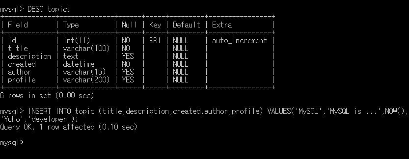
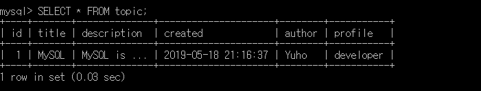
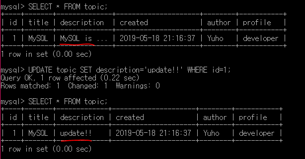
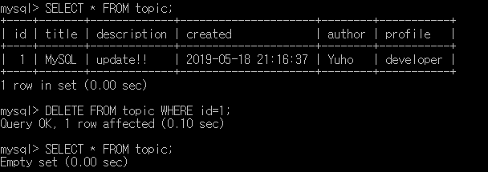
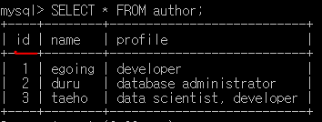
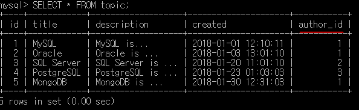
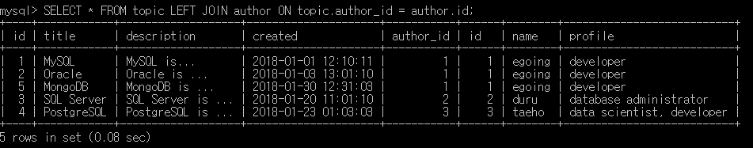
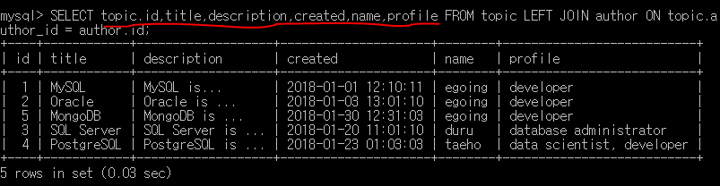

> 이 글은 ‘오픈튜토리얼스-생활코딩’의 Egoing님의 [강의](https://www.opentutorials.org/course/3162)를 정리했음을 먼저 밝힙니다.

### Insert구문

 기본적인 명령어 부터 나열해보도록 하겠습니다. 

- `SHOW DATABSES`: 현재 존재하는 데이터베이스들을 보여줌
- `USE 데이터베이스이름`: 사용 할 데이터베이스를 선택
- `SHOW TABLES`: 데이터베이스 내 존재하는 테이블들 보여줌
- `DESC 테이블이름`: 테이블에 대한 정보를 보여줌
- `INSERT INTO 테이블이름 ( 목록 ) VALUES( 값들 )`: VALUES 값을 가진 테이블 데이터 생성

### Select구문

> MySQL 공식 메뉴얼:https://dev.mysql.com/doc/refman/8.0/en/select.html

Select구문은 데이터를 읽어들일 때 사용하게 됩니다.

- `SELECT 표시하고싶은column FROM 테이블이름`: 테이블 내 원하는 데이터 출력
- `SELECT * FROM 테이블이름`: 테이블 내 모든 데이터를 출력

 이 아래부터는 `SELECT 표시하고싶은column FROM 테이블이름`를 생략하도록 하겠습니다. 

- `~ WHERE column이름='표시하고싶은데이터'`: '표시하고싶은 데이터'가 들어간 데이터 출력
- `~ ORDER BY column이름 DESC`: 'column이름'이 큰 순서로 데이터 출력
- `~ ORDER BY column이름 DESC LIMIT 숫자`: 'column이름'이 큰 순서로 데이터 출력, '숫자'까지만.

### Update구문

> MySQL 공식 메뉴얼: https://dev.mysql.com/doc/refman/8.0/en/update.html

수정을 하기위한 Update구문에 대해 알아봅시다.

- `UPDATE 테이블이름 SET column이름='바꿀내용' WHERE id=숫자;`

테이블 내 내가 선택한 column에 대해서 내용을 바꾸게 되는데, 그 중 내가 원하는 id 값을 가진 데이터만 수정을 하게 되는 명령어 입니다. 여기서 'where id=숫자' 를 적어놓지 않으면 모든 데이터가 수정되어버리는 재앙이 일어날 수 있기 때문에 조심하셔야 합니다!

### Delete구문

> MySQL 공식 메뉴얼: https://dev.mysql.com/doc/refman/8.0/en/delete.html

삭제를 하기위한 Delete구문에 대해 알아봅시다. 

- `DELETE FROM 테이블이름 WHERE id=숫자;`

테이블 내 원하는 id값을 가진 데이터를 삭제하는 명령어 입니다. 여기서도 마찬가지로 'where id=숫자' 를 적어놓지 않으면 모든 데이터가 삭제되어버리는 재앙이 일어날 수 있기 때문에 조심하셔야 합니다.

### Table분리하기

 테이블에서 중복되는 부분에 대해 더 효율적으로 관리하기 위해 테이블을 분리하는 방법을 알아봅시다. 예를 들어 author라는 행에 대해서 테이블을 분리하고 싶다고 한다면 먼저 author에 대한 테이블을 만들어 줍니다.

 그리고 전체적인 테이블을 만들고, 그 테이블 안에 author에 대해서는 author_id라는 행으로 바꿔주도록 합니다.

### Table합치기(JOIN)

 위에서 분리한 두개의 테이블을 한 눈에 볼 수 있도록 합쳐서 읽어들이는 방법을 알아보겠습니다. 여기서는 관계형 데이터베이스의 핵심이라고 불리는 JOIN명령어를 사용해야 합니다.

 

` SELECT * FROM '테이블1' LEFT JOIN '테이블2' ON '기준1' = '기준2';` 명령어를 사용하면 '테이블1'과 '테이블2'에 대해서 '기준1'과 '기준2'가 같은 것 끼리 합쳐서 읽어들일 수 있습니다. 

 

 또한 SELECT 뒤에 '*'가 아니라 원하는 행만 골라서 입력하면 더 깔끔하게 합쳐진 테이블을 출력할 수 있습니다. 

