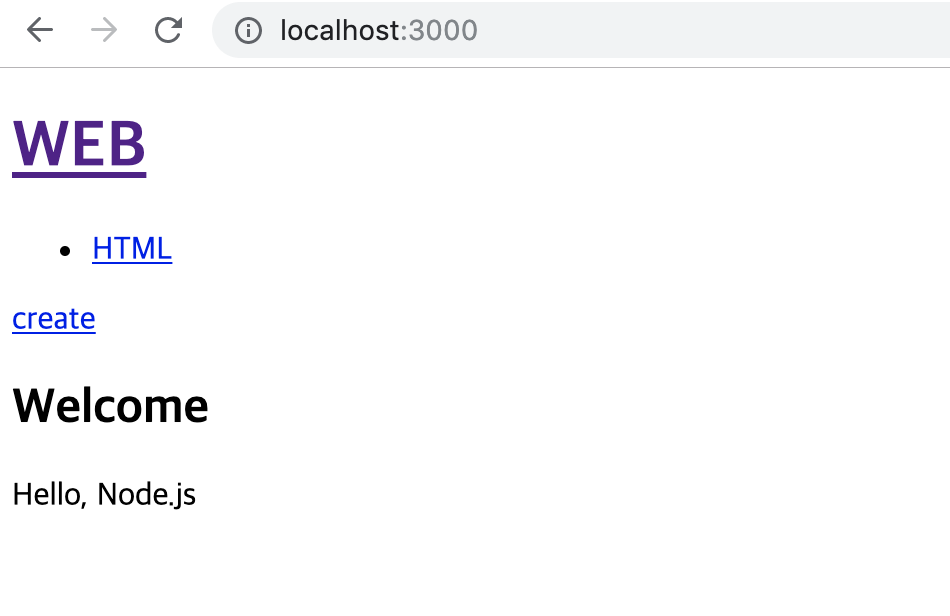
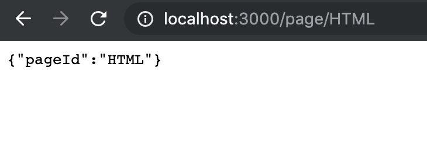

> 이 글은 ‘오픈튜토리얼스-생활코딩’의 Egoing님의 [강의](https://opentutorials.org/course/3370/21378)를 정리했음을 먼저 밝힙니다.

 Node.js 를 기반으로 하는 프레임워크는 다양하게 있지만 그 중 가장 보편적으로 사용되는 것이 Express입니다. Express를 기반으로 하여 웹 페이지를 만들어 보도록 하겠습니다. 그러기 위해서는 먼저 npm, node js, pm2 같은 기본적인 프로그램이 설치되어 있어야 합니다.

이고잉님의 강의자료 [링크](https://github.com/web-n/Nodejs)입니다. 이 링크의 자료를 다운받아서, 터미널에서 `pm2 start main.js --watch` 로 실행시켜봅시다. 또한 소스코드 내 사용되는 모듈을 설치하기 위해서 `npm install` 명령어도 실행시켜 줍니다. 소스코드 내에서 우리는 port3000을 이용한다고 적었으니, 주소 창에 localhost:3000을 입력하면 웹 페이지가 제대로 뜨는 것을 확인할 수 있습니다.



웹 페이지를 Express로 다시 수정하는 작업을 해보도록 하겠습니다. 그러기 위해서는 main.js 파일을 수정해야합니다. Express의 메뉴얼에 따라서 일단은 아래와 같은 코드를 작성 해 보았습니다.

```javascript
var express = require('express')
var app = express()
 
//route, routing
//app.get('/', (req, res) => res.send('Hello World!'))

app.get('/', function(req, res) { 
  return res.send('/');
});
 
app.get('/page', function(req, res) { 
  return res.send('/page');
});
 
app.listen(3000, function() {
  console.log('Example app listening on port 3000!')
});
```

 위의 코드에서 `app.get`은 라우팅 역할을 합니다. 라우팅이란 클라이언트의 pathname에 따라 그에 알맞은 정보를 호출해주는 것이라고 생각하시면 됩니다. 주소창에 localhost:3000/ 혹은 localhost:3000/page를 입력해서 잘 작동하는지 확인 해 봅시다. `app.listen`를 통해서는, 이 함수가 실행될 때 웹 서버가 실행이 되면서 3000번 포트에 연결 됩니다. 위 두 가지는 웹 페이지를 만들기 위한 가장 기초적인 골격이기 때문에 꼭 기억하고 있어야 합니다.

이번에는 Express를 통해 기본적인 requset와 response 정보를 각각 처리해봅시다.

```javascript
app.get('/', function(request, response) { 
  fs.readdir('./data', function(error, filelist){
    var title = 'Welcome';
    var description = 'Hello, Node.js';
    var list = template.list(filelist);
    var html = template.HTML(title, list,
      `<h2>${title}</h2>${description}`,
      `<a href="/create">create</a>`
    ); 
    response.send(html);
  });
});
```

 예를 들어 위와 같은 코드에서는, path가 '/' 일 때 콜백함수가 request와 response라는 인자를 받으며 마지막에 html이라는 어떤 파일을 출력하는 `response.send` 함수를 실행하는 것을 확인 할 수 있습니다.

### 상세보기 페이지 구현

요즘의 웹 개발에 있어서 url 작성 트렌드는 쿼리스트링으로 정보를 전해주는 것과는 조금 다르다고 합니다. 주소를 조금 더 아름답게(?) 하기 위함과 이 외에 검색 최적화 등등 다양한 이슈 때문이라고 하는데요, 이전에는 /?id=HTML 이런 방식으로 쿼리스트링을 전송해주는 형태에서 /page/HTML 이런 형태로 바뀌는 추세라고 하니 이를 구현하는 방법을 알아봅시다.

```javascript
app.get('/page/:pageId', function(request, response) { 
  response.send(request.params);
});
```

여기서 우리가 주목해야 하는 부분은 '/page/:pageId' 입니다. 이런 식으로 코드를 작성하면 request라는 인자에 페이지 마크 형태로 pageId의 값이 전송이 되는데, 말로 설명하면 이해가 잘 안되니까 직접 코드를 실행시켜 봅시다. 아 그리고 이에 대한 정보는 Express 홈페이지의 [가이드](https://expressjs.com/ko/)에서 확인 가능합니다. 

 

 주소창에 ~~/page/HTML을 입력하니 `requset.params`라는 객체에 pageId로 HTML이라는 정보가 전송된 것을 확인 할 수 있습니다. 굳이 이 주소가 아니더라도 /page/example 이나 /page/wooooww 이런식으로 주소를 입력하면 그에 따라 pageId에 자신이 입력한 정보가 전송되는 것을 확인 할 수 있습니다. 이고잉님의 소스코드는 [이 곳](https://opentutorials.org/course/3370/21389)에서 참고하시면 됩니다.