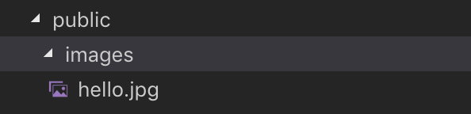

> 이 글은 ‘오픈튜토리얼스-생활코딩’의 Egoing님의 [강의](https://opentutorials.org/course/3370/21378)를 정리했음을 먼저 밝힙니다.

 Express에서 중요한 기능 두 가지를 꼽으라고 하면 하나는 Route이고 하나는 미들웨어 입니다. 다른 사람이 만든 부품을 내 웹 페이지 구현을 위해 사용하는 방법 중 하나가 미들웨어입니다. [Express홈페이지](https://expressjs.com/ko/resources/middleware.html)에 들어가면 다양한 미들웨어들을 확인 할 수 있습니다. [위키피디아](https://ko.wikipedia.org/wiki/미들웨어)에서 말하는 미들웨어의 정의는 다음과 같습니다. 

> 미들웨어는 양 쪽을 연결하여 데이터를 주고 받을 수 있도록 중간에서 매개 역할을 하는 소프트웨어, 네트워크를 통해서 연결된 여러 개의 컴퓨터에 있는 많은 프로세스들에게 어떤 서비스를 사용할 수 있도록 연결해 주는 소프트웨어를 말한다. 3계층 클라이언트/서버 구조에서 미들웨어가 존재한다. 웹 브라우저에서 데이터베이스로부터 데이터를 저장하거나 읽어올 수 있게 중간에 미들웨어가 존재하게 된다.

### 미들웨어의 형태

 Express홈페이지에 들어가서 미들웨어의 기본적인 형태들에 대해서 살펴보도록 하겠습니다. 우리가 자주 사용하게 될 '애플리케이션 레벨 미들웨어'에 대해서 형태를 살펴보면 아래와 같습니다.

```javascript
var app = express();

app.use(function (req, res, next) {
  console.log('Time:', Date.now());
  next();
});
```

 콜백 함수에 첫 번째 인자로는 requset(요청), 두 번째 인자로는 response(응답), 세 번째 인자로는 next라는 다음 미들웨어를 실행시킬 지에 대한 정보가 들어갑니다. 이 코드의 경우에는 특정 경로에 대한 언급이 없으므로 어느 요청에 대해서나 실행됩니다.

```javascript
app.use('/user/:id', function (req, res, next) {
  console.log('Request Type:', req.method);
  next();
});
```

 특정 경로에 대한 요청만 실행하고 싶다면, 콜백 함수 앞에 path를 적어주도록 합니다. 위의 코드에서는 /user/:id 경로에 대한 요청만이 함수를 실행합니다.

```javascript
app.get('/user/:id', function (req, res, next) {
  res.send('USER');
});
```

 위의 코드는 /user/:id 경로에 대한 GET요청을 실행합니다. 특정 경로가 아닌 모든 경로에서 요청을 실행하고 싶으면 경로에 '*****'을 입력하면 됩니다! 이외에도 더 다양하고 자세한 설명은 [Express공식 홈페이지](https://expressjs.com/ko/guide/using-middleware.html#middleware.application)에서 한글로 확인 가능합니다.

### 미들웨어의 사용 1

Express내 미들웨어 중 **body-parser**를 사용해서 '게시글(파일) 작성' 코드를 수정해보도록 하겠습니다.

먼저 body-parser 미들웨어를 npm을 이용해서 설치 해 주어야 합니다. `npm install body-parser --save` 를 터미널에서 실행합니다. 그리고 `var bodyParser = require('body-parser');` 를 코드의 적당한 자리에 선언해서 모듈을 로드 해 줍니다. 또한, 사용자가 요청을 할 때 form형태의 데이터로 요청을 했을 때 사용하는 `app.use(bodyParser.urlencoded({ extended: false }));` 를 코드의 적당한 자리에 선언해 줍니다. 아래에 예시를 참고하시면 됩니다. 

```javascript
var express = require('express')
var app = express()
var fs = require('fs');
var path = require('path');
var qs = require('querystring');
var bodyParser = require('body-parser');
var sanitizeHtml = require('sanitize-html');
var template = require('./lib/template.js');
 
app.use(bodyParser.urlencoded({ extended: false }));
```

 위의 코드에서 `app.use(bodyParser.urlencoded({ extended: false }))`를 집중해서 봐야 합니다. main.js가 실행될 때 마다 즉, 사용자가 어떤 요청을 할 때마다 body-parser 모듈에 의해서 미들웨어가 실행됩니다. 이로 인해 사용자가 전송한 post데이터가 내부적으로 분석이 되어 리퀘스트의 body속성을 만들고 여기에 정보를 추가 해 줍니다. (리퀘스트 이름이 request라고 한다면 'request.body'으로 사용 가능)

 결국 우리가 가지고 있는 main.js 소스코드에서 /creat\_process와 /update\_process파트에서 사용되는 post정보들에 대해서, 미들웨어를 사용하면 body에 대한 코드를 더 간결하게 작성할 수 있게 됩니다. 

### 미들웨어의 사용 2

 이번에는 **compression**이라는 미들웨어를 사용하면서 미들웨어에 대한 감각을 키워보도록 합시다. 이는 웹 서버가 웹 브라우저에게 응답할 때 데이터를 압축하도록 도와주는 미들웨어 입니다. 웹 사이트 내에서 너무 용량이 큰 정보가 계속 오고가면 돈도 많이 들고 시간도 많이 걸리게 되는데 compression이 이런 문제를 해결하도록 도와줍니다.

 먼저 compression 미들웨어를 npm을 이용해서 설치 해 주어야 합니다. `npm install compression --save` 를 터미널에서 실행합니다. 그리고 `var compression = require('compression');` 를 코드의 적당한 자리에 선언해서 모듈을 로드해 줍니다. 마지막으로 `app.use(compression());` 를 코드의 적당한 자리에 선언해 줍니다. 아래에 예시를 참고하시면 됩니다. 

```javascript
var express = require('express')
var app = express()
var fs = require('fs');
var path = require('path');
var qs = require('querystring');
var bodyParser = require('body-parser');
var sanitizeHtml = require('sanitize-html');
var compression = require('compression')
var template = require('./lib/template.js');
 
app.use(bodyParser.urlencoded({ extended: false }));
app.use(compression());
```

 `app.use()`를 통해서 `compression()`이라는 함수을 호출하면 미들웨어가 실행이 됩니다. `app.use()`에 compression 이나 body-parser같은 미들웨어를 장착하면 사용자가 요청을 보낼 때 마다 이런 미들웨어가 실행되어 코드에 적용한 대로 실행되게 됩니다.

### 정적인 파일 서비스하기

더 다양한 미들웨어에 대해서 알아보도록 하겠습니다.

이미지파일이나 자바스크립트, css파일을 웹 브라우저로 다운로드시켜주는 경우에 이런 것들을 정적인 파일이라고 합니다. 이런 정적인 파일들을 우리 웹 사이트에서 어떻게 express버전으로 사용할 수 있는지 알아보도록 하겠습니다. 

 이를 위해서는 우리가 정적인 파일을 서비스하는 것을 허용하고, 셋팅해야 하는데 이 또한 Express 홈 페이지에 설명이 잘 되어 있습니다. static이라고 하는 express가 기본적으로 내장하고 있는 미들웨어를 사용하면 되는데 일단은 아래와 같은 코드를 적어 보도록 하겠습니다.

```javascript
app.use(express.static('public'));
```

그리고 아래와 같이 main.js 파일이 있는 폴더에 public폴더, 그리고 public폴더 내 images폴더, 그리고 그 안에 이미지 파일을 넣어주도록 하겠습니다. hello.jpg라는 이미지 파일을 넣었습니다.



` app.use(express.static('public'));` 코드는, public폴더에 있는 정적인 파일을 서비스하겠다는 의미이기 때문에 main.js 소스코드 내에서 public폴더 내 정적 파일들을 자유롭게 사용할 수 있게 됩니다. 아래는 간단한 예시 코드입니다.

```javascript
app.get('/', function(request, response) { 
  var title = 'Welcome';
  var description = 'Hello, Node.js';
  var list = template.list(request.list);
  var html = template.HTML(title, list,
    `
    <h2>${title}</h2>${description}
    
    `,
    `<a href="/create">create</a>`
  ); 
  response.send(html);
});
```

 위의 코드에 의해서 우리의 웹 페이지에는 hello.jpg 파일이 업로드 됩니다.

### 에러 처리

 Express 홈 페이지를 보니, 우리가 요청에 대한 정보를 찾지 못했을 때 출력하는 Not found: 404에 대한 내용이 잘 설명되어 있습니다. 코드를 아래에 적어보도록 하겠습니다. 

```javascript
app.use(function(req, res, next) {
  res.status(404).send('Sorry cant find that!');
});
```

 이 또한 미들웨어인데 이 경우에는 기존의 미들웨어들 과는 달리 **소스코드의 마지막**에 선언해야 합니다. 미들웨어는 순차적으로 실행이 되기 때문에 일단은 먼저 앞에 있는 미들웨어들을 전부 훑은 후에 아무런 적합한 미들웨어를 실행시키지 못했을 때 404에 대한 미들웨어를 실행시켜 주어야 하기 때문입니다. 

 그렇다면 요청에 대한 적합한 미들웨어를 실행시키지 못한 것이 아니라, 코드 중간중간에 에러 정보가 발생하면 어떻게 처리해야 할까요? 

```javascript
app.get('/page/:pageId', function(request, response, next) { 
  var filteredId = path.parse(request.params.pageId).base;
  fs.readFile(`data/${filteredId}`, 'utf8', function(err, description){
    if(err){
      next(err);
    } else {
      var title = request.params.pageId;
      var sanitizedTitle = sanitizeHtml(title);
      var sanitizedDescription = sanitizeHtml(description, {
        allowedTags:['h1']
      });
      var list = template.list(request.list);
      var html = template.HTML(sanitizedTitle, list,
        `<h2>${sanitizedTitle}</h2>${sanitizedDescription}`,
        ` <a href="/create">create</a>
          <a href="/update/${sanitizedTitle}">update</a>
          <form action="/delete_process" method="post">
            <input type="hidden" name="id" value="${sanitizedTitle}">
            <input type="submit" value="delete">
          </form>`
      );
      response.send(html);
    }
  });
});
app.use(function (err, req, res, next) {
  console.error(err.stack)
  res.status(500).send('Something broke!')
});
```

 첫 번째 소스코드에서 if문과 else문을 나눠져 있는 것에 주목해 봅시다. if문은 에러가 발생했을 때 실행하는 코드이고 else문은 에러가 발생하지 않았을 때 실행하는 코드인 것을 알 수 있습니다. 에러가 발생한 if문에서는 next라는 함수안에 err를 건네주는데, express 내부적으로 다음 미들웨어를 실행 시킬 때 에러가 없으면 `next()`를 사용하고, 에러가 있으면 `next(err)`를 사용한다고 약속되어 있습니다.  

 그리고 `next(err)`가 실행된 경우에는 두 번째 소스코드가 실행되어 에러를 처리할 수 있게 됩니다. 여기서 주의할 점은 두번째 소스코드의 내용은 **404에러 처리 미들웨어 코드보다 뒤**에 선언되어야 한다는 점입니다. 

 